|     |
|-----|
|     |
|     |

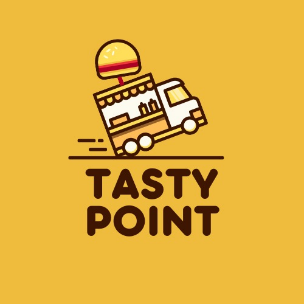

# Registro de versiones del Informe

<table>
<colgroup>
<col style="width: 24%" />
<col style="width: 24%" />
<col style="width: 25%" />
<col style="width: 25%" />
</colgroup>
<thead>
<tr class="header">
<th><strong>Versión</strong></th>
<th><strong>Fecha</strong></th>
<th><strong>Autor</strong></th>
<th><strong>Descripción y modificación</strong></th>
</tr>
</thead>
<tbody>
<tr class="odd">
<td>1.0</td>
<td>27/08/23</td>
<td>
David Antonio Torres Vilchez

Farid Josué Izquierdo Cristobal

Adrian Denis Alzamora Gonzales

Breydi Ramos Terrones
</td>
<td>
Creación de la carpeta de documentos para el proyecto, además del
Documento de Word: “Borrador TB1” para el primer avance del trabajo
final.

Implementación de Startup profile, Solution profile,

Segemento objetivo, competidores, entrevistas, Needfiding etc.

Lean UX canvas

Evenstorming Domain Driven Design

C4 Model diagrams

Se desarrollo el producto backlog
</td>
</tr>
</tbody>
</table>

# 

[STUDENT OUTCOME [7](#student-outcome)](#student-outcome)

[INTRODUCCIÓN [9](#introducción)](#introducción)

[1.1. Startup Profile [9](#startup-profile)](#startup-profile)

[1.1.1. Descripción de la Startup
[9](#descripción-de-la-startup)](#descripción-de-la-startup)

[1.1.2. Perfiles de integrantes del equipo
[10](#perfiles-de-integrantes-del-equipo)](#perfiles-de-integrantes-del-equipo)

[1.2. Solution Profile [12](#solution-profile)](#solution-profile)

[1.2.1 Antecedentes y problemática
[12](#antecedentes-y-problemática)](#antecedentes-y-problemática)

[1.2.2 Lean UX Process. [15](#lean-ux-process.)](#lean-ux-process.)

[1.3. Segmentos objetivo [22](#segmentos-objetivo)](#segmentos-objetivo)

[REQUIREMENTS ELICITATION & ANALYSIS
[23](#requirements-elicitation-analysis)](#requirements-elicitation-analysis)

[2.1. Competidores. [23](#competidores.)](#competidores.)

[2.1.1. Análisis competitivo**.**
[23](#análisis-competitivo.)](#análisis-competitivo.)

[2.1.2. Estrategias y tácticas frente a competidores
[29](#estrategias-y-tácticas-frente-a-competidores)](#estrategias-y-tácticas-frente-a-competidores)

[2.2. Entrevistas [30](#entrevistas)](#entrevistas)

[2.2.1. Diseño de entrevistas
[30](#diseño-de-entrevistas)](#diseño-de-entrevistas)

[2.2.2. Registro de entrevistas
[31](#registro-de-entrevistas)](#registro-de-entrevistas)

[2.2.4. Diseño de entrevistas.
[32](#diseño-de-entrevistas.)](#diseño-de-entrevistas.)

[2.2.5. Registro de entrevistas
[33](#registro-de-entrevistas-1)](#registro-de-entrevistas-1)

[2.3. Needfinding. [36](#needfinding.)](#needfinding.)

[2.3.1. User Personas.
[36](#interfaz-de-usuario-gráfica-sitio-web-descripción-generada-automáticamente2.3.1.-user-personas.)](#interfaz-de-usuario-gráfica-sitio-web-descripción-generada-automáticamente2.3.1.-user-personas.)

[2.3.2. User Task Matrix [38](#user-task-matrix)](#user-task-matrix)

[2.3.3. User Journey Mapping.
[38](#user-journey-mapping.)](#user-journey-mapping.)

[2.3.4. Empathy Mapping
[41](#interfaz-de-usuario-gráfica-descripción-generada-automáticamente2.3.4.-empathy-mapping)](#interfaz-de-usuario-gráfica-descripción-generada-automáticamente2.3.4.-empathy-mapping)

[2.3.5. As-is Scenario Mapping.
[43](#as-is-scenario-mapping.)](#as-is-scenario-mapping.)

[REQUIREMENTS SPECIFICATION
[44](#requirements-specification)](#requirements-specification)

[3.1. To-Be Scenario Mapping.
[44](#to-be-scenario-mapping.)](#to-be-scenario-mapping.)

[3.2. User Stories [45](#user-stories)](#user-stories)

[3.3. Impact Mapping. [65](#impact-mapping.)](#impact-mapping.)

[3.4. Product Backlog. [67](#product-backlog.)](#product-backlog.)

[SOLUTION SOFTWARE DESIGN
[71](#solution-software-design)](#solution-software-design)

[4.1 Strategic-Level Domain-Driven Design.
[71](#strategic-level-domain-driven-design.)](#strategic-level-domain-driven-design.)

[4.1.1 Event Storming [71](#event-storming)](#event-storming)

[4.1.2. Context Mapping [79](#context-mapping)](#context-mapping)

[4.1.3 Software Architecture
[79](#software-architecture)](#software-architecture)

[4.2. Tactical-Level Domain-Driven Design
[83](#tactical-level-domain-driven-design)](#tactical-level-domain-driven-design)

[4.2.1. Bounded Context: User
[84](#bounded-context-user)](#bounded-context-user)

[4.2.2. Bounded Context: Inventory Analitycs
[93](#bounded-context-inventory-analitycs)](#bounded-context-inventory-analitycs)

[4.2.3. Bounded Context: Payment
[100](#bounded-context-payment)](#bounded-context-payment)

[4.2.1. Bounded Context: Products
[107](#bounded-context-products)](#bounded-context-products)

[CONCLUSIONES [111](#conclusiones)](#conclusiones)

[BIBLIOGRAFÍA [112](#bibliografía)](#bibliografía)

# STUDENT OUTCOME

En ingeniería de software, el logro contribuye a alcanzar el: ABET –
EAC - student outcome 5: la capacidad de funcionar efectivamente en un
equipo cuyos miembros juntos proporcionan liderazgo, crean un entorno de
colaboración e inclusivo, establecen objetivos, planifican tareas y
cumplen objetivos.

<table style="width:100%;">
<colgroup>
<col style="width: 18%" />
<col style="width: 57%" />
<col style="width: 24%" />
</colgroup>
<thead>
<tr class="header">
<th><strong>Criterio específico</strong></th>
<th><strong>Acciones realizadas</strong></th>
<th><strong>Conclusiones</strong></th>
</tr>
</thead>
<tbody>
<tr class="odd">
<td>Actualiza conceptos y conocimientos necesarios para su desarrollo
profesional y en especial para su proyecto en soluciones de
software.</td>
<td>
<strong>Adrian Denis Alzamora Gonzales</strong>

<strong>TB1:</strong> Investigue sobre los nuevos componentes de IoT
que eran necesarios para comunicar los dispositivos de los almacenes con
las soluciones propuestas.

<strong>David Antonio Torres Vilchez</strong>

<strong>TB1:</strong> Participé en todas las reuniones programadas,
realizando mis tareas asignadas y mejorando continuamente de acuerdo con
los comentarios constructivos del equipo.

Farid Josué Izquierdo Cristobal

TB1: Para esta entrega de la TB1, he aplicado conceptos como
Domain-Driven Design, User Stories, Product Backlog y Lean UX para crear
soluciones de software centradas en el usuario y enfocadas en las
necesidades del negocio.

<strong>Yoimer Yanir Dávila Ramirez</strong>

<strong>TB1</strong>: Para esta primera entrega, he aplicado
conceptos de Domain-Driven Design y Lean UX para diseñar nuestra
solución de software enfocado en las necesidades de nuestros
clientes.

<strong>Ramos Terrones Breydi</strong>

TB1: Para este primer hito, he utilizado conceptos de Diseño Guiado
por el Dominio y Lean UX con el objetivo de diseñar nuestra solución de
software, la cual está orientada a satisfacer las necesidades de
nuestros clientes.
</td>
<td>Realicemos conjuntamente el análisis del segmento objetivo, a su vez
los competidores y establecimos una línea desde ese foco de
trabajo.</td>
</tr>
<tr class="even">
<td>Reconoce la necesidad del aprendizaje permanente para el diseño
profesional y el desarrollo de proyectos en soluciones de software.</td>
<td>
<strong>David Antonio Torres Vilchez </strong>

<strong>TB1:</strong> Realice una investigación de las empresas
enfocadas al servicio de comida a domicilio, así también como de sus
consumidores para conocer qué funciones o características implementar en
la aplicación.

<strong>Adrian Denis Alzamora Gonzales</strong>

<strong>TB1:</strong> Fue necesario realizar una investigación sobre
los componentes que iban a formar parte de la solución. Estos debían ser
de un costo bajo para que se accesible. Para ello se estudió los
componentes disponibles en el mercado como sensores, actuadores y
microcontroladores con un bajo costo y un buen rendimiento.

Farid Josué Izquierdo Cristobal

TB1: Para esta entrega de la TB1 utilizamos algunas herramientas para
el diseño de las arquitecturas de software y diagramas como el draw.io,
miro, figma, lucidchard y entre otros para realizar correctamente y de
forma organizada esta primera entrega.

<strong>Yoimer Yanir Dávila Ramirez</strong>

<strong>TB1</strong>: Para esta primera entrega, utilizamos
diferentes herramientas enfocadas para el diseño de diagramas de
arquitectura de software. Utilizando y reforzando las habilidades
aprendidas con DDD.

<strong>Breydi Ramos Terrones</strong>

TB1: En esta primera entrega, empleamos varias herramientas
especializadas en el diseño de diagramas de arquitectura de software.
Este enfoque nos permitió aplicar y reforzar las habilidades que hemos
adquirido con el Diseño Guiado por el Dominio (DDD).
</td>
<td>Adquirimos conocimientos previos de temas nuevos que partimos de
ello para realizar el análisis correspondiente.</td>
</tr>
</tbody>
</table>

# INTRODUCCIÓN

## 1.1. Startup Profile

### 1.1.1. Descripción de la Startup

El nombre de la empresa emergente es **Tasty Point.**

Tasty Point es un startup que ofrece el servicio de comida a domicilio
con el objetivo de reducir el desperdicio de alimentos. Tasty Point
promete reducir el porcentaje de comida desechada. Para ello ofrece una
aplicación móvil y una aplicación web. La aplicación móvil reúne a
diferentes restaurantes o cadenas alimenticias para aprovechar sus
platos o productos que no fueron consumidos, pero que poseen un buen
estado para su consumo. Con la ayuda de Tasty Point, encontrar platos
según la preferencia del usuario a un buen precio es sencillo y
económico. La aplicación móvil conecta a los clientes que buscan comida
buena y económica con restaurantes y cadenas de alimentación. Asimismo,
la aplicación web permite monitorear la temperatura y humedad mediante
un kit de IoT. Esto permite garantizar que los alimentos que se
proporcionan sean siempre frescos y seguros para comer.

**Misión **

Somos una compañía de desarrollo de soluciones de software comprometidos
con la creación de soluciones eficientes e innovadoras que faciliten a
las personas el acceso a los alimentos de forma sostenible. Creemos que
todos merecen tener acceso a alimentos nutritivos y estamos trabajando
para que eso sea una realidad.

**Visión**

Nuestra visión es promover una cultura de consumo responsable y eficaz.
Queremos mostrarle al mundo que es posible comer comida deliciosa sin
desperdiciar recursos. También estamos comprometidos con el apoyo al
comercio local y la promoción de la gastronomía peruana.

### 1.1.2. Perfiles de integrantes del equipo 

<table>
<colgroup>
<col style="width: 50%" />
<col style="width: 50%" />
</colgroup>
<thead>
<tr class="header">
<th><strong>INTEGRANTE</strong></th>
<th><strong>DESCRIPCIÓN</strong></th>
</tr>
</thead>
<tbody>
<tr class="odd">
<td><strong>Farid Josué Izquierdo Cristobal</strong></td>
<td rowspan="2">Soy un estudiante de 20 años, que estudia la carrera de
ingeniería de software en la Universidad Peruana de Ciencias Aplicadas.
Me considero una persona alegre y responsable, desde pequeño siempre me
llamó la atención todo lo que tenga que ver con la computadora y la
tecnología y es por este motivo que me motivé a estudiar esta carrera.
Me gusta aprender nuevas cosas y sobre todo con respecto a los distintos
lenguajes de programación.</td>
</tr>
<tr class="even">
<td></td>
</tr>
<tr class="odd">
<td><strong>Torres Vilchez, David Antonio</strong></td>
<td rowspan="2">Estudio la carrera de Ingeniería de Software en la UPC.
Actualmente me encuentro cursando la carrera de ingeniería de software
en la Universidad Peruana de Ciencias Aplicadas. Tengo conocimientos en
programación, buen desenvolvimiento trabajando bajo presión, optimismo y
motivación por cumplir con los objetivos del proyecto con la finalidad
de adquirir nuevas habilidades enfocadas en el desarrollo de
aplicaciones móviles.</td>
</tr>
<tr class="even">
<td></td>
</tr>
<tr class="odd">
<td><strong>Alzamora Gonzales, Adrian Denis</strong></td>
<td rowspan="2">
Ingeniero de software con 5 años de experiencia en
la

implementación de soluciones de software de alta calidad siguiendo
las buenas prácticas y estándares de la

industria actual. Desarrollé diversas soluciones bajo el enfoque ágil
y empleando tecnologías emergentes.
</td>
</tr>
<tr class="even">
<td></td>
</tr>
<tr class="odd">
<td><strong>Yoimer Yanir Dávila Ramirez</strong></td>
<td rowspan="2">Estudiante de Ingeniería de Software en la UPC, escogí
esta carrera ya que me gustaba la tecnología. Me considero una persona
responsable y respetuosa. Además, aportaré mis conocimientos sobre
desarrollo web y programación orientada a objetos con lenguajes como
C++, Python y Java. Así como en el desarrollo de experiencias móvil con
flutter y nativo con Kotlin.</td>
</tr>
<tr class="even">
<td></td>
</tr>
<tr class="odd">
<td><strong>Breydi Ramos Terrones</strong></td>
<td rowspan="2">Mi nombre es Breydi Ramos Terrones. Al culminar el
colegio estaba en un problema, ya que no sabía que estudiar, fue ahí
cuando comencé a investigar seriamente sobre lo que quería para mí en el
futuro y fue cuando encontré algo que me apasionaba, lo cual era la
ingeniería de software por lo que decidí estudiarla. Me considero una
persona amigable, solidaria y con habilidades para el trabajo en equipo.
Al grupo aportaré mis conocimientos sobre front end, desarrollo web y
conocimientos básicos sobre el framework .NET.</td>
</tr>
<tr class="even">
<td></td>
</tr>
</tbody>
</table>

## 1.2. Solution Profile 

### 1.2.1 Antecedentes y problemática  

**The 5 ‘W’s y 2 ‘H’s**

**1. What (Qué)**

El problema encontrado es la gran cantidad de alimentos disponibles
desperdiciados en Perú y el Mundo que, por consiguiente, generan
pérdidas económicas y ecológicas que afectan a los restaurantes y la
población.

**2. When (Cuándo)**

Este problema tiene más tiempo del que se tiene conciencia. Según la
Organización de las Naciones Unidas para la Alimentación y la
Agricultura (s.f.), "el número de personas afectadas por el hambre ha
aumentado lentamente desde 2014". Lo que evidencia la existencia de este
dañoso problema.

La relación de lo anterior con nuestros públicos objetivos ocurre al
concluir la venta del día o semana. Los clientes no agotaron el stock
disponible del restaurante tradicional o de comida rápida, lo que
resulta en el desecho de estos platos o ingredientes restantes que no
están lo suficientemente frescos para ser aprovechados en la siguiente
jornada.

Nuestro primer cliente, el consumidor, usará el producto cuando esté
buscando un plato de comida a un precio menor o un método para combatir
la problemática del desperdicio de comida. 

El comprador podrá elegir entre una variedad de platos disponibles en
nuestra aplicación móvil. Estos platos son ofrecidos por nuestro segundo
cliente, el restaurante tradicional o de comida rápida.

**3. Where (dónde) **

El cliente podrá usar el producto desde su dispositivo móvil de
preferencia. Esto le permitirá ordenar su comida desde cualquier lugar
en el que se encuentre y recibirla, usando los servicios ofrecidos por
el restaurante. 

**  
**

**4. Who (quién)**

Como se mencionó en algún párrafo anterior, nuestra aplicación móvil
cuenta con 2 clientes:

- El cliente consumidor, es quien ordena sus platos en la plataforma
  debido a la preocupación que la problemática del desperdicio de comida
  pueda generar si no es combatida, o simplemente debido a los precios
  bajos de los platos ofrecidos en la plataforma.

- Y el cliente Restaurante, tradicional o de comida rápida, es quien
  ofrece las opciones disponibles de platos en la plataforma como una
  forma de minimizar las pérdidas económicas generadas al "tirar" los
  productos no lo suficiente frescos para una siguiente jornada.

**5. Why (por qué)**

El problema del desperdicio de comida se debe a varios factores y ocurre
en varias etapas (alimentos que se pierden después de la cosecha,
durante la fase de venta al por menor de elementos primarios, etc.). Sin
embargo, Tasty Point se enfoca en el derroche de alimentos generados por
el no agotamiento del stock en ingredientes y platos concluidos,
problema consecuente de la falta de demanda. 

Tasty point busca solucionar el problema ofreciendo estos platos
restantes de manera directa a los clientes, explícitamente a un precio
menor.

**1. How (cómo)**

Tasty food es usado cuando:

El consumidor busca una manera de combatir la problemática del
desperdicio de comida, o simplemente busca alimentos ofrecidos a precios
bajos.

El cliente Restaurante, tradicional o de comida rápida, busca una forma
de minimizar las pérdidas generadas al "tirar" los productos que no
pudieron venderse y no son lo suficientemente frescos para una siguiente
jornada.

**2. How much (cuánto) **

De acuerdo con la ONU, Programa para el medio ambiente (2021), "se
estima que 931 millones de toneladas de alimentos, o 17% del total de
alimentos disponibles para los consumidores en 2019, terminaron en los
basureros de hogares, minoristas, restaurantes y otros servicios
alimentarios". Estas cifras evidencian la gran cantidad de comida que se
desperdicia de manera global y, de la misma manera al mencionar a
minoristas y hogares además de restaurantes, dejan entrever que es un
problema del que nadie está exento.

### 1.2.2 Lean UX Process.  

#### 1.2.2.1. Lean UX Problem Statements. 

En la actualidad el tercio de comida que producen las cadenas de
restaurantes en el mundo se desperdicia. En mira a esta gran pérdida,
ciertas empresas incentivan a la reutilización y el cuidado de los
alimentos. Por ello, venden las porciones de comida a un menor precio
garantizando la calidad y el mejor servicio. Según Rodriguez P. (2022)
tienden a tener gran acogida en la población juvenil. Además, señala que
Europa se presenta como un próspero nicho de mercado, lo que constituye
un notable logro en términos de aceptación y demanda. Sin embargo, en
Perú no se encuentra disponible.

Tasty Point es una Startup que ofrece la calidad y garantía de sus
dichos productos, cubriendo la necesidad de cada uno de los peruanos,
estar presente en el mercado, por lo que no existe otro startup que
ofrezca dicho servicio en el país. Tasty Point al ser una empresa
pionera en el Perú establece un vínculo directo entre consumidor y la
variedad de menú que esté interesado, ofreciendo así disponibilidad y
confianza a sus usuarios. La facilidad de compra es estrictamente
seguro, avala firmeza en sus medios de pagos e interacción con la
aplicación móvil, haciendo que tu experiencia sea amigable e interactiva
con sus usuarios.

Tasty Point al estar introducido al mercado peruano, país de una de las
mejores gastronomías del mundo, ofrece a sus consumidores una variedad
de platos al gusto del cliente y promueve la cultura de la sana
alimentación, responsable del buen cuidado de la salud e incentiva a la
estabilización del consumo nutritivo. Pone a disposición una amplia
variedad de platos elaborados a base de productos de la costa, sierra y
selva.

#### 1.2.2.2. Lean UX Assumptions 

##### Business Outcome

En este apartado, analizaremos el impacto que nuestra propuesta pueda
generar, bajo diversos aspectos, con el propósito de cumplir con nuestro
objetivo.

1.  Agilizar la búsqueda de productos alimenticios que ofrecen los
    restaurantes

Es importante permitir al consumidor una eficiente navegación a través
de nuestra app móvil con el propósito de agilizar la búsqueda de
diversos restaurantes.

2.  Mejorar las propuestas del mercado 

> Todos los consumidores buscan la mejor oferta/demanda y este caso no
> es la excepción, ofreciendo una reducción del precio original a aquel
> producto que no se desea desechar.

3.  Promoviendo el servicio de delivery

>  En tiempos de pandemia, las aglomeraciones pueden llegar a ser
> perjudiciales, por lo que con Tasty Point, los consumidores no tendrán
> que preocuparse por ello.

4.  El éxito significa lograr rentabilidad dentro del primer año de
    lanzamiento de la aplicación.

5.  Hecho implica expandirse a al menos cinco ciudades importantes
    dentro de los primeros dos años.

6.  El éxito de la aplicación depende de formar asociaciones con el 50%
    de los restaurantes locales en las ciudades objetivo.

7.  Los usuarios utilizarán la aplicación principalmente durante las
    horas de almuerzo y cena.

8.  Un resultado exitoso incluye lograr una reducción del 20% en el
    desperdicio de alimentos en los restaurantes asociados.

9.  El éxito de la aplicación está ligado a mantener un alto índice de
    satisfacción del cliente (por ejemplo, 4,5 estrellas o más).

10. Un hito exitoso es alcanzar 100.000 descargas de aplicaciones en los
    primeros seis meses.

11. La rentabilidad de la aplicación depende de que los clientes
    habituales representen al menos el 40 % del total de los pedidos.

12. El éxito significa asegurar un mínimo de 700.000 soles en
    financiación durante el primer año.

13. El MVP debe desarrollarse y lanzarse en un plazo de cuatro meses
    para mantener bajos los costos de desarrollo.

##### User

1.  Aquellos que residan en Lima Metropolitana y requieren de un
    servicio como el nuestro, forman parte de nuestro segmento objetivo:

    1.  Consumidores

    2.  Restaurantes

2.  Nuestros usuarios objetivo también están interesados en la
    sostenibilidad y el impacto social.

3.  Los consumidores están dispuestos a pagar por los productos
    ofrecidos.

4.  Los restaurantes están dispuestos a pagar un kit de IoT para sus
    almacenes de comida.

5.  Nuestros usuarios objetivo están activos en las redes sociales.

6.  Nuestros usuarios objetivo están ubicados en las principales
    ciudades.

7.  Nuestros usuarios objetivo tienen entre 25 y 45 años.

##### User Outcome

En este siguiente apartado, se presentan los beneficios adquiridos en
base a la interacción de los usuarios con nuestra aplicación móvil.

1.  Consumidores

    1.  Nos enfocamos en aquellas personas que consumen y adquieren sus
        productos alimenticios vía delivery y que prefieren elegir un
        plato de comida cualquiera con tal que esté en buen estado y a
        un buen precio.

    2.  Los usuarios desean un proceso de pedido fluido con unos pocos
        clics.

    3.  Los puntos débiles del usuario incluyen largos tiempos de
        entrega; Entregas más rápidas conducirán a una mayor
        satisfacción.

    4.  Los usuarios quieren conocer la información nutricional de los
        platos disponibles.

    5.  Los usuarios quieren conocer la información de la fecha de
        producción y caducidad de los platos disponibles.

    6.  Los usuarios valoran los envases ecológicos y aprecian los
        esfuerzos para reducir los residuos plásticos.

    7.  Los usuarios esperan actualizaciones oportunas sobre el estado
        del pedido y el seguimiento de la entrega.

    8.  Los usuarios quieren un sistema de calificación y revisión que
        les ayude a elegir platos.

    9.  Los usuarios aprecian la opción de personalizar sus pedidos (por
        ejemplo, ingredientes adicionales, solicitudes especiales).

    10. Los usuarios desean una función de chat de atención al cliente
        receptiva y fácil de usar.

    11. Los usuarios prefieren fotografías reales de platos a imágenes
        de archivo.

    12. Los usuarios esperan tener la opción de proporcionar comentarios
        y sugerencias para mejorar dentro de la aplicación.

2.  Restaurantes

    1.  Nos enfocamos en aquellos restaurantes que poseen un porcentaje
        moderado/alto de productos desechados por día. 

    2.  Los usuarios quieren registrar la información nutricional de los
        platos disponibles.

    3.  Los usuarios quieren registrar la información de la fecha de
        producción y caducidad de los platos disponibles.

    4.  Los usuarios quieren subir fotografías reales de platos a
        imágenes de archivo.

    5.  Los usuarios quieren un sistema de monitoreo de temperatura y
        humedad de los almacenes donde se almacena la comida sobrante.

##### Features

1.  Nuestros consumidores podrán pedir los alimentos que sobraron de una
    gran cantidad de restaurantes a un precio accesible.

2.  Los dueños de restaurantes podrán evitar el desperdicio de alimentos
    y generar ingresos con la venta de sus productos sobrantes a un buen
    precio a través de la aplicación subiendo sus productos de forma
    sencilla.

3.  Los dueños de restaurantes podrán añadir sus promociones en la
    aplicación para atraer consumidores.

4.  El sistema de búsqueda le brindara al consumidor el platillo que se
    ajuste mejor a sus preferencias como restaurante, tipo de comida,
    rango de precio, entre otros.

5.  Los consumidores podrán calificar y dejar reseñas de los
    restaurantes en los que pidieron.

6.  Los consumidores podrán visualizar notificaciones de las promociones
    de sus restaurantes favoritos.

7.  Los consumidores podrán comunicarse con los dueños de los
    restaurantes ante cualquier inconveniente mediante su información de
    contacto en su perfil.

8.  El valor \#1 o la funcionalidad más significativa que mis usuarios
    quieren de mi servicio es poder monitorear la temperatura y humedad
    donde se almacenan los productos reacondicionados.

9.  Hare dinero a través de subscripciones, venta de productos y kits de
    IoT

10. En el ámbito de delivery se competirá con plataformas como Rappi,
    Glovo, UberEats.

11. La incorporación de las fecha de producción y caducidad en cada uno
    de los productos brindara más confianza en los usuarios

12. La implementación de un programa de referencia alentará a los
    usuarios a invitar a amigos a unirse.

13. Los usuarios apreciarán una lista de "favoritos" para reordenar
    fácilmente sus platos preferidos.

14. Los usuarios desean una opción para pedidos grupales, especialmente
    para almuerzos de oficina.

15. un modelo de suscripción para usuarios frecuentes puede generar
    tasas de retención más altas.

16. Las actualizaciones periódicas de la aplicación y la corrección de
    errores son esenciales para la satisfacción del usuario.

17. Los usuarios quieren tener la opción de dar propina previa a los
    conductores para mejorar la experiencia general de entrega.

#### 1.2.2.3. Lean UX Hypothesis Statements. 

Hypothesis 1:

Creemos que agilizar la búsqueda de productos alimenticios que ofrecen
los restaurantes se logrará si el consumidor obtiene un plato de comida
de calidad y a buen precio con el sistema de búsqueda que le brindará al
consumidor el platillo que se ajuste mejor a sus preferencias como
restaurante, tipo de comida, rango de precio, entre otros.

Hypothesis 2:

Creemos que agilizar la búsqueda de productos alimenticios que ofrecen
los restaurantes se logrará si el representante de restaurante obtiene
un menor porcentaje de desperdicios con la capacidad de poder evitar el
desperdicio de alimentos y generar ingresos con la venta de sus
productos sobrantes a un buen precio a través de la aplicación.

Hypothesis 3:

Creemos que mejorar las propuestas del mercado se logrará si el
representante de restaurante obtiene mejores ganancias gracias a la
venta de residuos de comida con la capacidad de añadir sus promociones
en la plataforma para atraer consumidores.

Hypothesis 4:

Creemos que mejorar las propuestas del mercado se logrará si el
consumidor obtiene precios más bajos gracias a la compra de residuos de
comida con la capacidad de poder pedir los alimentos que sobraron de una
gran cantidad de restaurantes a un precio accesible.

Hypothesis 5:

Creemos que agilizar la búsqueda de productos alimenticios que ofrecen
los restaurantes se logrará si el consumidor obtiene un plato de comida
de calidad y a buen precio con la capacidad de poder visualizar
notificaciones de las promociones de sus restaurantes favoritos.

Hypothesis 6:

Creemos que mejorar las propuestas del mercado se logrará si el
consumidor obtiene una mejor experiencia de adquisición de los productos
residuales con la capacidad de poder calificar y dejar reseñas de los
restaurantes en los que pidieron.

Hypothesis 7:

Creemos que mejorar las propuestas del mercado se logrará si el
consumidor obtiene una mejor experiencia de adquisición de los productos
residuales con la capacidad de poder calificar y dejar reseñas de los
restaurantes en los que pidieron.

Hypothesis 8:

Creemos que brindar un kit de IoT para el monitoreo de temperatura y
humedad en los almacenes de comida sobrante para los restaurantes,
entonces podremos reducir el desperdicio de alimentos al garantizar
condiciones óptimas de almacenamiento, lo que resultará en un ahorro de
costos y una mayor calidad de los alimentos.

Hypothesis 9:

Creemos que brindar un kit de IoT para monitorear constantemente la
temperatura y humedad en los almacenes de comida sobrante, entonces
podremos prevenir la proliferación de bacterias y el deterioro de los
alimentos, lo que mejorará la seguridad alimentaria y reducirá el riesgo
de enfermedades transmitidas por alimentos.

Hypothesis 10:

Creemos que brindar un kit de IoT para monitorear en tiempo real y
detectar problemas de temperatura o humedad en los almacenes, entonces
podremos tomar medidas preventivas para garantizar una cadena de
suministro más confiable y evitar interrupciones en la entrega de
alimentos.

#### 1.2.2.4. Lean UX Canvas

## 1.3. Segmentos objetivo 

Para definir los segmentos objetivos que se verían beneficiados en la
solución de esta problemática, hemos realizado investigaciones que nos
han ayudado a esclarecer dichos segmentos. Como en todo proyecto,
existen dos grandes grupos, los cuales son aquellos que invierten en el
proyecto, más conocidos como clientes, y aquellos a los que consumen el
producto o servicio, los cuales son los **consumidores.** Dentro de
estos grupos definimos a nuestros clientes como aquellos **dueños(as) de
restaurantes** que desean incrementar sus ventas y evitar el desperdicio
de comida, estos se encuentran en un rango de edad entre los 30 a 50
años, preocupados por el cuidado de los recursos del planeta, con
conciencia ambiental y decidido a incrementar sus ganancias.

 Por otro lado, en el sector de **consumidores** identificamos a
aquellos comensales que desean adquirir alimentos por un bajo precio.
Estos se encuentran en un rango de edades entre los 18 a 30 años,
usuarios de diversas tecnologías, en muchos casos recién independizados,
y que desean ayudar a disminuir el desperdicio de comida que generan los
restaurantes. Asimismo, se ayudaría a familias que cuentan con algún
dispositivo electrónico en casa y que deseen disminuir sus gastos en
alimentos.

# REQUIREMENTS ELICITATION & ANALYSIS

## 2.1. Competidores. 

### 2.1.1. Análisis competitivo**. **

1.- **Too good to go** es la aplicación más grande que lucha contra el
desperdicio de alimentos de la actualidad. Con un aproximado de 5
millones de usuarios en el mundo en 9 países, muchos usuarios están
satisfechos, porque se evitó el desperdicio de comida desde el 2018. 

 

2.- **Phenix** es la empresa
emergente líder que lucha contra el desperdicio de la comida con sedes
en diferentes partes del mundo y desde su fundación en 2014 a la fecha
llevan recaudando 60 toneladas de comida que sin su presencia hubieran
sido desperdiciados. Dicha empresa tiene aliados como distribuidores,
fabricantes, mayoristas y tiendas alimentarias. 

3.-
**Olio** nace en el 2014 con la fundación de Teesa Cook, en mira a que
en el mundo la tercera parte de alimentos que consumimos se tira a la
basura esto, incentivó a poner en marcha a Olio. Dicho startup conecta a
vecinos entre sí y con negocios locales para que la comida que no es
consumida se comparta en vez de tirarla a la basura. Alimentos, verduras
y productos por vencer son ofertados de una manera particular, y
comercialmente bien adquiridos, a la fecha cuenta con alrededor de 5
millones de usuarios y 35 millones de porciones de comida compartida. 

**Cuadro comparativo entre Tasty Point y sus competidores**

<table>
<colgroup>
<col style="width: 18%" />
<col style="width: 14%" />
<col style="width: 19%" />
<col style="width: 23%" />
<col style="width: 23%" />
</colgroup>
<tbody>
<tr class="odd">
<td colspan="5" rowspan="2">
<strong>¿Por qué llevar a cabo este
análisis?</strong>

Porque este análisis nos permitirá añadir nuevas funciones, mejorar
las que ya tenemos y así ofrecer un servicio de calidad y
competitivo.

¿Puede nuestra aplicación competir con aplicaciones que tengas
intereses comunes frente a la venta de comidas a un mejor precio que
poseen las mismas características y funciones?
</td>
</tr>
<tr class="even">
</tr>
<tr class="odd">
<td colspan="2">
<strong>(En la cabecera colocar por cada competidor
nombre y</strong>

<strong>logo)</strong>
</td>
<td><strong>To Good to Go</strong></td>
<td><strong>Phenix</strong></td>
<td><strong>Olio</strong></td>
</tr>
<tr class="even">
<td rowspan="2"><strong>Perfil</strong></td>
<td><strong>Overview</strong></td>
<td>Desde el año 2018, viene creciendo esta empresa, cumpliendo con 4
años en el mercado.</td>
<td>En el año 2014 nació esta prometedora idea de negocio que desde su
presencia en el mercado viene generando gran aclamación por el
público.</td>
<td>Por el 2014 nace Olio con el objetivo de compartir más, y
desperdiciar menos comida. Esta empresa beneficia a muchas personas,
tiene una aceptación única y sobre todo cuenta con gran respaldo.</td>
</tr>
<tr class="odd">
<td>
<strong>Ventaja competitiva</strong>

<strong>¿Qué valor ofrece a los clientes?</strong>
</td>
<td>La iniciativa del negocio involucra el compromiso y el respaldo de
casi 5 millones de usuarios en 9 países del mundo</td>
<td>A la fecha 2.5 millones de usuarios vienen comprometidos con Phenix
y siendo beneficiados de dicho startup.</td>
<td>Alrededor de 5 millones de personas están registradas en Olio.</td>
</tr>
<tr class="even">
<td rowspan="2"><strong>Perfil de Marketing</strong></td>
<td><strong>Mercado objetivo</strong></td>
<td>Vende productos a nivel extranjero y abarca tiendas en diferentes
partes de Europa, sin presencia en América.</td>
<td>Vende productos a nivel extranjero y abarca tiendas en diferentes
partes de Europa, sin presencia en América.</td>
<td>Vende productos a nivel extranjero y abarca tiendas en diferentes
partes de Europa, sin presencia en América.</td>
</tr>
<tr class="odd">
<td><strong>Estrategias de marketing</strong></td>
<td>Ofertar productos a un menor precio.</td>
<td>Diversidad de productos y platos, ofertas irresistibles por mediante
su aplicativo.</td>
<td>Atención al cliente y facilidad de encontrar lo que el cliente viene
a buscar.</td>
</tr>
<tr class="even">
<td rowspan="3"><strong>Perfil de Producto</strong></td>
<td><strong>Productos &amp; Servicios</strong></td>
<td>Desde su año de fundación, viene beneficiando a gran cantidad de
población, así tal que evitó que la tercera parte del desperdicio de
comida sea una pérdida.</td>
<td>Viene luchando por la rentabilidad económica de la sociedad,
demostrando que si existe ideas para un mundo más justo, humano y
sostenible.</td>
<td>Más de 35 millones de porciones de comida repartidas en el mundo,
Olio crea un mundo donde nada valioso se desperdicie y todas las
personas tengan suficiente qué comer sin destruir nuestro planeta en el
proceso.</td>
</tr>
<tr class="odd">
<td><strong>Precios &amp; Costos</strong></td>
<td>Ofrece costos y porciones de comida a un bajo precio. Irresistible
en sus porciones de comida que comercializa.</td>
<td>Ofrece costos y porciones de comida a un bajo precio. Irresistible
en sus porciones de comida que comercializa.</td>
<td>Ofrece costos y porciones de comida a un bajo precio. Irresistible
en sus porciones de comida que comercializa.</td>
</tr>
<tr class="even">
<td><strong>Canales de distribución (Web y/o Móvil)</strong></td>
<td>App móvil y web</td>
<td>App móvil y web</td>
<td>App móvil y web</td>
</tr>
<tr class="odd">
<td rowspan="5"><strong>Análisis SWOT</strong></td>
<td></td>
<td></td>
<td></td>
<td></td>
</tr>
<tr class="even">
<td><strong>Fortalezas</strong></td>
<td>El usuario que pretenda acceder debe de hacerlo mediante una
aplicación móvil, donde el usuario se registra y realiza sus pedidos. 
También tienen una página web.</td>
<td>Phenix utiliza la aplicación móvil para captar clientes, a su vez
una página que respalda el negocio.</td>
<td>Utiliza una APP móvil y página web, interactiva eficaz y segura que
ofrece las comidas que tienen.</td>
</tr>
<tr class="odd">
<td><strong>Debilidades</strong></td>
<td>Solo tiene presencia en algunos países de Europa y es una empresa
emergente con mínima población clientela.</td>
<td>Solo tiene presencia en algunos países de Europa y es una empresa
emergente con mínima población clientela.</td>
<td>Solo tiene presencia en algunos países de Europa y es una empresa
emergente con mínima población clientela.</td>
</tr>
<tr class="even">
<td><strong>Oportunidades</strong></td>
<td>Tiene aceptación en Europa y millones de usuario muestran su
respaldo a la iniciativa.</td>
<td>Tiene aceptación en Europa y millones de usuario muestran su
respaldo a la iniciativa.</td>
<td>Tiene aceptación en Europa y millones de usuario muestran su
respaldo a la iniciativa.</td>
</tr>
<tr class="odd">
<td><strong>Amenazas</strong></td>
<td>No presenta mercado en América y no comercializa por delivery.</td>
<td>No presenta mercado en América y no comercializa por delivery.</td>
<td>No presenta mercado en América y no comercializa por delivery.</td>
</tr>
</tbody>
</table>

<table>
<colgroup>
<col style="width: 22%" />
<col style="width: 20%" />
<col style="width: 17%" />
<col style="width: 16%" />
<col style="width: 21%" />
</colgroup>
<thead>
<tr class="header">
<th><strong>Indicadores de comparación</strong></th>
<th><strong>Too Good to go</strong></th>
<th><strong>Phenix</strong></th>
<th><strong>Olio</strong></th>
<th><strong>Tasty Point</strong></th>
</tr>
</thead>
<tbody>
<tr class="odd">
<td>Años en el mercado.</td>
<td>Desde el año 2018, viene creciendo esta empresa, cumpliendo con 4
años en el mercado.</td>
<td>En el año 2014 nació esta prometedora idea de negocio que desde su
presencia en el mercado viene generando gran aclamación por el
público.</td>
<td>Por el 2014 nace Olio con el objetivo de compartir más, y
desperdiciar menos comida. Esta empresa beneficia a muchas personas,
tiene una aceptación única y sobre todo cuenta con gran respaldo.</td>
<td>Al ser un startup emergente, no cuenta con tiempo de
experiencia.</td>
</tr>
<tr class="even">
<td>Aceptación de la clientela</td>
<td>La iniciativa del negocio involucra el compromiso y el respaldo de
casi 5 millones de usuarios en 9 países del mundo.</td>
<td>A la fecha 2.5 millones de usuarios vienen comprometidos con Phenix
y siendo beneficiados de dicho startup.</td>
<td>Alrededor de 5 millones de personas están registradas en Olio.</td>
<td>En las entrevistas realizadas se evidencia el respaldo y el buen
impacto que genera el startup emergente.</td>
</tr>
<tr class="odd">
<td>Impacto social</td>
<td>Desde su año de fundación, viene beneficiando a gran cantidad de
población, así tal que evitó que la tercera parte del desperdicio de
comida sea una pérdida.</td>
<td>Viene luchando por la rentabilidad económica de la sociedad,
demostrando que si existe ideas para un mundo más justo, humano y
sostenible.</td>
<td>Más de 35 millones de porciones de comida repartidas en el mundo,
Olio crea un mundo donde nada valioso se desperdicie y todas las
personas tengan suficiente qué comer sin destruir nuestro planeta en el
proceso.</td>
<td>Efectivamente el impacto social que tendría la app móvil es
significativo, por lo que contribuimos con una noche causa y de una
manera efectiva.</td>
</tr>
<tr class="even">
<td>Tecnología utilizada para captar clientes</td>
<td>El usuario que pretenda acceder debe de hacerlo mediante una
aplicación móvil, donde el usuario se registra y realiza sus pedidos. 
También tienen una página web.</td>
<td>Phenix utiliza la aplicación móvil para captar clientes, a su vez
una página que respalda el negocio.</td>
<td>Utiliza una APP móvil y página web, interactiva eficaz y segura que
ofrece las comidas que tienen.</td>
<td>La tecnología usada para lograr llegar a nuestros clientes es la app
móvil, donde se presentan los servicios y las novedades que
ofrecemos.</td>
</tr>
<tr class="odd">
<td>Presencia en el extranjero </td>
<td>Se originó en Dinamarca y a la fecha está fundado en países como:
Noruega, Holanda, Alemania, Reino Unido, Francia, Bélgica, Suiza y
España. No cuenta con tiendas en América, esto se torna difícil porque
no permite extender su mercado.</td>
<td>Phenix está presente en 5 países del mundo con más de 30 filiales en
diferentes ciudades. Presencia en pocos países del mundo, sigue siendo
un startup emergente.</td>
<td>Olio va creciendo cada vez más y en 60 países del mundo tiene
presencia. Alberga a 80 mil empleados entre chefs, cocineros y demás
trabajadores. No presenta mucho público objetivo en América y mucho
menos en Perú. Al no tener presencia presenta dificultad.</td>
<td>
Se prevé que al momento de poner a disposición de las personas
interesantes se irán sumando y al atravesar un año superar los 100.000
usuarios registrados en nuestra aplicación móvil.

Somos un startup emergente y no tenemos experiencia en el mercado.
Presenta cierta dificultad para impactar en el negocio.
</td>
</tr>
</tbody>
</table>

### 2.1.2. Estrategias y tácticas frente a competidores 

Analizando nuestras propias debilidades, al ser un startup que recién
ingresamos al mercado, no tenemos asegurados a los clientes y tampoco
experiencia. Entonces, en base a las propias ideas y el estudio previo a
los competidores de Tasty Point, surgen las siguientes estrategias:

- Establecer lazos de sociedad entre proveedores de las diferentes zonas
  del país (Costa, Sierra y Selva) para tener una mejor variedad de los
  platos y ser impartidos en la ciudad. Por lo tanto, se considera
  ampliar la cantidad de asociados que proveen los recursos (mercadería
  a revender) mediante incentivos porcentuales de ganancia. 

- Crear mayor publicidad que exhibe nuestro startup, con el fin de auto
  promoverse y conseguir más alianzas con mercados, cadenas de
  restaurantes y diversas entidades públicas y privadas. 

- Para conseguir ventaja sobre el competidor se estudia el mercado
  actual y la demanda. Es necesario enfocar el nicho de negocio acorde a
  los segmentos objetivos que buscamos. 

Haciendo un breve estudio sigiloso de las debilidades de los
competidores de Tasty Point se plantean las siguientes tácticas con el
fin de superarnos como startup.

- Enfatizar la satisfacción y el feedback de nuestros clientes para así
  promover la comodidad y fidelidad para con nuestra marca.

- Materializar los conceptos que presentamos con el fin de realizar
  teaser de nuestros cambios/mejoras y así recibir una precrítica.

- Realizar campañas publicitarias para dar a conocer nuestra marca y así
  crear conciencia en las personas que nos desconocen.

- Convencer a las personas que es de suma importancia cuidar la comida,
  por lo que es el primordial sustento de la vida. 

- Impartir canales de publicidad, Radio, Facebook, Instagram: Con la
  idea de persuadir a la población juvenil y captar mayor número de
  usuarios.

- Estar en constante innovación   y cambio, esto será útil para llamar
  la atención de los usuarios. **  
  **

## 2.2. Entrevistas

Segmento: Representantes de las cadenas de restaurantes.

### 2.2.1. Diseño de entrevistas 

¡Hola, buen día!, permítame presentarme y hablarle un poco acerca de mi
proyecto, soy el estudiante \[...\] de la carrera de Ingeniería de
Software. Mi proyecto trata acerca de la creación de una aplicación en
donde se publican y venden comidas que han sobrado del día, de
restaurantes y de cualquier otro establecimiento de comida a un menor
precio, esto con la finalidad de ayudar a disminuir el desperdicio de
comida y ofrecerlos a un precio accesible; para ello a mi equipo y a mí
nos agradaría contar con su opinión, ¿podría concedernos una entrevista?

**INTRODUCCIÓN**

¿Cuál es su nombre?, ¿Cuál es su edad?, ¿Cuál es su formación?, ¿Dónde
se ubica su negocio?

**PRE-PROBLEMÁTICA**

¿Qué tipo de alimentos venden en su establecimiento?

¿Cuál es la edad promedio de sus clientes?

¿Cuáles son los alimentos que más vende y cuáles son los que menos
vende?

¿Le ha causado problemas el desperdicio de comida?

¿Usted confía en el análisis que realizan los dispositivos tecnológicos
en general?

**PROBLEMÁTICA**

¿Qué sucede con los alimentos que sobran al final del día?

¿Qué porcentaje de sus ganancias se ve afectado por estas pérdidas?

¿Qué alternativa propondría para disminuir el desperdicio de comida?

¿Conoce alguna aplicación móvil en dónde pueda ofertar la comida que le
ha sobrado al final del día? De ser así, ¿cuáles y qué tal ha sido su
experiencia?

¿Hace uso de algún medio para crecer sus ventas?

¿Usted piensa que sería una buena idea utilizar un dispositivo
tecnológico que sea capaz de analizar de forma eficiente el estado de un
alimento para que usted decida si es óptimo vender el alimento a un
menor precio?

**PRESENTACIÓN DE LA APP**

¿Estaría dispuesto(a) a ofertar la comida que le resta al final del día?

¿Qué descuento aplicaría a sus comidas?

¿Le resultaría útil usar una aplicación móvil en dónde pueda ofertar sus
alimentos? De ser así, ¿qué le gustaría que la aplicación móvil tuviera?

### 2.2.2. Registro de entrevistas

| Nombres y apellidos | Roberto Carlos Salazar Risco            |
|---------------------|-----------------------------------------|
| Edad                | 21 años                                 |
| Dirección           | Restaurante “El buen sabor”, Lima, Lima |
| Duración            | 8:02                                    |

|                                                                                                                                                                                                                                                                                                                                                                                                                                                                                                                                                                                                                                                                                                                                                                                                                                                                                                                                                                                                                                                             |
|-----------------------------------------------------------------------------------------------------------------------------------------------------------------------------------------------------------------------------------------------------------------------------------------------------------------------------------------------------------------------------------------------------------------------------------------------------------------------------------------------------------------------------------------------------------------------------------------------------------------------------------------------------------------------------------------------------------------------------------------------------------------------------------------------------------------------------------------------------------------------------------------------------------------------------------------------------------------------------------------------------------------------------------------------------------------------------------------------------------------------------------|
| URL: [video2222717250.mp4](https://upcedupe-my.sharepoint.com/:v:/g/personal/u202010942_upc_edu_pe/ESrkBUt9F_hGnyZsi3zsCmwBIfXyJ5h6IJLv3_LbWr-NZA?e=Oab2zT)                                                                                                                                                                                                                                                                                                                                                                                                                                                                                                                                                                                                                                                                                                                                                                                                                                                                                                                                                                       |
| Entrevistador: David Antonio Torres Vilchez                                                                                                                                                                                                                                                                                                                                                                                                                                                                                                                                                                                                                                                                                                                                                                                                                                                                                                                                                                                                                                                                                       |
| Análisis: Roberto Salazar Risco es un estudiante de 21 años que por vacaciones decidió abrir un foodtruck de comida rápida como alitas, hamburguesas, sándwiches, entre otros. Roberto nos comenta que el producto más vendido son sus hamburguesas y que el menos vendido son unos panes con chicharrones. Sus clientes tienen un aproximado de 20 años, siendo gran parte de sus consumidores jóvenes universitarios. Tuvo problemas al comenzar con el negocio puesto que en los primeros días tenían más carne de lo normal y esto provoco muchos desechos, actualmente evita este problema analizando los productos menos vendidos para sacarlos del menú y comprar lo necesario. Según él, el porcentaje de ganancias afectado es de aproximadamente el 5-8%. No ha llegado a ver una app enfocada en evitar desperdicios. Él está dispuesto a dar un descuento alto con el fin de reducir los desechos de alimentos. Le agradaría la idea de una app móvil sencilla de usar, que le permita hacer un seguimiento de sus productos y notificar a los usuarios de la aplicación acerca de sus nuevas ofertas constantemente. |

Segmento: Usuarios

### 2.2.4. Diseño de entrevistas.

¡Hola, buen día!, permítame presentarme y hablarle un poco acerca de mi
proyecto, soy el estudiante \[...\] de la carrera de Ingeniería de
Software. Mi proyecto trata acerca de la creación de una aplicación
móvil en donde se publiquen comidas que han sobrado del día de
restaurantes y de cualquier otro establecimiento de comida a un menor
precio, esto con la finalidad de ayudar a disminuir el desperdicio de
comida y ofrecerlos a un precio accesible; para ello a mi equipo y a mí
nos agradaría contar con su opinión, ¿podría concedernos una entrevista?

**INTRODUCCIÓN**

¿Cuál es su nombre?, ¿Cuál es su edad?, ¿Cuál es su profesión?, ¿Dónde
vive?

**PRE-PROBLEMÁTICA**

¿Con qué frecuencia compra alimentos preparados en establecimientos?

¿Qué tipo de comidas preparadas fuera de casa consume más?

¿Cuál es el promedio de dinero que gasta en dichos alimentos?

¿Usted confía en el análisis que realizan los dispositivos tecnológicos
en general?

**PROBLEMÁTICA**

¿Sabe usted qué ocurre con los alimentos que no son vendidos durante el
día en un establecimiento de comida? De ser su respuesta no, ¿qué se
imagina que ocurre con esos alimentos?

¿Qué alternativa propondría para disminuir el desperdicio de comida?

¿Qué tipo de comida compraría a un menor precio?

 ¿Conoce alguna App o página web en dónde pueda adquirir alimentos a un
menor precio? Si la respuesta es sí, ¿cuáles?

¿Usted piensa que sería una buena idea utilizar un dispositivo
tecnológico que sea capaz de analizar de forma eficiente el estado de un
alimento para que usted decida si adquirir el producto a un menor
precio?

**PRESENTACIÓN DE LA APP**

¿Conoce algún restaurante que ofrezca su comida en una app y las de a un
menor precio?

¿Estaría dispuesto(a) a comprar alimentos que han sobrado en un
restaurante por un menor precio?

¿Usaría una app en donde pueda encontrar alimentos que han quedado en un
establecimiento de comida?

Después de utilizar la aplicación, ¿estaría dispuesto a compartirnos su
opinión y recomendarla si esta ha sido de su agrado?

### 2.2.5. Registro de entrevistas

| Nombres y apellidos | Luis Martinez Sotelo |
|---------------------|----------------------|
| Edad                | 21                   |
| Dirección           | Rimac, Lima          |
| Duración            | 3:20                 |

|                                                                                                                                                                                                                                                                                                                                                                                                                                                                                                                                                                                                                                                                                                                                                                                |
|----------------------------------------------------------------------------------------------------------------------------------------------------------------------------------------------------------------------------------------------------------------------------------------------------------------------------------------------------------------------------------------------------------------------------------------------------------------------------------------------------------------------------------------------------------------------------------------------------------------------------------------------------------------------------------------------------------------------------------------------------------------------------------------------------------------------------------------------------|
| URL: https://youtu.be/jDtoZJNe9TU                                                                                                                                                                                                                                                                                                                                                                                                                                                                                                                                                                                                                                                                                                                                                                                                                  |
| Entrevistador: Adrian Alzamora Gonzales                                                                                                                                                                                                                                                                                                                                                                                                                                                                                                                                                                                                                                                                                                                                                                                                            |
| Análisis: En esta oportunidad se Entrevistó a Luis Martínez quien es un estudiante de 21 años de la carrera de ingeniería civil, también nos indica que vive en el distrito del Rímac de la ciudad de Lima. Luis nos cuenta que usualmente suele gastar alrededor de 40 a 50 soles por semana en alimentos que se pueden catalogar como comida rápida. El entrevistado opina que unas buenas alternativas para disminuir el desperdicio de comida son la donación de alimentos o la venta de estos a un menor precio. Asimismo, Luis comenta que estaría dispuesto a comprar alimentos sobrantes de establecimientos de comida solo si estos se encuentran en buen estado. De la misma forma, piensa que una app móvil que ofrezca alimentos sobrantes a un menor precio es una buena idea, ya que no conoce herramientas similares en el mercado. |

| Nombre y apellidos                                                                                                                                                                                                                                                                                                                                                                                                                                                                                                                                                                                                                                                                                                          | Andrea Veronica Liviapoma Mendez |
|-----------------------------------------------------------------------------------------------------------------------------------------------------------------------------------------------------------------------------------------------------------------------------------------------------------------------------------------------------------------------------------------------------------------------------------------------------------------------------------------------------------------------------------------------------------------------------------------------------------------------------------------------------------------------------------------------------------------------------|----------------------------------|
| Edad                                                                                                                                                                                                                                                                                                                                                                                                                                                                                                                                                                                                                                                                                                                        | 21                               |
| Dirección                                                                                                                                                                                                                                                                                                                                                                                                                                                                                                                                                                                                                                                                                                                   | Pueblo Libre, Lima               |
| Duración                                                                                                                                                                                                                                                                                                                                                                                                                                                                                                                                                                                                                                                                                                                    | 3.07m                            |
|                                                                                                                                                                                                                                                                                                                                                                                                                                                                                                                                                                                                                                                                                    |                                  |
| URL: [2023-04-06 21-42-16.mkv](https://upcedupe-my.sharepoint.com/:v:/g/personal/u20161a096_upc_edu_pe/EeZ1CZ78inJDhp7ol2sIn_UBbQamhR9fQXrPh9rDSUPraQ?e=KC18F1)                                                                                                                                                                                                                                                                                                                                                                                                                                                                                                                                                             |                                  |
| Entrevistador: Farid Josué Izquierdo Cristobal                                                                                                                                                                                                                                                                                                                                                                                                                                                                                                                                                                                                                                                                              |                                  |
| Análisis: Andrea es una joven de 21 años, estudiante de la carrera de Nutrición de la Universidad Peruana de Ciencias Aplicadas (UPC). Ella nos menciona que al menos una vez a la semana consume alimentos preparados de establecimientos de comida y que su consumo promedio es de 30 soles, nos indica que gracias a su experiencia laboral en un restaurante conoce del gran desperdicio de alimentos que produce esta industria. Por último, nos comenta que si estuviese interesada en consumir productos sobrantes de restaurantes con la condición de que no estén extremadamente próximos a caducar y también mostro interés en el uso de una aplicación móvil que pueda ofrecer estos productos a un menor costo. |                                  |

## 2.3. Needfinding. 

### 2.3.1. User Personas. 

**  
**

### 2.3.2. User Task Matrix  

| User Tasks                                                    | Consumidor |             | Cliente    |             |
|---------------------------------------------------------------|------------|-------------|------------|-------------|
|                                                               | Frecuencia | Importancia | Frecuencia | Importancia |
| Registrar Producto                                            | Siempre    | Alta        | Nunca      | Baja        |
| Adquirir Publicidad                                           | A veces    | Media       | Nunca      | Baja        |
| Buscar plato por tipo                                         | A veces    | Baja        | Siempre    | Alta        |
| Buscar plato por precio                                       | A veces    | Baja        | Siempre    | Alta        |
| Agregar Oferta a Plato                                        | A veces    | Media       | Nunca      | Baja        |
| Pagar por servicio                                            | A veces    | Alta        | A veces    | Alta        |
| Revisar estado de productos                                   | Siempre    | Alta        | Nunca      | Baja        |
| Visualizar resumen de ventas                                  | Siempre    | Alta        | Nunca      | Baja        |
| Revisar temperatura de inventario                             | Siempre    | Alta        | Nunca      | Baja        |
| Revisar Humedad de Inventario                                 | Siempre    | Alta        | Nunca      | Baja        |
| Notificaciones sobre cambios bruscos en temperatura y humedad | Siempre    | Alta        | Nunca      | Baja        |

### 2.3.3. User Journey Mapping.

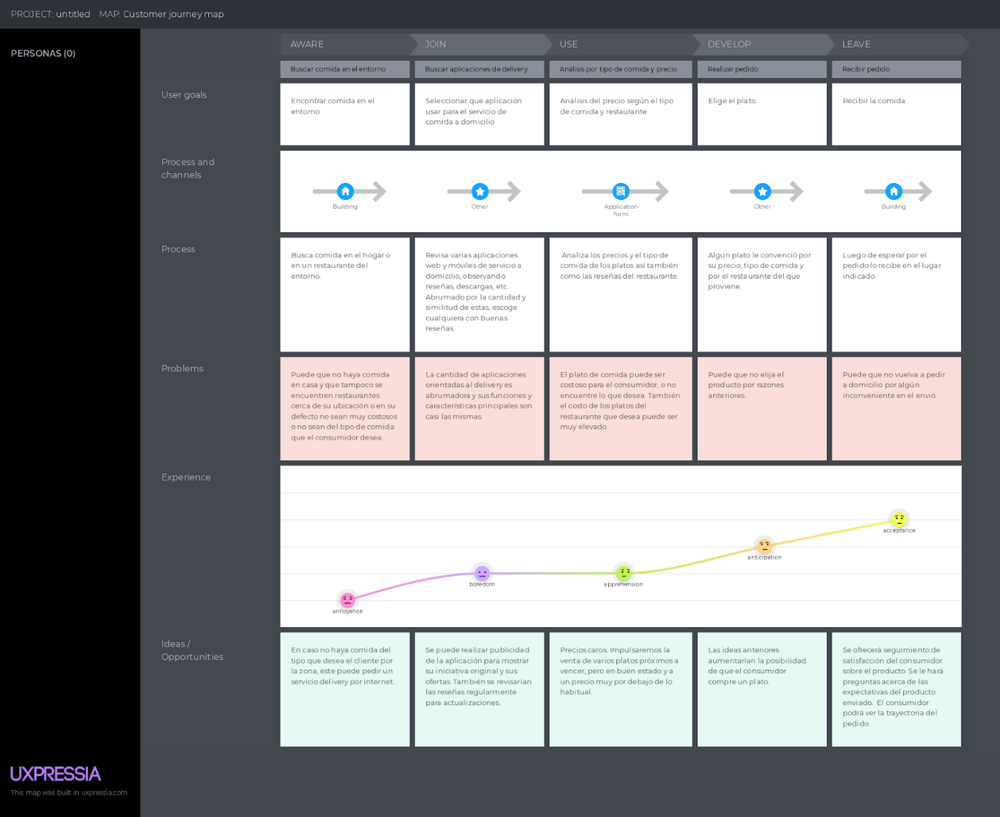Consumidor:

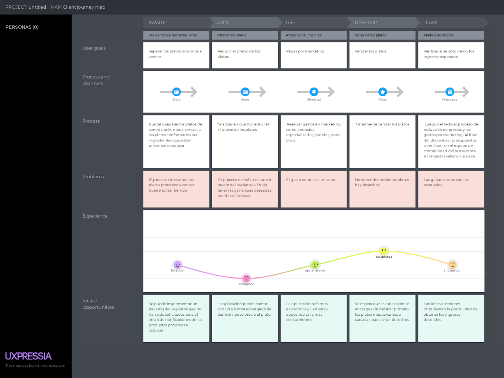Cliente:

**  
**

### 2.3.4. Empathy Mapping

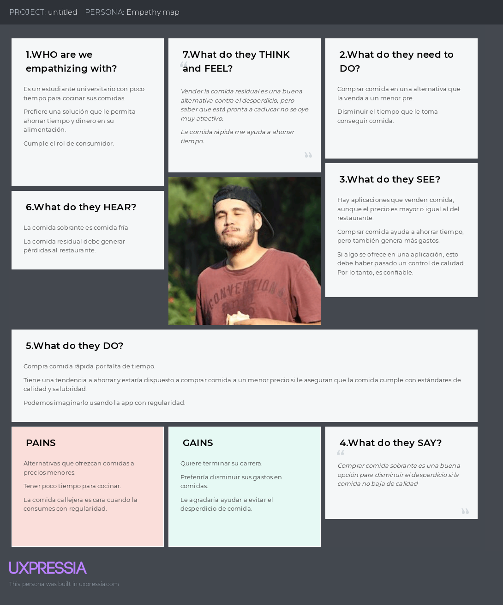

### 2.3.5. As-is Scenario Mapping.

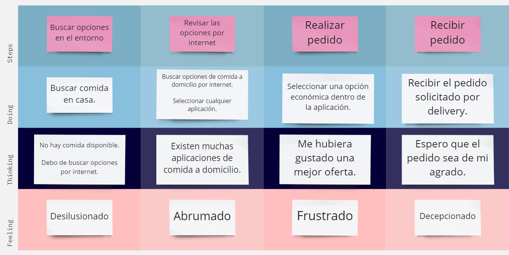Consumidor:

Cliente:

Link de los as-is scenarios:
https://miro.com/app/board/uXjVPbmMyEc=/?share_link_id=757619138617

# REQUIREMENTS SPECIFICATION

## 3.1. To-Be Scenario Mapping. 

Consumidor: los usuarios que van a comprar los alimentos.

Cliente: cadena de restaurantes y comidas.

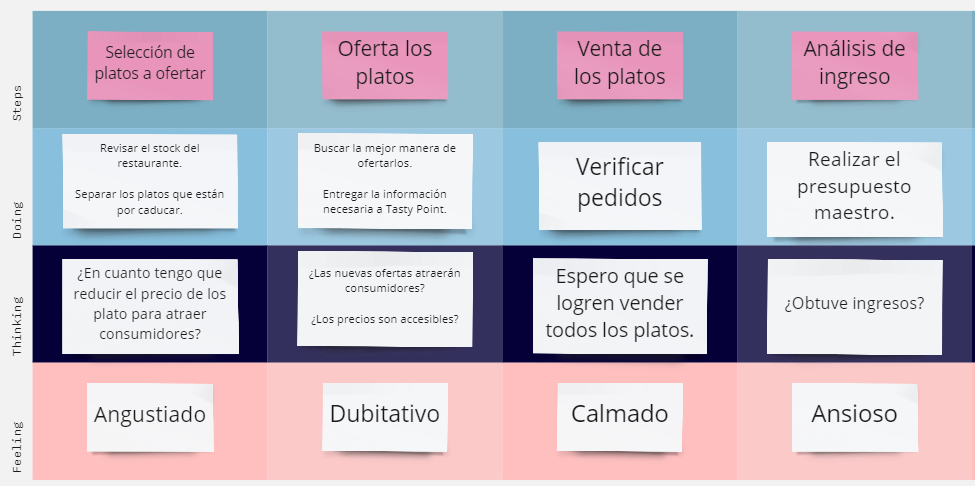

Link de los to-be scenarios:
https://miro.com/app/board/uXjVPbmMyEc=/?share_link_id=757619138617

## 3.2. User Stories 

** User stories Consumer**

| Story ID | Título                                              | Descripción                                                                                                                                                                | Criterios de aceptación                                                                                                                                                                                                                                                                                                                                 | Escenarios                                                                                        |
|----------|-----------------------------------------------------|----------------------------------------------------------------------------------------------------------------------------------------------------------------------------|---------------------------------------------------------------------------------------------------------------------------------------------------------------------------------------------------------------------------------------------------------------------------------------------------------------------------------------------------------|---------------------------------------------------------------------------------------------------|
| US01     | Registro de Consumidor                              | Como consumidor quiero crear una cuenta para acceder a la aplicación móvil.                                                                                                | Dado que el consumidor se encuentra en la ventana de registro y completa todos los campos. Cuando presiona el botón registrarse. Entonces podrá acceder a la aplicación.                                                                                                                                                                                | El consumidor quiere registrarse en la aplicación.                                                |
|          |                                                     |                                                                                                                                                                            | Dado que el consumidor se encuentra en la ventana de registro y no completa todos los campos obligatorios. Cuando presiona el botón registrarse. Entonces esos campos se marcan de rojo Y se muestra el mensaje: “Complete los campos obligatorios”.                                                                                                    | El consumidor no completa los campos obligatorios.                                                |
|          |                                                     |                                                                                                                                                                            | Dado que el consumidor se encuentra en la ventana de registro y completa erróneamente los campos. Cuando presiona el botón registrarse. Entonces se muestra el siguiente mensaje: “Complete los campos correctamente”.                                                                                                                                  |  El consumidor intenta registrarse, pero no completa con datos correctos los campos obligatorios. |
| US02     | Monitorear el perfil                                | Como consumidor quiero ver el perfil de mi cuenta para corroborar que mis datos sean correctos.                                                                            | Dado que el consumidor quiere ver su perfil. Cuando presiona el icono de perfil ubicado en la sección de menú. Entonces la aplicación muestra la información del perfil del consumidor.                                                                                                                                                                 | El consumidor quiere ver su perfil.                                                               |
| US03     | Cerrar sesión de consumidor                         | Como consumidor quiero cerrar sesión para salir de mi cuenta.                                                                                                              | Dado que el consumidor se encuentra en la aplicación. Cuando presiona el icono de perfil ubicado en la sección de menú. Entonces se le mostrará un mensaje: ¿Está seguro de cerrar sesión? Y el consumidor selecciona la opción sí para cerrar la sesión.                                                                                               | El consumidor quiere cerrar sesión en el sistema.                                                 |
|          |                                                     |                                                                                                                                                                            | Dado que el consumidor se encuentra en la aplicación. Cuando presiona el botón de cerrar sesión. Entonces se le mostrará un mensaje: ¿Está seguro de cerrar sesión? Y el consumidor selecciona la opción no para mantener iniciada la sesión.                                                                                                           |  El consumidor presiona por error el botón de “Cerrar sesión “.                                   |
| US04     | Pagar el envío de productos                         | Como consumidor quiero pagar el envió del pedido.                                                                                                                          | Dado que el consumidor se encuentra en la ventana “Pago”. Cuando se llena el campo de número de cuenta correctamente y presione el botón de Pagar. Entonces la aplicación mostrará un icono de verificado.                                                                                                                                              | El consumidor desea colocar su cuenta bancaria.                                                   |
|          |                                                     |                                                                                                                                                                            | Dado que el consumidor se encuentra en la ventana “Pago”. Cuando no se llena el campo de número de cuenta correctamente Y presione el botón de Pagar. Entonces la aplicación mostrará un mensaje de error y el borde del campo se volverá rojo.                                                                                                         | El consumidor rellena el campo de su cuenta bancaria incorrectamente.                             |
| US05     | Visualizar todas las notificaciones                 | Como consumidor, quiero visualizar las notificaciones para estar informado sobre las ofertas que ofrezcan los restaurantes.                                                | Dado que el consumidor se encuentra en la aplicación, cuando ingresa a la sección de notificaciones, entonces le aparecen las notificaciones realizadas por los restaurantes registrados en la aplicación.                                                                                                                                              | Ver ofertas publicadas por restaurantes.                                                          |
| US06     | Fijar favoritos                                     | Como consumidor quiero guardar la información de mis productos favoritos                                                                                                   | Dado que el consumidor, se encuentra en la ventana “Lista de productos”, cuando presiona el icono de corazón vacío que posee el artículo en la lista de productos publicados por los restaurantes registrados en la aplicación, entonces se añaden los datos del producto a la sección de favoritos y el icono de corazón vacío cambia por uno lleno.   | Guardar productos favoritos.                                                                      |
|          |                                                     |                                                                                                                                                                            | Dado que el consumidor, se encuentra en la ventana “Lista de productos”, cuando presiona el icono de corazón lleno que posee el artículo en la lista de productos publicados por los restaurantes registrados en la aplicación, entonces se eliminan los datos del producto a la sección de favoritos y el icono de corazón lleno cambia por uno vacío. | Eliminar producto de favoritos                                                                    |
| US07     | Visualizar productos y sus datos                    | Como consumidor quiero ver la lista de los productos publicados por los restaurantes registrados en la aplicación para poder comprarlos.                                   | Dado que el consumidor ha inicializado su sesión, cuando presione el icono de Lista en el menú entonces será dirigido a la ventana de “Lista de productos”, y podrá visualizar los productos organizados con sus respectivas fotos y ciertos datos puntuales como descripción.                                                                          | El consumidor quiere visualizar algunos productos para comprarlos.                                |
|          |                                                     |                                                                                                                                                                            | Dado que el consumidor ha inicializado su sesión, cuando presione el icono de Lista en el menú entonces será dirigido a la ventana de “Lista de productos”, y podrá visualizar el mensaje: “No hay productos publicados”.                                                                                                                               | El consumidor quiere visualizar algunos productos para comprarlos, pero no hay productos.         |
| US08     | Filtrar restaurante                                 | Como consumidor quiero filtrar la lista de restaurantes registrados en la aplicación para poder encontrar rápidamente los productos de mi restaurante de preferencia.      | Dado que el consumidor está en la sección Lista de productos, cuando ingrese el nombre del restaurante en la barra de navegación ubicado en la parte superior, entonces se mostrarán los datos de los productos de los restaurantes registrados en la aplicación.                                                                                       | El consumidor visualiza los restaurantes deseados.                                                |
|          |                                                     |                                                                                                                                                                            | Dado que el consumidor está en la sección Lista de productos, cuando ingrese el nombre del restaurante en la barra de navegación ubicado en la parte superior, entonces se mostrará el mensaje: “Restaurante no encontrado”.                                                                                                                            | No hay restaurantes registrados en la aplicación con el nombre del .                              |
| US09     | Compartir comentario                                | Como consumidor quiero redactar un comentario sobre un determinado restaurante acerca de mi experiencia con ellos para poder compartir mi opinión con los demás.           | Dado que el consumidor se encuentra en la ventana de reseñas, cuando ingrese su comentario y presione el botón de publicar entonces se publicará el comentario.                                                                                                                                                                                         | El consumidor exceda el límite de caracteres permitidos.                                          |
| US10     | Filtrar productos                                   | Como consumidor quiero filtrar la lista de productos registrados en la aplicación para poder encontrar rápidamente el producto que deseo.                                  | Dado que el consumidor está en la sección Lista de productos, cuando ingrese el nombre del producto en la barra de navegación ubicado en la parte superior, entonces se mostrarán los datos de los productos de los restaurantes registrados en la aplicación.                                                                                          | El consumidor visualiza los productos deseados.                                                   |
|          |                                                     |                                                                                                                                                                            | Dado que el consumidor está en la sección Lista de productos, cuando ingrese el nombre del producto en la barra de navegación ubicado en la parte superior, entonces se mostrará el mensaje: “Producto no encontrado”.                                                                                                                                  | No hay productos registrados en la aplicación con el nombre del producto.                         |
| US40     | Visualizar Información Sobre el Estado del Producto | Como consumidor quiero visualizar la información respectiva sobre el estado del producto para poder verificar que el alimento se encuentra en buen estado para el consumo. | Dado que el consumidor se encuentrá en la sección “List of Products”, cuando el usuario encuentre el producto que desea adquirir, podrá visualizar visualizar el tiempo de caducidad que tiene el producto.                                                                                                                                             | El consumidor visualiza el estado de los productos deseados.                                      |

**User Stories Business**

| **Número** | **Título**                                                                      | **Descripción**                                                                                                                                                                                                               | **Criterios de aceptación**                                                                                                                                                                                                                                                                                                                                                                                  | **Escenarios **                                                                                                                             |
|------------|---------------------------------------------------------------------------------|-------------------------------------------------------------------------------------------------------------------------------------------------------------------------------------------------------------------------------|--------------------------------------------------------------------------------------------------------------------------------------------------------------------------------------------------------------------------------------------------------------------------------------------------------------------------------------------------------------------------------------------------------------|---------------------------------------------------------------------------------------------------------------------------------------------|
| US11       | Registro de Cliente                                                             | Como cliente quiero crear una cuenta para acceder a la aplicación móvil.                                                                                                                                                      | Dado que el cliente se encuentra en la ventana de registro y completa todos los campos. Cuando presiona el botón registrarse. Entonces podrá acceder a la aplicación.                                                                                                                                                                                                                                        | El cliente quiere registrarse en la aplicación.                                                                                             |
|            |                                                                                 |                                                                                                                                                                                                                               |                                                                                                                                                                                                                                                                                                                                                                                                              |                                                                                                                                             |
|            |                                                                                 |                                                                                                                                                                                                                               | Dado que el cliente se encuentra en la ventana de registro y no completa todos los campos obligatorios. Cuando presiona el botón registrarse. Entonces esos campos se marcan de rojo y se muestra el mensaje: “Complete los campos obligatorios”.                                                                                                                                                            | El cliente no completa los campos obligatorios.                                                                                             |
|            |                                                                                 |                                                                                                                                                                                                                               |                                                                                                                                                                                                                                                                                                                                                                                                              |                                                                                                                                             |
|            |                                                                                 |                                                                                                                                                                                                                               | Dado que el cliente se encuentra en la ventana de registro y completa erróneamente los campos. Cuando presiona el botón registrarse. Entonces se muestra el siguiente mensaje: “Complete los campos correctamente”.                                                                                                                                                                                          |  El cliente intenta registrarse, pero no completa con datos correctos los campos obligatorios.                                              |
| US12       | Pago de suscripción                                                             | Como cliente deseo poder pagar la suscripción desde la aplicación para acceder a más beneficios.                                                                                                                              | Dado que el cliente ya se encuentra registrado. Cuando el cliente desee usar alguna función de la aplicación. Entonces la aplicación le mostrará una pantalla con las opciones de suscripción al servicio.                                                                                                                                                                                                   | Visualización de las opciones de suscripción                                                                                                |
|            |                                                                                 |                                                                                                                                                                                                                               |                                                                                                                                                                                                                                                                                                                                                                                                              |                                                                                                                                             |
|            |                                                                                 |                                                                                                                                                                                                                               |                                                                                                                                                                                                                                                                                                                                                                                                              |                                                                                                                                             |
|            |                                                                                 |                                                                                                                                                                                                                               |                                                                                                                                                                                                                                                                                                                                                                                                              |                                                                                                                                             |
|            |                                                                                 |                                                                                                                                                                                                                               | Dado que el cliente visualiza las opciones de suscripción. Cuando el cliente selecciona una de las opciones. Entonces la aplicación lo redirigirá a una pantalla en la que podrá ingresar la tarjeta de crédito o débito con la que realizará el pago.                                                                                                                                                       | El cliente ingresa los datos de su tarjeta.                                                                                                 |
|            |                                                                                 |                                                                                                                                                                                                                               |                                                                                                                                                                                                                                                                                                                                                                                                              |                                                                                                                                             |
|            |                                                                                 |                                                                                                                                                                                                                               |                                                                                                                                                                                                                                                                                                                                                                                                              |                                                                                                                                             |
|            |                                                                                 |                                                                                                                                                                                                                               |                                                                                                                                                                                                                                                                                                                                                                                                              |                                                                                                                                             |
|            |                                                                                 |                                                                                                                                                                                                                               | Dado que el cliente ya ingresó los datos necesarios para el pago. Cuando el cliente seleccione el botón Pagar. Entonces la aplicación le mostrará un mensaje de “Pago realizado con éxito”. Y el cliente podrá utilizar la aplicación.                                                                                                                                                                       | Realización exitosa del pago                                                                                                                |
|            |                                                                                 |                                                                                                                                                                                                                               |                                                                                                                                                                                                                                                                                                                                                                                                              |                                                                                                                                             |
|            |                                                                                 |                                                                                                                                                                                                                               |                                                                                                                                                                                                                                                                                                                                                                                                              |                                                                                                                                             |
|            |                                                                                 |                                                                                                                                                                                                                               |                                                                                                                                                                                                                                                                                                                                                                                                              |                                                                                                                                             |
|            |                                                                                 |                                                                                                                                                                                                                               |                                                                                                                                                                                                                                                                                                                                                                                                              |                                                                                                                                             |
|            |                                                                                 |                                                                                                                                                                                                                               | Dado que el cliente ya ingresó los datos necesarios para el pago. Cuando el cliente seleccione el botón Pagar. Y la aplicación detecte algún inconveniente . Entonces la aplicación le mostrará un mensaje de “El pago no se pudo realizar. Inténtelo de nuevo más tarde”.                                                                                                                                   | Realización fallida del pago                                                                                                                |
| US13       | Publicación de platos sobrantes                                                 | Como cliente deseo poder publicar los platos que me sobraron en el día para poder vender lo máximo posible.                                                                                                                   | Dado que el cliente posee excedentes de platos del día. Y el cliente se encuentra en la ventana de “Catálogo” y desea publicar sus excedentes. Cuando el cliente seleccione la opción Publicar. Entonces la aplicación le preguntará qué desea publicar (platos de comida o insumos)                                                                                                                         | Cliente selecciona producto a publicar                                                                                                      |
|            |                                                                                 |                                                                                                                                                                                                                               | Dado que el cliente se encuentra en la pantalla de elección de plato o insumo. Cuando el cliente escoja la opción de plato de comida. Entonces la aplicación le pedirá que ingrese una serie de datos sobre el plato (nombre del plato, cantidad, precio verdadero, precio ofrecido, entre otros).                                                                                                           | Cliente ingresa los datos del plato                                                                                                         |
|            |                                                                                 |                                                                                                                                                                                                                               | Dado que el cliente se encuentra en la pantalla de completado de datos del plato de comida. Cuando el cliente complete correctamente los datos. Y seleccione la opción publicar. Entonces la aplicación le mostrará un mensaje “Publicación realizada”.                                                                                                                                                      | Cliente realiza la publicación                                                                                                              |
| US14       | Publicación de insumos sobrantes                                                | Como cliente quiero publicar los insumos sobrantes del día para reducir al mínimo los desperdicios de estos.                                                                                                                  | Dado que el cliente posee excedentes de insumos del día. Y el cliente se encuentra en la ventana “Catálogo” y desea publicar sus excedentes. Cuando el cliente seleccione la opción Publicar. Entonces la aplicación le preguntará qué desea publicar (platos de comida o insumos)                                                                                                                           | Cliente selecciona producto a publicar                                                                                                      |
| US41       | Poder visualizar notificaciones para hacer seguimiento el estado de un producto | Como cliente quiero recibir notificaciones que me mantengan informado sobre los productos para ofrecer productos en buen estado a mis comensales.                                                                             | Dado que el cliente se encuentra dentro del aplicativo, podrá visualizar una sección de notificaciones con un incono de una campana, entonces al dirigirse ahí podrá visualizar todas las notificaciones que informaran al cliente sobre el estado de sus productos.                                                                                                                                         | El cliente se dirige a la sección del icono de campana y visualiza las notificaciones.                                                      |
| US42       | Registrar Inventario                                                            | Como cliente quiero registrar el inventario que tengo                                                                                                                                                                         | Dado que el cliente se encuentre en la aplicación se dirigirá a la sección “Inventory Analitycs” , entonces podrá registrar el respectivo inventario de su restaurante.                                                                                                                                                                                                                                      | El cliente entra a la sección “Inventory Analitycs” para registrar su inventario del restaurante.                                           |
| US43       | Monitorear el inventario                                                        | Como cliente quiero monitorear mi inventario, con el fin de estar al tanto del estado de mis productos.                                                                                                                       | Dado que el cliente se encuentre en la aplicación se dirigirá a la sección “Inventory Analitycs” , entonces podrá hacer seguimiento del estado de cada producto que se encuentre en el inventario.                                                                                                                                                                                                           | El cliente entra a la sección “Inventory Analitycs” para registrar su inventario del restaurante.                                           |
| US44       | Registrar fecha de producción y caducidad                                       | Como cliente quiero registrar la fecha de producción y caducidad del producto.                                                                                                                                                | Dado que el cliente se encuentra visualizando la lista de sus productos, podrá registrar la fecha de producción y caducidad de su producto seleccionado.                                                                                                                                                                                                                                                     | El cliente registrará la fecha de producción y caducidad del producto solicitado.                                                           |
|            |                                                                                 |                                                                                                                                                                                                                               | Dado que el cliente se encuentra en la pantalla de elección de plato o insumo. Cuando el cliente escoja la opción de insumo. Entonces la aplicación le pedirá que ingrese los datos del insumo(nombre del insumo, porciones, precio estimado, entre otros).                                                                                                                                                  | Cliente ingresa descripción del insumo                                                                                                      |
|            |                                                                                 |                                                                                                                                                                                                                               | Dado que el cliente se encuentra en la pantalla de completado de datos del insumo. Cuando el cliente complete correctamente los datos. Y seleccione la opción publicar. Entonces la aplicación le mostrará un mensaje “Publicación realizada”.                                                                                                                                                               | Cliente realiza la publicación                                                                                                              |
| US15       | Medios de contacto                                                              | Como cliente quiero enlazar todos los medios de comunicación que poseo para permitir a mis consumidores contactarse directamente con nosotros.                                                                                | Dado que el cliente se encuentra en la ventana “Perfil”, cuando selecciona “Agregar redes sociales” y los agrega, entonces la aplicación mostrará un mensaje “Se agregó con éxito”.                                                                                                                                                                                                                          | Añadir redes sociales                                                                                                                       |
| US16       | Ver opciones disponibles                                                        | Como cliente quiero ver las opciones que ofrece Tasty Point para conocer el funcionamiento de la app y elegir alguna de sus opciones disponibles.                                                                             | Dado que el cliente ha iniciado sesión, se encuentra en la ventana principal de Tasty point y desea ver las opciones disponibles de la app. Cuando el cliente seleccione el símbolo listo. Entonces la aplicación mostrará las opciones disponibles: "Inicio", "Agregar", "Catálogo", "Perfil", en formato de lista.                                                                                         | El cliente ingresa correctamente a la lista de opciones.                                                                                    |
| US17       | Ver pedidos                                                                     | Como cliente quiero ver la lista de pedidos solicitados en mi restaurante, para conocer la demanda a través de la aplicación móvil.                                                                                           | Dado que el cliente ha iniciado sesión, se encuentra en la ventana principal de Tasty point y hace clic en la sección “Órdenes”, cuando el cliente se encuentre en dicha sección, entonces aparecerá una lista con los nombres de los consumidores que realizaron un pedido en específico con fecha,  hora y cantidad ordenada.                                                                              | El cliente ingresa al registro de pedidos.                                                                                                  |
| US18       | Ver el catálogo de platos e insumos                                             | Como cliente quiero ver el catálogo actual de platos e insumos ofrecidos por mi establecimiento para corroborar que los datos de la app coincidan con mi inventario.                                                          | Dado que el cliente ha iniciado sesión, se encuentra en la lista de opciones ofrecida de Tasty point y desea revisar su catálogo. Cuando el cliente seleccione la opción "Catálogo". Entonces la aplicación mostrará la totalidad de platos e insumos registrados por el cliente, junto a datos pertinentes como: la cantidad actual, reservas hechas y tipo de recojo o envío disponible.                   | El cliente elige la opción catálogo.                                                                                                        |
|            |                                                                                 |                                                                                                                                                                                                                               | Dado que el cliente se encuentra en la lista de platos e insumos disponibles ofrecidos por su establecimiento, y desea ver sólo los platos o insumos ofrecidos por su establecimiento. Cuando el cliente seleccione la opción filtro y elija la opción “platos” o “insumos”. Entonces la aplicación listará solo platos o solo insumos (dependiendo de la opción del cliente) junto a sus datos pertinentes. | El cliente elige ver solo platos o solo insumos del catálogo.                                                                               |
| US19       | Abrir vista de consumidor                                                       | Como cliente quiero contar con la vista de consumidor para asegurar que mis productos se vean atractivos para los consumidores.                                                                                               | Dado que el cliente se encuentra en la ventana “Catálogo”, Cuando el cliente presione la opción: “Vista de consumidor”. Entonces la aplicación mostrará la ventana “Vista de consumidor” con los productos organizados de la forma en las que se le presenta al cliente.                                                                                                                                     | El cliente ingresa a “vista de consumidor”                                                                                                  |
| US20       | Editar las características de un plato o insumo                                 | Como cliente quiero ser capaz de editar las características que coloqué sobre algún plato o insumo para corregir errores o actualizar la información.                                                                         | Dado que el cliente se encuentra en la ventana “Catálogo” y quiera editar algún dato presentado. Cuando el cliente seleccione el botón editar del plato a editar. Entonces la aplicación permitirá la edición de los datos o multimedia ingresados (Nombre del plato, precio real, precio ofrecido, tipo de recojo o envío, foto del plato/insumo, etc).                                                     | El cliente ingresa correctamente al modo edición.                                                                                           |
|            |                                                                                 |                                                                                                                                                                                                                               | Dado que el cliente ha terminado de editar los datos requeridos y quiere guardar los cambios. Cuando el cliente elija el botón aceptar. Entonces se guardará y actualizará la información ofrecida; y se mostrará una ventana emergente de “Se han guardado los cambios”.                                                                                                                                    | El cliente guarda correctamente los datos editados.                                                                                         |
| US21       | Contar con un CTA (Call To Action) potencialmente atractivo                     | Como cliente es de mi interés que las ventas aumenten, por lo tanto, es de suma importancia que dentro de la app exista algún botón o enlace que los direccione a la carta disponible en mi restaurante y asegurar su compra. | Dado que el cliente se encuentra dentro de la aplicación cuando decida qué platillo consumir, entonces aparecen CTA atractivos de los restaurantes asociados a la aplicación, apareciendo botones con enlaces que los envía a la página del restaurante.                                                                                                                                                     | El cliente asegura una venta y se guarda el registro del platillo, siendo así que para la compra futura se recomiendan platillos similares. |
| US22       | Poder leer los comentarios de los usuarios.                                     | Como cliente quiero leer el feedback de los comensales para mejorar.                                                                                                                                                          | Dado que el cliente se encuentra dentro de la ventana “Reseñas de consumidores” cuando se dirige al área de opiniones, entonces puede leer los comentarios de los consumidores .                                                                                                                                                                                                                             | El cliente entra en la sección de consumidores y visualiza quiénes han hecho comentarios.                                                   |
|            |                                                                                 |                                                                                                                                                                                                                               |                                                                                                                                                                                                                                                                                                                                                                                                              |                                                                                                                                             |
|            |                                                                                 |                                                                                                                                                                                                                               |                                                                                                                                                                                                                                                                                                                                                                                                              |                                                                                                                                             |

**User Stories Landing Page**

| US25 | Botón call to action                             | Como usuario deseo que el landing page posea un botón call-to-action para poder acceder directamente hacia la aplicación                                    | Dado que el usuario se encuentra en el landing page. Cuando el usuario seleccione el botón Call to action llamado Comenzar. Entonces el sistema redirigirá al usuario a la aplicación móvil.                                                  | Presión del botón CTA                                         |
|------|--------------------------------------------------|-------------------------------------------------------------------------------------------------------------------------------------------------------------|-----------------------------------------------------------------------------------------------------------------------------------------------------------------------------------------------------------------------------------------------|---------------------------------------------------------------|
| US26 | Visualización de planes de suscripción.          | Como usuario deseo poder visualizar los planes de suscripción en el landing page para poder informarme cuanto son las cantidades por pagar por el servicio. | Dado que el usuario se encuentra en el landing page. Cuando el usuario seleccione la opción Planes de suscripción. Entonces el landing page le mostrará los planes de suscripción.                                                            | Selección de opción para visualizar planes.                   |
|      |                                                  |                                                                                                                                                             | Dado que el usuario se encuentra en el landing page. Cuando el usuario deslice el landing page hacia abajo. Entonces la aplicación permitirá visualizar los planes de suscripción.                                                            | Desliz de pantalla para visualizar planes.                    |
| US27 | Visualización de redes sociales                  | Como usuario deseo poder acceder a las redes sociales del startup por medio del landing page para conocer más acerca de este.                               | Dado que el usuario se encuentra en el landing page. Cuando el usuario deslice la página hasta el final. Entonces la aplicación mostrará el footer en el cual se encontrarán las redes sociales y demás información.                          | Visualización de redes sociales en el Footer.                 |
| US28 | Mobile responsive                                | Como usuario deseo que la aplicación móvil sea totalmente responsive para poder usarlo desde distintos dispositivos.                                        | Dado que el usuario utiliza el landing page. Cuando el usuario ingresa a la aplicación desde distintos dispositivos. Entonces la aplicación se adaptará a todos los dispositivos. Y la aplicación continuará funcional y visualmente estable. | Usuario ingresa desde distintos dispositivos.                 |
| US29 | Visualizar la sección home del landing page      | Como usuario quiero ver la sección “home” para ver la información principal.                                                                                | Dado que el usuario se encuentra en el landing page, cuando se dirija a la sección de home, entonces visualiza una breve descripción de la aplicación e información de sus segmentos.                                                         | Usuario se dirige a la sección “home” de la landing page.     |
| US30 | Visualizar la sección "about us" en landing page | Como usuario quiero ver la sección “about us” para saber porque TastyPoint es innovadora en el área de comida a domicilio.                                  | Dado que el usuario se encuentra en el landing page, cuando se dirija a la sección de about us”, entonces visualizará la información de TastyPoint.                                                                                           | Usuario se dirige a la sección “about us” de la landing page. |
| US31 | Visualizar la sección "segments" en landing page | Como usuario quiero ver la sección “segments” para conocer a quienes está dirigida la aplicación y sus beneficios.                                          | Dado que el usuario se encuentra en el landing page, cuando se dirija a la sección de “segments”, entonces visualiza el público objetivo de TastyPoint y las características de la aplicación en cada uno.                                    | Usuario se dirige a la sección “segments” de la landing page  |

## 3.3. Impact Mapping.  

Impact mapping es una técnica de planificación colaborativa para
proyectos de software, es eficiente para inclinar la correcta manera de
abordar la startup. Se realiza haciendo hincapié en el usuario, la
planificación basada en resultados y asignación mental del continuo
desarrollo del software.

**Segmento Usuario:**

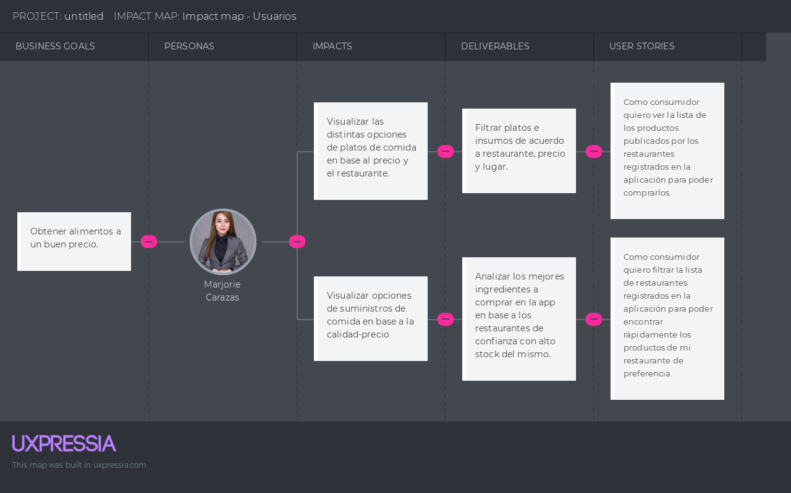

**  
**

**Segmento Cliente:**

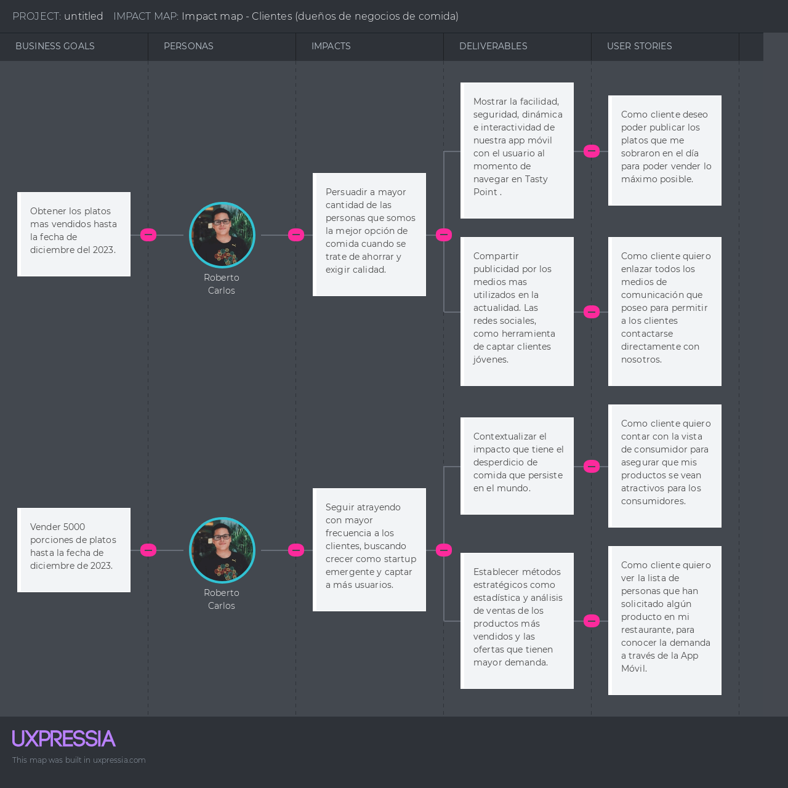

## 3.4. Product Backlog. 

Link a Product Backlog en Trello:
<https://trello.com/invite/b/y8XLZomg/ff78ce99cff9b79ee4444a9b1ee60779/tasty-point>

| **\#Orden** | **User Story ID** | **Título**                                                                      | **Descripción**                                                                                                                                                                                                               | **Story Points (1/2/3/5/8)** |
|-------------|-------------------|---------------------------------------------------------------------------------|-------------------------------------------------------------------------------------------------------------------------------------------------------------------------------------------------------------------------------|------------------------------|
| **1 **      | US25              | Botón call to action                                                            | Como usuario deseo que el landing page posea un botón call-to-action para poder acceder directamente hacia la aplicación.                                                                                                     | 1                            |
| **2**       | US29              | Visualizar la sección home del landing page                                     | Como usuario quiero ver la sección “home” para ver la información principal.                                                                                                                                                  | 2                            |
| **3**       | US30              | Visualizar la sección "about us" en landing page                                | Como usuario quiero ver la sección “about us” para saber porque TastyPoint es innovadora en el área de comida a domicilio.                                                                                                    | 1                            |
| **4**       | US31              | Visualizar la sección "segments" en landing page.                               | Como usuario quiero ver la sección “segments” para conocer a quienes está dirigida la aplicación y sus beneficios.                                                                                                            | 1                            |
| **5**       | US26              | Visualización de planes de suscripción.                                         | Como usuario deseo poder visualizar los planes de suscripción en el landing page para poder informarme cuanto son las cantidades por pagar por el servicio.                                                                   | 2                            |
| **6**       | US27              | Visualización de redes sociales.                                                | Como usuario deseo poder acceder a las redes sociales del startup por medio del landing page para conocer más acerca de este.                                                                                                 | 1                            |
| **7**       | US13              | Publicación de platos sobrantes                                                 | Como cliente deseo poder publicar los platos que me sobraron en el día para poder vender lo máximo posible                                                                                                                    | 5                            |
| **8**       | US14              | Publicación de insumos sobrantes                                                | Como cliente quiero publicar los insumos sobrantes del día para reducir al mínimo los desperdicios de estos                                                                                                                   | 5                            |
| **9**       | US20              | Editar las características de un plato o insumo                                 | Como cliente quiero ser capaz de editar las características que coloqué sobre algún plato o insumo para corregir errores o actualizar la información.                                                                         | 3                            |
| **10**      | US21              | Contar con un CTA (Call To Action) potencialmente atractivo                     | Como cliente es de mi interés que las ventas aumenten, por lo tanto, es de suma importancia que dentro de la App exista algún botón o enlace que los direccione a la carta disponible en mi restaurante y asegurar su compra. | 5                            |
| **11**      | US18              | Ver el catálogo de platos e insumos                                             | Como cliente quiero ver el catálogo actual de platos e insumos ofrecidos por mi establecimiento para corroborar que los datos de la app coincidan con mi inventario.                                                          | 3                            |
| **12**      | US12              | Pago de suscripción                                                             | Como cliente deseo poder pagar la suscripción desde la aplicación para facilitar un control de pagos                                                                                                                          | 5                            |
| **13**      | US07              | Visualizar productos y sus datos                                                | Como consumidor quiero ver la lista de los productos publicados por los restaurantes registrados en la aplicación para poder comprarlos.                                                                                      | 3                            |
| **14**      | US17              | Ver pedidos                                                                     | Como cliente quiero ver la lista de pedidos solicitados en mi restaurante, para conocer la demanda a través de la App móvil.                                                                                                  | 3                            |
| **16**      | US08              | Filtrar restaurante                                                             | Como consumidor quiero filtrar la lista de restaurantes registrados en la aplicación para poder encontrar rápidamente los productos de mi restaurante de preferencia.                                                         | 3                            |
| **17**      | US10              | Filtrar productos                                                               | Como consumidor quiero filtrar la lista de productos registrados en la aplicación para poder encontrar rápidamente el producto que deseo.                                                                                     | 3                            |
| **18**      | US06              | Fijar favoritos                                                                 | Como consumidor quiero clasificar de manera favorita mis productos para lograr visualizar la disponibilidad en la sección “Mis favoritos”                                                                                     | 3                            |
| **19**      | US04              | Pagar el envío de productos                                                     | Como consumidor quiero pagar mi envío para recibirlo plácidamente en mi casa                                                                                                                                                  | 5                            |
| **20**      | US09              | Compartir comentario                                                            | Como consumidor quiero redactar un comentario sobre algo en específico para poder compartir mi experiencia con los demás.                                                                                                     | 2                            |
| **21**      | US22              | Poder leer los comentarios de los usuarios                                      | Como cliente quiero leer el feedback de los comensales para mejorar.                                                                                                                                                          | 3                            |
| **22**      | US16              | Ver opciones disponibles                                                        | Como cliente quiero ver las opciones que ofrece Tasty Point para conocer el funcionamiento de la app y elegir alguna de sus opciones disponibles.                                                                             | 2                            |
| **23**      | US19              | Abrir vista de consumidor                                                       | Como cliente quiero contar con la vista de consumidor para asegurar que mis productos se vean atractivos para los consumidores.                                                                                               | 3                            |
| **24**      | US15              | Medios de contacto                                                              | Como cliente quiero enlazar todos los medios de comunicación que poseo para permitir a los clientes contactarse directamente con nosotros.                                                                                    | 2                            |
| **25**      | US05              | Visualizar todas las notificaciones                                             | Como consumidor, quiero visualizar las principales notificaciones para estar informado sobre las ofertas y promociones que ofrezca la aplicación                                                                              | 2                            |
| **26**      | US11              | Registro de cliente                                                             | Como cliente deseo poder registrarme en la aplicación para acceder a todos sus beneficios                                                                                                                                     | 3                            |
| **27**      | US01              | Registro de Consumidor                                                          | Como consumidor quiero crear una cuenta para poder realizar compras de platos de comida a un bajo precio.                                                                                                                     | 3                            |
| **29**      | US02              | Monitorear el perfil                                                            | Como consumidor quiero ver el perfil de mi cuenta para corroborar que mis datos sean correctos.                                                                                                                               | 3                            |
| **30**      | US03              | Cerrar sesión de consumidor                                                     | Como consumidor deseo poder cerrar sesión para no dejar expuesta mi cuenta en mi ordenador                                                                                                                                    | 2                            |
| **31**      | US28              | Mobile responsive                                                               | Como usuario deseo que la aplicación móvil sea totalmente responsive para poder usarlo desde distintos dispositivos.                                                                                                          | 2                            |
| **32**      | US40              | Visualizar Información Sobre el Estado del Producto                             | Como consumidor quiero visualizar la información respectiva sobre el estado del producto para poder verificar que el alimento se encuentra en buen estado para el consumo.                                                    | 2                            |
| **33**      | US41              | Poder visualizar notificaciones para hacer seguimiento el estado de un producto | Como cliente quiero recibir notificaciones que me mantengan informado sobre los productos para ofrecer productos en buen estado a mis comensales.                                                                             | 2                            |
| **34**      | US42              | Registrar Inventario                                                            | Como cliente quiero registrar el inventario que tengo                                                                                                                                                                         | 1                            |
| **35**      | US43              | Monitorear el inventario                                                        | Como cliente quiero monitorear mi inventario, con el fin de estar al tanto del estado de mis productos.                                                                                                                       | 1                            |
| **36**      | US44              | Registrar fecha de producción y caducidad                                       | Como cliente quiero registrar la fecha de producción y caducidad del producto.                                                                                                                                                | 1                            |

# SOLUTION SOFTWARE DESIGN

## Strategic-Level Domain-Driven Design.

### 4.1.1 Event Storming

#### 4.1.1.1 Candidate Context Discovery

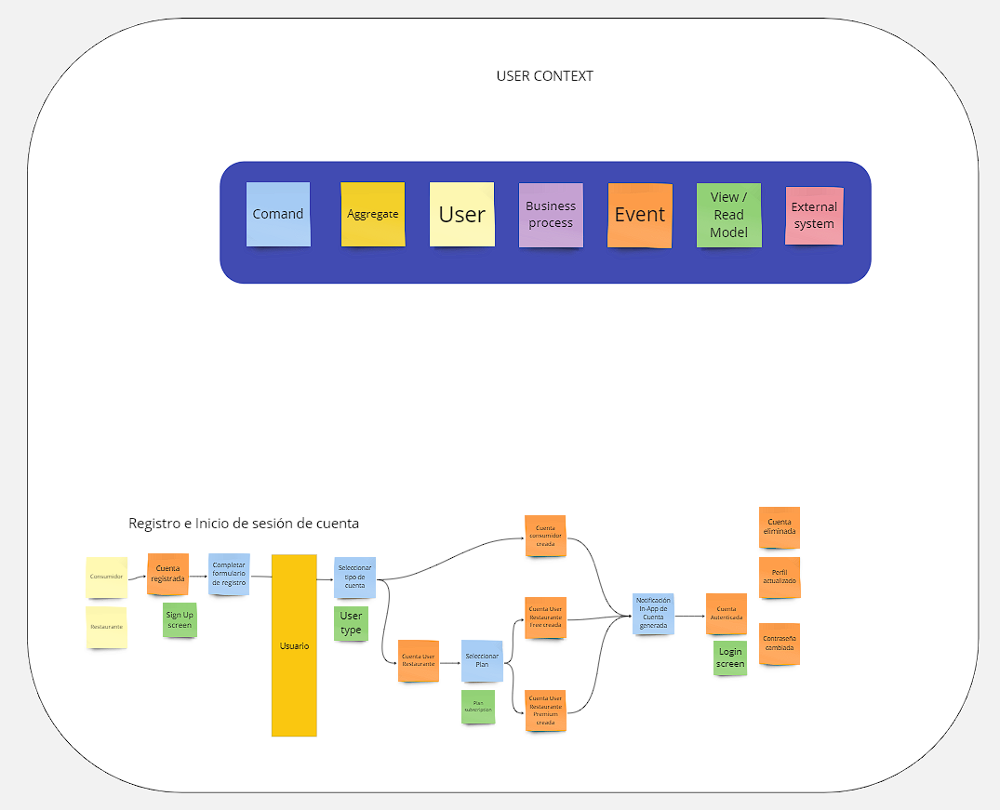

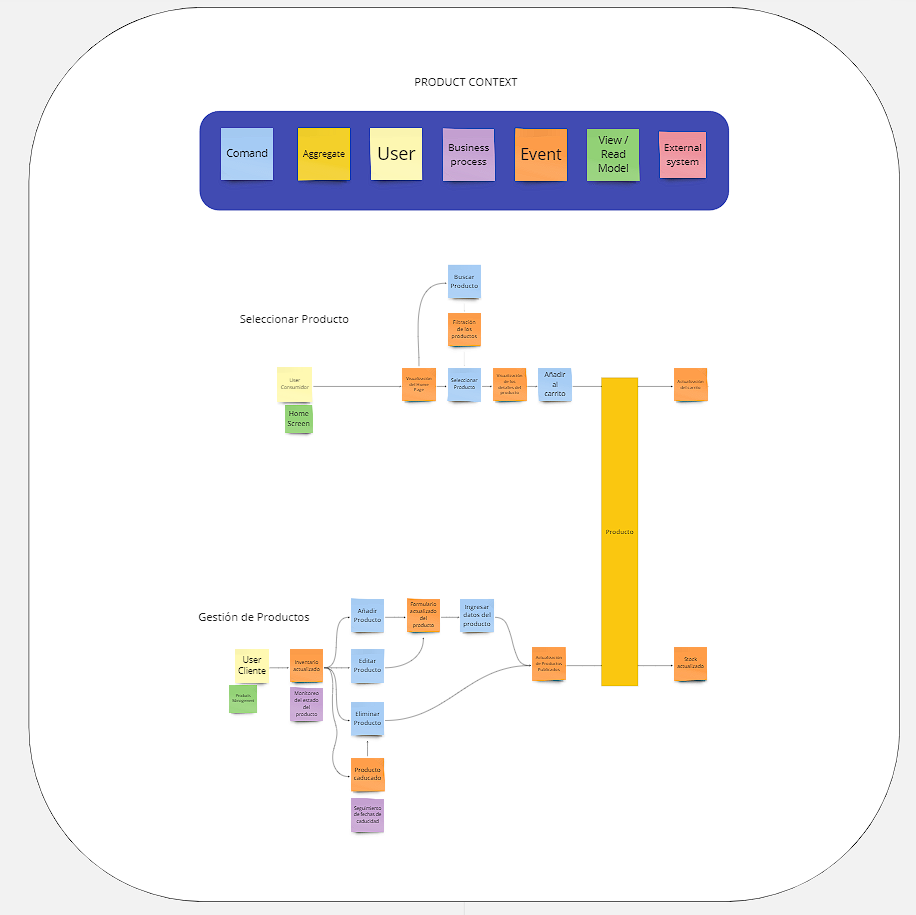

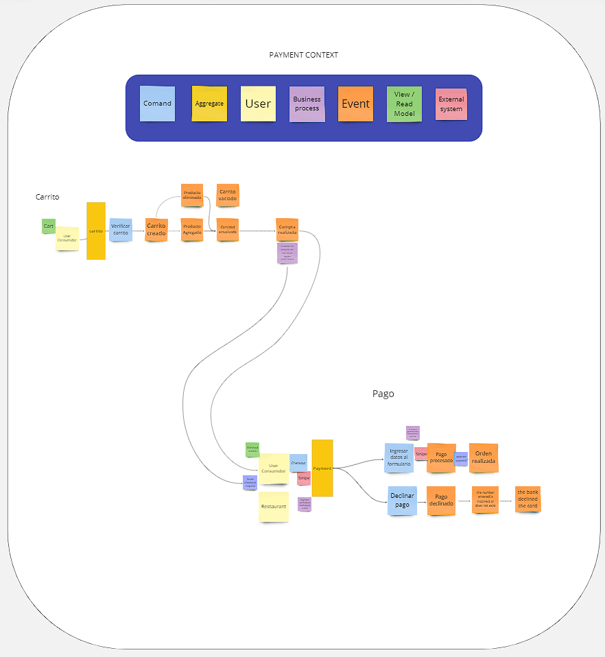

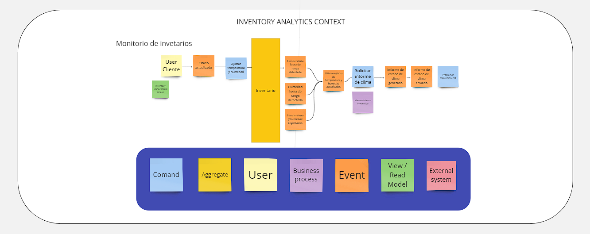

Enlace:
<https://miro.com/app/board/uXjVMp1_C0M=/?share_link_id=793442019520>

#### 4.1.1.2 Domain Message Flows Modeling

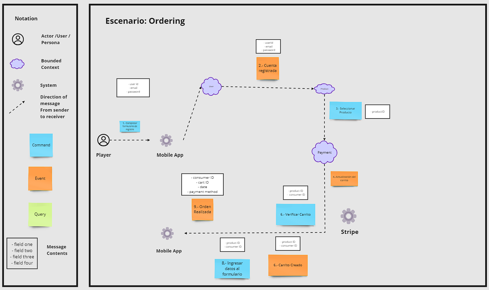

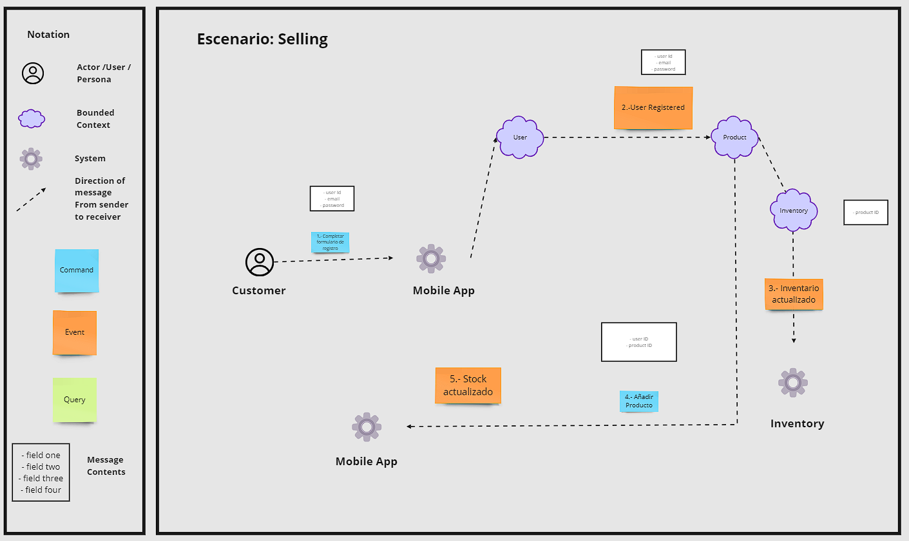

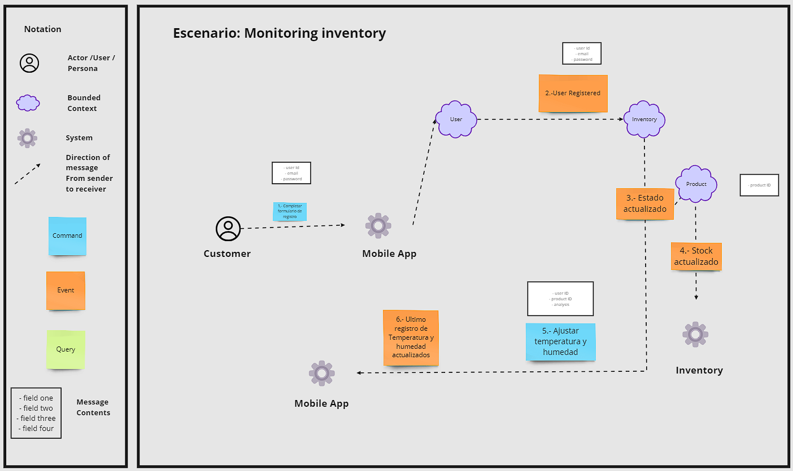

#### 4.1.1.3 Bounded Context Canvases. 

##### User bounded context canvas

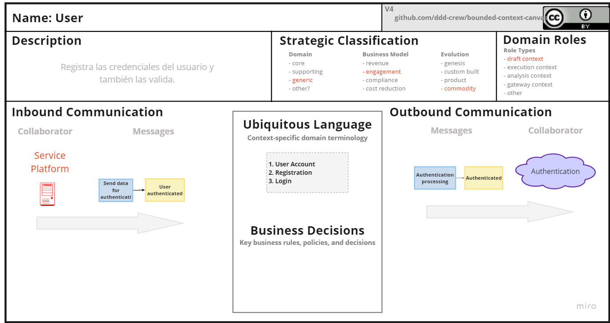

##### Payment bounded context canvas

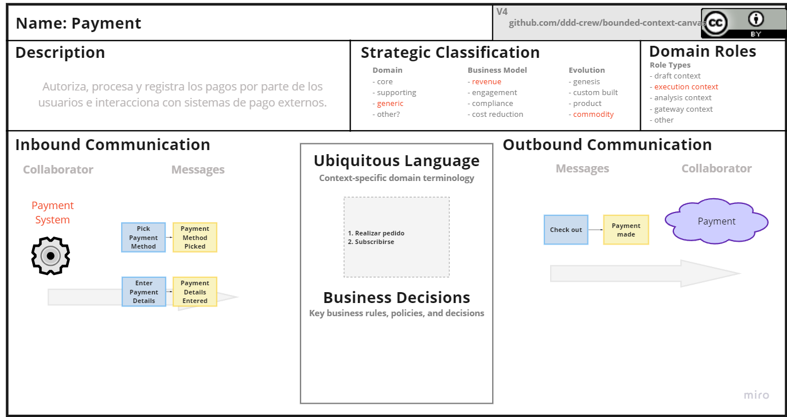

##### Inventory Analutics bounded context canvas

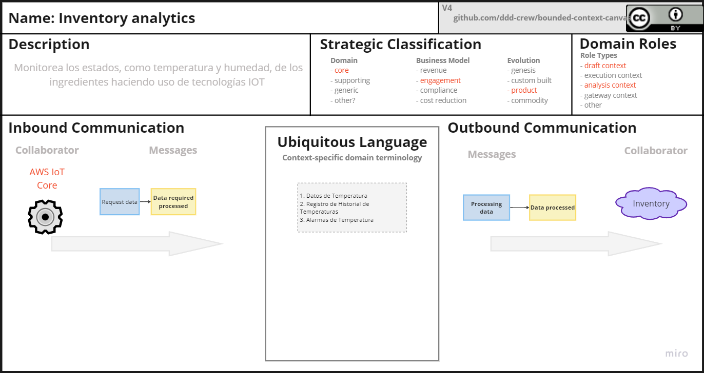

##### Product bounded context canvas

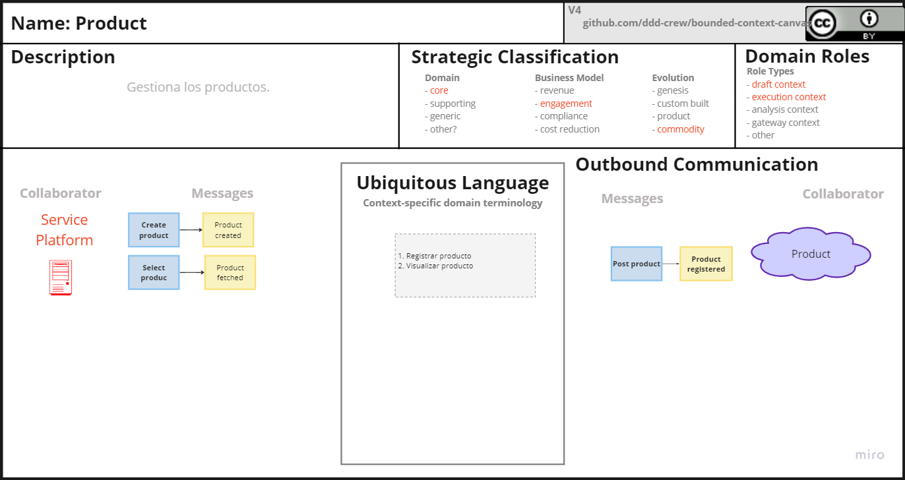

### 4.1.2. Context Mapping

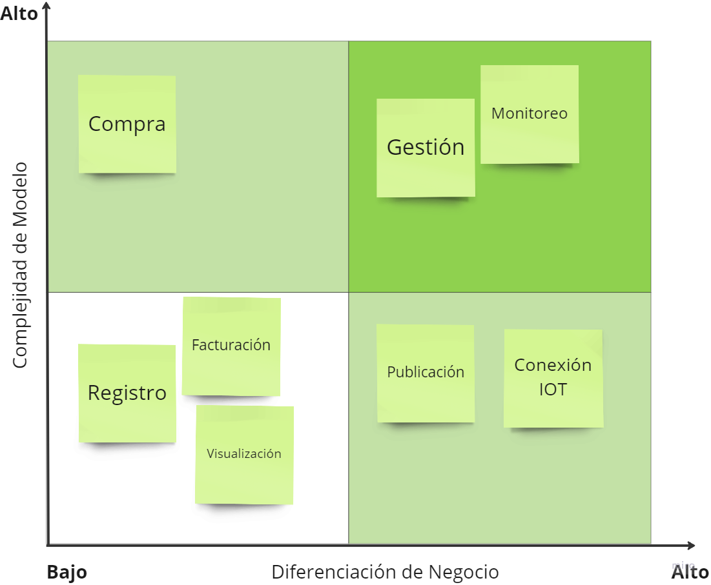

### 4.1.3 Software Architecture

#### 4.1.3.1 Software Architecture System Landscape Diagram

En este diagrama plasmamos el panorama completo de nuestro sistema
TastyPoint. Aquí podemos evidenciar las relaciones con los segmentos
objetivo, así como los sistemas externos con los que interactúa nuestro
sistema.

#### 4.1.3.2 Software Architecture Context Level Diagram

En este diagrama se plasma el contexto general que engloba nuestro
sistema TastyPoint. Aquí evidenciamos las relaciones de nuestro sistema
con otros así como con los segmentos objetivos.

#### 4.1.3.3 Software Architecture Container Level Diagram

En este diagrama se muestran los principales componentes de nuestro de
nuestro sistema (TastyPoint). Así como estos se relacionan con nuestros
segmentos objetivos y sistemas externos.

#### 4.1.3.4 Software Architecture Deployment Diagrams

En este diagrama se encuentran los componentes que son parte de la
arquitectura del despliegue de nuestra solución. Se puede verificar la
interacción que sucede entre los componentes desplegados y elementos que
usan los clientes para disfrutar del servicio.

## 4.2. Tactical-Level Domain-Driven Design

### 4.2.1. Bounded Context: User 

#### 4.2.1.1. Domain Layer.

<table>
<colgroup>
<col style="width: 34%" />
<col style="width: 31%" />
<col style="width: 33%" />
</colgroup>
<thead>
<tr class="header">
<th>Nombre</th>
<th colspan="2">User</th>
</tr>
</thead>
<tbody>
<tr class="odd">
<td>Categoría</td>
<td colspan="2">Entity</td>
</tr>
<tr class="even">
<td>Propósito</td>
<td colspan="2">Clase que representa un usuario. Contiene atributos como
el nombre, la dirección y correo.</td>
</tr>
<tr class="odd">
<td>Relaciones</td>
<td colspan="2"><ul>
<li>
One-to-One con RestaurantOwner
</li>
<li>
One-to-One con Customer
</li>
<li>
One-to-Many con Warehouse: Un
</li>
</ul>
<blockquote>

usuario (Restaurant Owner) puede poseer

varios almacenes para almacenar comida

</blockquote></td>
</tr>
<tr class="even">
<td colspan="3">Atributos</td>
</tr>
<tr class="odd">
<td>Nombre</td>
<td>Tipo de dato</td>
<td>Visibilidad</td>
</tr>
<tr class="even">
<td>id</td>
<td>uuid</td>
<td>private</td>
</tr>
<tr class="odd">
<td>username</td>
<td>string</td>
<td>private</td>
</tr>
<tr class="even">
<td>phoneNumber</td>
<td>string</td>
<td>private</td>
</tr>
<tr class="odd">
<td>address</td>
<td>string</td>
<td>private</td>
</tr>
<tr class="even">
<td>email</td>
<td>string</td>
<td>private</td>
</tr>
<tr class="odd">
<td>userType</td>
<td>enum</td>
<td>private</td>
</tr>
<tr class="even">
<td colspan="3">Métodos</td>
</tr>
<tr class="odd">
<td>Nombre</td>
<td>Tipo de retorno</td>
<td>Visibilidad</td>
</tr>
<tr class="even">
<td>addUser</td>
<td>void</td>
<td>public</td>
</tr>
<tr class="odd">
<td>getUserName</td>
<td>string</td>
<td>public</td>
</tr>
<tr class="even">
<td>getAddress</td>
<td>string</td>
<td>public</td>
</tr>
<tr class="odd">
<td>getPhone</td>
<td>string</td>
<td>public</td>
</tr>
<tr class="even">
<td>getEmail</td>
<td>string</td>
<td>public</td>
</tr>
<tr class="odd">
<td>getUserType</td>
<td>enum</td>
<td>public</td>
</tr>
<tr class="even">
<td>authenticate</td>
<td>boolean</td>
<td>public</td>
</tr>
<tr class="odd">
<td>updateProfile</td>
<td>void</td>
<td>public</td>
</tr>
</tbody>
</table>

| Nombre                  | RestaurantOwner                                                                   |             |
|-------------------------|-----------------------------------------------------------------------------------|-------------|
| Categoría               | Entity                                                                            |             |
| Propósito               | Clase que representa un usuario que posee un restaurante. Hereda de la clase User |             |
| Atributos               |                                                                                   |             |
| Nombre                  | Tipo de dato                                                                      | Visibilidad |
| id                      | uuid                                                                              | private     |
| restaurantName          | string                                                                            | private     |
| Métodos                 |                                                                                   |             |
| Nombre                  | Tipo de retorno                                                                   | Visibilidad |
| getRestaurantName       | string                                                                            | public      |
| updateRestaurantDetails | void                                                                              | public      |
| addMenuItem             | void                                                                              | public      |
| addWarehouse            | Vod                                                                               | public      |
| removeMenuItem          | void                                                                              | public      |
| listMenuItems           | List\[Item\]                                                                      | public      |

| Nombre         | Consumer                                                    |             |
|----------------|-------------------------------------------------------------|-------------|
| Categoría      | Entity                                                      |             |
| Propósito      | Clase que representa un consumidor. Hereda de la clase User |             |
| Atributos      |                                                             |             |
| Nombre         | Tipo de dato                                                | Visibilidad |
| Cart           | List\[Item\]                                                | private     |
| Métodos        |                                                             |             |
| Nombre         | Tipo de retorno                                             | Visibilidad |
| addToCart      | void                                                        | public      |
| removeFromCart | Void                                                        | public      |
| ViewCart       | List\[Item\]                                                | public      |
| checkout       | Order                                                       | public      |

Values Object

| Nombre      | Item                           |             |
|-------------|--------------------------------|-------------|
| Categoría   | Value Object                   |             |
| Propósito   | Manejo de valores de tipo Item |             |
| Atributos   |                                |             |
| Nombre      | Tipo de dato                   | Visibilidad |
| itemId      | string                         | private     |
| name        | string                         | private     |
| description | string                         | private     |
| price       | double                         | private     |

Aggregates

| Nombre              | Order                                                                                          |             |
|---------------------|------------------------------------------------------------------------------------------------|-------------|
| Categoría           | Aggregate                                                                                      |             |
| Propósito           | Agrupar y gestionar la información relacionada con los pedidos realizados por los consumidores |             |
| Atributos           |                                                                                                |             |
| Nombre              | Tipo de dato                                                                                   | Visibilidad |
| orderId             | String                                                                                         | private     |
| userId              | String                                                                                         | private     |
| ítems               | List\[Item\]                                                                                   | private     |
| totalPrice          | double                                                                                         | private     |
| Métodos             |                                                                                                |             |
| calculateTotalPrice | double                                                                                         | public      |

#### 4.2.1.2. Interface Layer.

| Nombre     | UserController                                                                                                                                       |             |
|------------|------------------------------------------------------------------------------------------------------------------------------------------------------|-------------|
| Categoria  | Controller                                                                                                                                           |             |
| Proposito  | Controlador encargado de manejar las solicitudes HTTP relacionadas con usuarios. Se comunica con la capa de servicios para procesar las solicitudes. |             |
| Nombre     | Tipo de retorno                                                                                                                                      | Visibilidad |
| Register   | Promise                                                                                                                                              | Public      |
| UpdateUser | Promise                                                                                                                                              | Public      |
| DeleteUser | Promise                                                                                                                                              | Public      |
| Login      | User                                                                                                                                                 | Public      |

#### 4.2.1.3. Application Layer.

| Event Handlers     |                                                     |
|--------------------|-----------------------------------------------------|
| Nombre             | Propósito                                           |
| VerifyEventHandler | Notificar a un usuario cuando su cuenta se verifica |

| Commands                     |                                            |
|------------------------------|--------------------------------------------|
| Nombre                       | Propósito                                  |
| AddMenuItemCommandHandler    | Añadir una comida al menú                  |
| RemoveMenuItemCommandHandler | Eliminar una comida del menú               |
| AddToCartCommandHandler      | Añadir una comida al carrito de compras    |
| RemoveFromCartCommandHandler | Eliminar una comida del carrito de compras |
| CheckoutCommandHandler       | Confirmar la comprar                       |

| Dto                       |                                                        |
|---------------------------|--------------------------------------------------------|
| Nombre                    | Propósito                                              |
| MenuItemSearchResponseDto | Data de respuesta de la búsqueda de un plato de comida |

| Validator               |                                          |
|-------------------------|------------------------------------------|
| Nombre                  | Propósito                                |
| MenuItemSearchValidator | Valida la búsqueda de un plato de comida |

#### 4.2.1.4. Infrastructure Layer.

| Nombre    | UserRepository                                                                                                                             |             |
|-----------|--------------------------------------------------------------------------------------------------------------------------------------------|-------------|
| Categoría | Repository                                                                                                                                 |             |
| Propósito | Define la interfaz para el repositorio encargado de conservar y recuperar la información relacionada con los usuarios en la base de datos. |             |
| Métodos   |                                                                                                                                            |             |
| Nombre    | Tipo de retorno                                                                                                                            | Visibilidad |
| create    | void                                                                                                                                       | public      |
| delete    | void                                                                                                                                       | public      |
| edit      | void                                                                                                                                       | public      |
| getById   | User                                                                                                                                       | public      |

| Nombre    | MenuItemRepository                                                                                                          |             |
|-----------|-----------------------------------------------------------------------------------------------------------------------------|-------------|
| Categoría | Repository                                                                                                                  |             |
| Propósito | Define la interfaz para el repositorio encargado de conservar y recuperar la información relacionada con la comida del menú |             |
| Métodos   |                                                                                                                             |             |
| Nombre    | Tipo de retorno                                                                                                             | Visibilidad |
| create    | void                                                                                                                        | public      |
| delete    | void                                                                                                                        | public      |
| edit      | void                                                                                                                        | public      |
| getById   | User                                                                                                                        | public      |
| getAll    | List\[Item\]                                                                                                                | public      |

| Nombre    | OrderRepository                                                                                |             |
|-----------|------------------------------------------------------------------------------------------------|-------------|
| Categoría | Repository                                                                                     |             |
| Propósito | Define la interfaz para el repositorio encargado de los conservar y recuperar datos del pedido |             |
| Métodos   |                                                                                                |             |
| Nombre    | Tipo de retorno                                                                                | Visibilidad |
| create    | void                                                                                           | public      |
| delete    | void                                                                                           | public      |
| edit      | void                                                                                           | public      |
| getById   | User                                                                                           | public      |
| getAll    | List\[Order\]                                                                                  | public      |

#### 4.2.1.6. Bounded Context Software Architecture Component Level Diagrams.

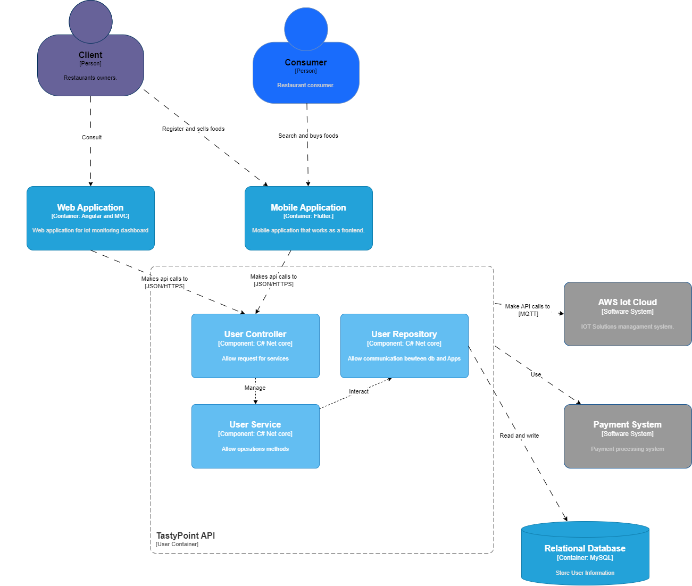

#### 4.2.1.7. Bounded Context Software Architecture Code Level Diagrams.

##### 4.2.1.7.1. Bounded Context Domain Layer Class Diagrams.

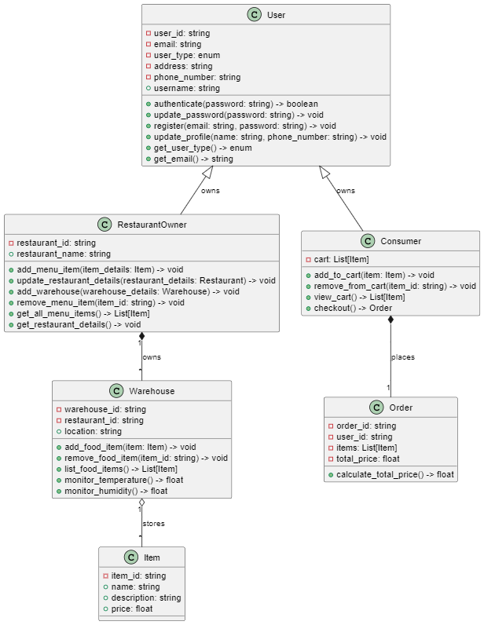

##### 4.2.1.7.2. Bounded Context Database Design Diagram.

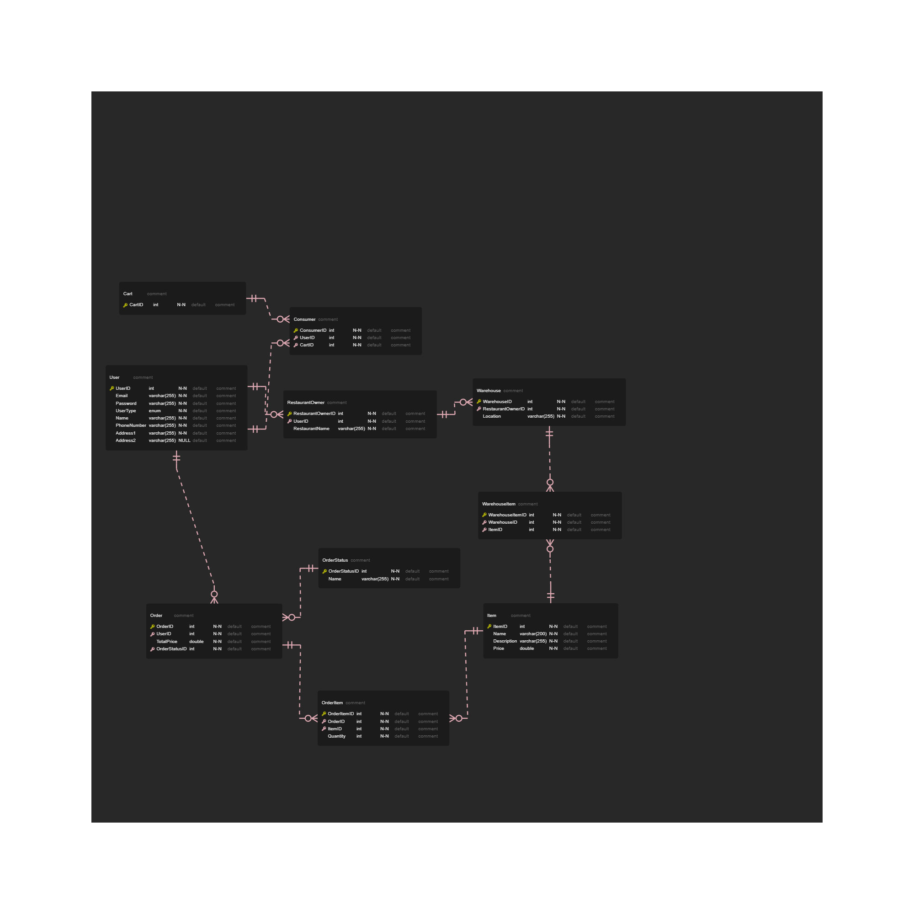

Link: <https://ibb.co/F75hsNf>

### 4.2.2. Bounded Context: Inventory Analitycs

#### 4.2.2.1. Domain Layer.

| Nombre                |                 | InventoryAnalitycs                                                                                                                                       |             |             |
|-----------------------|-----------------|----------------------------------------------------------------------------------------------------------------------------------------------------------|-------------|-------------|
| Categoria             |                 | Entity                                                                                                                                                   |             |             |
| Proposito             |                 | Clase que representa un inventario de productos. Contiene como el título, descripción, cantidad de productos, temperatura, medición de humedad y estado. |             |             |
| Relaciones            |                 | Many-to-One con Client(RestaurantOwner) : Un usuario (Restaurant Owner) puede poseer varios análisis de inventarios                                      |             |             |
| Atributos             |                 |                                                                                                                                                          |             |             |
| Nombre                |                 | Tipo de dato                                                                                                                                             |             | Visibilidad |
| Title                 |                 | string                                                                                                                                                   |             | private     |
| Description           |                 | string                                                                                                                                                   |             | private     |
| Num_products          |                 | int                                                                                                                                                      |             | private     |
| Temperature           |                 | string                                                                                                                                                   |             | private     |
| Humidity              |                 | string                                                                                                                                                   |             | private     |
| State                 |                 | string                                                                                                                                                   |             | private     |
| Métodos               |                 |                                                                                                                                                          |             |             |
| Nombre                | Tipo de retorno |                                                                                                                                                          | Visibilidad |             |
| AddInventoryAnalitycs | void            |                                                                                                                                                          | public      |             |
| GetTitle              | string          |                                                                                                                                                          | public      |             |
| SetTitle              | void            |                                                                                                                                                          | public      |             |
| GetDescription        | String          |                                                                                                                                                          | public      |             |
| SetDescription        | void            |                                                                                                                                                          | public      |             |
| GetNumProducts        | Int             |                                                                                                                                                          | public      |             |
| SetNumProducts        | void            |                                                                                                                                                          | public      |             |
| GetTemperature        | string          |                                                                                                                                                          | public      |             |
| SetTemperature        | void            |                                                                                                                                                          | public      |             |
| GetHumidity           | string          |                                                                                                                                                          | public      |             |
| SetHumidity           | void            |                                                                                                                                                          | public      |             |
| GetState              | string          |                                                                                                                                                          | public      |             |
| SetState              | void            |                                                                                                                                                          | public      |             |
|                       |                 |                                                                                                                                                          |             |             |

| Nombre    | InventoryAnalitycsService                                                                                                             |             |
|-----------|---------------------------------------------------------------------------------------------------------------------------------------|-------------|
| Categoria | Service                                                                                                                               |             |
| Proposito | Define la interfaz para el servicio encargado de manejar la lógica de negocio relacionada con el análisis de inventario de productos. |             |
| Metodos   |                                                                                                                                       |             |
| Nombre    | Tipo de retorno                                                                                                                       | Visibilidad |
| ListById  | InventoryAnalitycs                                                                                                                    | public      |
| ListAll   | InventoryAnalitycs                                                                                                                    | public      |
| Create    | InventoryAnalitycsResponse                                                                                                            | public      |
| Update    | InventoryAnalitycsResponse                                                                                                            | public      |
| Delete    | InventoryAnalitycsResponse                                                                                                            | public      |

#### 4.2.2.2. Interface Layer.

| Nombre                   | InventoryAnalitycsController                                                                                                                                           |             |
|--------------------------|------------------------------------------------------------------------------------------------------------------------------------------------------------------------|-------------|
| Categoria                | Controller                                                                                                                                                             |             |
| Proposito                | Controlador encargado de manejar las solicitudes HTTP relacionadas con el análisis de inventarios. Se comunica con la capa de servicios para procesar las solicitudes. |             |
| Nombre                   | Tipo de retorno                                                                                                                                                        | Visibilidad |
| GetAllInventoryAnalitycs | Promise                                                                                                                                                                | public      |
| PostInventoryAnalitycs   | Promise                                                                                                                                                                | public      |
| UpdateInventoryAnalitycs | Promise                                                                                                                                                                | public      |
| DeleteInventoryAnalitycs | Promise                                                                                                                                                                | public      |

#### 4.2.2.3. Application Layer.

| Nombre    | InventoryAnalitycsHandler                     |
|-----------|-----------------------------------------------|
| Categoria | Event Handler                                 |
| Proposito | Validar los datos del análisis de inventario. |

#### 4.2.2.4. Infrastructure Layer.

| Nombre    | InventoryAnalitycsRepository                                                                                                                           |             |
|-----------|--------------------------------------------------------------------------------------------------------------------------------------------------------|-------------|
| Categoria | Repository                                                                                                                                             |             |
| Proposito | Define la interfaz para el repositorio encargado de acceder y manipular la información relacionada con los análisis de inventario en la base de datos. |             |
| Metodos   |                                                                                                                                                        |             |
| Nombre    | Tipo de retorno                                                                                                                                        | Visibilidad |
| create    | void                                                                                                                                                   | public      |
| delete    | void                                                                                                                                                   | public      |
| edit      | void                                                                                                                                                   | public      |
| getById   | InventoryAnalitycs                                                                                                                                     | public      |
| GetAll    | Array\<InventoryAnalitycs\>                                                                                                                            | public      |

#### 4.2.2.6. Bounded Context Software Architecture Component Level Diagrams. 

#### 4.2.2.7. Bounded Context Software Architecture Code Level Diagrams.

##### 4.2.2.7.1. Bounded Context Domain Layer Class Diagrams

##### 4.2.2.7.2. Bounded Context Database Design Diagram.

### 4.2.3. Bounded Context: Payment 

#### 4.2.3.1. Domain Layer. 

| Nombre                 |                  | Cart                                                          |              |              |
|------------------------|------------------|---------------------------------------------------------------|--------------|--------------|
| Categoria              |                  | Entity                                                        |              |              |
| Proposito              |                  | Clase que representa el carrito de compras de la aplicación.  |              |              |
| Atributos              |                  |                                                               |              |              |
| Nombre                 |                  | Tipo de dato                                                  |              | Visibilidad  |
| cartId                 |                  | int                                                           |              | private      |
| productName            |                  | string                                                        |              | private      |
| productDescription     |                  | string                                                        |              | private      |
| productPrice           |                  | int                                                           |              | private      |
| productQuantity        |                  | int                                                           |              | private      |
| totalPrice             |                  | int                                                           |              | private      |
| Métodos                |                  |                                                               |              |              |
| Nombre                 | Tipo de retorno  |                                                               | Visibilidad  |              |
| getCartId              | int              |                                                               | public       |              |
| getProductName         | string           |                                                               | public       |              |
| getProductDescription  | string           |                                                               | public       |              |
| getProductPrice        | int              |                                                               | public       |              |
| getProductQuantity     | int              |                                                               | public       |              |
| setProductQuantity     | void             |                                                               | public       |              |
| getTotalPrice          | int              |                                                               | public       |              |
| setTotalPrice          | void             |                                                               | public       |              |

 

| Nombre            |                  | CartService                                                                             |              |
|-------------------|------------------|-----------------------------------------------------------------------------------------|--------------|
| Categoria         |                  | Entity                                                                                  |              |
| Proposito         |                  | Define la interfaz para el servicio encargado del carrito de compras de la aplicación.  |              |
| Métodos           |                  |                                                                                         |              |
| Nombre            | Tipo de retorno  |                                                                                         | Visibilidad  |
| addProduct        | void             |                                                                                         | public       |
| removeProduct     | void             |                                                                                         | public       |
| decreaseQuantity  | void             |                                                                                         | public       |
| updateQuantity    | void             |                                                                                         | public       |
| createCart        | void             |                                                                                         | public       |

 

 

 

| Nombre              |                  | Purchase                                                |              |              |
|---------------------|------------------|---------------------------------------------------------|--------------|--------------|
| Categoria           |                  | Entity                                                  |              |              |
| Proposito           |                  | Clase que representa el apartado de pago del producto.  |              |              |
| Atributos           |                  |                                                         |              |              |
| Nombre              |                  | Tipo de dato                                            |              | Visibilidad  |
| paymentId           |                  | int                                                     |              | private      |
| cartId              |                  | int                                                     |              | private      |
| paymentAmount       |                  | int                                                     |              | private      |
| currency            |                  | string                                                  |              | private      |
| paymentStatus       |                  | string                                                  |              | private      |
| customerId          |                  | string                                                  |              | private      |
| Métodos             |                  |                                                         |              |              |
| Nombre              | Tipo de retorno  |                                                         | Visibilidad  |              |
| getPaymentId()      | int              |                                                         | public       |              |
| getCartId()         | int              |                                                         | public       |              |
| getPaymentAmount()  | int              |                                                         | public       |              |
| getCurrency()       | string           |                                                         | public       |              |
| getPaymentStatus()  | string           |                                                         | public       |              |
| getCustomerId()     | string           |                                                         | public       |              |
| processPayment()    | boolean          |                                                         | public       |              |

 

| Nombre             |                  | PurchaseService                                                           |              |
|--------------------|------------------|---------------------------------------------------------------------------|--------------|
| Categoria          |                  | Entity                                                                    |              |
| Proposito          |                  | Define la interfaz para el servicio de pago de compras de la aplicación.  |              |
| Métodos            |                  |                                                                           |              |
| Nombre             | Tipo de retorno  |                                                                           | Visibilidad  |
| createPayment()    | StripePayment    |                                                                           | public       |
| initiatePayment()  | PaymentIntent    |                                                                           | public       |
| confirmPayment()   | boolean          |                                                                           | public       |
| refundPayment()    | boolean          |                                                                           | public       |
| retrievePayment()  | StripePayment    |                                                                           | public       |

 

 

#### 4.2.3.2. Interface Layer. 

| Nombre                                                       | CartPaymentController                                                                         |              |
|--------------------------------------------------------------|-----------------------------------------------------------------------------------------------|--------------|
| Categoria                                                    | Controller                                                                                    |              |
| Proposito                                                    | Controlador encargado de manejar las solicitudes HTTP relacionadas con el pago del carrito.   |              |
| Nombre                                                       | Tipo de retorno                                                                               | Visibilidad  |
| getAllCarts()                                                | Promise                                                                                       | public       |
| getCartById(cartId: int)                                     | Promise                                                                                       | public       |
| createCart(cartData: CartData)                               | Promise                                                                                       | public       |
| updateCart(cartId: int, cartData: CartData)                  | Promise                                                                                       | public       |
| deleteCart(cartId: int)                                      | Promise                                                                                       | public       |
| getAllPurchases()                                            | Promise                                                                                       | public       |
| getPurchaseById(purchaseId: int)                             | Promise                                                                                       | public       |
| createPurchase(purchaseData: PurchaseData)                   | Promise                                                                                       | public       |
| updatePurchase(purchaseId: int, purchaseData: PurchaseData)  | Promise                                                                                       | public       |
| deletePurchase(purchaseId: int)                              | Promise                                                                                       | public       |

 

#### 4.2.3.3. Application Layer. 

| Nombre     | CartPaymentHandler                                                                                |
|------------|---------------------------------------------------------------------------------------------------|
| Categoria  | Event Handler                                                                                     |
| Proposito  | Validar los datos relacionados con carritos y compras, y manejar eventos relacionados con ellos.  |

 

#### 4.2.3.4. Infrastructure Layer. 

| Nombre                                                       | CartPaymentRepository                                                                                                           |              |
|--------------------------------------------------------------|---------------------------------------------------------------------------------------------------------------------------------|--------------|
| Categoria                                                    | Repository                                                                                                                      |              |
| Proposito                                                    | Define la interfaz para el repositorio encargado de acceder y manipular la información relacionada con los pagos del carrito.   |              |
| Metodos                                                      |                                                                                                                                 |              |
| Nombre                                                       | Tipo de retorno                                                                                                                 | Visibilidad  |
| createCart(cartData: CartData)                               | void                                                                                                                            | public       |
| updateCart(cartId: int, cartData: CartData)                  | void                                                                                                                            | public       |
| deleteCart(cartId: int)                                      | void                                                                                                                            | public       |
| getCartById(cartId: int)                                     | Cart                                                                                                                            | public       |
| getAllCarts()                                                | Array\<Cart\>                                                                                                                   | public       |
| createPurchase(purchaseData: PurchaseData)                   | void                                                                                                                            | public       |
| updatePurchase(purchaseId: int, purchaseData: PurchaseData)  | void                                                                                                                            | public       |
| deletePurchase(purchaseId: int)                              | void                                                                                                                            | public       |
| getPurchaseById(purchaseId: int)                             | Purchase                                                                                                                        | public       |
| getAllPurchases()                                            | Array\<Purchase\>                                                                                                               | public       |

 

#### 4.2.3.6. Bounded Context Software Architecture Component Level Diagrams.   

 

#### 4.2.3.7. Bounded Context Software Architecture Code Level Diagrams. 

##### 4.2.3.7.1. Bounded Context Domain Layer Class Diagrams 

 

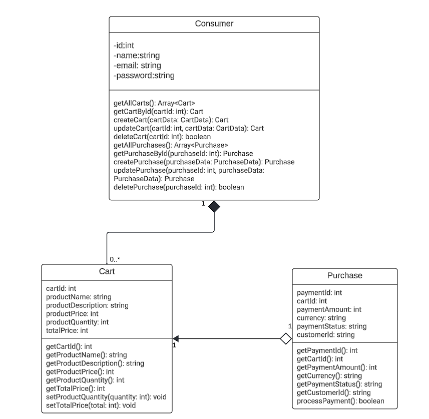 

 

 

 

##### 4.2.3.7.2. Bounded Context Database Design Diagram. 

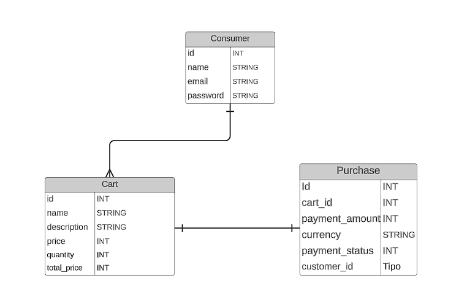 

 

 

### 4.2.1. Bounded Context: Products

#### 4.2.1.1. Domain Layer. 

| Nombre          |                  | Product                                                                                                             |              |              |
|-----------------|------------------|---------------------------------------------------------------------------------------------------------------------|--------------|--------------|
| Categoria       |                  | Entity                                                                                                              |              |              |
| Proposito       |                  | Clase que representa un producto, el cual fue registrado por un cliente y puede ser seleccionado por un consumidor. |              |              |
| Atributos       |                  |                                                                                                                     |              |              |
| Nombre          |                  | Tipo de dato                                                                                                        |              | Visibilidad  |
| Name            |                  | string                                                                                                              |              | private      |
| Description     |                  | string                                                                                                              |              | private      |
| Quantity        |                  | int                                                                                                                 |              | private      |
| Price           |                  | float                                                                                                               |              | private      |
| Discount        |                  | float                                                                                                               |              | private      |
| State           |                  | string                                                                                                              |              | private      |
| Métodos         |                  |                                                                                                                     |              |              |
| Nombre          | Tipo de retorno  |                                                                                                                     | Visibilidad  |              |
| AddProduct      | void             |                                                                                                                     | public       |              |
| GetName         | string           |                                                                                                                     | public       |              |
| SetName         | void             |                                                                                                                     | public       |              |
| GetDescription  | String           |                                                                                                                     | public       |              |
| SetDescription  | void             |                                                                                                                     | public       |              |
| GetQuantity     | Int              |                                                                                                                     | public       |              |
| SetQuantity     | void             |                                                                                                                     | public       |              |
| GetPrice        | string           |                                                                                                                     | public       |              |
| SetPrice        | void             |                                                                                                                     | public       |              |
| GetDiscount     | string           |                                                                                                                     | public       |              |
| SetDiscount     | void             |                                                                                                                     | public       |              |
| GetState        | string           |                                                                                                                     | public       |              |
| SetState        | void             |                                                                                                                     | public       |              |

 

| Nombre     | ProductService                                                                                                |              |
|------------|---------------------------------------------------------------------------------------------------------------|--------------|
| Categoria  | Service                                                                                                       |              |
| Proposito  | Define la interfaz para el servicio encargado de manejar la lógica de negocio relacionada con los productos.  |              |
| Metodos    |                                                                                                               |              |
| Nombre     | Tipo de retorno                                                                                               | Visibilidad  |
| ListById   | Product                                                                                                       | public       |
| ListAll    | Array\<Product\>                                                                                              | public       |
| Create     | productResponse                                                                                               | public       |
| Update     | ProductResponse                                                                                               | public       |
| Delete     | ProductResponse                                                                                               | public       |
|            |                                                                                                               |              |

 

 

 

#### 4.2.1.2. Interface Layer. 

| Nombre          | ProdutController                                                                                                                                           |              |
|-----------------|------------------------------------------------------------------------------------------------------------------------------------------------------------|--------------|
| Categoria       | Controller                                                                                                                                                 |              |
| Proposito       | Controlador encargado de manejar las solicitudes HTTP relacionadas con los productos. Se comunica con la capa de servicios para procesar las solicitudes.  |              |
| Nombre          | Tipo de retorno                                                                                                                                            | Visibilidad  |
| GetAllProducts  | Promise                                                                                                                                                    | public       |
| PostProduct     | Promise                                                                                                                                                    | public       |
| UpdateProduct   | Promise                                                                                                                                                    | public       |
| DeleteProduct   | Promise                                                                                                                                                    | public       |

 

#### 4.2.2.3. Application Layer. 

| Nombre     | ProductsHandler                                |
|------------|------------------------------------------------|
| Categoria  | Event Handler                                  |
| Proposito  | Validar los datos del análisis de inventario.  |

 

#### 4.2.3.4. Infrastructure Layer. 

| Nombre     | ProductRepository                                                                                                                           |              |
|------------|---------------------------------------------------------------------------------------------------------------------------------------------|--------------|
| Categoria  | Repository                                                                                                                                  |              |
| Proposito  | Define la interfaz para el repositorio encargado de acceder y manipular la información relacionada con los productos en la base de datos.   |              |
| Metodos    |                                                                                                                                             |              |
| Nombre     | Tipo de retorno                                                                                                                             | Visibilidad  |
| create     | void                                                                                                                                        | public       |
| delete     | void                                                                                                                                        | public       |
| edit       | void                                                                                                                                        | public       |
| getById    | Product                                                                                                                                     | public       |
| GetAll     | Array\<Product\>                                                                                                                            | public       |

 

 

 

 

 

 

 

 

 

 

 

#### 4.2.4.6. Bounded Context Software Architecture Component Level Diagrams.  

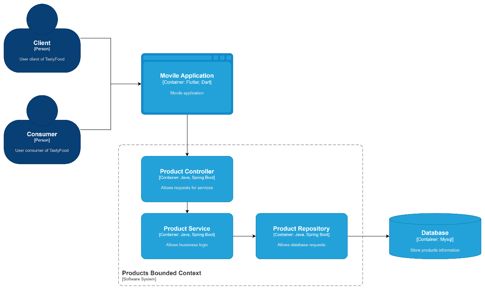

#### 4.2.5.7. Bounded Context Software Architecture Code Level Diagrams. 

##### 4.2.5.7.1. Bounded Context Domain Layer Class Diagrams 

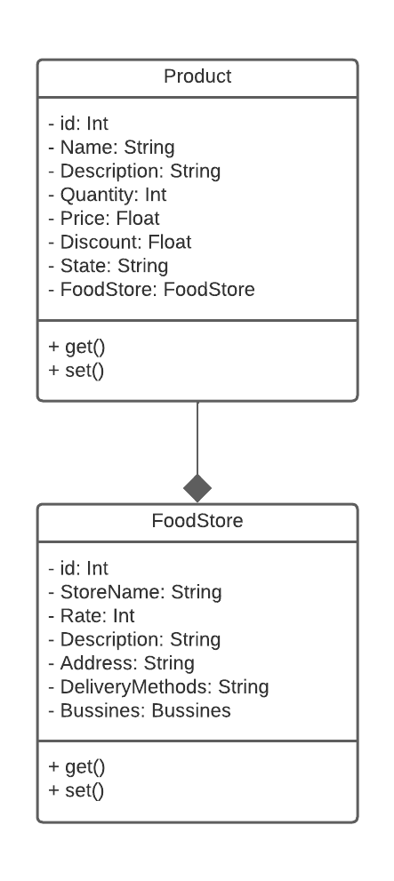 

 

 

##### 4.2.5.7.2. Bounded Context Database Design Diagram. 

 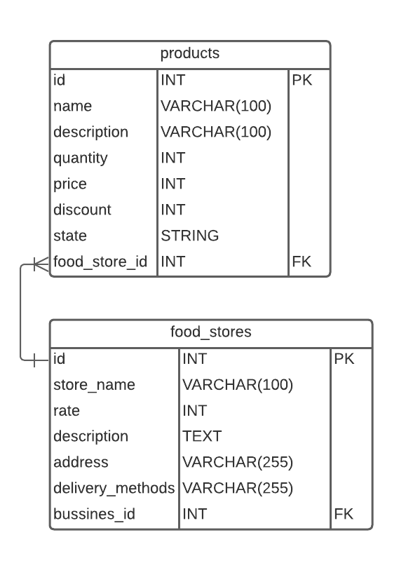

 

# CONCLUSIONES

Tasty Point, el startup encargado de evitar el desperdicio de comida y
comercializarlos a un precio justo, mucho más económico, cuenta con una
idea delimitada que cumplirá con los estándares del curso.  Es útil
mencionar que, el desarrollo el proyecto se inicia con una idea de
negocio que mundialmente desempeña un factor beneficiarte dentro de la
sociedad, para realizar la implementación se irá realizando mejoras
continuas que beneficien la trascendencia del proyecto. 

En según luga el proceso de recopilación de información mediante
entrevistas de nuestro público objetivo nos facilita en el planteamiento
de las funciones a desarrollar en la aplicación, mejorando nuestras
ideas e incrementando las capacidades de la app y por ende asegurando
una buena recepción en su lanzamiento. 

Por último, la elaboración de los artefactos C4 relacionados con los
diagramas de arquitectura a nivel de contexto, componentes, contenedores
y clases involucro una investigación en el campo de IoT para identificar
las tecnologías y protocolos de comunicación con MQTT que se iban a
emplear en la solución.

Recomendaciones

Se recomienda continuar el desarrollo de la aplicación en base a User
Stories es otra parte clave de este proyecto. En las User Stories se
definen todas aquellas características o funcionalidades, o mejor
llamados requisitos, dándonos una idea clara y precisa acerca de cuáles
son los siguientes pasos para seguir durante todo el proceso de
desarrollo. Asimismo, gracias a herramientas como el Product Backlog,
nos permiten organizar mejor nuestros tiempos y ser más eficientes en
todo aspecto.

Del mismo modo, se recomienda realizar un estudio más a fondo del código
del proyecto (landing page para ir mejorando), porque consideramos que
falta mayor eficiencia y más comprensión por parte del código. Además,
es necesario ejercer mayor compromiso y dedicación para resolver las
dudas e inquietudes, cosa que es un gran impedimento para la
coordinación y solución de problemas que nos toman tiempo y es una
barrera para superar.

Utilizar herramientas como GitHub y otras herramientas colaborativas
ayuda en gran medida a que desarrollemos el Proyecto de forma rápida.
Además, permite evitar varios errores en el Código.

Video About the Team

# BIBLIOGRAFÍA

Organización de las Naciones Unidas para la Alimentación y la
agricultura. (s.f.). Día Internacional de Concienciación sobre la
Pérdida y el Desperdicio de Alimentos. Recuperado de
<https://www.fao.org/international-day-awareness-food-loss-waste/es/>
\[Consulta: 25 de agosto de 2022\].

ONU, Programa para el medio ambiente. (4 de marzo de 2021). Se
desperdicia 17% de todos los alimentos disponibles a nivel del
consumidor. ONU. Recuperado de
<https://www.unep.org/es/noticias-y-reportajes/comunicado-de-prensa/onu-se-desperdicia-17-de-todos-los-alimentos-disponibles>
\[Consulta: 25 de agosto de 2016\].

PHENIX. (2022). ¿Quién es Phenix, la startup que actúa contra el
desperdicio? Francia: Phenix. Recuperado de
<https://www.wearephenix.com/es/es-homepage-generale/quienes-somos/>
\[Consulta: 30 de agosto de 2022\].

Too Good To Go. (s.f.). Salva comida ahora. Recuperado de
<https://toogoodtogo.es/es/consumer> \[Consulta: 30 de agosto de 2022\].

Pablo Rodrígez. (29 Diciembre 2020).Too Good To Go, la app que vende la
comida sobrante de supermercados y restaurantes tres veces más barata y
en packs sorpresa. \[Entrada en blog\]. Recuperado de
<https://www.xataka.com/servicios/too-good-to-go-app-que-vende-comida-sobrante-supermercados-restaurantes-tres-veces-barata-packs-sorpresa>
\[Consulta: 1 de septiembre de 2022\].

Elizabeth Royte. (s.f.). Un tercio de los alimentos que cultivamos se
desperdician o se pierden. National Geographic. Recuperado de
<https://www.nationalgeographic.es/medio-ambiente/un-tercio-de-los-alimentos-que-cultivamos-se-desperdician-o-se-pierden>
\[Consulta: 1 de septiembre de 2022\].

Redacción RPP. (10 de febrero del 2021). Delivery creció 250% en el Perú
durante la pandemia. RPP Noticias. Recuperado de
<https://rpp.pe/economia/economia/delivery-peruanos-gastan-entre-s-80-y-s-200-en-promedio-en-pedidos-servicio-de-reparto-a-domicilio-restaurantes-tiendas-supermercados-noticia-1319925>
\[Consulta: 1 de septiembre de 2022\].

**ANEXO 1:**

Link de Trello:
https://trello.com/invite/tastypoint/ATTI3bf72a5205b4217a503be11ddd3522d96FB33842

Product backlog:

**ANEXO 2:**

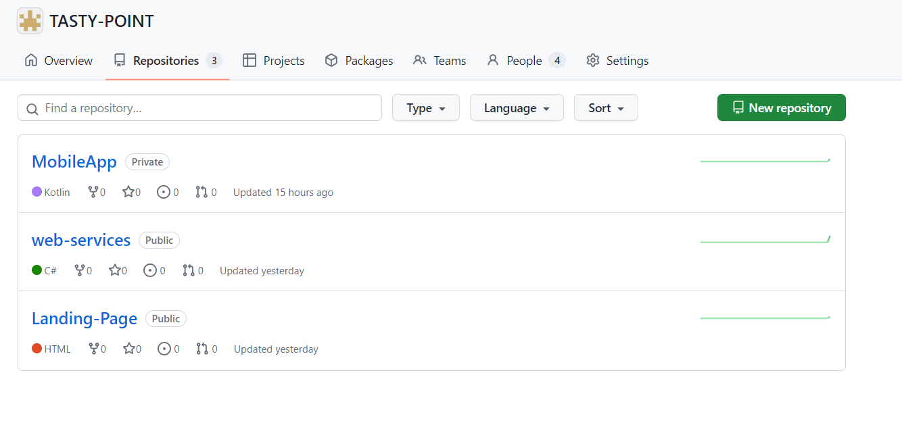Link de organización en
GitHub: <https://github.com/orgs/TastyPoint/repositories>
