  -----------------------------------------------------------------------

  -----------------------------------------------------------------------

{width="8.464583333333334in"
height="10.952777777777778in"}

{width="1.382638888888889in"
height="1.382638888888889in"}

# Registro de versiones del Informe {#registro-de-versiones-del-informe .Estilo-sin-numeracion .unnumbered}

+------------+-----------+-------------+-------------+----------------+
| *          |           | **Fecha**   | **Autor**   | **Descripción  |
| *Versión** |           |             |             | y              |
|            |           |             |             | modificación** |
+============+===========+=============+=============+================+
| 1.0        |           | 27/08/23    | David       | Creación de la |
|            |           |             | Antonio     | carpeta de     |
|            |           |             | Torres      | documentos     |
|            |           |             | Vilchez     | para el        |
|            |           |             |             | proyecto,      |
|            |           |             | Farid Josué | además del     |
|            |           |             | Izquierdo   | Documento de   |
|            |           |             | Cristobal   | Word:          |
|            |           |             |             | "Borrador TB1" |
|            |           |             | Adrian      | para el primer |
|            |           |             | Denis       | avance del     |
|            |           |             | Alzamora    | trabajo final. |
|            |           |             | Gonzales    |                |
|            |           |             |             | Implementación |
|            |           |             | Breydi      | de Startup     |
|            |           |             | Ramos       | profile,       |
|            |           |             | Terrones    | Solution       |
|            |           |             |             | profile,       |
|            |           |             | Yoimer      |                |
|            |           |             | Yanir       | Segemento      |
|            |           |             | Dávila      | objetivo,      |
|            |           |             | Ramirez     | competidores,  |
|            |           |             |             | entrevistas,   |
|            |           |             |             | Needfiding     |
|            |           |             |             | etc.           |
|            |           |             |             |                |
|            |           |             |             | Lean UX canvas |
|            |           |             |             |                |
|            |           |             |             | Evenstorming   |
|            |           |             |             | Domain Driven  |
|            |           |             |             | Design         |
|            |           |             |             |                |
|            |           |             |             | C4 Model       |
|            |           |             |             | diagrams       |
|            |           |             |             |                |
|            |           |             |             | Se desarrollo  |
|            |           |             |             | el producto    |
|            |           |             |             | backlog        |
+------------+-----------+-------------+-------------+----------------+
| 2.0        |           | 22/09/23    | David       | Avance de:     |
|            |           |             | Antonio     |                |
|            |           |             | Torres      | Application    |
|            |           |             | Vilchez     |                |
|            |           |             |             | Mockups        |
|            |           |             |             |                |
|            |           |             |             | Applications   |
|            |           |             |             |                |
|            |           |             |             | Prototype      |
|            |           |             |             |                |
|            |           |             |             | Landing Page   |
|            |           |             |             |                |
|            |           |             |             | Implementation |
|            |           |             |             |                |
|            |           |             |             | User Flow      |
|            |           |             |             |                |
|            |           |             |             | Diagrams       |
+------------+-----------+-------------+-------------+----------------+
|            |           |             | Adrian      | Establecer     |
|            |           |             | Denis       | General Style  |
|            |           |             | Alzamora    | guideline and  |
|            |           |             | Gonzales    | web guideline  |
|            |           |             |             | Figma          |
|            |           |             |             |                |
|            |           |             |             | Diseñar        |
|            |           |             |             | Application    |
|            |           |             |             | wireframes     |
|            |           |             |             |                |
|            |           |             |             | Documentar     |
|            |           |             |             | Application    |
|            |           |             |             | User Flow      |
|            |           |             |             | Diagram        |
|            |           |             |             |                |
|            |           |             |             | Application    |
|            |           |             |             | prototyping    |
|            |           |             |             |                |
|            |           |             |             | Implementación |
|            |           |             |             | Sprint1        |
|            |           |             |             |                |
|            |           |             |             | Anexar links a |
|            |           |             |             | artefactos     |
+------------+-----------+-------------+-------------+----------------+
| 3.0        |           | 21/10/23    | Adrian      | Sprint 2       |
|            |           |             | Alzamora    | backlog        |
|            |           |             | Gonzales    |                |
|            |           |             |             | Se incluye los |
|            |           |             |             | commits de las |
|            |           |             |             | pruebas        |
|            |           |             |             | realizadas de  |
|            |           |             |             | la Plataforma  |
|            |           |             |             |                |
|            |           |             |             | Se incluye la  |
|            |           |             |             | evidencia de   |
|            |           |             |             | ejecucion de   |
|            |           |             |             | kit de iot y   |
|            |           |             |             | la Plataforma  |
|            |           |             |             |                |
|            |           |             |             | Se incluye la  |
|            |           |             |             | evidencia de   |
|            |           |             |             | la             |
|            |           |             |             | documentacion  |
|            |           |             |             | de los         |
|            |           |             |             | servicios.     |
+------------+-----------+-------------+-------------+----------------+
|            |           |             | David       | Desarollo del  |
|            |           |             | Antonio     | mobile app,    |
|            |           |             | Torres      | junto con la   |
|            |           |             | Vilchez     | evaluación de  |
|            |           |             |             | heurísticas de |
|            |           |             |             | la misma.      |
|            |           |             |             |                |
|            |           |             |             | Desarrollo del |
|            |           |             |             | feature de     |
|            |           |             |             | inventory      |
|            |           |             |             | analitycs para |
|            |           |             |             | poder          |
|            |           |             |             | monitorear el  |
|            |           |             |             | inventario y   |
|            |           |             |             | poder eliminar |
|            |           |             |             | productos.     |
+------------+-----------+-------------+-------------+----------------+
|            |           |             | Breydi      | Desarrollo de  |
|            |           |             | Ramos       | las features   |
|            |           |             | Terrones    | asociadas a la |
|            |           |             |             | lectura de     |
|            |           |             |             | Temperatura y  |
|            |           |             |             | Humedad en la  |
|            |           |             |             | Aplicación,    |
|            |           |             |             | Entrevista y   |
|            |           |             |             | Registro de    |
|            |           |             |             | esta siguiendo |
|            |           |             |             | los            |
|            |           |             |             | estandares.    |
+------------+-----------+-------------+-------------+----------------+

#  {#section .TOC-Heading .unnumbered}

[STUDENT OUTCOME [7](#student-outcome)](#student-outcome)

[INTRODUCCIÓN [12](#introducción)](#introducción)

[1.1. Startup Profile [12](#startup-profile)](#startup-profile)

[1.1.1. Descripción de la Startup
[12](#descripción-de-la-startup)](#descripción-de-la-startup)

[1.1.2. Perfiles de integrantes del equipo
[13](#perfiles-de-integrantes-del-equipo)](#perfiles-de-integrantes-del-equipo)

[1.2. Solution Profile [15](#solution-profile)](#solution-profile)

[1.2.1 Antecedentes y problemática
[15](#antecedentes-y-problemática)](#antecedentes-y-problemática)

[1.2.2 Lean UX Process. [18](#lean-ux-process.)](#lean-ux-process.)

[1.3. Segmentos objetivo [26](#segmentos-objetivo)](#segmentos-objetivo)

[REQUIREMENTS ELICITATION & ANALYSIS
[27](#requirements-elicitation-analysis)](#requirements-elicitation-analysis)

[2.1. Competidores. [27](#competidores.)](#competidores.)

[2.1.1. Análisis competitivo**.**
[27](#análisis-competitivo.)](#análisis-competitivo.)

[2.1.2. Estrategias y tácticas frente a competidores
[33](#estrategias-y-tácticas-frente-a-competidores)](#estrategias-y-tácticas-frente-a-competidores)

[2.2. Entrevistas [35](#entrevistas)](#entrevistas)

[Segmento: Representantes de las cadenas de restaurantes (Cliente).
[35](#segmento-representantes-de-las-cadenas-de-restaurantes-cliente.)](#segmento-representantes-de-las-cadenas-de-restaurantes-cliente.)

[2.2.1. Diseño de entrevistas
[35](#diseño-de-entrevistas)](#diseño-de-entrevistas)

[2.2.2. Registro de entrevistas
[36](#registro-de-entrevistas)](#registro-de-entrevistas)

[Segmento: Consumidores
[37](#segmento-consumidores)](#segmento-consumidores)

[2.2.4. Diseño de entrevistas.
[37](#diseño-de-entrevistas.)](#diseño-de-entrevistas.)

[2.2.5. Registro de entrevistas
[39](#registro-de-entrevistas-1)](#registro-de-entrevistas-1)

[2.3. Needfinding. [43](#needfinding.)](#needfinding.)

[2.3.1. User Personas.
[44](#interfaz-de-usuario-gráfica-sitio-web-descripción-generada-automáticamente2.3.1.-user-personas.)](#interfaz-de-usuario-gráfica-sitio-web-descripción-generada-automáticamente2.3.1.-user-personas.)

[2.3.2. User Task Matrix [46](#user-task-matrix)](#user-task-matrix)

[2.3.3. User Journey Mapping.
[46](#user-journey-mapping.)](#user-journey-mapping.)

[2.3.4. Empathy Mapping
[49](#interfaz-de-usuario-gráfica-descripción-generada-automáticamente2.3.4.-empathy-mapping)](#interfaz-de-usuario-gráfica-descripción-generada-automáticamente2.3.4.-empathy-mapping)

[2.3.5. As-is Scenario Mapping.
[52](#as-is-scenario-mapping.)](#as-is-scenario-mapping.)

[REQUIREMENTS SPECIFICATION
[53](#requirements-specification)](#requirements-specification)

[3.1. To-Be Scenario Mapping.
[53](#to-be-scenario-mapping.)](#to-be-scenario-mapping.)

[3.2. User Stories [55](#user-stories)](#user-stories)

[3.3. Impact Mapping. [94](#impact-mapping.)](#impact-mapping.)

[3.4. Product Backlog. [96](#product-backlog.)](#product-backlog.)

[SOLUTION SOFTWARE DESIGN
[110](#solution-software-design)](#solution-software-design)

[4.1 Strategic-Level Domain-Driven Design.
[110](#strategic-level-domain-driven-design.)](#strategic-level-domain-driven-design.)

[4.1.1 Event Storming [110](#event-storming)](#event-storming)

[4.1.2. Context Mapping [119](#context-mapping)](#context-mapping)

[4.1.3 Software Architecture
[119](#software-architecture)](#software-architecture)

[4.2. Tactical-Level Domain-Driven Design
[124](#tactical-level-domain-driven-design)](#tactical-level-domain-driven-design)

[4.2.1. Bounded Context: User
[124](#bounded-context-user)](#bounded-context-user)

[4.2.2. Bounded Context: Inventory Analitycs
[135](#bounded-context-inventory-analitycs)](#bounded-context-inventory-analitycs)

[4.2.3. Bounded Context: Payment
[142](#bounded-context-payment)](#bounded-context-payment)

[4.2.1. Bounded Context: Products
[151](#bounded-context-products)](#bounded-context-products)

[Solution UI/UX Design
[157](#solution-uiux-design)](#solution-uiux-design)

[5.1. Style Guidelines. [157](#style-guidelines.)](#style-guidelines.)

[5.1.1. General Style Guidelines.
[157](#general-style-guidelines.)](#general-style-guidelines.)

[5.1.2. Web, Mobile and IoT Style Guidelines.
[163](#web-mobile-and-iot-style-guidelines.)](#web-mobile-and-iot-style-guidelines.)

[5.2. Information Architecture.
[166](#information-architecture.)](#information-architecture.)

[5.3. Landing Page UI Design.
[169](#landing-page-ui-design.)](#landing-page-ui-design.)

[5.3.1. Landing Page Wireframe.
[169](#landing-page-wireframe.)](#landing-page-wireframe.)

[5.3.2. Landing Page Mock-up.
[169](#landing-page-mock-up.)](#landing-page-mock-up.)

[5.4. Applications UX/UI Design (Web)
[171](#applications-uxui-design-web)](#applications-uxui-design-web)

[5.4.1. Applications Wireframes.
[171](#applications-wireframes.)](#applications-wireframes.)

[5.4.2. Applications Wireflow Diagrams.
[177](#applications-wireflow-diagrams.)](#applications-wireflow-diagrams.)

[5.4.2. Applications Mock-ups.
[182](#applications-mock-ups.)](#applications-mock-ups.)

[5.4.3. Applications User Flow Diagrams.
[185](#applications-user-flow-diagrams.)](#applications-user-flow-diagrams.)

[5.4.4. Applications Prototyping.
[187](#applications-prototyping.)](#applications-prototyping.)

[5.5 Applications UX/UI Design. (Mobile)
[188](#applications-uxui-design.-mobile)](#applications-uxui-design.-mobile)

[5.5.1 Application Mockups.
[188](#application-mockups.)](#application-mockups.)

[5.5.3 Applications Prototype.
[192](#applications-prototype.)](#applications-prototype.)

[Product implementation, validation & deployment
[193](#product-implementation-validation-deployment)](#product-implementation-validation-deployment)

[6.1. Software Configuration Management.
[193](#software-configuration-management.)](#software-configuration-management.)

[6.1.1. Software Development Environment Configuration.
[193](#software-development-environment-configuration.)](#software-development-environment-configuration.)

[6.1.2. Source Code Management.
[196](#source-code-management.)](#source-code-management.)

[6.1.3. Source Code Style Guide & Conventions.
[198](#source-code-style-guide-conventions.)](#source-code-style-guide-conventions.)

[6.1.4. Software Deployment Configuration.
[199](#software-deployment-configuration.)](#software-deployment-configuration.)

[6.2 Landing Page, Services & Application.
[199](#_Toc149939439)](#_Toc149939439)

[6.2.1. Sprint 1 [199](#sprint-1)](#sprint-1)

[6.2.1.1. Sprint Planning 1.
[199](#sprint-planning-1.)](#sprint-planning-1.)

[6.2.1.2. Sprint Backlog 1.
[200](#sprint-backlog-1.)](#sprint-backlog-1.)

[6.2.1.3. Development Evidence for Sprint Review.
[204](#development-evidence-for-sprint-review.)](#development-evidence-for-sprint-review.)

[6.2.1.4. Testing Suite Evidence for Sprint Review.
[204](#testing-suite-evidence-for-sprint-review.)](#testing-suite-evidence-for-sprint-review.)

[6.2.1.5. Execution Evidence for Sprint Review.
[204](#execution-evidence-for-sprint-review.)](#execution-evidence-for-sprint-review.)

[6.2.1.6. Services Documentation Evidence for Sprint Review.
[205](#services-documentation-evidence-for-sprint-review.)](#services-documentation-evidence-for-sprint-review.)

[6.2.1.7. Software Deployment Evidence for Sprint Review.
[205](#software-deployment-evidence-for-sprint-review.)](#software-deployment-evidence-for-sprint-review.)

[6.2.1.8. Team Collaboration Insights during Sprint.
[206](#team-collaboration-insights-during-sprint.)](#team-collaboration-insights-during-sprint.)

[6.2.2. Sprint 2 [208](#sprint-2)](#sprint-2)

[6.2.2.1. Sprint Planning 2.
[208](#sprint-planning-2.)](#sprint-planning-2.)

[6.2.2.2. Sprint Backlog 2.
[209](#sprint-backlog-2.)](#sprint-backlog-2.)

[6.2.2.3.Development Evidence for Sprint Review.
[219](#development-evidence-for-sprint-review.-1)](#development-evidence-for-sprint-review.-1)

[6.2.2.4.Testing Suite Evidence for Sprint Review.
[222](#testing-suite-evidence-for-sprint-review.-1)](#testing-suite-evidence-for-sprint-review.-1)

[6.2.2.5. Execution Evidence for Sprint Review.
[225](#execution-evidence-for-sprint-review.-1)](#execution-evidence-for-sprint-review.-1)

[6.2.2.6. Services Documentation Evidence for Sprint Review.
[227](#services-documentation-evidence-for-sprint-review.-1)](#services-documentation-evidence-for-sprint-review.-1)

[6.2.2.7. Software Deployment Evidence for Sprint Review.
[232](#software-deployment-evidence-for-sprint-review.-1)](#software-deployment-evidence-for-sprint-review.-1)

[6.3. Validation Interviews.
[234](#validation-interviews.)](#validation-interviews.)

[6.3.1. Diseño de Entrevistas.
[234](#diseno-de-entrevistas.)](#diseno-de-entrevistas.)

[6.3.2. Registro de Entrevistas.
[236](#registro-de-entrevistas.)](#registro-de-entrevistas.)

[6.3.3. Evaluaciones según heurísticas.
[241](#evaluaciones-segun-heuristicas.)](#evaluaciones-segun-heuristicas.)

[6.4 Video About-the-Product.
[249](#video-about-the-product.)](#video-about-the-product.)

[CONCLUSIONES [250](#conclusiones)](#conclusiones)

[BIBLIOGRAFÍA [252](#bibliografía)](#bibliografía)

# STUDENT OUTCOME {#student-outcome .unnumbered}

En ingeniería de software, el logro contribuye a alcanzar el: ABET --
EAC - student outcome 5: la capacidad de funcionar efectivamente en un
equipo cuyos miembros juntos proporcionan liderazgo, crean un entorno de
colaboración e inclusivo, establecen objetivos, planifican tareas y
cumplen objetivos.

+------------+----------------------------------------+----------------+
| **Criterio | **Acciones realizadas**                | **             |
| es         |                                        | Conclusiones** |
| pecífico** |                                        |                |
+============+========================================+================+
| Actualiza  | **Adrian Denis Alzamora Gonzales**     | Realicemos     |
| conceptos  |                                        | conjuntamente  |
| y          | **TB1:** Investigue sobre los nuevos   | el análisis    |
| con        | componentes de IoT que eran necesarios | del segmento   |
| ocimientos | para comunicar los dispositivos de los | objetivo, a su |
| necesarios | almacenes con las soluciones           | vez los        |
| para su    | propuestas.                            | competidores y |
| desarrollo |                                        | establecimos   |
| p          | **TP:** Para la etapa de diseño de los | una línea      |
| rofesional | productos utilizamos extensiones de    | desde ese foco |
| y en       | vscode que nos permitieron agilizar el | de trabajo. La |
| especial   | proceso de elaboración de los          | fase de diseño |
| para su    | diagramas. Asimismo, para el diseño de | nos permite    |
| proyecto   | lo wireframes y mockups reutilizamos   | comprender     |
| en         | componentes disponibles en Figma       | cual es la     |
| soluciones | Community y los adaptamos a la guía de | lógica de      |
| de         | estilos de las soluciones.             | nuestro        |
| software.  |                                        | negocio y los  |
|            | **TB2:** Se implemento la solucion IoT | componentes    |
|            | utilizando los componentes del         | que se         |
|            | simulador Wokwi. Ademas para el sprint | requieren para |
|            | 2 se desarrollaron todas las historias | brindar        |
|            | de usuarios de mayor prioridad como la | soporte a los  |
|            | comunicacion del kit IoT con la        | productos      |
|            | plataforma.Ademas, se implemento el    | desarrollados  |
|            | servicio que nos permite comunicar ek  | en el presente |
|            | kit IoT con la plataforma mediante la  | trabajo. Los   |
|            | configuracion de reglas y endpoints    | mockups son    |
|            | que permiten registrar y leer los      | fundamentales  |
|            | datos enviados por el sensor en la     | para           |
|            | base de datos alojada en el servicio   | comprender si  |
|            | de firebase realtime database.Se       | el cliente     |
|            | demuestra en la seccion home la        | está           |
|            | lectura en tiempo real de la           | satisfecho con |
|            | temperature y la humedad del almacen   | sus            |
|            | registrado. Asimismo se calculan otros | ne             |
|            | parametros tomando como base dichas    | cesidades.Para |
|            | variables. De esta forma se le entegra | la             |
|            | un producto de calidad y funcional que | implementacion |
|            | les permite registrar sus productos,   | de la solucion |
|            | moniterear la temperature y humedad y  | se requiere de |
|            | visualizar una grafica de reporte de   | conocimiento   |
|            | ambas variables que puede descargarse  | basicos en el  |
|            | en diferentes formartos.               | consumo de     |
|            |                                        | servicios de   |
|            | **David Antonio Torres Vilchez**       | firebase, asi  |
|            |                                        | como           |
|            | **TB1:** Participé en todas las        | desarrollo     |
|            | reuniones programadas, realizando mis  | frontend con   |
|            | tareas asignadas y mejorando           | el framework   |
|            | continuamente de acuerdo con los       | angular.       |
|            | comentarios constructivos del equipo.  |                |
|            |                                        |                |
|            | **TP:** Para este entregable realice   |                |
|            | los mockups en base a los web & mobile |                |
|            | style guidelines definidos, tambien    |                |
|            | colabore en el proceso de creación de  |                |
|            | user flows para los contextos web &    |                |
|            | mobile. En este proceso aplique        |                |
|            | conocimientos Ui y UX para poder       |                |
|            | brindar la mejor experiencia posible a |                |
|            | nuestros futuros usuarios.             |                |
|            |                                        |                |
|            | **TB2:** Aplique conocimientos en la   |                |
|            | evaluación de heurísticas para la      |                |
|            | validación del producto, así también   |                |
|            | como el desarrollo de la función de    |                |
|            | monitoreo de inventario haciendo uso   |                |
|            | de conocimientos en UI/UX.             |                |
|            |                                        |                |
|            | **Farid Josué Izquierdo Cristobal**    |                |
|            |                                        |                |
|            | **TB1:** Para esta entrega de la TB1,  |                |
|            | he aplicado conceptos como             |                |
|            | Domain-Driven Design, User Stories,    |                |
|            | Product Backlog y Lean UX para crear   |                |
|            | soluciones de software centradas en el |                |
|            | usuario y enfocadas en las necesidades |                |
|            | del negocio.                           |                |
|            |                                        |                |
|            | **TP:** Para esta entrega del TP,      |                |
|            | hemos realizado los mockups y          |                |
|            | wireframes para web, mobile y landing  |                |
|            | page, para esto fue importante aplicar |                |
|            | conceptos como diseño centrado en el   |                |
|            | usuario, jerarquía visual, diseño      |                |
|            | responsivo, simplificación y           |                |
|            | minimalismo, consistencia, y           |                |
|            | prototipado interactivo. Estos         |                |
|            | conceptos nos permitieron crear        |                |
|            | interfaces intuitivas, fáciles de usar |                |
|            | y atractivas, mejorando la experiencia |                |
|            | del usuario y la eficacia del diseño.  |                |
|            |                                        |                |
|            | **TB2:** Para esta TB2, se implementó  |                |
|            | la validación de usuarios durante el   |                |
|            | inicio de sesión y registro,           |                |
|            | utilizando el servicio de              |                |
|            | autenticación proporcionado por        |                |
|            | Firebase. Este servicio asegura que    |                |
|            | cada usuario esté debidamente validado |                |
|            | al acceder al sistema. Además, se      |                |
|            | configuró una base de datos en tiempo  |                |
|            | real utilizando también las            |                |
|            | herramientas que Firebase ofrece. Esto |                |
|            | nos permitió establecer una conexión   |                |
|            | directa y efectiva entre nuestro       |                |
|            | frontend y backend, facilitando así la |                |
|            | gestión y manipulación de datos en     |                |
|            | tiempo real, asegurando que la         |                |
|            | información presentada esté siempre    |                |
|            | actualizada y sea accesible de manera  |                |
|            | eficiente y segura.                    |                |
|            |                                        |                |
|            | **Yoimer Yanir Dávila Ramirez**        |                |
|            |                                        |                |
|            | **TB1**: Para esta primera entrega, he |                |
|            | aplicado conceptos de Domain-Driven    |                |
|            | Design y Lean UX para diseñar nuestra  |                |
|            | solución de software enfocado en las   |                |
|            | necesidades de nuestros clientes.      |                |
|            |                                        |                |
|            | **TP:** Para esta segunda entrega,     |                |
|            | además de aplicar conceptos de UI      |                |
|            | Design y Lean UX para el diseño de los |                |
|            | wireframes y mockups de nuestras       |                |
|            | soluciones (web application y mobile   |                |
|            | application), se utilizaron conceptos  |                |
|            | de documentación tanto a nivel de      |                |
|            | source code conventions como de        |                |
|            | styleguideles.                         |                |
|            |                                        |                |
|            | TB2: Para esta tb2, utilicé mi         |                |
|            | experiencia en la evaluación de        |                |
|            | heurísticas para validar el producto,  |                |
|            | además de aplicar mis conocimientos en |                |
|            | UI/UX para desarrollar una función de  |                |
|            | monitoreo de inventario.               |                |
|            |                                        |                |
|            | **Ramos Terrones Breydi**              |                |
|            |                                        |                |
|            | **TB1:** Para este primer hito, he     |                |
|            | utilizado conceptos de Diseño Guiado   |                |
|            | por el Dominio y Lean UX con el        |                |
|            | objetivo de diseñar nuestra solución   |                |
|            | de software, la cual está orientada a  |                |
|            | satisfacer las necesidades de nuestros |                |
|            | clientes.                              |                |
|            |                                        |                |
|            | **TP:** Para este hito se me encargo   |                |
|            | el desarrollo de los features del      |                |
|            | primer sprint.                         |                |
|            |                                        |                |
|            | **TB2:** Para esta entrega se me       |                |
|            | encargo el desarrollo de las features  |                |
|            | con respecto a las gráficas y          |                |
|            | entrevistas con usuarios consumidores. |                |
+------------+----------------------------------------+----------------+
| Reconoce   | David Antonio Torres Vilchez           | Adquirimos     |
| la         |                                        | conocimientos  |
| necesidad  | TB1: Realice una investigación de las  | previos de     |
| del        | empresas enfocadas al servicio de      | temas nuevos   |
| a          | comida a domicilio, así también como   | que partimos   |
| prendizaje | de sus consumidores para conocer qué   | de ello para   |
| permanente | funciones o características            | realizar el    |
| para el    | implementar en la aplicación.          | análisis       |
| diseño     |                                        | co             |
| p          | TP: Repase conceptos vistos            | rrespondiente. |
| rofesional | previamente en la carrera para poder   | Descubrimos    |
| y el       | desarrollar un landing page y mock ups | como entregar  |
| desarrollo | siguiendo los principios básicos de UX | un diseño      |
| de         | y UI, así también mejore varios        | minimalista    |
| proyectos  | artefactos realizados previamente para | para que el    |
| en         | poder cumplir con el requisito de      | cliente pueda  |
| soluciones | mejora continua.                       | configurar su  |
| de         |                                        | kit IoT y      |
| software.  | TB2: Realice un proceso de validación  | pueda          |
|            | del producto adquiriendo               | conectarlos a  |
|            | retroalimentación y mejora del         | la internet.   |
|            | proyecto hasta el momento, así también | Para enviar    |
|            | participe en el desarrollo del         | los datos      |
|            | componente de inventario en la         | registrados    |
|            | aplicación web.                        | por el sensor  |
|            |                                        | DHT22 en el    |
|            | Adrian Denis Alzamora **Gonzales**     | mi             |
|            |                                        | crocontrolador |
|            | TB1: Fue necesario realizar una        | esp32 fue      |
|            | investigación sobre los componentes    | indispensable  |
|            | que iban a formar parte de la          | conocimientos  |
|            | solución. Estos debían ser de un costo | en el lenguaje |
|            | bajo para que se accesible. Para ello  | c++, así como  |
|            | se estudió los componentes disponibles | el uso de      |
|            | en el mercado como sensores,           | biblioteca     |
|            | actuadores y microcontroladores con un | para consumir  |
|            | bajo costo y un buen rendimiento.      | el servicio    |
|            |                                        | desde el lado  |
|            | TP: En esta etapa comprendimos que no  | cliente.       |
|            | solo debemos adaptar el diseño para    |                |
|            | que sea amigable para los clientes, en |                |
|            | el caso de los dueños de restaurantes  |                |
|            | se diseñó una interfaz para que este   |                |
|            | logre configurar sus dispositivos IoT  |                |
|            | de la forma mas simple posible.        |                |
|            |                                        |                |
|            | TB2: Para la implementación exitosa    |                |
|            | del kit IoT en el simulador Wokwi fue  |                |
|            | indispensable conocimientos en el      |                |
|            | lenguaje c++ que nos permite           |                |
|            | instanciar objetos de la biblioteca de |                |
|            | firebase con el propósito de poder     |                |
|            | enviar la información registrada por   |                |
|            | los sensores en el microcontrolador    |                |
|            | esp32, el cual se conecta previamente  |                |
|            | a la red wifi. Además para el consumo  |                |
|            | del servicio realtime database se      |                |
|            | requirió conocimiento en angular fire  |                |
|            | un módulo que nos facilita métodos que |                |
|            | nos permiten obtener los datos en      |                |
|            | tiempo real, asi como editarlos y      |                |
|            | eliminarlos.                           |                |
|            |                                        |                |
|            | Farid Josué Izquierdo Cristobal        |                |
|            |                                        |                |
|            | TB1: Para esta entrega de la TB1       |                |
|            | utilizamos algunas herramientas para   |                |
|            | el diseño de las arquitecturas de      |                |
|            | software y diagramas como el draw.io,  |                |
|            | miro, figma, lucidchard y entre otros  |                |
|            | para realizar correctamente y de forma |                |
|            | organizada esta primera entrega.       |                |
|            |                                        |                |
|            | TP: Para esta entrega de la TP, hemos  |                |
|            | utilzado algunas herramientas          |                |
|            | esenciales como figma y overflow, para |                |
|            | realizar los mockups y wireframes,     |                |
|            | tanto para mobile, web y landing page. |                |
|            |                                        |                |
|            | TB2: Para la realización de la TB2, se |                |
|            | creó un espacio de trabajo utilizando  |                |
|            | Firebase como herramienta principal.   |                |
|            | Firebase nos facilitó diversas         |                |
|            | funcionalidades y servicios esenciales |                |
|            | para el desarrollo y la implementación |                |
|            | efectiva de nuestra tarea. Su servicio |                |
|            | de autenticación aseguró un inicio de  |                |
|            | sesión seguro y una validación robusta |                |
|            | de cada usuario, mientras que la base  |                |
|            | de datos en tiempo real permitió una   |                |
|            | gestión de datos fluida y eficiente.   |                |
|            |                                        |                |
|            | Yoimer Yanir Dávila Ramirez            |                |
|            |                                        |                |
|            | TB1: Para esta primera entrega,        |                |
|            | utilizamos diferentes herramientas     |                |
|            | enfocadas para el diseño de diagramas  |                |
|            | de arquitectura de software.           |                |
|            | Utilizando y reforzando las            |                |
|            | habilidades aprendidas con DDD.        |                |
|            |                                        |                |
|            | TP: Para esta segunda entrega,         |                |
|            | utilizamos diferentes herramientas     |                |
|            | enfocadas para el diseño de mockups,   |                |
|            | wireframes y user flows. Utilizando y  |                |
|            | reforzando las habilidades aprendidas  |                |
|            | de UI Design y Lean UX.                |                |
|            |                                        |                |
|            | TB2: En la TB2, se utilizó Firebase    |                |
|            | como herramienta principal para crear  |                |
|            | un entorno de trabajo. Firebase        |                |
|            | ofreció un servicio de autenticación   |                |
|            | seguro y una base de datos en tiempo   |                |
|            | real que permitió una gestión          |                |
|            | eficiente de datos.                    |                |
|            |                                        |                |
|            | Breydi Ramos Terrones                  |                |
|            |                                        |                |
|            | TB1: En esta primera entrega,          |                |
|            | empleamos varias herramientas          |                |
|            | especializadas en el diseño de         |                |
|            | diagramas de arquitectura de software. |                |
|            | Este enfoque nos permitió aplicar y    |                |
|            | reforzar las habilidades que hemos     |                |
|            | adquirido con el Diseño Guiado por el  |                |
|            | Dominio (DDD).                         |                |
|            |                                        |                |
|            | TP: Durante el proyecto realizamos el  |                |
|            | uso de herramientas ágiles para        |                |
|            | comunicarnos y documentar el progreso  |                |
|            | de nuestro proyecto.                   |                |
|            |                                        |                |
|            | TB2: En la app web, se logró la        |                |
|            | transferencia de datos desde Wokwi     |                |
|            | hacia un gráfico que mostraba la       |                |
|            | temperatura y humedad en la            |                |
|            | aplicación. Firebase desempeñó un      |                |
|            | papel fundamental al facilitar esta    |                |
|            | comunicación y visualización de datos  |                |
|            | en tiempo real de manera efectiva.     |                |
+------------+----------------------------------------+----------------+

# INTRODUCCIÓN {#introducción .unnumbered}

## 1.1. Startup Profile {#startup-profile .Titulo-2}

### 1.1.1. Descripción de la Startup {#descripción-de-la-startup .Titulo-3 .unnumbered}

El nombre de la empresa emergente es **Tasty Point.**

Tasty Point es un startup que ofrece el servicio de comida a domicilio
con el objetivo de reducir el desperdicio de alimentos. Tasty Point
promete reducir el porcentaje de comida desechada. Para ello ofrece una
aplicación móvil y una aplicación web. La aplicación móvil reúne a
diferentes restaurantes o cadenas alimenticias para aprovechar sus
platos o productos que no fueron consumidos, pero que poseen un buen
estado para su consumo. Con la ayuda de Tasty Point, encontrar platos
según la preferencia del usuario a un buen precio es sencillo y
económico. La aplicación móvil conecta a los clientes que buscan comida
buena y económica con restaurantes y cadenas de alimentación. Asimismo,
la aplicación web permite monitorear la temperatura y humedad mediante
un kit de IoT. Esto permite garantizar que los alimentos que se
proporcionan sean siempre frescos y seguros para comer.

**Misión **

Somos una compañía de desarrollo de soluciones de software comprometidos
con la creación de soluciones eficientes e innovadoras que faciliten a
las personas el acceso a los alimentos de forma sostenible. Creemos que
todos merecen tener acceso a alimentos nutritivos y estamos trabajando
para que eso sea una realidad.

**Visión**

Nuestra visión es promover una cultura de consumo responsable y eficaz.
Queremos mostrarle al mundo que es posible comer comida deliciosa sin
desperdiciar recursos. También estamos comprometidos con el apoyo al
comercio local y la promoción de la gastronomía peruana.

### 1.1.2. Perfiles de integrantes del equipo  {#perfiles-de-integrantes-del-equipo .Titulo-3 .unnumbered}

+-----------------------------------+-----------------------------------+
| **INTEGRANTE**                    | **DESCRIPCIÓN**                   |
+===================================+===================================+
| **Farid Josué Izquierdo           | Soy un estudiante de 20 años, que |
| Cristobal**                       | estudia la carrera de ingeniería  |
|                                   | de software en la Universidad     |
|                                   | Peruana de Ciencias Aplicadas. Me |
|                                   | considero una persona alegre y    |
|                                   | responsable, desde pequeño        |
|                                   | siempre me llamó la atención todo |
|                                   | lo que tenga que ver con la       |
|                                   | computadora y la tecnología y es  |
|                                   | por este motivo que me motivé a   |
|                                   | estudiar esta carrera. Me gusta   |
|                                   | aprender nuevas cosas y sobre     |
|                                   | todo con respecto a los distintos |
|                                   | lenguajes de programación.        |
+-----------------------------------+-----------------------------------+
| {width="2.3277055993000877in" |                                   |
| height="3.0416666666666665in"}    |                                   |
+-----------------------------------+-----------------------------------+
| **Torres Vilchez, David Antonio** | Estudio la carrera de Ingeniería  |
|                                   | de Software en la UPC.            |
|                                   | Actualmente me encuentro cursando |
|                                   | la carrera de ingeniería de       |
|                                   | software en la Universidad        |
|                                   | Peruana de Ciencias Aplicadas.    |
|                                   | Tengo conocimientos en            |
|                                   | programación, buen                |
|                                   | desenvolvimiento trabajando bajo  |
|                                   | presión, optimismo y motivación   |
|                                   | por cumplir con los objetivos del |
|                                   | proyecto con la finalidad de      |
|                                   | adquirir nuevas habilidades       |
|                                   | enfocadas en el desarrollo de     |
|                                   | aplicaciones móviles.             |
+-----------------------------------+-----------------------------------+
| {width="2.2083333333333335in" |                                   |
| height="2.8180555555555555in"}    |                                   |
+-----------------------------------+-----------------------------------+
| **Alzamora Gonzales, Adrian       | Ingeniero de software con 5 años  |
| Denis**                           | de experiencia en la              |
|                                   |                                   |
|                                   | implementación de soluciones de   |
|                                   | software de alta calidad          |
|                                   | siguiendo las buenas prácticas y  |
|                                   | estándares de la                  |
|                                   |                                   |
|                                   | industria actual. Desarrollé      |
|                                   | diversas soluciones bajo el       |
|                                   | enfoque ágil y empleando          |
|                                   | tecnologías emergentes.           |
+-----------------------------------+-----------------------------------+
| {width="1.6618055555555555in" |                                   |
| height="2.232638888888889in"}     |                                   |
+-----------------------------------+-----------------------------------+
| **Yoimer Yanir Dávila Ramirez**   | Estudiante de Ingeniería de       |
|                                   | Software en la UPC, escogí esta   |
|                                   | carrera ya que me gustaba la      |
|                                   | tecnología. Me considero una      |
|                                   | persona responsable y respetuosa. |
|                                   | Además, aportaré mis              |
|                                   | conocimientos sobre desarrollo    |
|                                   | web y programación orientada a    |
|                                   | objetos con lenguajes como C++,   |
|                                   | Python y Java. Así como en el     |
|                                   | desarrollo de experiencias móvil  |
|                                   | con flutter y nativo con Kotlin.  |
+-----------------------------------+-----------------------------------+
| {width="2.3020833333333335in" |                                   |
| height="2.5625in"}                |                                   |
+-----------------------------------+-----------------------------------+
| **Breydi Ramos Terrones**         | Mi nombre es Breydi Ramos         |
|                                   | Terrones. Al culminar el colegio  |
|                                   | estaba en un problema, ya que no  |
|                                   | sabía que estudiar, fue ahí       |
|                                   | cuando comencé a investigar       |
|                                   | seriamente sobre lo que quería    |
|                                   | para mí en el futuro y fue cuando |
|                                   | encontré algo que me apasionaba,  |
|                                   | lo cual era la ingeniería de      |
|                                   | software por lo que decidí        |
|                                   | estudiarla. Me considero una      |
|                                   | persona amigable, solidaria y con |
|                                   | habilidades para el trabajo en    |
|                                   | equipo. Al grupo aportaré mis     |
|                                   | conocimientos sobre front end,    |
|                                   | desarrollo web y conocimientos    |
|                                   | básicos sobre el framework .NET.  |
+-----------------------------------+-----------------------------------+
| {width="2.4806846019247595in" |                                   |
| height="3.0208333333333335in"}    |                                   |
+-----------------------------------+-----------------------------------+

## 1.2. Solution Profile  {#solution-profile .Tituloo-2}

### 1.2.1 Antecedentes y problemática   {#antecedentes-y-problemática .Titulo-3 .unnumbered}

La temperatura de los almacenes es un factor esencial para asegurar la
calidad y la salubridad de los productos almacenados, sobre todo en el
sector alimentario. No obstante, el control manual de la temperatura y
la humedad puede ser un proceso engorroso, caro y sujeto a errores. Por
eso, surge la demanda de una solución que permita el monitoreo
automático y a distancia de las condiciones ambientales en los
almacenes, así como la producción de informes y avisos en caso de
desviaciones. Nuestra solución emplea sensores inalámbricos y una nube
privada para medir y mostrar la temperatura y la humedad en tiempo real
desde cualquier dispositivo móvil o PC. Nuestra solución se diferencia
de otras existentes en el mercado por su facilidad de instalación, su
seguridad y su flexibilidad Algunas soluciones similares son: Ellab,
Turck, CEMMIT y Rackspace.

Ellab: Ellab ofrece una amplia gama de opciones que sirven no solo para
mapear la temperatura de su almacén, sino para una monitorización
continua a partir del momento de la instalación.

Turck: Es una empresa que se dedica a productos de sensor, fieldbus y
conectividad, así como a tecnología de interfaz, interfaces
hombre-máquina (HMI) y sistemas RFID. Turck brinda soluciones eficaces
para la automatización de fábricas y procesos en diversas industrias,
como la alimentaria, la farmacéutica, la química y la automotriz.

CEMMIT : Dedicado al mejoramiento de la calidad por medio de la gestión
tecnológica y metrológica de los equipos e instrumentos de medición, de
laboratorio y biomédicos del sector productivo del nororiente colombiano

Rackspace: Maximiza los beneficios de la nube moderna con su experiencia
imparcial en plataformas y aplicaciones cloud para una transformación
integral.

**Problemática**

El control manual de la temperatura y la humedad requiere el uso de
termómetros, higrómetros y otros instrumentos que deben ser verificados
regularmente por personal cualificado. Esto implica gastos de personal,
mantenimiento y calibración de los equipos. Además, el control manual
puede ser erróneo o insuficiente, ya que puede haber diferencias de
temperatura y humedad dentro del mismo almacén o entre distintos
almacenes. Esto puede perjudicar la calidad y la seguridad de los
productos almacenados, lo que puede ocasionar pérdidas económicas,
quejas de clientes, multas legales o daños a la reputación de la
empresa. A continuación, analizamos la problemática por medio de la
técnica de las 5W (*Who, What, Where Why, When*) y las 2H (*How, How
much*):

**The 5 'W's y 2 'H's**

**1. What (Qué)**

El problema encontrado es la gran cantidad de alimentos disponibles
desperdiciados en Perú y el Mundo que, por consiguiente, generan
pérdidas económicas y ecológicas que afectan a los restaurantes y la
población.

**2. When (Cuándo)**

Este problema tiene más tiempo del que se tiene conciencia. Según la
Organización de las Naciones Unidas para la Alimentación y la
Agricultura (s.f.), \"el número de personas afectadas por el hambre ha
aumentado lentamente desde 2014\". Lo que evidencia la existencia de
este dañoso problema.

La relación de lo anterior con nuestros públicos objetivos ocurre al
concluir la venta del día o semana. Los clientes no agotaron el stock
disponible del restaurante tradicional o de comida rápida, lo que
resulta en el desecho de estos platos o ingredientes restantes que no
están lo suficientemente frescos para ser aprovechados en la siguiente
jornada.

Nuestro primer cliente, el consumidor, usará el producto cuando esté
buscando un plato de comida a un precio menor o un método para combatir
la problemática del desperdicio de comida. 

El comprador podrá elegir entre una variedad de platos disponibles en
nuestra aplicación móvil. Estos platos son ofrecidos por nuestro segundo
cliente, el restaurante tradicional o de comida rápida. Asimismo podrá
adquirir un kit IoT para mantener los almacenes de sus productos en una
temperatura optima.

**3. Where (dónde) **

El cliente podrá usar el producto desde su dispositivo móvil de
preferencia. Esto le permitirá ordenar su comida desde cualquier lugar
en el que se encuentre y recibirla, usando los servicios ofrecidos por
el restaurante. 

**4. Who (quién)**

Como se mencionó en algún párrafo anterior, nuestra aplicación móvil
cuenta con 2 clientes:

-   El cliente consumidor, es quien ordena sus platos en la plataforma
    debido a la preocupación que la problemática del desperdicio de
    comida pueda generar si no es combatida, o simplemente debido a los
    precios bajos de los platos ofrecidos en la plataforma.

-   Y el cliente Restaurante, tradicional o de comida rápida, es quien
    ofrece las opciones disponibles de platos en la plataforma como una
    forma de minimizar las pérdidas económicas generadas al \"tirar\"
    los productos no lo suficiente frescos para una siguiente jornada.

**5. Why (por qué)**

El problema del desperdicio de comida se debe a varios factores y ocurre
en varias etapas (alimentos que se pierden después de la cosecha,
durante la fase de venta al por menor de elementos primarios, etc.). Sin
embargo, Tasty Point se enfoca en el derroche de alimentos generados por
el no agotamiento del stock en ingredientes y platos concluidos,
problema consecuente de la falta de demanda. 

Tasty point busca solucionar el problema ofreciendo estos platos
restantes de manera directa a los clientes, explícitamente a un precio
menor.

**1. How (cómo)**

Tasty food es usado cuando:

El consumidor busca una manera de combatir la problemática del
desperdicio de comida, o simplemente busca alimentos ofrecidos a precios
bajos.

El cliente Restaurante, tradicional o de comida rápida, busca una forma
de minimizar las pérdidas generadas al \"tirar\" los productos que no
pudieron venderse y no son lo suficientemente frescos para una siguiente
jornada.

**2. How much (cuánto) **

De acuerdo con la ONU, Programa para el medio ambiente (2021), \"se
estima que 931 millones de toneladas de alimentos, o 17% del total de
alimentos disponibles para los consumidores en 2019, terminaron en los
basureros de hogares, minoristas, restaurantes y otros servicios
alimentarios\". Estas cifras evidencian la gran cantidad de comida que
se desperdicia de manera global y, de la misma manera al mencionar a
minoristas y hogares además de restaurantes, dejan entrever que es un
problema del que nadie está exento.

### 1.2.2 Lean UX Process.   {#lean-ux-process. .Titulo-3 .unnumbered}

#### 1.2.2.1. Lean UX Problem Statements.  {#lean-ux-problem-statements. .Titulo-4}

En la actualidad el tercio de comida que producen las cadenas de
restaurantes en el mundo se desperdicia. En mira a esta gran pérdida,
ciertas empresas incentivan a la reutilización y el cuidado de los
alimentos. Por ello, venden las porciones de comida a un menor precio
garantizando la calidad y el mejor servicio. Según Rodriguez P. (2022)
tienden a tener gran acogida en la población juvenil. Además, señala que
Europa se presenta como un próspero nicho de mercado, lo que constituye
un notable logro en términos de aceptación y demanda. Sin embargo, en
Perú no se encuentra disponible.

Tasty Point es una Startup que ofrece la calidad y garantía de sus
dichos productos, cubriendo la necesidad de cada uno de los peruanos,
estar presente en el mercado, por lo que no existe otro startup que
ofrezca dicho servicio en el país. Tasty Point al ser una empresa
pionera en el Perú establece un vínculo directo entre consumidor y la
variedad de menú que esté interesado, ofreciendo así disponibilidad y
confianza a sus usuarios. La facilidad de compra es estrictamente
seguro, avala firmeza en sus medios de pagos e interacción con la
aplicación móvil, haciendo que tu experiencia sea amigable e interactiva
con sus usuarios.

Tasty Point al estar introducido al mercado peruano, país de una de las
mejores gastronomías del mundo, ofrece a sus consumidores una variedad
de platos al gusto del cliente y promueve la cultura de la sana
alimentación, responsable del buen cuidado de la salud e incentiva a la
estabilización del consumo nutritivo. Pone a disposición una amplia
variedad de platos elaborados a base de productos de la costa, sierra y
selva.

#### 1.2.2.2. Lean UX Assumptions  {#lean-ux-assumptions .Titulo-4}

##### Business Outcome

En este apartado, analizaremos el impacto que nuestra propuesta pueda
generar, bajo diversos aspectos, con el propósito de cumplir con nuestro
objetivo.

1.  Agilizar la búsqueda de productos alimenticios que ofrecen los
    restaurantes

Es importante permitir al consumidor una eficiente navegación a través
de nuestra app móvil con el propósito de agilizar la búsqueda de
diversos restaurantes.

2.  Mejorar las propuestas del mercado 

> Todos los consumidores buscan la mejor oferta/demanda y este caso no
> es la excepción, ofreciendo una reducción del precio original a aquel
> producto que no se desea desechar.

3.  Promoviendo el servicio de delivery

>  En tiempos de pandemia, las aglomeraciones pueden llegar a ser
> perjudiciales, por lo que con Tasty Point, los consumidores no tendrán
> que preocuparse por ello. El éxito significa lograr rentabilidad
> dentro del primer año de lanzamiento de la aplicación. Lo anterior
> implica expandirse a al menos cinco ciudades importantes dentro de los
> primeros dos años.

4.  El éxito de la aplicación depende de formar asociaciones con el 50%
    de los restaurantes locales en las ciudades objetivo.

5.  Los usuarios utilizarán la aplicación principalmente durante las
    horas de almuerzo y cena.

6.  Un resultado exitoso incluye lograr una reducción del 20% en el
    desperdicio de alimentos en los restaurantes asociados.

7.  El éxito de la aplicación está ligado a mantener un alto índice de
    satisfacción del cliente (por ejemplo, 4,5 estrellas o más).

8.  Un hito exitoso es alcanzar 100.000 descargas de aplicaciones en los
    primeros seis meses.

9.  La rentabilidad de la aplicación depende de que los clientes
    habituales representen al menos el 40 % del total de los pedidos.

10. El éxito significa asegurar un mínimo de 700.000 soles en
    financiación durante el primer año.

11. El MVP debe desarrollarse y lanzarse en un plazo de cuatro meses
    para mantener bajos los costos de desarrollo.

##### User

1.  Aquellos que residan en Lima Metropolitana y requieren de un
    servicio como el nuestro, forman parte de nuestro segmento objetivo:

    1.  Consumidores

    2.  Restaurantes

2.  Nuestros usuarios objetivo también están interesados en la
    sostenibilidad y el impacto social.

3.  Los consumidores están dispuestos a pagar por los productos
    ofrecidos.

4.  Los restaurantes están dispuestos a pagar un kit de IoT para sus
    almacenes de comida.

5.  Nuestros usuarios objetivo están activos en las redes sociales.

6.  Nuestros usuarios objetivo están ubicados en las principales
    ciudades.

7.  Nuestros usuarios objetivo tienen entre 25 y 45 años.

##### User Outcome

En este siguiente apartado, se presentan los beneficios adquiridos en
base a la interacción de los usuarios con nuestra aplicación móvil.

1.  Consumidores

    a.  Nos enfocamos en aquellas personas que consumen y adquieren sus
        productos alimenticios vía delivery y que prefieren elegir un
        plato de comida cualquiera con tal que esté en buen estado y a
        un buen precio.

    b.  Los usuarios desean un proceso de pedido fluido con unos pocos
        clics.

    c.  Los puntos débiles del usuario incluyen largos tiempos de
        entrega; Entregas más rápidas conducirán a una mayor
        satisfacción.

    d.  Los usuarios quieren conocer la información nutricional de los
        platos disponibles.

    e.  Los usuarios quieren conocer la información de la fecha de
        producción y caducidad de los platos disponibles.

    f.  Los usuarios valoran los envases ecológicos y aprecian los
        esfuerzos para reducir los residuos plásticos.

    g.  Los usuarios esperan actualizaciones oportunas sobre el estado
        del pedido y el seguimiento de la entrega.

    h.  Los usuarios quieren un sistema de calificación y revisión que
        les ayude a elegir platos.

    i.  Los usuarios aprecian la opción de personalizar sus pedidos (por
        ejemplo, ingredientes adicionales, solicitudes especiales).

    j.  Los usuarios desean una función de chat de atención al cliente
        receptiva y fácil de usar.

    k.  Los usuarios prefieren fotografías reales de platos a imágenes
        de archivo.

    l.  Los usuarios esperan tener la opción de proporcionar comentarios
        y sugerencias para mejorar dentro de la aplicación.

2.  Restaurantes

    a.  Nos enfocamos en aquellos restaurantes que poseen un porcentaje
        moderado/alto de productos desechados por día. 

    b.  Los usuarios quieren registrar la información nutricional de los
        platos disponibles.

    c.  Los usuarios quieren registrar la información de la fecha de
        producción y caducidad de los platos disponibles.

    d.  Los usuarios quieren subir fotografías reales de platos a
        imágenes de archivo.

    e.  Los usuarios quieren un sistema de monitoreo de temperatura y
        humedad de los almacenes donde se almacena la comida sobrante.

##### Features

1.  Nuestros consumidores podrán pedir los alimentos que sobraron de una
    gran cantidad de restaurantes a un precio accesible.

2.  Los dueños de restaurantes podrán evitar el desperdicio de alimentos
    y generar ingresos con la venta de sus productos sobrantes a un buen
    precio a través de la aplicación subiendo sus productos de forma
    sencilla.

3.  Los dueños de restaurantes podrán añadir sus promociones en la
    aplicación para atraer consumidores.

4.  El sistema de búsqueda le brindara al consumidor el platillo que se
    ajuste mejor a sus preferencias como restaurante, tipo de comida,
    rango de precio, entre otros.

5.  Los consumidores podrán calificar y dejar reseñas de los
    restaurantes en los que pidieron.

6.  Los consumidores podrán visualizar notificaciones de las promociones
    de sus restaurantes favoritos.

7.  Los consumidores podrán comunicarse con los dueños de los
    restaurantes ante cualquier inconveniente mediante su información de
    contacto en su perfil.

8.  El valor #1 o la funcionalidad más significativa que mis usuarios
    quieren de mi servicio es poder monitorear la temperatura y humedad
    donde se almacenan los productos reacondicionados.

9.  Hare dinero a través de subscripciones, venta de productos y kits de
    IoT

10. En el ámbito de delivery se competirá con plataformas como Rappi,
    Glovo, UberEats.

11. La incorporación de las fecha de producción y caducidad en cada uno
    de los productos brindara más confianza en los usuarios

12. La implementación de un programa de referencia alentará a los
    usuarios a invitar a amigos a unirse.

13. Los usuarios apreciarán una lista de \"favoritos\" para reordenar
    fácilmente sus platos preferidos.

14. Los usuarios desean una opción para pedidos grupales, especialmente
    para almuerzos de oficina.

15. un modelo de suscripción para usuarios frecuentes puede generar
    tasas de retención más altas.

16. Las actualizaciones periódicas de la aplicación y la corrección de
    errores son esenciales para la satisfacción del usuario.

17. Los usuarios quieren tener la opción de dar propina previa a los
    conductores para mejorar la experiencia general de entrega.

#### 1.2.2.3. Lean UX Hypothesis Statements.  {#lean-ux-hypothesis-statements. .Titulo-4}

Hypothesis 1:

Creemos que agilizar la búsqueda de productos alimenticios que ofrecen
los restaurantes se logrará si el consumidor obtiene un plato de comida
de calidad y a buen precio con el sistema de búsqueda que le brindará al
consumidor el platillo que se ajuste mejor a sus preferencias como
restaurante, tipo de comida, rango de precio, entre otros.

Hypothesis 2:

Creemos que agilizar la búsqueda de productos alimenticios que ofrecen
los restaurantes se logrará si el representante de restaurante obtiene
un menor porcentaje de desperdicios con la capacidad de poder evitar el
desperdicio de alimentos y generar ingresos con la venta de sus
productos sobrantes a un buen precio a través de la aplicación.

Hypothesis 3:

Creemos que mejorar las propuestas del mercado se logrará si el
representante de restaurante obtiene mejores ganancias gracias a la
venta de residuos de comida con la capacidad de añadir sus promociones
en la plataforma para atraer consumidores.

Hypothesis 4:

Creemos que mejorar las propuestas del mercado se logrará si el
consumidor obtiene precios más bajos gracias a la compra de residuos de
comida con la capacidad de poder pedir los alimentos que sobraron de una
gran cantidad de restaurantes a un precio accesible.

Hypothesis 5:

Creemos que agilizar la búsqueda de productos alimenticios que ofrecen
los restaurantes se logrará si el consumidor obtiene un plato de comida
de calidad y a buen precio con la capacidad de poder visualizar
notificaciones de las promociones de sus restaurantes favoritos.

Hypothesis 6:

Creemos que mejorar las propuestas del mercado se logrará si el
consumidor obtiene una mejor experiencia de adquisición de los productos
residuales con la capacidad de poder calificar y dejar reseñas de los
restaurantes en los que pidieron.

Hypothesis 7:

Creemos que mejorar las propuestas del mercado se logrará si el
consumidor obtiene una mejor experiencia de adquisición de los productos
residuales con la capacidad de poder calificar y dejar reseñas de los
restaurantes en los que pidieron.

Hypothesis 8:

Creemos que brindar un kit de IoT para el monitoreo de temperatura y
humedad en los almacenes de comida sobrante para los restaurantes,
entonces podremos reducir el desperdicio de alimentos al garantizar
condiciones óptimas de almacenamiento, lo que resultará en un ahorro de
costos y una mayor calidad de los alimentos.

Hypothesis 9:

Creemos que brindar un kit de IoT para monitorear constantemente la
temperatura y humedad en los almacenes de comida sobrante, entonces
podremos prevenir la proliferación de bacterias y el deterioro de los
alimentos, lo que mejorará la seguridad alimentaria y reducirá el riesgo
de enfermedades transmitidas por alimentos.

Hypothesis 10:

Creemos que brindar un kit de IoT para monitorear en tiempo real y
detectar problemas de temperatura o humedad en los almacenes, entonces
podremos tomar medidas preventivas para garantizar una cadena de
suministro más confiable y evitar interrupciones en la entrega de
alimentos.

#### 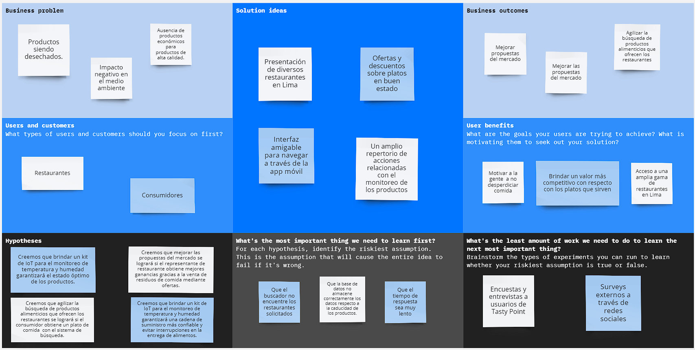{width="7.535416666666666in" height="3.8048611111111112in"}1.2.2.4. Lean UX Canvas {#imagen-que-contiene-escala-de-tiempo-descripción-generada-automáticamente1.2.2.4.-lean-ux-canvas .Titulo-4}

## 1.3. Segmentos objetivo  {#segmentos-objetivo .Tituloo-2}

Para definir los segmentos objetivos que se verían beneficiados en la
solución de esta problemática, hemos realizado investigaciones que nos
han ayudado a esclarecer dichos segmentos. Como en todo proyecto,
existen dos grandes grupos, los cuales son aquellos que invierten en el
proyecto, más conocidos como clientes, y aquellos a los que consumen el
producto o servicio, los cuales son los **consumidores.** Dentro de
estos grupos definimos a nuestros clientes como aquellos **dueños(as) de
restaurantes** que desean incrementar sus ventas y evitar el desperdicio
de comida, estos se encuentran en un rango de edad entre los 30 a 50
años, preocupados por el cuidado de los recursos del planeta, con
conciencia ambiental y decidido a incrementar sus ganancias.

 Por otro lado, en el sector de **consumidores** identificamos a
aquellos comensales que desean adquirir alimentos por un bajo precio.
Estos se encuentran en un rango de edades entre los 18 a 30 años,
usuarios de diversas tecnologías, en muchos casos recién independizados,
y que desean ayudar a disminuir el desperdicio de comida que generan los
restaurantes. Asimismo, se ayudaría a familias que cuentan con algún
dispositivo electrónico en casa y que deseen disminuir sus gastos en
alimentos.

# REQUIREMENTS ELICITATION & ANALYSIS {#requirements-elicitation-analysis .unnumbered}

## 2.1. Competidores.  {#competidores. .Tituloo-2}

### 2.1.1. Análisis competitivo**. ** {#análisis-competitivo. .Titulo-3 .unnumbered}

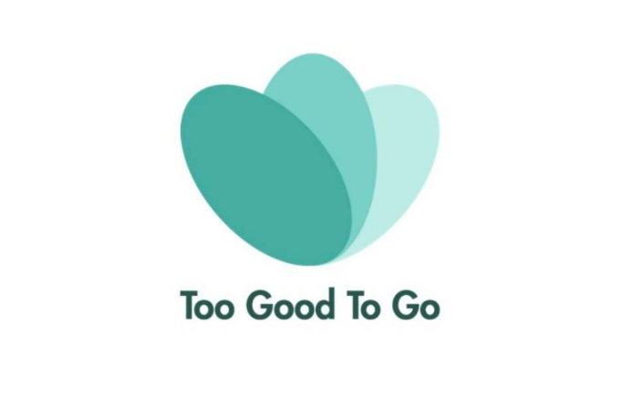{width="3.145138888888889in"
height="1.9736111111111112in"}

1.- **Too good to go** es la aplicación más grande que lucha contra el
desperdicio de alimentos de la actualidad. Con un aproximado de 5
millones de usuarios en el mundo en 9 países, muchos usuarios están
satisfechos, porque se evitó el desperdicio de comida desde el 2018. 

 

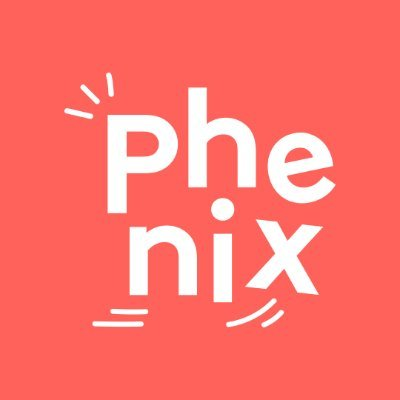{width="3.0055555555555555in"
height="1.976388888888889in"}2.- **Phenix** es la empresa emergente
líder que lucha contra el desperdicio de la comida con sedes en
diferentes partes del mundo y desde su fundación en 2014 a la fecha
llevan recaudando 60 toneladas de comida que sin su presencia hubieran
sido desperdiciados. Dicha empresa tiene aliados como distribuidores,
fabricantes, mayoristas y tiendas alimentarias. 

{width="2.9881944444444444in"
height="2.175in"}3.- **Olio** nace en el 2014 con la fundación de Teesa
Cook, en mira a que en el mundo la tercera parte de alimentos que
consumimos se tira a la basura esto, incentivó a poner en marcha a Olio.
Dicho startup conecta a vecinos entre sí y con negocios locales para que
la comida que no es consumida se comparta en vez de tirarla a la basura.
Alimentos, verduras y productos por vencer son ofertados de una manera
particular, y comercialmente bien adquiridos, a la fecha cuenta con
alrededor de 5 millones de usuarios y 35 millones de porciones de comida
compartida. 

**Cuadro comparativo entre Tasty Point y sus competidores**

+------------+---------+-------------+----------------+----------------+
| **¿Por qué |         |             |                |                |
| llevar a   |         |             |                |                |
| cabo este  |         |             |                |                |
| a          |         |             |                |                |
| nálisis?** |         |             |                |                |
|            |         |             |                |                |
| Porque     |         |             |                |                |
| este       |         |             |                |                |
| análisis   |         |             |                |                |
| nos        |         |             |                |                |
| permitirá  |         |             |                |                |
| añadir     |         |             |                |                |
| nuevas     |         |             |                |                |
| funciones, |         |             |                |                |
| mejorar    |         |             |                |                |
| las que ya |         |             |                |                |
| tenemos y  |         |             |                |                |
| así        |         |             |                |                |
| ofrecer un |         |             |                |                |
| servicio   |         |             |                |                |
| de calidad |         |             |                |                |
| y          |         |             |                |                |
| co         |         |             |                |                |
| mpetitivo. |         |             |                |                |
|            |         |             |                |                |
| ¿Puede     |         |             |                |                |
| nuestra    |         |             |                |                |
| aplicación |         |             |                |                |
| competir   |         |             |                |                |
| con        |         |             |                |                |
| ap         |         |             |                |                |
| licaciones |         |             |                |                |
| que tengas |         |             |                |                |
| intereses  |         |             |                |                |
| comunes    |         |             |                |                |
| frente a   |         |             |                |                |
| la venta   |         |             |                |                |
| de comidas |         |             |                |                |
| a un mejor |         |             |                |                |
| precio que |         |             |                |                |
| poseen las |         |             |                |                |
| mismas     |         |             |                |                |
| carac      |         |             |                |                |
| terísticas |         |             |                |                |
| y          |         |             |                |                |
| funciones? |         |             |                |                |
+------------+---------+-------------+----------------+----------------+
|            |         |             |                |                |
+------------+---------+-------------+----------------+----------------+
| **(En la   |         | **To Good   | **Phenix**     | **Olio**       |
| cabecera   |         | to Go**     |                |                |
| colocar    |         |             |                |                |
| por cada   |         |             |                |                |
| competidor |         |             |                |                |
| nombre y** |         |             |                |                |
|            |         |             |                |                |
| **logo)**  |         |             |                |                |
+------------+---------+-------------+----------------+----------------+
| **Perfil** | **Ove   | Desde el    | En el año 2014 | Por el 2014    |
|            | rview** | año 2018,   | nació esta     | nace Olio con  |
|            |         | viene       | prometedora    | el objetivo de |
|            |         | creciendo   | idea de        | compartir más, |
|            |         | esta        | negocio que    | y desperdiciar |
|            |         | empresa,    | desde su       | menos comida.  |
|            |         | cumpliendo  | presencia en   | Esta empresa   |
|            |         | con 4 años  | el mercado     | beneficia a    |
|            |         | en el       | viene          | muchas         |
|            |         | mercado.    | generando gran | personas,      |
|            |         |             | aclamación por | tiene una      |
|            |         |             | el público.    | aceptación     |
|            |         |             |                | única y sobre  |
|            |         |             |                | todo cuenta    |
|            |         |             |                | con gran       |
|            |         |             |                | respaldo.      |
+------------+---------+-------------+----------------+----------------+
|            | **      | La          | A la fecha 2.5 | Alrededor de 5 |
|            | Ventaja | iniciativa  | millones de    | millones de    |
|            | compet  | del negocio | usuarios       | personas están |
|            | itiva** | involucra   | vienen         | registradas en |
|            |         | el          | comprometidos  | Olio.          |
|            | **¿Qué  | compromiso  | con Phenix y   |                |
|            | valor   | y el        | siendo         |                |
|            | ofrece  | respaldo de | beneficiados   |                |
|            | a los   | casi 5      | de dicho       |                |
|            | clie    | millones de | startup.       |                |
|            | ntes?** | usuarios en |                |                |
|            |         | 9 países    |                |                |
|            |         | del mundo   |                |                |
+------------+---------+-------------+----------------+----------------+
| **Perfil   | **      | Vende       | Vende          | Vende          |
| de         | Mercado | productos a | productos a    | productos a    |
| M          | obj     | nivel       | nivel          | nivel          |
| arketing** | etivo** | extranjero  | extranjero y   | extranjero y   |
|            |         | y abarca    | abarca tiendas | abarca tiendas |
|            |         | tiendas en  | en diferentes  | en diferentes  |
|            |         | diferentes  | partes de      | partes de      |
|            |         | partes de   | Europa, sin    | Europa, sin    |
|            |         | Europa, sin | presencia en   | presencia en   |
|            |         | presencia   | América.       | América.       |
|            |         | en América. |                |                |
+------------+---------+-------------+----------------+----------------+
|            | **Estr  | Ofertar     | Diversidad de  | Atención al    |
|            | ategias | productos a | productos y    | cliente y      |
|            | de      | un menor    | platos,        | facilidad de   |
|            | mark    | precio.     | ofertas        | encontrar lo   |
|            | eting** |             | irresistibles  | que el cliente |
|            |         |             | por mediante   | viene a        |
|            |         |             | su aplicativo. | buscar.        |
+------------+---------+-------------+----------------+----------------+
| **Perfil   | **Pr    | Desde su    | Viene luchando | Más de 35      |
| de         | oductos | año de      | por la         | millones de    |
| Producto** | &       | fundación,  | rentabilidad   | porciones de   |
|            | Serv    | viene       | económica de   | comida         |
|            | icios** | b           | la sociedad,   | repartidas en  |
|            |         | eneficiando | demostrando    | el mundo, Olio |
|            |         | a gran      | que si existe  | crea un mundo  |
|            |         | cantidad de | ideas para un  | donde nada     |
|            |         | población,  | mundo más      | valioso se     |
|            |         | así tal que | justo, humano  | desperdicie y  |
|            |         | evitó que   | y sostenible.  | todas las      |
|            |         | la tercera  |                | personas       |
|            |         | parte del   |                | tengan         |
|            |         | desperdicio |                | suficiente qué |
|            |         | de comida   |                | comer sin      |
|            |         | sea una     |                | destruir       |
|            |         | pérdida.    |                | nuestro        |
|            |         |             |                | planeta en el  |
|            |         |             |                | proceso.       |
+------------+---------+-------------+----------------+----------------+
|            | **      | Ofrece      | Ofrece costos  | Ofrece costos  |
|            | Precios | costos y    | y porciones de | y porciones de |
|            | &       | porciones   | comida a un    | comida a un    |
|            | C       | de comida a | bajo precio.   | bajo precio.   |
|            | ostos** | un bajo     | Irresistible   | Irresistible   |
|            |         | precio.     | en sus         | en sus         |
|            |         | I           | porciones de   | porciones de   |
|            |         | rresistible | comida que     | comida que     |
|            |         | en sus      | comercializa.  | comercializa.  |
|            |         | porciones   |                |                |
|            |         | de comida   |                |                |
|            |         | que         |                |                |
|            |         | co          |                |                |
|            |         | mercializa. |                |                |
+------------+---------+-------------+----------------+----------------+
|            | **      | App móvil y | App móvil y    | App móvil y    |
|            | Canales | web         | web            | web            |
|            | de      |             |                |                |
|            | distr   |             |                |                |
|            | ibución |             |                |                |
|            | (Web    |             |                |                |
|            | y/o     |             |                |                |
|            | M       |             |                |                |
|            | óvil)** |             |                |                |
+------------+---------+-------------+----------------+----------------+
| **Análisis |         |             |                |                |
| SWOT**     |         |             |                |                |
+------------+---------+-------------+----------------+----------------+
|            | **Forta | El usuario  | Phenix utiliza | Utiliza una    |
|            | lezas** | que         | la aplicación  | APP móvil y    |
|            |         | pretenda    | móvil para     | página web,    |
|            |         | acceder     | captar         | interactiva    |
|            |         | debe de     | clientes, a su | eficaz y       |
|            |         | hacerlo     | vez una página | segura que     |
|            |         | mediante    | que respalda   | ofrece las     |
|            |         | una         | el negocio.    | comidas que    |
|            |         | aplicación  |                | tienen.        |
|            |         | móvil,      |                |                |
|            |         | donde el    |                |                |
|            |         | usuario se  |                |                |
|            |         | registra y  |                |                |
|            |         | realiza sus |                |                |
|            |         | pedidos.    |                |                |
|            |         | También     |                |                |
|            |         | tienen una  |                |                |
|            |         | página web. |                |                |
+------------+---------+-------------+----------------+----------------+
|            | *       | Solo tiene  | Solo tiene     | Solo tiene     |
|            | *Debili | presencia   | presencia en   | presencia en   |
|            | dades** | en algunos  | algunos países | algunos países |
|            |         | países de   | de Europa y es | de Europa y es |
|            |         | Europa y es | una empresa    | una empresa    |
|            |         | una empresa | emergente con  | emergente con  |
|            |         | emergente   | mínima         | mínima         |
|            |         | con mínima  | población      | población      |
|            |         | población   | clientela.     | clientela.     |
|            |         | clientela.  |                |                |
+------------+---------+-------------+----------------+----------------+
|            | **O     | Tiene       | Tiene          | Tiene          |
|            | portuni | aceptación  | aceptación en  | aceptación en  |
|            | dades** | en Europa y | Europa y       | Europa y       |
|            |         | millones de | millones de    | millones de    |
|            |         | usuario     | usuario        | usuario        |
|            |         | muestran su | muestran su    | muestran su    |
|            |         | respaldo a  | respaldo a la  | respaldo a la  |
|            |         | la          | iniciativa.    | iniciativa.    |
|            |         | iniciativa. |                |                |
+------------+---------+-------------+----------------+----------------+
|            | **Ame   | No presenta | No presenta    | No presenta    |
|            | nazas** | mercado en  | mercado en     | mercado en     |
|            |         | América y   | América y no   | América y no   |
|            |         | no          | comercializa   | comercializa   |
|            |         | c           | por delivery.  | por delivery.  |
|            |         | omercializa |                |                |
|            |         | por         |                |                |
|            |         | delivery.   |                |                |
+------------+---------+-------------+----------------+----------------+

+---------------+-------------+-----------+-----------+--------------+
| **Indicadores | **Too Good  | *         | **Olio**  | **Tasty      |
| de            | to go**     | *Phenix** |           | Point**      |
| comparación** |             |           |           |              |
+===============+=============+===========+===========+==============+
| Años en el    | Desde el    | En el año | Por el    | Al ser un    |
| mercado.      | año 2018,   | 2014      | 2014 nace | startup      |
|               | viene       | nació     | Olio con  | emergente,   |
|               | creciendo   | esta      | el        | no cuenta    |
|               | esta        | pr        | objetivo  | con tiempo   |
|               | empresa,    | ometedora | de        | de           |
|               | cumpliendo  | idea de   | compartir | experiencia. |
|               | con 4 años  | negocio   | más, y    |              |
|               | en el       | que desde | des       |              |
|               | mercado.    | su        | perdiciar |              |
|               |             | presencia | menos     |              |
|               |             | en el     | comida.   |              |
|               |             | mercado   | Esta      |              |
|               |             | viene     | empresa   |              |
|               |             | generando | beneficia |              |
|               |             | gran      | a muchas  |              |
|               |             | a         | personas, |              |
|               |             | clamación | tiene una |              |
|               |             | por el    | a         |              |
|               |             | público.  | ceptación |              |
|               |             |           | única y   |              |
|               |             |           | sobre     |              |
|               |             |           | todo      |              |
|               |             |           | cuenta    |              |
|               |             |           | con gran  |              |
|               |             |           | respaldo. |              |
+---------------+-------------+-----------+-----------+--------------+
| Aceptación de | La          | A la      | Alrededor | En las       |
| la clientela  | iniciativa  | fecha 2.5 | de 5      | entrevistas  |
|               | del negocio | millones  | millones  | realizadas   |
|               | involucra   | de        | de        | se evidencia |
|               | el          | usuarios  | personas  | el respaldo  |
|               | compromiso  | vienen    | están     | y el buen    |
|               | y el        | comp      | re        | impacto que  |
|               | respaldo de | rometidos | gistradas | genera el    |
|               | casi 5      | con       | en Olio.  | startup      |
|               | millones de | Phenix y  |           | emergente.   |
|               | usuarios en | siendo    |           |              |
|               | 9 países    | ben       |           |              |
|               | del mundo.  | eficiados |           |              |
|               |             | de dicho  |           |              |
|               |             | startup.  |           |              |
+---------------+-------------+-----------+-----------+--------------+
| Impacto       | Desde su    | Viene     | Más de 35 | E            |
| social        | año de      | luchando  | millones  | fectivamente |
|               | fundación,  | por la    | de        | el impacto   |
|               | viene       | ren       | porciones | social que   |
|               | b           | tabilidad | de comida | tendría la   |
|               | eneficiando | económica | r         | app móvil es |
|               | a gran      | de la     | epartidas | si           |
|               | cantidad de | sociedad, | en el     | gnificativo, |
|               | población,  | de        | mundo,    | por lo que   |
|               | así tal que | mostrando | Olio crea | contribuimos |
|               | evitó que   | que si    | un mundo  | con una      |
|               | la tercera  | existe    | donde     | noche causa  |
|               | parte del   | ideas     | nada      | y de una     |
|               | desperdicio | para un   | valioso   | manera       |
|               | de comida   | mundo más | se        | efectiva.    |
|               | sea una     | justo,    | de        |              |
|               | pérdida.    | humano y  | sperdicie |              |
|               |             | so        | y todas   |              |
|               |             | stenible. | las       |              |
|               |             |           | personas  |              |
|               |             |           | tengan    |              |
|               |             |           | s         |              |
|               |             |           | uficiente |              |
|               |             |           | qué comer |              |
|               |             |           | sin       |              |
|               |             |           | destruir  |              |
|               |             |           | nuestro   |              |
|               |             |           | planeta   |              |
|               |             |           | en el     |              |
|               |             |           | proceso.  |              |
+---------------+-------------+-----------+-----------+--------------+
| Tecnología    | El usuario  | Phenix    | Utiliza   | La           |
| utilizada     | que         | utiliza   | una APP   | tecnología   |
| para captar   | pretenda    | la        | móvil y   | usada para   |
| clientes      | acceder     | a         | página    | lograr       |
|               | debe de     | plicación | web,      | llegar a     |
|               | hacerlo     | móvil     | in        | nuestros     |
|               | mediante    | para      | teractiva | clientes es  |
|               | una         | captar    | eficaz y  | la app       |
|               | aplicación  | clientes, | segura    | móvil, donde |
|               | móvil,      | a su vez  | que       | se presentan |
|               | donde el    | una       | ofrece    | los          |
|               | usuario se  | página    | las       | servicios y  |
|               | registra y  | que       | comidas   | las          |
|               | realiza sus | respalda  | que       | novedades    |
|               | pedidos.    | el        | tienen.   | que          |
|               | También     | negocio.  |           | ofrecemos.   |
|               | tienen una  |           |           |              |
|               | página web. |           |           |              |
+---------------+-------------+-----------+-----------+--------------+
| Presencia en  | Se originó  | Phenix    | Olio va   | Se prevé que |
| el            | en          | está      | creciendo | al momento   |
| extranjero    | Dinamarca y | presente  | cada vez  | de poner a   |
|               | a la fecha  | en 5      | más y en  | disposición  |
|               | está        | países    | 60 países | de las       |
|               | fundado en  | del mundo | del mundo | personas     |
|               | países      | con más   | tiene     | interesantes |
|               | como:       | de 30     | p         | se irán      |
|               | Noruega,    | filiales  | resencia. | sumando y al |
|               | Holanda,    | en        | Alberga a | atravesar un |
|               | Alemania,   | d         | 80 mil    | año superar  |
|               | Reino       | iferentes | empleados | los 100.000  |
|               | Unido,      | ciudades. | entre     | usuarios     |
|               | Francia,    | Presencia | chefs,    | registrados  |
|               | Bélgica,    | en pocos  | cocineros | en nuestra   |
|               | Suiza y     | países    | y demás   | aplicación   |
|               | España. No  | del       | trab      | móvil.       |
|               | cuenta con  | mundo,    | ajadores. |              |
|               | tiendas en  | sigue     | No        | Somos un     |
|               | América,    | siendo un | presenta  | startup      |
|               | esto se     | startup   | mucho     | emergente y  |
|               | torna       | e         | público   | no tenemos   |
|               | difícil     | mergente. | objetivo  | experiencia  |
|               | porque no   |           | en        | en el        |
|               | permite     |           | América y | mercado.     |
|               | extender su |           | mucho     | Presenta     |
|               | mercado.    |           | menos en  | cierta       |
|               |             |           | Perú. Al  | dificultad   |
|               |             |           | no tener  | para         |
|               |             |           | presencia | impactar en  |
|               |             |           | presenta  | el negocio.  |
|               |             |           | di        |              |
|               |             |           | ficultad. |              |
+---------------+-------------+-----------+-----------+--------------+

### 2.1.2. Estrategias y tácticas frente a competidores  {#estrategias-y-tácticas-frente-a-competidores .Titulo-3 .unnumbered}

Analizando nuestras propias debilidades, al ser un startup que recién
ingresamos al mercado, no tenemos asegurados a los clientes y tampoco
experiencia. Entonces, en base a las propias ideas y el estudio previo a
los competidores de Tasty Point, surgen las siguientes estrategias:

-   Establecer lazos de sociedad entre proveedores de las diferentes
    zonas del país (Costa, Sierra y Selva) para tener una mejor variedad
    de los platos y ser impartidos en la ciudad. Por lo tanto, se
    considera ampliar la cantidad de asociados que proveen los recursos
    (mercadería a revender) mediante incentivos porcentuales de
    ganancia. 

-   Crear mayor publicidad que exhibe nuestro startup, con el fin de
    auto promoverse y conseguir más alianzas con mercados, cadenas de
    restaurantes y diversas entidades públicas y privadas. 

-   Para conseguir ventaja sobre el competidor se estudia el mercado
    actual y la demanda. Es necesario enfocar el nicho de negocio acorde
    a los segmentos objetivos que buscamos. 

Haciendo un breve estudio sigiloso de las debilidades de los
competidores de Tasty Point se plantean las siguientes tácticas con el
fin de superarnos como startup.

-   Enfatizar la satisfacción y el feedback de nuestros clientes para
    así promover la comodidad y fidelidad para con nuestra marca.

-   Materializar los conceptos que presentamos con el fin de realizar
    teaser de nuestros cambios/mejoras y así recibir una precrítica.

-   Realizar campañas publicitarias para dar a conocer nuestra marca y
    así crear conciencia en las personas que nos desconocen.

-   Convencer a las personas que es de suma importancia cuidar la
    comida, por lo que es el primordial sustento de la vida. 

-   Impartir canales de publicidad, Radio, Facebook, Instagram: Con la
    idea de persuadir a la población juvenil y captar mayor número de
    usuarios.

-   Estar en constante innovación   y cambio, esto será útil para llamar
    la atención de los usuarios. **\
    **

## 2.2. Entrevistas {#entrevistas .Tituloo-2}

### Segmento: Representantes de las cadenas de restaurantes (Cliente). {#segmento-representantes-de-las-cadenas-de-restaurantes-cliente. .unnumbered}

### 2.2.1. Diseño de entrevistas  {#diseño-de-entrevistas .Titulo-3 .unnumbered}

¡Hola, buen día!, permítame presentarme y hablarle un poco acerca de mi
proyecto, soy el estudiante \[\...\] de la carrera de Ingeniería de
Software. Mi proyecto trata acerca de la creación de una aplicación en
donde se publican y venden comidas que han sobrado del día, de
restaurantes y de cualquier otro establecimiento de comida a un menor
precio, esto con la finalidad de ayudar a disminuir el desperdicio de
comida y ofrecerlos a un precio accesible; para ello a mi equipo y a mí
nos agradaría contar con su opinión, ¿podría concedernos una entrevista?

**INTRODUCCIÓN**

¿Cuál es su nombre?, ¿Cuál es su edad?, ¿Cuál es su formación?, ¿Dónde
se ubica su negocio?

**PRE-PROBLEMÁTICA**

¿Qué tipo de alimentos venden en su establecimiento?

¿Cuál es la edad promedio de sus clientes?

¿Cuáles son los alimentos que más vende y cuáles son los que menos
vende?

¿Le ha causado problemas el desperdicio de comida?

¿Usted confía en el análisis que realizan los dispositivos tecnológicos
en general?

**PROBLEMÁTICA**

¿Qué sucede con los alimentos que sobran al final del día?

¿Qué porcentaje de sus ganancias se ve afectado por estas pérdidas?

¿Qué alternativa propondría para disminuir el desperdicio de comida?

¿Conoce alguna aplicación móvil en dónde pueda ofertar la comida que le
ha sobrado al final del día? De ser así, ¿cuáles y qué tal ha sido su
experiencia?

¿Hace uso de algún medio para crecer sus ventas?

¿Usted piensa que sería una buena idea utilizar un dispositivo
tecnológico que sea capaz de analizar de forma eficiente el estado de un
alimento para que usted decida si es óptimo vender el alimento a un
menor precio?

**PRESENTACIÓN DE LA APP**

¿Estaría dispuesto(a) a ofertar la comida que le resta al final del día?

¿Qué descuento aplicaría a sus comidas?

¿Le resultaría útil usar una aplicación móvil en dónde pueda ofertar sus
alimentos? De ser así, ¿qué le gustaría que la aplicación móvil tuviera?

### 2.2.2. Registro de entrevistas {#registro-de-entrevistas .Titulo-3 .unnumbered}

  -----------------------------------------------------------------------
  Nombres y apellidos  Roberto Carlos Salazar Risco
  -------------------- --------------------------------------------------
  Edad                 21 años

  Dirección            Restaurante "El buen sabor", Lima, Lima

  Duración             8:02
  -----------------------------------------------------------------------

  -----------------------------------------------------------------------------------------------------------------------------------------------
  {width="6.9in" height="2.2291666666666665in"}
  -----------------------------------------------------------------------------------------------------------------------------------------------
  URL: [Entrevista Dueño de
  restaurante](https://upcedupe-my.sharepoint.com/:v:/g/personal/u202010942_upc_edu_pe/ESrkBUt9F_hGnyZsi3zsCmwBIfXyJ5h6IJLv3_LbWr-NZA?e=Oab2zT)

  Entrevistador: David Antonio Torres Vilchez

  Análisis: Roberto Salazar Risco es un estudiante de 21 años que por vacaciones decidió abrir un foodtruck de comida rápida como alitas,
  hamburguesas, sándwiches, entre otros. Roberto nos comenta que el producto más vendido son sus hamburguesas y que el menos vendido son unos
  panes con chicharrones. Sus clientes tienen un aproximado de 20 años, siendo gran parte de sus consumidores jóvenes universitarios. Tuvo
  problemas al comenzar con el negocio puesto que en los primeros días tenían más carne de lo normal y esto provoco muchos desechos, actualmente
  evita este problema analizando los productos menos vendidos para sacarlos del menú y comprar lo necesario. Según él, el porcentaje de ganancias
  afectado es de aproximadamente el 5-8%. No ha llegado a ver una app enfocada en evitar desperdicios. Él está dispuesto a dar un descuento alto
  con el fin de reducir los desechos de alimentos. Le agradaría la idea de una app móvil sencilla de usar, que le permita hacer un seguimiento de
  sus productos y notificar a los usuarios de la aplicación acerca de sus nuevas ofertas constantemente.
  -----------------------------------------------------------------------------------------------------------------------------------------------

### Segmento: Consumidores {#segmento-consumidores .unnumbered}

### 2.2.4. Diseño de entrevistas. {#diseño-de-entrevistas. .Titulo-3 .unnumbered}

¡Hola, buen día!, permítame presentarme y hablarle un poco acerca de mi
proyecto, soy el estudiante \[\...\] de la carrera de Ingeniería de
Software. Mi proyecto trata acerca de la creación de una aplicación
móvil en donde se publiquen comidas que han sobrado del día de
restaurantes y de cualquier otro establecimiento de comida a un menor
precio, esto con la finalidad de ayudar a disminuir el desperdicio de
comida y ofrecerlos a un precio accesible; para ello a mi equipo y a mí
nos agradaría contar con su opinión, ¿podría concedernos una entrevista?

**INTRODUCCIÓN**

¿Cuál es su nombre?, ¿Cuál es su edad?, ¿Cuál es su profesión?, ¿Dónde
vive?

**PRE-PROBLEMÁTICA**

¿Con qué frecuencia compra alimentos preparados en establecimientos?

¿Qué tipo de comidas preparadas fuera de casa consume más?

¿Cuál es el promedio de dinero que gasta en dichos alimentos?

¿Usted confía en el análisis que realizan los dispositivos tecnológicos
en general?

**PROBLEMÁTICA**

¿Sabe usted qué ocurre con los alimentos que no son vendidos durante el
día en un establecimiento de comida? De ser su respuesta no, ¿qué se
imagina que ocurre con esos alimentos?

¿Qué alternativa propondría para disminuir el desperdicio de comida?

¿Qué tipo de comida compraría a un menor precio?

 ¿Conoce alguna App o página web en dónde pueda adquirir alimentos a un
menor precio? Si la respuesta es sí, ¿cuáles?

¿Usted piensa que sería una buena idea utilizar un dispositivo
tecnológico que sea capaz de analizar de forma eficiente el estado de un
alimento para que usted decida si adquirir el producto a un menor
precio?

**PRESENTACIÓN DE LA APP**

¿Conoce algún restaurante que ofrezca su comida en una app y las de a un
menor precio?

¿Estaría dispuesto(a) a comprar alimentos que han sobrado en un
restaurante por un menor precio?

¿Usaría una app en donde pueda encontrar alimentos que han quedado en un
establecimiento de comida?

Después de utilizar la aplicación, ¿estaría dispuesto a compartirnos su
opinión y recomendarla si esta ha sido de su agrado?

### 2.2.5. Registro de entrevistas {#registro-de-entrevistas-1 .Titulo-3 .unnumbered}

  -----------------------------------------------------------------------
  Nombres y apellidos    Luis Martinez Sotelo
  ---------------------- ------------------------------------------------
  Edad                   21

  Dirección              Rimac, Lima

  Duración               3:20
  -----------------------------------------------------------------------

  -----------------------------------------------------------------------
  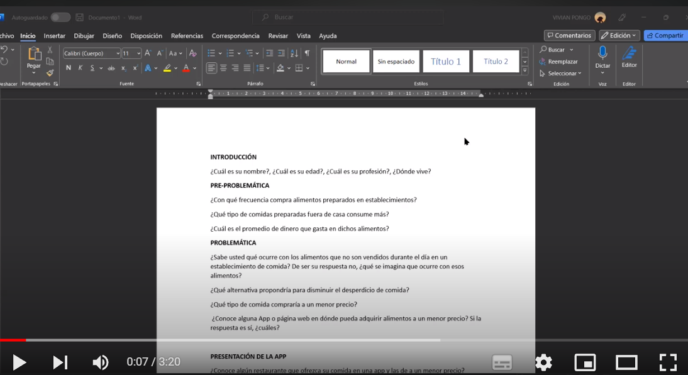{width="5.0in" height="2.7291666666666665in"}
  -----------------------------------------------------------------------
  URL: [Entrevista Consumidor](https://youtu.be/jDtoZJNe9TU)

  Entrevistador: Adrian Alzamora Gonzales

  Análisis: En esta oportunidad se Entrevistó a Luis Martínez quien es un
  estudiante de 21 años de la carrera de ingeniería civil, también nos
  indica que vive en el distrito del Rímac de la ciudad de Lima. Luis nos
  cuenta que usualmente suele gastar alrededor de 40 a 50 soles por
  semana en alimentos que se pueden catalogar como comida rápida. El
  entrevistado opina que unas buenas alternativas para disminuir el
  desperdicio de comida son la donación de alimentos o la venta de estos
  a un menor precio. Asimismo, Luis comenta que estaría dispuesto a
  comprar alimentos sobrantes de establecimientos de comida solo si estos
  se encuentran en buen estado. De la misma forma, piensa que una app
  móvil que ofrezca alimentos sobrantes a un menor precio es una buena
  idea, ya que no conoce herramientas similares en el mercado.
  -----------------------------------------------------------------------

  -----------------------------------------------------------------------------------------------------------------------------------------------------------------------------
  Nombre y apellidos                                                                                                                    Andrea Veronica Liviapoma Mendez
  ------------------------------------------------------------------------------------------------------------------------------------- ---------------------------------------
  Edad                                                                                                                                  21

  Dirección                                                                                                                             Pueblo Libre, Lima

  Duración                                                                                                                              3.07m

  {width="5.91666447944007in" height="3.081596675415573in"}                                                       

  URL: [Entrevista Consumidor                                                                                                           
  2](https://upcedupe-my.sharepoint.com/:v:/g/personal/u20161a096_upc_edu_pe/EeZ1CZ78inJDhp7ol2sIn_UBbQamhR9fQXrPh9rDSUPraQ?e=KC18F1)   

  Entrevistador: Farid Josué Izquierdo Cristobal                                                                                        

  Análisis: Andrea es una joven de 21 años, estudiante de la carrera de Nutrición de la Universidad Peruana de Ciencias Aplicadas       
  (UPC). Ella nos menciona que al menos una vez a la semana consume alimentos preparados de establecimientos de comida y que su consumo 
  promedio es de 30 soles, nos indica que gracias a su experiencia laboral en un restaurante conoce del gran desperdicio de alimentos   
  que produce esta industria. Por último, nos comenta que si estuviese interesada en consumir productos sobrantes de restaurantes con   
  la condición de que no estén extremadamente próximos a caducar y también mostro interés en el uso de una aplicación móvil que pueda   
  ofrecer estos productos a un menor costo.                                                                                             
  -----------------------------------------------------------------------------------------------------------------------------------------------------------------------------

## 2.3. Needfinding.  {#needfinding. .Tituloo-2}

## 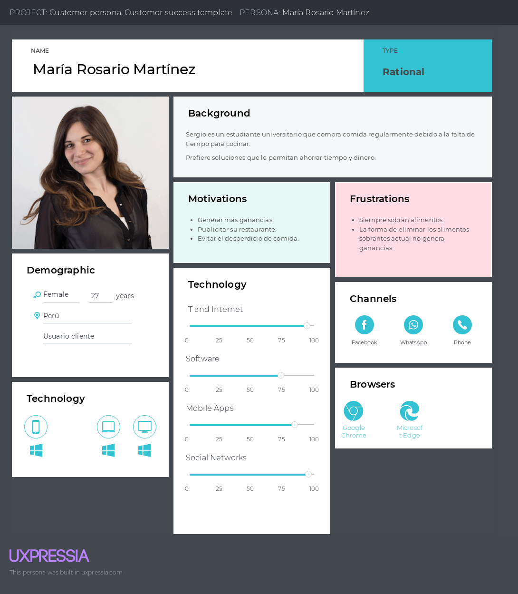{width="6.683333333333334in" height="7.675in"}2.3.1. User Personas.  {#interfaz-de-usuario-gráfica-sitio-web-descripción-generada-automáticamente2.3.1.-user-personas. .Tituloo-2}

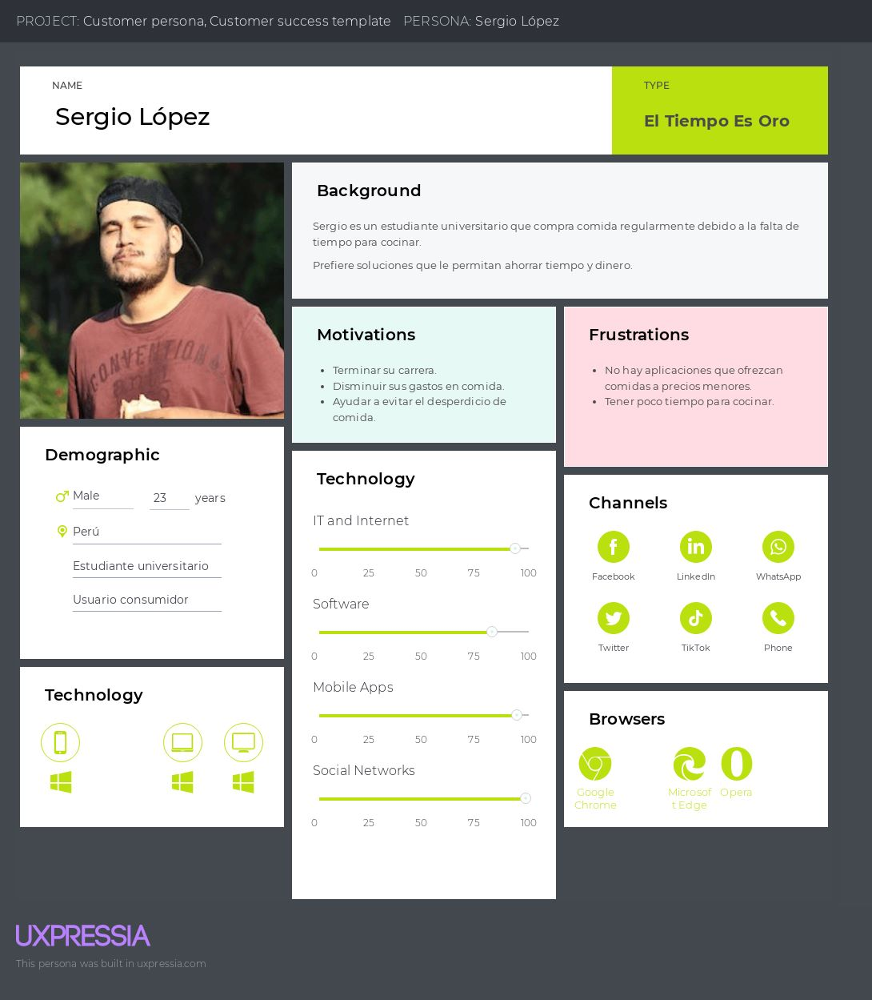{width="6.790928477690288in"
height="7.779220253718285in"}**\
**

### 2.3.2. User Task Matrix   {#user-task-matrix .Titulo-3 .unnumbered}

  ----------------------------------------------------------------------------
  User Tasks       Consumidor                    Cliente        
  ---------------- -------------- -------------- -------------- --------------
                   Frecuencia     Importancia    Frecuencia     Importancia

  Registrar        Siempre        Alta           Nunca          Baja
  Producto                                                      

  Adquirir         A veces        Media          Nunca          Baja
  Publicidad                                                    

  Buscar plato por A veces        Baja           Siempre        Alta
  tipo                                                          

  Buscar plato por A veces        Baja           Siempre        Alta
  precio                                                        

  Agregar Oferta a A veces        Media          Nunca          Baja
  Plato                                                         

  Pagar por        A veces        Alta           A veces        Alta
  servicio                                                      

  Revisar estado   Siempre        Alta           Nunca          Baja
  de productos                                                  

  Visualizar       Siempre        Alta           Nunca          Baja
  resumen de                                                    
  ventas                                                        

  Revisar          Siempre        Alta           Nunca          Baja
  temperatura de                                                
  inventario                                                    

  Revisar Humedad  Siempre        Alta           Nunca          Baja
  de Inventario                                                 

  Notificaciones   Siempre        Alta           Nunca          Baja
  sobre cambios                                                 
  bruscos en                                                    
  temperatura y                                                 
  humedad                                                       
  ----------------------------------------------------------------------------

### 2.3.3. User Journey Mapping. {#user-journey-mapping. .Titulo-3 .unnumbered}

{width="8.194444444444445in"
height="6.696527777777778in"}Consumidor:

{width="7.673894356955381in"
height="5.779221347331584in"}Cliente:

**\
**

### 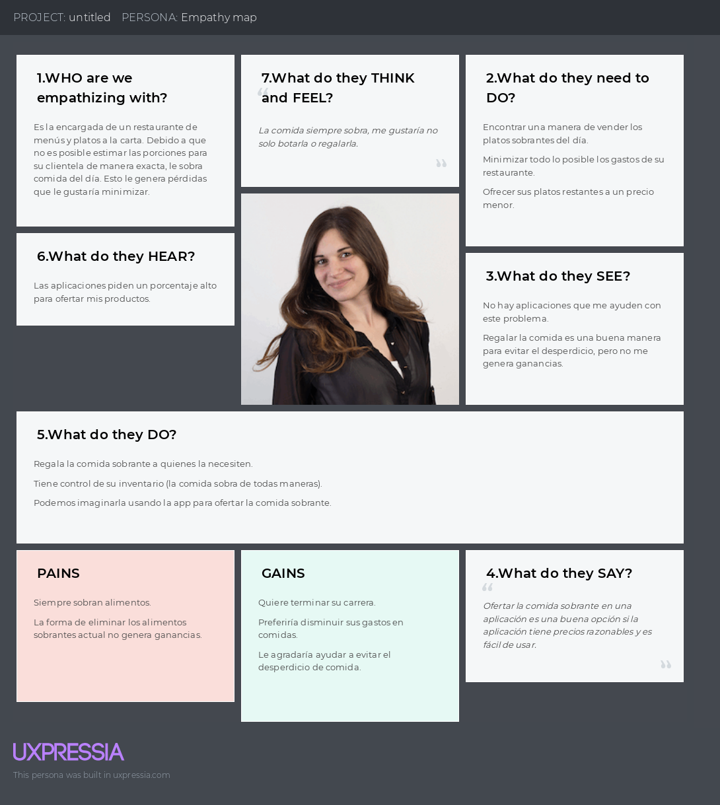{width="6.895833333333333in" height="7.709027777777778in"}2.3.4. Empathy Mapping {#interfaz-de-usuario-gráfica-descripción-generada-automáticamente2.3.4.-empathy-mapping .Titulo-3 .unnumbered}

{width="6.896104549431321in"
height="8.28326990376203in"}

### 2.3.5. As-is Scenario Mapping. {#as-is-scenario-mapping. .Titulo-3 .unnumbered}

{width="7.522222222222222in"
height="3.765972222222222in"}Consumidor:

Cliente:

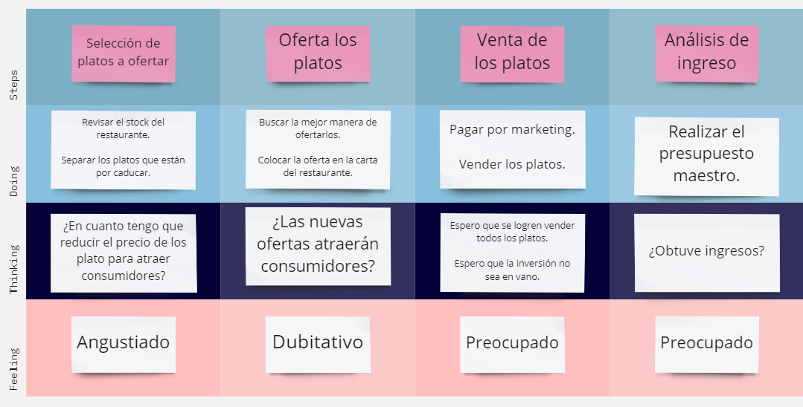{width="7.26875in" height="3.69375in"}

Link de los as-is scenarios:
https://miro.com/app/board/uXjVPbmMyEc=/?share_link_id=757619138617

# REQUIREMENTS SPECIFICATION {#requirements-specification .unnumbered}

## 3.1. To-Be Scenario Mapping.  {#to-be-scenario-mapping. .Tituloo-2}

Consumidor: los usuarios que van a comprar los alimentos.

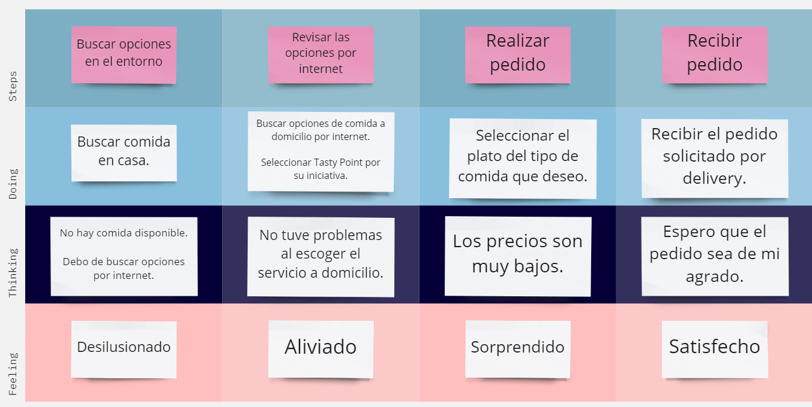{width="6.893055555555556in"
height="3.4694444444444446in"}

Cliente: cadena de restaurantes y comidas.

{width="6.9in"
height="3.439583333333333in"}

Link de los to-be scenarios:
<https://miro.com/app/board/uXjVPbmMyEc=/?share_link_id=757619138617>

## 3.2. User Stories  {#user-stories .Tituloo-2}

** User stories Consumer**

  ---------------------------------------------------------------------------------------
  Story ID       Título             Descripción      Criterios de      Escenarios 
                                                     aceptación        
  -------------- ------------------ ---------------- ----------------- ------------------
  US01           Registro de        Como consumidor  Dado que el       El consumidor
                 Consumidor         quiero crear una consumidor se     quiere registrarse
                                    cuenta para      encuentra en la   en la aplicación.
                                    acceder a la     ventana de        
                                    aplicación       registro y        
                                    móvil.           completa todos    
                                                     los campos.       
                                                     Cuando presiona   
                                                     el botón          
                                                     registrarse.      
                                                     Entonces podrá    
                                                     acceder a la      
                                                     aplicación.       

                                                     Dado que el       El consumidor no
                                                     consumidor se     completa los
                                                     encuentra en la   campos
                                                     ventana de        obligatorios.
                                                     registro y no     
                                                     completa todos    
                                                     los campos        
                                                     obligatorios.     
                                                     Cuando presiona   
                                                     el botón          
                                                     registrarse.      
                                                     Entonces esos     
                                                     campos se marcan  
                                                     de rojo Y se      
                                                     muestra el        
                                                     mensaje:          
                                                     "Complete los     
                                                     campos            
                                                     obligatorios".    

                                                     Dado que el        El consumidor
                                                     consumidor se     intenta
                                                     encuentra en la   registrarse, pero
                                                     ventana de        no completa con
                                                     registro y        datos correctos
                                                     completa          los campos
                                                     erróneamente los  obligatorios.
                                                     campos. Cuando    
                                                     presiona el botón 
                                                     registrarse.      
                                                     Entonces se       
                                                     muestra el        
                                                     siguiente         
                                                     mensaje:          
                                                     "Complete los     
                                                     campos            
                                                     correctamente".   

  US02           Monitorear el      Como consumidor  Dado que el       El consumidor
                 perfil             quiero ver el    consumidor quiere quiere ver su
                                    perfil de mi     ver su perfil.    perfil.
                                    cuenta para      Cuando presiona   
                                    corroborar que   el icono de       
                                    mis datos sean   perfil ubicado en 
                                    correctos.       la sección de     
                                                     menú. Entonces la 
                                                     aplicación        
                                                     muestra la        
                                                     información del   
                                                     perfil del        
                                                     consumidor.       

  US03           Cerrar sesión de   Como consumidor  Dado que el       El consumidor
                 consumidor         quiero cerrar    consumidor se     quiere cerrar
                                    sesión para      encuentra en la   sesión en el
                                    salir de mi      aplicación.       sistema.
                                    cuenta.          Cuando presiona   
                                                     el icono de       
                                                     perfil ubicado en 
                                                     la sección de     
                                                     menú. Entonces se 
                                                     le mostrará un    
                                                     mensaje: ¿Está    
                                                     seguro de cerrar  
                                                     sesión? Y el      
                                                     consumidor        
                                                     selecciona la     
                                                     opción sí para    
                                                     cerrar la         
                                                     sesión.           

                                                     Dado que el        El consumidor
                                                     consumidor se     presiona por error
                                                     encuentra en la   el botón de
                                                     aplicación.       "Cerrar sesión ".
                                                     Cuando presiona   
                                                     el botón de       
                                                     cerrar sesión.    
                                                     Entonces se le    
                                                     mostrará un       
                                                     mensaje: ¿Está    
                                                     seguro de cerrar  
                                                     sesión? Y el      
                                                     consumidor        
                                                     selecciona la     
                                                     opción no para    
                                                     mantener iniciada 
                                                     la sesión.        

  US04           Pagar el envío de  Como consumidor  Dado que el       El consumidor
                 productos          quiero pagar el  consumidor se     desea colocar su
                                    envió del        encuentra en la   cuenta bancaria.
                                    pedido.          ventana "Pago".   
                                                     Cuando se llena   
                                                     el campo de       
                                                     número de cuenta  
                                                     correctamente y   
                                                     presione el botón 
                                                     de Pagar.         
                                                     Entonces la       
                                                     aplicación        
                                                     mostrará un icono 
                                                     de verificado.    

                                                     Dado que el       El consumidor
                                                     consumidor se     rellena el campo
                                                     encuentra en la   de su cuenta
                                                     ventana "Pago".   bancaria
                                                     Cuando no se      incorrectamente.
                                                     llena el campo de 
                                                     número de cuenta  
                                                     correctamente Y   
                                                     presione el botón 
                                                     de Pagar.         
                                                     Entonces la       
                                                     aplicación        
                                                     mostrará un       
                                                     mensaje de error  
                                                     y el borde del    
                                                     campo se volverá  
                                                     rojo.             

  US05           Visualizar todas   Como consumidor, Dado que el       Ver ofertas
                 las notificaciones quiero           consumidor se     publicadas por
                                    visualizar las   encuentra en la   restaurantes.
                                    notificaciones   aplicación,       
                                    para estar       cuando ingresa a  
                                    informado sobre  la sección de     
                                    las ofertas que  notificaciones,   
                                    ofrezcan los     entonces le       
                                    restaurantes.    aparecen las      
                                                     notificaciones    
                                                     realizadas por    
                                                     los restaurantes  
                                                     registrados en la 
                                                     aplicación.       

  US06           Fijar favoritos    Como consumidor  Dado que el       Guardar productos
                                    quiero guardar   consumidor, se    favoritos.
                                    la información   encuentra en la   
                                    de mis productos ventana "Lista de 
                                    favoritos        productos",       
                                                     cuando presiona   
                                                     el icono de       
                                                     corazón vacío que 
                                                     posee el artículo 
                                                     en la lista de    
                                                     productos         
                                                     publicados por    
                                                     los restaurantes  
                                                     registrados en la 
                                                     aplicación,       
                                                     entonces se       
                                                     añaden los datos  
                                                     del producto a la 
                                                     sección de        
                                                     favoritos y el    
                                                     icono de corazón  
                                                     vacío cambia por  
                                                     uno lleno.        

                                                     Dado que el       Eliminar producto
                                                     consumidor, se    de favoritos
                                                     encuentra en la   
                                                     ventana "Lista de 
                                                     productos",       
                                                     cuando presiona   
                                                     el icono de       
                                                     corazón lleno que 
                                                     posee el artículo 
                                                     en la lista de    
                                                     productos         
                                                     publicados por    
                                                     los restaurantes  
                                                     registrados en la 
                                                     aplicación,       
                                                     entonces se       
                                                     eliminan los      
                                                     datos del         
                                                     producto a la     
                                                     sección de        
                                                     favoritos y el    
                                                     icono de corazón  
                                                     lleno cambia por  
                                                     uno vacío.        

  US07           Visualizar         Como consumidor  Dado que el       El consumidor
                 productos y sus    quiero ver la    consumidor ha     quiere visualizar
                 datos              lista de los     inicializado su   algunos productos
                                    productos        sesión, cuando    para comprarlos.
                                    publicados por   presione el icono 
                                    los restaurantes de Lista en el    
                                    registrados en   menú entonces     
                                    la aplicación    será dirigido a   
                                    para poder       la ventana de     
                                    comprarlos.      "Lista de         
                                                     productos", y     
                                                     podrá visualizar  
                                                     los productos     
                                                     organizados con   
                                                     sus respectivas   
                                                     fotos y ciertos   
                                                     datos puntuales   
                                                     como              
                                                     descripción.      

                                                     Dado que el       El consumidor
                                                     consumidor ha     quiere visualizar
                                                     inicializado su   algunos productos
                                                     sesión, cuando    para comprarlos,
                                                     presione el icono pero no hay
                                                     de Lista en el    productos.
                                                     menú entonces     
                                                     será dirigido a   
                                                     la ventana de     
                                                     "Lista de         
                                                     productos", y     
                                                     podrá visualizar  
                                                     el mensaje: "No   
                                                     hay productos     
                                                     publicados".      

  US08           Filtrar            Como consumidor  Dado que el       El consumidor
                 restaurante        quiero filtrar   consumidor está   visualiza los
                                    la lista de      en la sección     restaurantes
                                    restaurantes     Lista de          deseados.
                                    registrados en   productos, cuando 
                                    la aplicación    ingrese el nombre 
                                    para poder       del restaurante   
                                    encontrar        en la barra de    
                                    rápidamente los  navegación        
                                    productos de mi  ubicado en la     
                                    restaurante de   parte superior,   
                                    preferencia.     entonces se       
                                                     mostrarán los     
                                                     datos de los      
                                                     productos de los  
                                                     restaurantes      
                                                     registrados en la 
                                                     aplicación.       

                                                     Dado que el       No hay
                                                     consumidor está   restaurantes
                                                     en la sección     registrados en la
                                                     Lista de          aplicación con el
                                                     productos, cuando nombre del .
                                                     ingrese el nombre 
                                                     del restaurante   
                                                     en la barra de    
                                                     navegación        
                                                     ubicado en la     
                                                     parte superior,   
                                                     entonces se       
                                                     mostrará el       
                                                     mensaje:          
                                                     "Restaurante no   
                                                     encontrado".      

  US09           Compartir          Como consumidor  Dado que el       El consumidor
                 comentario         quiero redactar  consumidor se     exceda el límite
                                    un comentario    encuentra en la   de caracteres
                                    sobre un         ventana de        permitidos. 
                                    determinado      reseñas, cuando   
                                    restaurante      ingrese su        
                                    acerca de mi     comentario y      
                                    experiencia con  presione el botón 
                                    ellos para poder de publicar       
                                    compartir mi     entonces se       
                                    opinión con los  publicará el      
                                    demás.           comentario.       

  US10           Filtrar productos  Como consumidor  Dado que el       El consumidor
                                    quiero filtrar   consumidor está   visualiza los
                                    la lista de      en la sección     productos
                                    productos        Lista de          deseados.
                                    registrados en   productos, cuando 
                                    la aplicación    ingrese el nombre 
                                    para poder       del producto en   
                                    encontrar        la barra de       
                                    rápidamente el   navegación        
                                    producto que     ubicado en la     
                                    deseo.           parte superior,   
                                                     entonces se       
                                                     mostrarán los     
                                                     datos de los      
                                                     productos de los  
                                                     restaurantes      
                                                     registrados en la 
                                                     aplicación.       

                                                     Dado que el       No hay productos
                                                     consumidor está   registrados en la
                                                     en la sección     aplicación con el
                                                     Lista de          nombre del
                                                     productos, cuando producto.
                                                     ingrese el nombre 
                                                     del producto en   
                                                     la barra de       
                                                     navegación        
                                                     ubicado en la     
                                                     parte superior,   
                                                     entonces se       
                                                     mostrará el       
                                                     mensaje:          
                                                     "Producto no      
                                                     encontrado".      

  US11           Visualizar         Como consumidor  Dado que el       El consumidor
                 Información Sobre  quiero           consumidor se     visualiza el
                 el Estado del      visualizar la    encuentrá en la   estado de los
                 Producto           información      sección "List of  productos
                                    respectiva sobre Products", cuando deseados.
                                    el estado del    el usuario        
                                    producto para    encuentre el      
                                    poder verificar  producto que      
                                    que el alimento  desea adquirir,   
                                    se encuentra en  podrá visualizar  
                                    buen estado para visualizar el     
                                    el consumo.      tiempo de         
                                                     caducidad que     
                                                     tiene el          
                                                     producto.         
  ---------------------------------------------------------------------------------------

User Stories Business

  ---------------------------------------------------------------------------------------------
  **Número**     **Título**        **Descripción**   **Criterios de           **Escenarios **
                                                     aceptación**             
  -------------- ----------------- ----------------- ------------------------ -----------------
  US12           Registro de       Como cliente      Dado que el cliente se   El cliente quiere
                 Cliente           quiero crear una  encuentra en la ventana  registrarse en la
                                   cuenta para       de registro y completa   aplicación.
                                   acceder a la      todos los campos. Cuando 
                                   aplicación móvil. presiona el botón        
                                                     registrarse. Entonces    
                                                     podrá acceder a la       
                                                     aplicación.              

                                                     Dado que el cliente se   El cliente no
                                                     encuentra en la ventana  completa los
                                                     de registro y no         campos
                                                     completa todos los       obligatorios.
                                                     campos obligatorios.     
                                                     Cuando presiona el botón 
                                                     registrarse. Entonces    
                                                     esos campos se marcan de 
                                                     rojo y se muestra el     
                                                     mensaje: "Complete los   
                                                     campos obligatorios".    

                                                     Dado que el cliente se    El cliente
                                                     encuentra en la ventana  intenta
                                                     de registro y completa   registrarse, pero
                                                     erróneamente los campos. no completa con
                                                     Cuando presiona el botón datos correctos
                                                     registrarse. Entonces se los campos
                                                     muestra el siguiente     obligatorios.
                                                     mensaje: "Complete los   
                                                     campos correctamente".   

  US13           Pago de           Como cliente      Dado que el cliente ya   Visualización de
                 suscripción       deseo poder pagar se encuentra registrado. las opciones de
                                   la suscripción    Cuando el cliente desee  suscripción
                                   desde la          usar alguna función de   
                                   aplicación para   la aplicación. Entonces  
                                   acceder a más     la aplicación le         
                                   beneficios.       mostrará una pantalla    
                                                     con las opciones de      
                                                     suscripción al servicio. 

                                                     Dado que el cliente      El cliente
                                                     visualiza las opciones   ingresa los datos
                                                     de suscripción. Cuando   de su tarjeta.
                                                     el cliente selecciona    
                                                     una de las opciones.     
                                                     Entonces la aplicación   
                                                     lo redirigirá a una      
                                                     pantalla en la que podrá 
                                                     ingresar la tarjeta de   
                                                     crédito o débito con la  
                                                     que realizará el pago.   

                                                     Dado que el cliente ya   Realización
                                                     ingresó los datos        exitosa del pago
                                                     necesarios para el pago. 
                                                     Cuando el cliente        
                                                     seleccione el botón      
                                                     Pagar. Entonces la       
                                                     aplicación le mostrará   
                                                     un mensaje de "Pago      
                                                     realizado con éxito". Y  
                                                     el cliente podrá         
                                                     utilizar la aplicación.  

                                                     Dado que el cliente ya   Realización
                                                     ingresó los datos        fallida del pago
                                                     necesarios para el pago. 
                                                     Cuando el cliente        
                                                     seleccione el botón      
                                                     Pagar. Y la aplicación   
                                                     detecte algún            
                                                     inconveniente . Entonces 
                                                     la aplicación le         
                                                     mostrará un mensaje de   
                                                     "El pago no se pudo      
                                                     realizar. Inténtelo de   
                                                     nuevo más tarde".        

  US14           Publicación de    Como cliente      Dado que el cliente      Cliente
                 platos sobrantes  deseo poder       posee excedentes de      selecciona
                                   publicar los      platos del día. Y el     producto a
                                   platos que me     cliente se encuentra en  publicar
                                   sobraron en el    la ventana de "Catálogo" 
                                   día para poder    y desea publicar sus     
                                   vender lo máximo  excedentes. Cuando el    
                                   posible.          cliente seleccione la    
                                                     opción Publicar.         
                                                     Entonces la aplicación   
                                                     le preguntará qué desea  
                                                     publicar (platos de      
                                                     comida o insumos)        

                                                     Dado que el cliente se   Cliente ingresa
                                                     encuentra en la pantalla los datos del
                                                     de elección de plato o   plato
                                                     insumo. Cuando el        
                                                     cliente escoja la opción 
                                                     de plato de comida.      
                                                     Entonces la aplicación   
                                                     le pedirá que ingrese    
                                                     una serie de datos sobre 
                                                     el plato (nombre del     
                                                     plato, cantidad, precio  
                                                     verdadero, precio        
                                                     ofrecido, entre otros).  

                                                     Dado que el cliente se   Cliente realiza
                                                     encuentra en la pantalla la publicación
                                                     de completado de datos   
                                                     del plato de comida.     
                                                     Cuando el cliente        
                                                     complete correctamente   
                                                     los datos. Y seleccione  
                                                     la opción publicar.      
                                                     Entonces la aplicación   
                                                     le mostrará un mensaje   
                                                     "Publicación realizada". 

  US15           Publicación de    Como cliente      Dado que el cliente      Cliente
                 insumos sobrantes quiero publicar   posee excedentes de      selecciona
                                   los insumos       insumos del día. Y el    producto a
                                   sobrantes del día cliente se encuentra en  publicar
                                   para reducir al   la ventana "Catálogo" y  
                                   mínimo los        desea publicar sus       
                                   desperdicios de   excedentes. Cuando el    
                                   estos.            cliente seleccione la    
                                                     opción Publicar.         
                                                     Entonces la aplicación   
                                                     le preguntará qué desea  
                                                     publicar (platos de      
                                                     comida o insumos)        

  US16           Poder visualizar  Como cliente      Dado que el cliente se   El cliente se
                 notificaciones    quiero recibir    encuentra dentro del     dirige a la
                 para hacer        notificaciones    aplicativo, podrá        sección del icono
                 seguimiento el    que me mantengan  visualizar una sección   de campana y
                 estado de un      informado sobre   de notificaciones con un visualiza las
                 producto          los productos     incono de una campana,   notificaciones.
                                   para ofrecer      entonces al dirigirse    
                                   productos en buen ahí podrá visualizar     
                                   estado a mis      todas las notificaciones 
                                   comensales.       que informaran al        
                                                     cliente sobre el estado  
                                                     de sus productos.        

  US17           Registrar         Como cliente      Dado que el cliente se   El cliente entra
                 Inventario        quiero registrar  encuentre en la          a la sección
                                   el inventario que aplicación se dirigirá a "Inventory
                                   tengo             la sección "Inventory    Analitycs" para
                                                     Analitycs" , entonces    registrar su
                                                     podrá registrar el       inventario del
                                                     respectivo inventario de restaurante.
                                                     su restaurante.          

  US18           Monitorear el     Como cliente      Dado que el cliente se   El cliente entra
                 inventario        quiero monitorear encuentre en la          a la sección
                                   mi inventario,    aplicación se dirigirá a "Inventory
                                   con el fin de     la sección "Inventory    Analitycs" para
                                   estar al tanto    Analitycs" , entonces    registrar su
                                   del estado de mis podrá hacer seguimiento  inventario del
                                   productos.        del estado de cada       restaurante.
                                                     producto que se          
                                                     encuentre en el          
                                                     inventario.              

  US19           Registrar fecha   Como cliente      Dado que el cliente se   El cliente
                 de producción y   quiero registrar  encuentra visualizando   registrará la
                 caducidad         la fecha de       la lista de sus          fecha de
                                   producción y      productos, podrá         producción y
                                   caducidad del     registrar la fecha de    caducidad del
                                   producto.         producción y caducidad   producto
                                                     de su producto           solicitado.
                                                     seleccionado.            

                                                     Dado que el cliente se   Cliente ingresa
                                                     encuentra en la pantalla descripción del
                                                     de elección de plato o   insumo
                                                     insumo. Cuando el        
                                                     cliente escoja la opción 
                                                     de insumo. Entonces la   
                                                     aplicación le pedirá que 
                                                     ingrese los datos del    
                                                     insumo(nombre del        
                                                     insumo, porciones,       
                                                     precio estimado, entre   
                                                     otros).                  

                                                     Dado que el cliente se   Cliente realiza
                                                     encuentra en la pantalla la publicación
                                                     de completado de datos   
                                                     del insumo. Cuando el    
                                                     cliente complete         
                                                     correctamente los datos. 
                                                     Y seleccione la opción   
                                                     publicar. Entonces la    
                                                     aplicación le mostrará   
                                                     un mensaje "Publicación  
                                                     realizada".              

  US20           Medios de         Como cliente      Dado que el cliente se   Añadir redes
                 contacto          quiero enlazar    encuentra en la ventana  sociales
                                   todos los medios  "Perfil", cuando         
                                   de comunicación   selecciona "Agregar      
                                   que poseo para    redes sociales" y los    
                                   permitir a mis    agrega, entonces la      
                                   consumidores      aplicación mostrará un   
                                   contactarse       mensaje "Se agregó con   
                                   directamente con  éxito".                  
                                   nosotros.                                  

  US21           Ver opciones      Como cliente      Dado que el cliente ha   El cliente
                 disponibles       quiero ver las    iniciado sesión, se      ingresa
                                   opciones que      encuentra en la ventana  correctamente a
                                   ofrece Tasty      principal de Tasty point la lista de
                                   Point para        y desea ver las opciones opciones.
                                   conocer el        disponibles de la        
                                   funcionamiento de app. Cuando el cliente   
                                   la app y elegir   seleccione el símbolo    
                                   alguna de sus     listo. Entonces la       
                                   opciones          aplicación mostrará las  
                                   disponibles.      opciones disponibles:    
                                                     \"Inicio\", \"Agregar\", 
                                                     \"Catálogo\",            
                                                     \"Perfil\", en formato   
                                                     de lista.                

  US22           Ver pedidos       Como cliente      Dado que el cliente ha   El cliente
                                   quiero ver la     iniciado sesión, se      ingresa al
                                   lista de pedidos  encuentra en la ventana  registro de
                                   solicitados en mi principal de Tasty point pedidos.
                                   restaurante, para y hace clic en la        
                                   conocer la        sección "Órdenes",       
                                   demanda a través  cuando el cliente se     
                                   de la aplicación  encuentre en dicha       
                                   móvil.            sección, entonces        
                                                     aparecerá una lista con  
                                                     los nombres de los       
                                                     consumidores que         
                                                     realizaron un pedido en  
                                                     específico con fecha,    
                                                     hora y cantidad          
                                                     ordenada.                

  US23           Ver el catálogo   Como cliente      Dado que el cliente ha   El cliente elige
                 de platos e       quiero ver el     iniciado sesión, se      la opción
                 insumos           catálogo actual   encuentra en la lista de catálogo.
                                   de platos e       opciones ofrecida de     
                                   insumos ofrecidos Tasty point y desea      
                                   por mi            revisar su               
                                   establecimiento   catálogo. Cuando el      
                                   para corroborar   cliente seleccione la    
                                   que los datos de  opción                   
                                   la app coincidan  \"Catálogo\". Entonces   
                                   con mi            la aplicación mostrará   
                                   inventario.       la totalidad de platos e 
                                                     insumos registrados por  
                                                     el cliente, junto a      
                                                     datos pertinentes como:  
                                                     la cantidad actual,      
                                                     reservas hechas y tipo   
                                                     de recojo o envío        
                                                     disponible.              

                                                     Dado que el cliente se   El cliente elige
                                                     encuentra en la lista de ver solo platos o
                                                     platos e insumos         solo insumos del
                                                     disponibles ofrecidos    catálogo.
                                                     por su establecimiento,  
                                                     y desea ver sólo los     
                                                     platos o insumos         
                                                     ofrecidos por su         
                                                     establecimiento. Cuando  
                                                     el cliente seleccione la 
                                                     opción filtro y elija la 
                                                     opción "platos" o        
                                                     "insumos". Entonces la   
                                                     aplicación listará solo  
                                                     platos o solo insumos    
                                                     (dependiendo de la       
                                                     opción del cliente)      
                                                     junto a sus datos        
                                                     pertinentes.             

  US24           Abrir vista de    Como cliente      Dado que el cliente se   El cliente
                 consumidor        quiero contar con encuentra en la ventana  ingresa a "vista
                                   la vista de       "Catálogo", Cuando el    de consumidor"
                                   consumidor para   cliente presione la      
                                   asegurar que mis  opción: "Vista de        
                                   productos se vean consumidor". Entonces la 
                                   atractivos para   aplicación mostrará la   
                                   los consumidores. ventana "Vista de        
                                                     consumidor" con los      
                                                     productos organizados de 
                                                     la forma en las que se   
                                                     le presenta al cliente.  

  US25           Editar las        Como cliente      Dado que el cliente se   El cliente
                 características   quiero ser capaz  encuentra en la ventana  ingresa
                 de un plato o     de editar las     "Catálogo" y quiera      correctamente al
                 insumo            características   editar algún dato        modo edición.
                                   que coloqué sobre presentado. Cuando el    
                                   algún plato o     cliente seleccione el    
                                   insumo para       botón editar del plato a 
                                   corregir errores  editar. Entonces la      
                                   o actualizar la   aplicación permitirá la  
                                   información.      edición de los datos o   
                                                     multimedia ingresados    
                                                     (Nombre del plato,       
                                                     precio real, precio      
                                                     ofrecido, tipo de recojo 
                                                     o envío, foto del        
                                                     plato/insumo, etc).      

                                                     Dado que el cliente ha   El cliente guarda
                                                     terminado de editar los  correctamente los
                                                     datos requeridos y       datos editados.
                                                     quiere guardar los       
                                                     cambios. Cuando el       
                                                     cliente elija el botón   
                                                     aceptar. Entonces se     
                                                     guardará y actualizará   
                                                     la información ofrecida; 
                                                     y se mostrará una        
                                                     ventana emergente de "Se 
                                                     han guardado los         
                                                     cambios".                

  US26           Contar con un CTA Como cliente es   Dado que el cliente se   El cliente
                 (Call To Action)  de mi interés que encuentra dentro de la   asegura una venta
                 potencialmente    las ventas        aplicación cuando decida y se guarda el
                 atractivo         aumenten, por lo  qué platillo consumir,   registro del
                                   tanto, es de suma entonces aparecen CTA    platillo, siendo
                                   importancia que   atractivos de los        así que para la
                                   dentro de la app  restaurantes asociados a compra futura se
                                   exista algún      la aplicación,           recomiendan
                                   botón o enlace    apareciendo botones con  platillos
                                   que los           enlaces que los envía a  similares.
                                   direccione a la   la página del            
                                   carta disponible  restaurante.             
                                   en mi restaurante                          
                                   y asegurar su                              
                                   compra.                                    

  US27           Poder leer los    Como cliente      Dado que el cliente se   El cliente entra
                 comentarios de    quiero leer el    encuentra dentro de la   en la sección de
                 los usuarios.     feedback de los   ventana "Reseñas de      consumidores y
                                   comensales para   consumidores" cuando se  visualiza quiénes
                                   mejorar.          dirige al área de        han hecho
                                                     opiniones, entonces      comentarios.
                                                     puede leer los           
                                                     comentarios de los       
                                                     consumidores .           
  ---------------------------------------------------------------------------------------------

User Stories Landing Page

  ---------------------------------------------------------------------------------
  US28           Botón call to   Como usuario     Dado que el       Presión del
                 action          deseo que el     usuario se        botón CTA
                                 landing page     encuentra en el   
                                 posea un botón   landing page.     
                                 call-to-action   Cuando el usuario 
                                 para poder       seleccione el     
                                 acceder          botón Call to     
                                 directamente     action llamado    
                                 hacia la         Comenzar.         
                                 aplicación       Entonces el       
                                                  sistema           
                                                  redirigirá al     
                                                  usuario a la      
                                                  aplicación móvil. 
  -------------- --------------- ---------------- ----------------- ---------------
  US29           Visualización   Como usuario     Dado que el       Selección de
                 de planes de    deseo poder      usuario se        opción para
                 suscripción.    visualizar los   encuentra en el   visualizar
                                 planes de        landing page.     planes.
                                 suscripción en   Cuando el usuario 
                                 el landing page  seleccione la     
                                 para poder       opción Planes de  
                                 informarme       suscripción.      
                                 cuanto son las   Entonces el       
                                 cantidades por   landing page le   
                                 pagar por el     mostrará los      
                                 servicio.        planes de         
                                                  suscripción.      

                                                  Dado que el       Desliz de
                                                  usuario se        pantalla para
                                                  encuentra en el   visualizar
                                                  landing page.     planes.
                                                  Cuando el usuario 
                                                  deslice el        
                                                  landing page      
                                                  hacia abajo.      
                                                  Entonces la       
                                                  aplicación        
                                                  permitirá         
                                                  visualizar los    
                                                  planes de         
                                                  suscripción.      

  US30           Visualización   Como usuario     Dado que el       Visualización
                 de redes        deseo poder      usuario se        de redes
                 sociales        acceder a las    encuentra en el   sociales en el
                                 redes sociales   landing page.     Footer.
                                 del startup por  Cuando el usuario 
                                 medio del        deslice la página 
                                 landing page     hasta el final.   
                                 para conocer más Entonces la       
                                 acerca de este.  aplicación        
                                                  mostrará el       
                                                  footer en el cual 
                                                  se encontrarán    
                                                  las redes         
                                                  sociales y demás  
                                                  información.      

  US31           Mobile          Como usuario     Dado que el       Usuario ingresa
                 responsive      deseo que la     usuario utiliza   desde distintos
                                 aplicación móvil el landing page.  dispositivos.
                                 sea totalmente   Cuando el usuario 
                                 responsive para  ingresa a la      
                                 poder usarlo     aplicación desde  
                                 desde distintos  distintos         
                                 dispositivos.    dispositivos.     
                                                  Entonces la       
                                                  aplicación se     
                                                  adaptará a todos  
                                                  los dispositivos. 
                                                  Y la aplicación   
                                                  continuará        
                                                  funcional y       
                                                  visualmente       
                                                  estable.          

  US32           Visualizar la   Como usuario     Dado que el       Usuario se
                 sección home    quiero ver la    usuario se        dirige a la
                 del landing     sección "home"   encuentra en el   sección "home"
                 page            para ver la      landing page,     de la landing
                                 información      cuando se dirija  page.
                                 principal.       a la sección de   
                                                  home, entonces    
                                                  visualiza una     
                                                  breve descripción 
                                                  de la aplicación  
                                                  e información de  
                                                  sus segmentos.    

  US33           Visualizar la   Como usuario     Dado que el       Usuario se
                 sección \"about quiero ver la    usuario se        dirige a la
                 us\" en landing sección "about   encuentra en el   sección "about
                 page            us" para saber   landing page,     us" de la
                                 porque           cuando se dirija  landing page.
                                 TastyPoint es    a la sección de   
                                 innovadora en el about us",        
                                 área de comida a entonces          
                                 domicilio.       visualizará la    
                                                  información de    
                                                  TastyPoint.       

  US34           Visualizar la   Como usuario     Dado que el       Usuario se
                 sección         quiero ver la    usuario se        dirige a la
                 \"segments\" en sección          encuentra en el   sección
                 landing page    "segments" para  landing page,     "segments" de
                                 conocer a        cuando se dirija  la landing page
                                 quienes está     a la sección de   
                                 dirigida la      "segments",       
                                 aplicación y sus entonces          
                                 beneficios.      visualiza el      
                                                  público objetivo  
                                                  de TastyPoint y   
                                                  las               
                                                  características   
                                                  de la aplicación  
                                                  en cada uno.      
  ---------------------------------------------------------------------------------

## 3.3. Impact Mapping.   {#impact-mapping. .Tituloo-2}

Impact mapping es una técnica de planificación colaborativa para
proyectos de software, es eficiente para inclinar la correcta manera de
abordar la startup. Se realiza haciendo hincapié en el usuario, la
planificación basada en resultados y asignación mental del continuo
desarrollo del software.

**Segmento Usuario:**

{width="6.9in"
height="4.308333333333334in"}

**\
**

**Segmento Cliente:**

{width="6.9in" height="6.9in"}

## 3.4. Product Backlog.  {#product-backlog. .Tituloo-2}

Link a Product Backlog en Trello:
<https://trello.com/invite/b/y8XLZomg/ff78ce99cff9b79ee4444a9b1ee60779/tasty-point>

  --------------------------------------------------------------------------------
  #Orden         User Story ID  Título            Descripción       Story Points
                                                                    (1/2/3/5/8)
  -------------- -------------- ----------------- ----------------- --------------
  1              US28           Botón call to     Como usuario      1
                                action            deseo que el      
                                                  landing page      
                                                  posea un botón    
                                                  call-to-action    
                                                  para poder        
                                                  acceder           
                                                  directamente      
                                                  hacia la          
                                                  aplicación.       

  2              US32           Visualizar la     Como usuario      2
                                sección home del  quiero ver la     
                                landing page      sección "home"    
                                                  para ver la       
                                                  información       
                                                  principal.        

  3              US33           Visualizar la     Como usuario      1
                                sección \"about   quiero ver la     
                                us\" en landing   sección "about    
                                page              us" para saber    
                                                  porque TastyPoint 
                                                  es innovadora en  
                                                  el área de comida 
                                                  a domicilio.      

  4              US34           Visualizar la     Como usuario      1
                                sección           quiero ver la     
                                \"segments\" en   sección           
                                landing page.     "segments" para   
                                                  conocer a quienes 
                                                  está dirigida la  
                                                  aplicación y sus  
                                                  beneficios.       

  5              US29           Visualización de  Como usuario      2
                                planes de         deseo poder       
                                suscripción.      visualizar los    
                                                  planes de         
                                                  suscripción en el 
                                                  landing page para 
                                                  poder informarme  
                                                  cuanto son las    
                                                  cantidades por    
                                                  pagar por el      
                                                  servicio.         

  6              US30           Visualización de  Como usuario      1
                                redes sociales.   deseo poder       
                                                  acceder a las     
                                                  redes sociales    
                                                  del startup por   
                                                  medio del landing 
                                                  page para conocer 
                                                  más acerca de     
                                                  este.             

  7              US14           Publicación de    Como cliente      5
                                platos sobrantes  deseo poder       
                                                  publicar los      
                                                  platos que me     
                                                  sobraron en el    
                                                  día para poder    
                                                  vender lo máximo  
                                                  posible           

  8              US15           Publicación de    Como cliente      5
                                insumos sobrantes quiero publicar   
                                                  los insumos       
                                                  sobrantes del día 
                                                  para reducir al   
                                                  mínimo los        
                                                  desperdicios de   
                                                  estos             

  9              US25           Editar las        Como cliente      3
                                características   quiero ser capaz  
                                de un plato o     de editar las     
                                insumo            características   
                                                  que coloqué sobre 
                                                  algún plato o     
                                                  insumo para       
                                                  corregir errores  
                                                  o actualizar la   
                                                  información.      

  10             US26           Contar con un CTA Como cliente es   5
                                (Call To Action)  de mi interés que 
                                potencialmente    las ventas        
                                atractivo         aumenten, por lo  
                                                  tanto, es de suma 
                                                  importancia que   
                                                  dentro de la App  
                                                  exista algún      
                                                  botón o enlace    
                                                  que los           
                                                  direccione a la   
                                                  carta disponible  
                                                  en mi restaurante 
                                                  y asegurar su     
                                                  compra.           

  11             US23           Ver el catálogo   Como cliente      3
                                de platos e       quiero ver el     
                                insumos           catálogo actual   
                                                  de platos e       
                                                  insumos ofrecidos 
                                                  por mi            
                                                  establecimiento   
                                                  para corroborar   
                                                  que los datos de  
                                                  la app coincidan  
                                                  con mi            
                                                  inventario.       

  12             US13           Pago de           Como cliente      5
                                suscripción       deseo poder pagar 
                                                  la suscripción    
                                                  desde la          
                                                  aplicación para   
                                                  facilitar un      
                                                  control de pagos  

  13             US07           Visualizar        Como consumidor   3
                                productos y sus   quiero ver la     
                                datos             lista de los      
                                                  productos         
                                                  publicados por    
                                                  los restaurantes  
                                                  registrados en la 
                                                  aplicación para   
                                                  poder comprarlos. 

  14             US22           Ver pedidos       Como cliente      3
                                                  quiero ver la     
                                                  lista de pedidos  
                                                  solicitados en mi 
                                                  restaurante, para 
                                                  conocer la        
                                                  demanda a través  
                                                  de la App móvil.  

  15             US08           Filtrar           Como consumidor   3 
                                restaurante       quiero filtrar la 
                                                  lista de          
                                                  restaurantes      
                                                  registrados en la 
                                                  aplicación para   
                                                  poder encontrar   
                                                  rápidamente los   
                                                  productos de mi   
                                                  restaurante de    
                                                  preferencia.      

  16             US10           Filtrar productos Como consumidor   3
                                                  quiero filtrar la 
                                                  lista de          
                                                  productos         
                                                  registrados en la 
                                                  aplicación para   
                                                  poder encontrar   
                                                  rápidamente el    
                                                  producto que      
                                                  deseo.            

  17             US06           Fijar favoritos   Como consumidor   3
                                                  quiero clasificar 
                                                  de manera         
                                                  favorita mis      
                                                  productos para    
                                                  lograr visualizar 
                                                  la disponibilidad 
                                                  en la sección     
                                                  "Mis favoritos"   

  18             US04           Pagar el envío de Como consumidor   5
                                productos         quiero pagar mi   
                                                  envío para        
                                                  recibirlo         
                                                  plácidamente en   
                                                  mi casa           

  19             US09           Compartir         Como consumidor   2
                                comentario        quiero redactar   
                                                  un comentario     
                                                  sobre algo en     
                                                  específico para   
                                                  poder compartir   
                                                  mi experiencia    
                                                  con los demás.    

  20             US27           Poder leer los    Como cliente      3
                                comentarios de    quiero leer el    
                                los usuarios      feedback de los   
                                                  comensales para   
                                                  mejorar.          

  21             US21           Ver opciones      Como cliente      2
                                disponibles       quiero ver las    
                                                  opciones que      
                                                  ofrece Tasty      
                                                  Point para        
                                                  conocer el        
                                                  funcionamiento de 
                                                  la app y elegir   
                                                  alguna de sus     
                                                  opciones          
                                                  disponibles.      

  22             US24           Abrir vista de    Como cliente      3
                                consumidor        quiero contar con 
                                                  la vista de       
                                                  consumidor para   
                                                  asegurar que mis  
                                                  productos se vean 
                                                  atractivos para   
                                                  los consumidores. 

  23             US20           Medios de         Como cliente      2
                                contacto          quiero enlazar    
                                                  todos los medios  
                                                  de comunicación   
                                                  que poseo para    
                                                  permitir a los    
                                                  clientes          
                                                  contactarse       
                                                  directamente con  
                                                  nosotros.         

  24             US05           Visualizar todas  Como consumidor,  2
                                las               quiero visualizar 
                                notificaciones    las principales   
                                                  notificaciones    
                                                  para estar        
                                                  informado sobre   
                                                  las ofertas y     
                                                  promociones que   
                                                  ofrezca la        
                                                  aplicación        

  25             US12           Registro de       Como cliente      3
                                cliente           deseo poder       
                                                  registrarme en la 
                                                  aplicación para   
                                                  acceder a todos   
                                                  sus beneficios    

  26             US01           Registro de       Como consumidor   3
                                Consumidor        quiero crear una  
                                                  cuenta para poder 
                                                  realizar compras  
                                                  de platos de      
                                                  comida a un bajo  
                                                  precio.           

  27             US02           Monitorear el     Como consumidor   3
                                perfil            quiero ver el     
                                                  perfil de mi      
                                                  cuenta para       
                                                  corroborar que    
                                                  mis datos sean    
                                                  correctos.        

  28             US03           Cerrar sesión de  Como consumidor   2
                                consumidor        deseo poder       
                                                  cerrar sesión     
                                                  para no dejar     
                                                  expuesta mi       
                                                  cuenta en mi      
                                                  ordenador         

  29             US31           Mobile responsive Como usuario      2
                                                  deseo que la      
                                                  aplicación móvil  
                                                  sea totalmente    
                                                  responsive para   
                                                  poder usarlo      
                                                  desde distintos   
                                                  dispositivos.     

  30             US11           Visualizar        Como consumidor   2
                                Información Sobre quiero visualizar 
                                el Estado del     la información    
                                Producto          respectiva sobre  
                                                  el estado del     
                                                  producto para     
                                                  poder verificar   
                                                  que el alimento   
                                                  se encuentra en   
                                                  buen estado para  
                                                  el consumo.       

  31             US16           Poder visualizar  Como cliente      2
                                notificaciones    quiero recibir    
                                para hacer        notificaciones    
                                seguimiento el    que me mantengan  
                                estado de un      informado sobre   
                                producto          los productos     
                                                  para ofrecer      
                                                  productos en buen 
                                                  estado a mis      
                                                  comensales.       

  32             US17           Registrar         Como cliente      1
                                Inventario        quiero registrar  
                                                  el inventario que 
                                                  tengo             

  33             US18           Monitorear el     Como cliente      1
                                inventario        quiero monitorear 
                                                  mi inventario,    
                                                  con el fin de     
                                                  estar al tanto    
                                                  del estado de mis 
                                                  productos.        

  34             US19           Registrar fecha   Como cliente      1
                                de producción y   quiero registrar  
                                caducidad         la fecha de       
                                                  producción y      
                                                  caducidad del     
                                                  producto.         
  --------------------------------------------------------------------------------

# SOLUTION SOFTWARE DESIGN {#solution-software-design .unnumbered}

## Strategic-Level Domain-Driven Design.

### 4.1.1 Event Storming {#event-storming .unnumbered}

#### 4.1.1.1 Candidate Context Discovery {#candidate-context-discovery .unnumbered}

{width="6.9in"
height="5.590277777777778in"}

{width="6.9in"
height="6.892361111111111in"}

{width="6.9in"
height="7.4944444444444445in"}

{width="6.9in"
height="2.7402777777777776in"}

Enlace:
<https://miro.com/app/board/uXjVMp1_C0M=/?share_link_id=793442019520>

#### 4.1.1.2 Domain Message Flows Modeling {#domain-message-flows-modeling .unnumbered}

{width="6.9in"
height="4.0881944444444445in"}

{width="6.9in" height="4.117361111111111in"}

{width="6.9in"
height="4.108333333333333in"}

#### 4.1.1.3 Bounded Context Canvases.  {#bounded-context-canvases. .unnumbered}

##### User bounded context canvas {#user-bounded-context-canvas .unnumbered}

{width="6.9in"
height="3.661111111111111in"}

##### Payment bounded context canvas {#payment-bounded-context-canvas .unnumbered}

{width="6.9in"
height="3.661111111111111in"}

##### Inventory Analutics bounded context canvas {#inventory-analutics-bounded-context-canvas .unnumbered}

{width="6.9in"
height="3.661111111111111in"}

##### Product bounded context canvas {#product-bounded-context-canvas .unnumbered}

{width="6.9in"
height="3.661111111111111in"}

### 4.1.2. Context Mapping {#context-mapping .unnumbered}

{width="6.9in"
height="5.684029965004375in"}

### 4.1.3 Software Architecture {#software-architecture .unnumbered}

#### 4.1.3.1 Software Architecture System Landscape Diagram {#software-architecture-system-landscape-diagram .unnumbered}

En este diagrama plasmamos el panorama completo de nuestro sistema
TastyPoint. Aquí podemos evidenciar las relaciones con los segmentos
objetivo, así como los sistemas externos con los que interactúa nuestro
sistema.

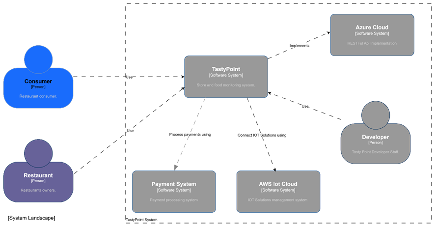{width="6.814166666666667in"
height="3.5490441819772527in"}

#### 4.1.3.2 Software Architecture Context Level Diagram {#software-architecture-context-level-diagram .unnumbered}

En este diagrama se plasma el contexto general que engloba nuestro
sistema TastyPoint. Aquí evidenciamos las relaciones de nuestro sistema
con otros así como con los segmentos objetivos.

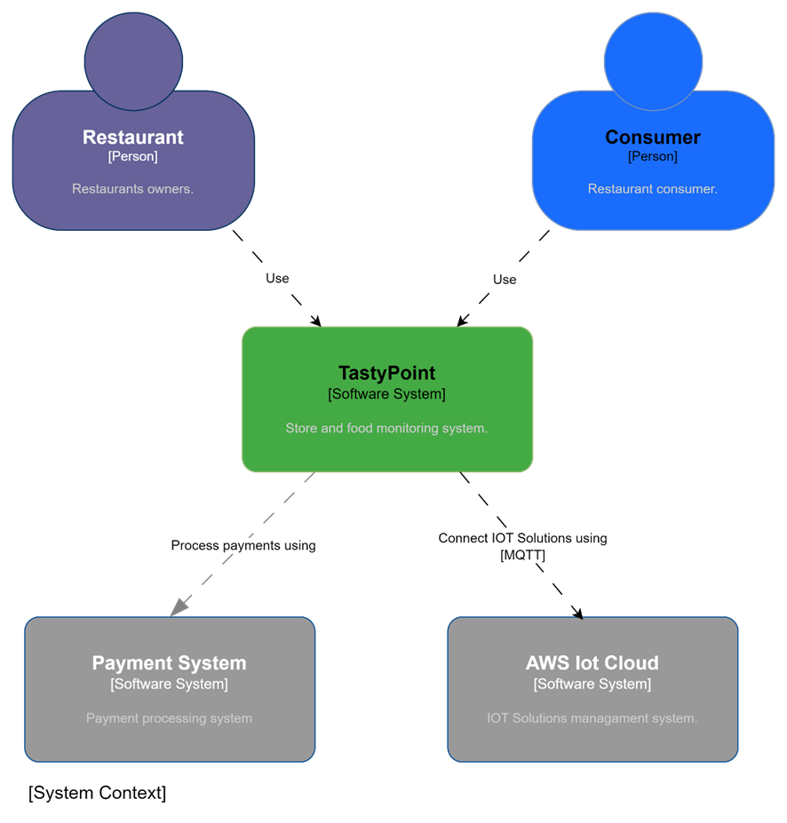{width="5.52252624671916in"
height="5.775190288713911in"}

#### 4.1.3.3 Software Architecture Container Level Diagram {#software-architecture-container-level-diagram .unnumbered}

En este diagrama se muestran los principales componentes de nuestro de
nuestro sistema (TastyPoint). Así como estos se relacionan con nuestros
segmentos objetivos y sistemas externos.

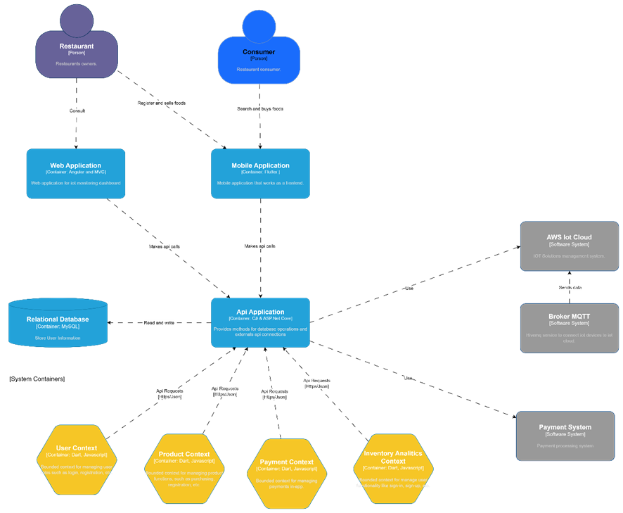{width="6.869593175853018in"
height="5.653103674540683in"}

#### 4.1.3.4 Software Architecture Deployment Diagrams {#software-architecture-deployment-diagrams .unnumbered}

En este diagrama se encuentran los componentes que son parte de la
arquitectura del despliegue de nuestra solución. Se puede verificar la
interacción que sucede entre los componentes desplegados y elementos que
usan los clientes para disfrutar del servicio.

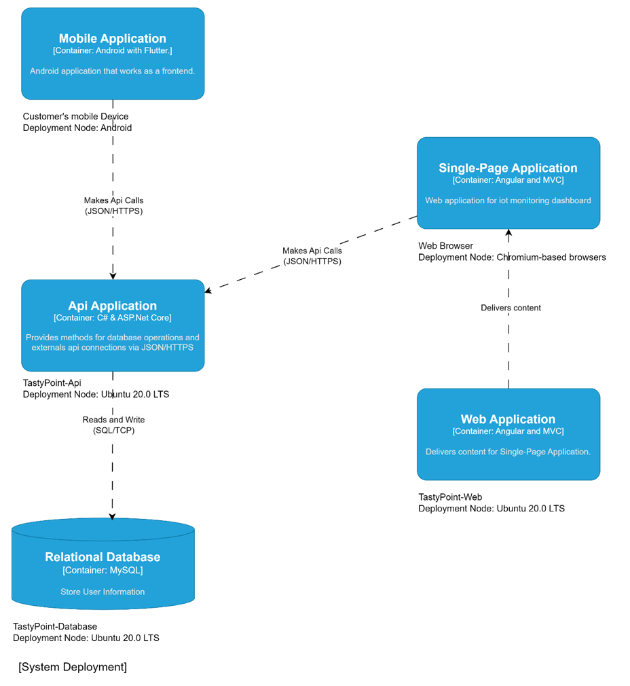{width="6.718359580052494in" height="7.3125in"}

## 4.2. Tactical-Level Domain-Driven Design {#tactical-level-domain-driven-design .unnumbered}

### 4.2.1. Bounded Context: User  {#bounded-context-user .unnumbered}

#### 4.2.1.1. Domain Layer. {#domain-layer. .unnumbered}

+-----------------------+---------------------+-----------------------+
| Nombre                | User                |                       |
+=======================+=====================+=======================+
| Categoría             | Entity              |                       |
+-----------------------+---------------------+-----------------------+
| Propósito             | Clase que           |                       |
|                       | representa un       |                       |
|                       | usuario. Contiene   |                       |
|                       | atributos como el   |                       |
|                       | nombre, la          |                       |
|                       | dirección y correo. |                       |
+-----------------------+---------------------+-----------------------+
| Relaciones            | -   One-to-One con  |                       |
|                       |     RestaurantOwner |                       |
|                       |                     |                       |
|                       | -   One-to-One con  |                       |
|                       |     Customer        |                       |
|                       |                     |                       |
|                       | -   One-to-Many con |                       |
|                       |     Warehouse: Un   |                       |
|                       |                     |                       |
|                       | > usuario           |                       |
|                       | > (Restaurant       |                       |
|                       | > Owner) puede      |                       |
|                       | > poseer            |                       |
|                       | >                   |                       |
|                       | > varios almacenes  |                       |
|                       | > para almacenar    |                       |
|                       | > comida            |                       |
+-----------------------+---------------------+-----------------------+
| Atributos             |                     |                       |
+-----------------------+---------------------+-----------------------+
| Nombre                | Tipo de dato        | Visibilidad           |
+-----------------------+---------------------+-----------------------+
| id                    | uuid                | private               |
+-----------------------+---------------------+-----------------------+
| username              | string              | private               |
+-----------------------+---------------------+-----------------------+
| phoneNumber           | string              | private               |
+-----------------------+---------------------+-----------------------+
| address               | string              | private               |
+-----------------------+---------------------+-----------------------+
| email                 | string              | private               |
+-----------------------+---------------------+-----------------------+
| userType              | enum                | private               |
+-----------------------+---------------------+-----------------------+
| Métodos               |                     |                       |
+-----------------------+---------------------+-----------------------+
| Nombre                | Tipo de retorno     | Visibilidad           |
+-----------------------+---------------------+-----------------------+
| addUser               | void                | public                |
+-----------------------+---------------------+-----------------------+
| getUserName           | string              | public                |
+-----------------------+---------------------+-----------------------+
| getAddress            | string              | public                |
+-----------------------+---------------------+-----------------------+
| getPhone              | string              | public                |
+-----------------------+---------------------+-----------------------+
| getEmail              | string              | public                |
+-----------------------+---------------------+-----------------------+
| getUserType           | enum                | public                |
+-----------------------+---------------------+-----------------------+
| authenticate          | boolean             | public                |
+-----------------------+---------------------+-----------------------+
| updateProfile         | void                | public                |
+-----------------------+---------------------+-----------------------+

  -------------------------------------------------------------------------
  Nombre                    RestaurantOwner        
  ------------------------- ---------------------- ------------------------
  Categoría                 Entity                 

  Propósito                 Clase que representa   
                            un usuario que posee   
                            un restaurante. Hereda 
                            de la clase User       

  Atributos                                        

  Nombre                    Tipo de dato           Visibilidad

  id                        uuid                   private

  restaurantName            string                 private

  Métodos                                          

  Nombre                    Tipo de retorno        Visibilidad

  getRestaurantName         string                 public

  updateRestaurantDetails   void                   public

  addMenuItem               void                   public

  addWarehouse              Vod                    public

  removeMenuItem            void                   public

  listMenuItems             List\[Item\]           public
  -------------------------------------------------------------------------

  ------------------------------------------------------------------------
  Nombre                   Consumer               
  ------------------------ ---------------------- ------------------------
  Categoría                Entity                 

  Propósito                Clase que representa   
                           un consumidor. Hereda  
                           de la clase User       

  Atributos                                       

  Nombre                   Tipo de dato           Visibilidad

  Cart                     List\[Item\]           private

  Métodos                                         

  Nombre                   Tipo de retorno        Visibilidad

  addToCart                void                   public

  removeFromCart           Void                   public

  ViewCart                 List\[Item\]           public

  checkout                 Order                  public
  ------------------------------------------------------------------------

Values Object

  ------------------------------------------------------------------------
  Nombre                   Item                   
  ------------------------ ---------------------- ------------------------
  Categoría                Value Object           

  Propósito                Manejo de valores de   
                           tipo Item              

  Atributos                                       

  Nombre                   Tipo de dato           Visibilidad

  itemId                   string                 private

  name                     string                 private

  description              string                 private

  price                    double                 private
  ------------------------------------------------------------------------

Aggregates

  ------------------------------------------------------------------------
  Nombre                   Order                  
  ------------------------ ---------------------- ------------------------
  Categoría                Aggregate              

  Propósito                Agrupar y gestionar la 
                           información            
                           relacionada con los    
                           pedidos realizados por 
                           los consumidores       

  Atributos                                       

  Nombre                   Tipo de dato           Visibilidad

  orderId                  String                 private

  userId                   String                 private

  ítems                    List\[Item\]           private

  totalPrice               double                 private

  Métodos                                         

  calculateTotalPrice      double                 public
  ------------------------------------------------------------------------

#### 4.2.1.2. Interface Layer. {#interface-layer. .unnumbered}

  -----------------------------------------------------------------------
  Nombre                  UserController          
  ----------------------- ----------------------- -----------------------
  Categoria               Controller              

  Proposito               Controlador encargado   
                          de manejar las          
                          solicitudes HTTP        
                          relacionadas con        
                          usuarios. Se comunica   
                          con la capa de          
                          servicios para procesar 
                          las solicitudes.        

  Nombre                  Tipo de retorno         Visibilidad

  Register                Promise                 Public

  UpdateUser              Promise                 Public

  DeleteUser              Promise                 Public

  Login                   User                    Public
  -----------------------------------------------------------------------

#### 4.2.1.3. Application Layer. {#application-layer. .unnumbered}

  -----------------------------------------------------------------------
  Event Handlers                      
  ----------------------------------- -----------------------------------
  Nombre                              Propósito

  VerifyEventHandler                  Notificar a un usuario cuando su
                                      cuenta se verifica
  -----------------------------------------------------------------------

  -----------------------------------------------------------------------
  Commands                            
  ----------------------------------- -----------------------------------
  Nombre                              Propósito

  AddMenuItemCommandHandler           Añadir una comida al menú

  RemoveMenuItemCommandHandler        Eliminar una comida del menú

  AddToCartCommandHandler             Añadir una comida al carrito de
                                      compras

  RemoveFromCartCommandHandler        Eliminar una comida del carrito de
                                      compras

  CheckoutCommandHandler              Confirmar la comprar
  -----------------------------------------------------------------------

  -----------------------------------------------------------------------
  Dto                                 
  ----------------------------------- -----------------------------------
  Nombre                              Propósito

  MenuItemSearchResponseDto           Data de respuesta de la búsqueda de
                                      un plato de comida
  -----------------------------------------------------------------------

  -----------------------------------------------------------------------
  Validator                           
  ----------------------------------- -----------------------------------
  Nombre                              Propósito

  MenuItemSearchValidator             Valida la búsqueda de un plato de
                                      comida
  -----------------------------------------------------------------------

#### 4.2.1.4. Infrastructure Layer. {#infrastructure-layer. .unnumbered}

  ------------------------------------------------------------------------
  Nombre           UserRepository                  
  ---------------- ------------------------------- -----------------------
  Categoría        Repository                      

  Propósito        Define la interfaz para el      
                   repositorio encargado de        
                   conservar y recuperar la        
                   información relacionada con los 
                   usuarios en la base de datos.   

  Métodos                                          

  Nombre           Tipo de retorno                 Visibilidad

  create           void                            public

  delete           void                            public

  edit             void                            public

  getById          User                            public
  ------------------------------------------------------------------------

  ------------------------------------------------------------------------
  Nombre           MenuItemRepository              
  ---------------- ------------------------------- -----------------------
  Categoría        Repository                      

  Propósito        Define la interfaz para el      
                   repositorio encargado de        
                   conservar y recuperar la        
                   información relacionada con la  
                   comida del menú                 

  Métodos                                          

  Nombre           Tipo de retorno                 Visibilidad

  create           void                            public

  delete           void                            public

  edit             void                            public

  getById          User                            public

  getAll           List\[Item\]                    public
  ------------------------------------------------------------------------

  ------------------------------------------------------------------------
  Nombre           OrderRepository                 
  ---------------- ------------------------------- -----------------------
  Categoría        Repository                      

  Propósito        Define la interfaz para el      
                   repositorio encargado de los    
                   conservar y recuperar datos del 
                   pedido                          

  Métodos                                          

  Nombre           Tipo de retorno                 Visibilidad

  create           void                            public

  delete           void                            public

  edit             void                            public

  getById          User                            public

  getAll           List\[Order\]                   public
  ------------------------------------------------------------------------

#### 4.2.1.6. Bounded Context Software Architecture Component Level Diagrams. {#bounded-context-software-architecture-component-level-diagrams. .unnumbered}

{width="6.9in"
height="5.844444444444444in"}

#### 4.2.1.7. Bounded Context Software Architecture Code Level Diagrams. {#bounded-context-software-architecture-code-level-diagrams. .unnumbered}

##### 4.2.1.7.1. Bounded Context Domain Layer Class Diagrams. {#bounded-context-domain-layer-class-diagrams. .unnumbered}

{width="6.416666666666667in"
height="8.291666666666666in"}

##### 4.2.1.7.2. Bounded Context Database Design Diagram. {#bounded-context-database-design-diagram. .unnumbered}

{width="5.492704505686789in"
height="5.544745188101487in"}

Link: <https://ibb.co/F75hsNf>

### 4.2.2. Bounded Context: Inventory Analitycs {#bounded-context-inventory-analitycs .unnumbered}

#### 4.2.2.1. Domain Layer. {#domain-layer.-1 .unnumbered}

  -------------------------------------------------------------------------------------------
  Nombre                            InventoryAnalitycs                   
  ----------------------- --------- ---------------------- ------------- --------------------
  Categoria                         Entity                               

  Proposito                         Clase que representa                 
                                    un inventario de                     
                                    productos. Contiene                  
                                    como el título,                      
                                    descripción, cantidad                
                                    de productos,                        
                                    temperatura, medición                
                                    de humedad y estado.                 

  Relaciones                        Many-to-One con Client               
                                    (RestaurantOwner): Un                
                                    usuario (Restaurant                  
                                    Owner) puede poseer                  
                                    varios análisis de                   
                                    inventarios                          

  Atributos                                                              

  Nombre                            Tipo de dato                         Visibilidad

  Title                             string                               private

  Description                       string                               private

  Num_products                      int                                  private

  Temperature                       string                               private

  Humidity                          string                               private

  State                             string                               private

  Métodos                                                                

  Nombre                  Tipo de                          Visibilidad   
                          retorno                                        

  AddInventoryAnalitycs   void                             public        

  GetTitle                string                           public        

  SetTitle                void                             public        

  GetDescription          String                           public        

  SetDescription          void                             public        

  GetNumProducts          Int                              public        

  SetNumProducts          void                             public        

  GetTemperature          string                           public        

  SetTemperature          void                             public        

  GetHumidity             string                           public        

  SetHumidity             void                             public        

  GetState                string                           public        

  SetState                void                             public        

                                                                         
  -------------------------------------------------------------------------------------------

  ---------------------------------------------------------------------------
  Nombre                   InventoryAnalitycsService    
  ------------------------ ---------------------------- ---------------------
  Categoria                Service                      

  Proposito                Define la interfaz para el   
                           servicio encargado de        
                           manejar la lógica de negocio 
                           relacionada con el análisis  
                           de inventario de productos.  

  Metodos                                               

  Nombre                   Tipo de retorno              Visibilidad

  ListById                 InventoryAnalitycs           public

  ListAll                  InventoryAnalitycs           public

  Create                   InventoryAnalitycsResponse   public

  Update                   InventoryAnalitycsResponse   public

  Delete                   InventoryAnalitycsResponse   public
  ---------------------------------------------------------------------------

#### 4.2.2.2. Interface Layer. {#interface-layer.-1 .unnumbered}

  -------------------------------------------------------------------------------
  Nombre                     InventoryAnalitycsController   
  -------------------------- ------------------------------ ---------------------
  Categoria                  Controller                     

  Proposito                  Controlador encargado de       
                             manejar las solicitudes HTTP   
                             relacionadas con el análisis   
                             de inventarios. Se comunica    
                             con la capa de servicios para  
                             procesar las solicitudes.      

  Nombre                     Tipo de retorno                Visibilidad

  GetAllInventoryAnalitycs   Promise                        public

  PostInventoryAnalitycs     Promise                        public

  UpdateInventoryAnalitycs   Promise                        public

  DeleteInventoryAnalitycs   Promise                        public
  -------------------------------------------------------------------------------

#### 4.2.2.3. Application Layer. {#application-layer.-1 .unnumbered}

  -----------------------------------------------------------------------
  Nombre                   InventoryAnalitycsHandler
  ------------------------ ----------------------------------------------
  Categoria                Event Handler

  Proposito                Validar los datos del análisis de inventario.
  -----------------------------------------------------------------------

#### 4.2.2.4. Infrastructure Layer. {#infrastructure-layer.-1 .unnumbered}

  -----------------------------------------------------------------------------
  Nombre                   InventoryAnalitycsRepository   
  ------------------------ ------------------------------ ---------------------
  Categoria                Repository                     

  Proposito                Define la interfaz para el     
                           repositorio encargado de       
                           acceder y manipular la         
                           información relacionada con    
                           los análisis de inventario en  
                           la base de datos.              

  Metodos                                                 

  Nombre                   Tipo de retorno                Visibilidad

  create                   void                           public

  delete                   void                           public

  edit                     void                           public

  getById                  InventoryAnalitycs             public

  GetAll                   Array\<InventoryAnalitycs\>    public
  -----------------------------------------------------------------------------

#### 4.2.2.6. Bounded Context Software Architecture Component Level Diagrams.  {#bounded-context-software-architecture-component-level-diagrams.-1 .unnumbered}

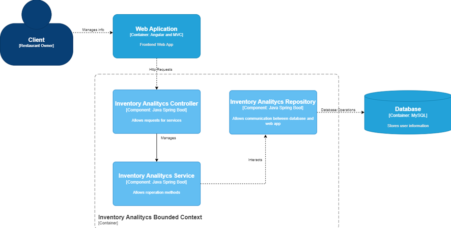{width="5.0in" height="2.53125in"}

#### 4.2.2.7. Bounded Context Software Architecture Code Level Diagrams. {#bounded-context-software-architecture-code-level-diagrams.-1 .unnumbered}

##### 4.2.2.7.1. Bounded Context Domain Layer Class Diagrams {#bounded-context-domain-layer-class-diagrams .unnumbered}

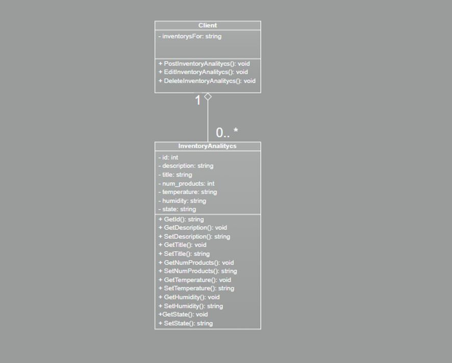{width="5.0in" height="4.020833333333333in"}

##### 4.2.2.7.2. Bounded Context Database Design Diagram. {#bounded-context-database-design-diagram.-1 .unnumbered}

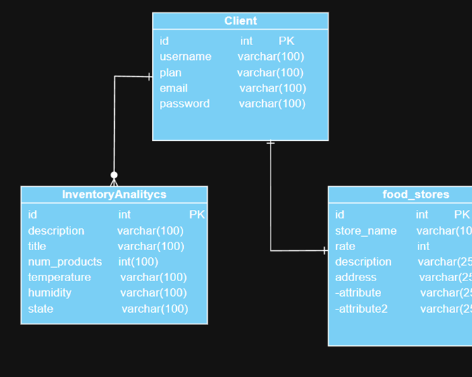{width="5.0in" height="3.9895833333333335in"}

### 4.2.3. Bounded Context: Payment  {#bounded-context-payment .unnumbered}

#### 4.2.3.1. Domain Layer.  {#domain-layer.-2 .unnumbered}

  -----------------------------------------------------------------------------------------------
  Nombre                              Cart                                  
  ------------------------ ---------- ---------------------- -------------- ---------------------
  Categoria                           Entity                                

  Proposito                           Clase que representa                  
                                      el carrito de compras                 
                                      de la aplicación.                     

  Atributos                                                                  

  Nombre                              Tipo de dato                          Visibilidad 

  cartId                              int                                   private 

  productName                         string                                private 

  productDescription                  string                                private 

  productPrice                        int                                   private 

  productQuantity                     int                                   private 

  totalPrice                          int                                   private 

  Métodos                                                                   

  Nombre                   Tipo de                           Visibilidad    
                           retorno                                          

  getCartId                int                               public         

  getProductName           string                            public         

  getProductDescription    string                            public         

  getProductPrice          int                               public         

  getProductQuantity       int                               public         

  setProductQuantity       void                              public         

  getTotalPrice            int                               public         

  setTotalPrice            void                              public         
  -----------------------------------------------------------------------------------------------

 

  ---------------------------------------------------------------------------------
  Nombre                             CartService            
  ----------------------- ---------- ---------------------- -----------------------
  Categoria                          Entity                 

  Proposito                          Define la interfaz     
                                     para el servicio       
                                     encargado del carrito  
                                     de compras de la       
                                     aplicación.            

  Métodos                                                   

  Nombre                  Tipo de                           Visibilidad 
                          retorno                           

  addProduct              void                              public 

  removeProduct           void                              public 

  decreaseQuantity        void                              public 

  updateQuantity          void                              public 

  createCart              void                              public 
  ---------------------------------------------------------------------------------

 

 

 

  ----------------------------------------------------------------------------------------------
  Nombre                             Purchase                              
  ----------------------- ---------- ---------------------- -------------- ---------------------
  Categoria                          Entity                                

  Proposito                          Clase que representa                  
                                     el apartado de pago                   
                                     del producto.                         

  Atributos                                                                 

  Nombre                             Tipo de dato                          Visibilidad 

  paymentId                          int                                   private 

  cartId                             int                                   private 

  paymentAmount                      int                                   private 

  currency                           string                                private 

  paymentStatus                      string                                private 

  customerId                         string                                private 

  Métodos                                                                  

  Nombre                  Tipo de                           Visibilidad    
                          retorno                                          

  getPaymentId()          int                               public         

  getCartId()             int                               public         

  getPaymentAmount()      int                               public         

  getCurrency()           string                            public         

  getPaymentStatus()      string                            public         

  getCustomerId()         string                            public         

  processPayment()        boolean                           public         
  ----------------------------------------------------------------------------------------------

 

  ---------------------------------------------------------------------------------------
  Nombre                                   PurchaseService        
  ----------------------- ---------------- ---------------------- -----------------------
  Categoria                                Entity                 

  Proposito                                Define la interfaz     
                                           para el servicio de    
                                           pago de compras de la  
                                           aplicación.            

  Métodos                                                         

  Nombre                  Tipo de retorno                         Visibilidad 

  createPayment()         StripePayment                           public 

  initiatePayment()       PaymentIntent                           public 

  confirmPayment()        boolean                                 public 

  refundPayment()         boolean                                 public 

  retrievePayment()       StripePayment                           public 
  ---------------------------------------------------------------------------------------

 

 

#### 4.2.3.2. Interface Layer.  {#interface-layer.-2 .unnumbered}

  ------------------------------------------------------------------------------------
  Nombre                                CartPaymentController    
  ------------------------------------- ------------------------ ---------------------
  Categoria                             Controller               

  Proposito                             Controlador encargado de 
                                        manejar las solicitudes  
                                        HTTP relacionadas con el 
                                        pago del carrito.        

  Nombre                                Tipo de retorno          Visibilidad 

  getAllCarts()                         Promise                  public 

  getCartById(cartId: int)              Promise                  public 

  createCart(cartData: CartData)        Promise                  public 

  updateCart(cartId: int, cartData:     Promise                  public 
  CartData)                                                      

  deleteCart(cartId: int)               Promise                  public 

  getAllPurchases()                     Promise                  public 

  getPurchaseById(purchaseId: int)      Promise                  public 

  createPurchase(purchaseData:          Promise                  public 
  PurchaseData)                                                  

  updatePurchase(purchaseId: int,       Promise                  public 
  purchaseData: PurchaseData)                                    

  deletePurchase(purchaseId: int)       Promise                  public 
  ------------------------------------------------------------------------------------

 

#### 4.2.3.3. Application Layer.  {#application-layer.-2 .unnumbered}

  -----------------------------------------------------------------------
  Nombre                   CartPaymentHandler 
  ------------------------ ----------------------------------------------
  Categoria                Event Handler 

  Proposito                Validar los datos relacionados con carritos y
                           compras, y manejar eventos relacionados con
                           ellos. 
  -----------------------------------------------------------------------

 

#### 4.2.3.4. Infrastructure Layer.  {#infrastructure-layer.-2 .unnumbered}

  --------------------------------------------------------------------------------
  Nombre                                CartPaymentRepository    
  ------------------------------------- ------------------------ -----------------
  Categoria                             Repository               

  Proposito                             Define la interfaz para  
                                        el repositorio encargado 
                                        de acceder y manipular   
                                        la información           
                                        relacionada con los      
                                        pagos del carrito.       

  Metodos                                                         

  Nombre                                Tipo de retorno          Visibilidad 

  createCart(cartData: CartData)        void                     public 

  updateCart(cartId: int, cartData:     void                     public 
  CartData)                                                      

  deleteCart(cartId: int)               void                     public 

  getCartById(cartId: int)              Cart                     public 

  getAllCarts()                         Array\<Cart\>            public 

  createPurchase(purchaseData:          void                     public 
  PurchaseData)                                                  

  updatePurchase(purchaseId: int,       void                     public 
  purchaseData: PurchaseData)                                    

  deletePurchase(purchaseId: int)       void                     public 

  getPurchaseById(purchaseId: int)      Purchase                 public 

  getAllPurchases()                     Array\<Purchase\>        public 
  --------------------------------------------------------------------------------

 

#### 4.2.3.6. Bounded Context Software Architecture Component Level Diagrams.  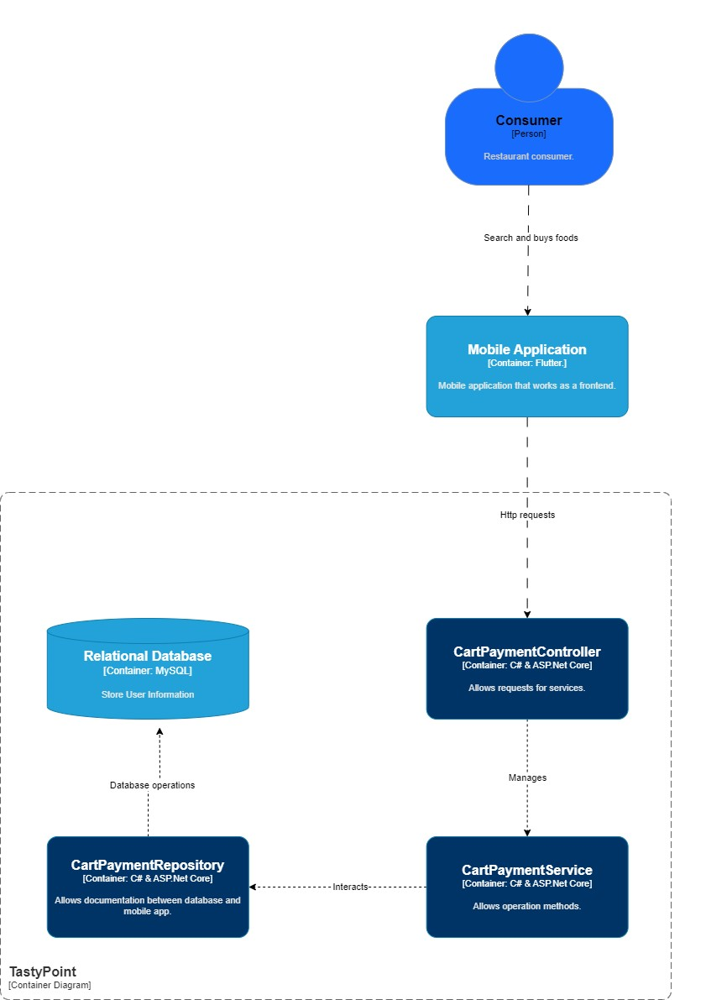{width="5.707300962379702in" height="8.089363517060367in"}  {#bounded-context-software-architecture-component-level-diagrams.-diagrama-descripción-generada-automáticamente .unnumbered}

 

#### 4.2.3.7. Bounded Context Software Architecture Code Level Diagrams.  {#bounded-context-software-architecture-code-level-diagrams.-2 .unnumbered}

##### 4.2.3.7.1. Bounded Context Domain Layer Class Diagrams  {#bounded-context-domain-layer-class-diagrams-1 .unnumbered}

 

{width="6.9in"
height="6.738888888888889in"} 

 

 

 

##### 4.2.3.7.2. Bounded Context Database Design Diagram.  {#bounded-context-database-design-diagram.-2 .unnumbered}

{width="6.24375in"
height="4.051388888888889in"} 

 

 

### 4.2.1. Bounded Context: Products {#bounded-context-products .unnumbered}

#### 4.2.1.1. Domain Layer.  {#domain-layer.-3 .unnumbered}

  ----------------------------------------------------------------------------------------------
  Nombre                             Product                               
  ----------------------- ---------- ---------------------- -------------- ---------------------
  Categoria                          Entity                                

  Proposito                          Clase que representa                  
                                     un producto, el cual                  
                                     fue registrado por un                 
                                     cliente y puede ser                   
                                     seleccionado por un                   
                                     consumidor.                           

  Atributos                                                                 

  Nombre                             Tipo de dato                          Visibilidad 

  Name                               string                                private 

  Description                        string                                private 

  Quantity                           int                                   private 

  Price                              float                                 private 

  Discount                           float                                 private 

  State                              string                                private 

  Métodos                                                                  

  Nombre                  Tipo de                           Visibilidad    
                          retorno                                          

  AddProduct              void                              public         

  GetName                 string                            public         

  SetName                 void                              public         

  GetDescription          String                            public         

  SetDescription          void                              public         

  GetQuantity             Int                               public         

  SetQuantity             void                              public         

  GetPrice                string                            public         

  SetPrice                void                              public         

  GetDiscount             string                            public         

  SetDiscount             void                              public         

  GetState                string                            public         

  SetState                void                              public         
  ----------------------------------------------------------------------------------------------

 

  ------------------------------------------------------------------------
  Nombre                   ProductService            
  ------------------------ ------------------------- ---------------------
  Categoria                Service                   

  Proposito                Define la interfaz para   
                           el servicio encargado de  
                           manejar la lógica de      
                           negocio relacionada con   
                           los productos.            

  Metodos                                             

  Nombre                   Tipo de retorno           Visibilidad 

  ListById                 Product                   public 

  ListAll                  Array\<Product\>          public 

  Create                   productResponse           public 

  Update                   ProductResponse           public 

  Delete                   ProductResponse           public 

                                                     
  ------------------------------------------------------------------------

 

 

 

#### 4.2.1.2. Interface Layer.  {#interface-layer.-3 .unnumbered}

  ------------------------------------------------------------------------
  Nombre                   ProdutController          
  ------------------------ ------------------------- ---------------------
  Categoria                Controller                

  Proposito                Controlador encargado de  
                           manejar las solicitudes   
                           HTTP relacionadas con los 
                           productos. Se comunica    
                           con la capa de servicios  
                           para procesar las         
                           solicitudes.              

  Nombre                   Tipo de retorno           Visibilidad 

  GetAllProducts           Promise                   public 

  PostProduct              Promise                   public 

  UpdateProduct            Promise                   public  

  DeleteProduct            Promise                   public 
  ------------------------------------------------------------------------

 

#### 4.2.2.3. Application Layer.  {#application-layer.-3 .unnumbered}

  -----------------------------------------------------------------------
  Nombre                   ProductsHandler 
  ------------------------ ----------------------------------------------
  Categoria                Event Handler 

  Proposito                Validar los datos del análisis de inventario. 
  -----------------------------------------------------------------------

 

#### 4.2.3.4. Infrastructure Layer.  {#infrastructure-layer.-3 .unnumbered}

  ------------------------------------------------------------------------
  Nombre                   ProductRepository         
  ------------------------ ------------------------- ---------------------
  Categoria                Repository                

  Proposito                Define la interfaz para   
                           el repositorio encargado  
                           de acceder y manipular la 
                           información relacionada   
                           con los productos en la   
                           base de datos.            

  Metodos                                             

  Nombre                   Tipo de retorno           Visibilidad 

  create                   void                      public 

  delete                   void                      public 

  edit                     void                      public 

  getById                  Product                   public 

  GetAll                   Array\<Product\>          public 
  ------------------------------------------------------------------------

 

 

 

 

 

 

 

 

 

 

 

#### 4.2.4.6. Bounded Context Software Architecture Component Level Diagrams.   {#bounded-context-software-architecture-component-level-diagrams.-2 .unnumbered}

{width="6.485417760279965in"
height="3.8843744531933506in"}

#### 4.2.5.7. Bounded Context Software Architecture Code Level Diagrams.  {#bounded-context-software-architecture-code-level-diagrams.-3 .unnumbered}

##### 4.2.5.7.1. Bounded Context Domain Layer Class Diagrams  {#bounded-context-domain-layer-class-diagrams-2 .unnumbered}

{width="2.0416666666666665in"
height="4.5625in"} 

 

 

##### 4.2.5.7.2. Bounded Context Database Design Diagram.  {#bounded-context-database-design-diagram.-3 .unnumbered}

 {width="2.6041666666666665in"
height="3.6666666666666665in"}

 

# Solution UI/UX Design {#solution-uiux-design .unnumbered}

## 5.1. Style Guidelines. {#style-guidelines. .unnumbered}

### 5.1.1. General Style Guidelines. {#general-style-guidelines. .unnumbered}

Una Brand Style Guide es necesaria para todo tipo de empresa, ya que
este es el pilar que mantendrá en pie la interfaz de usuario de las
aplicaciones en las cuales ofrecen sus servicios. Del mismo modo, esta
permite que se presente una comunicación consistente en el entorno de
una empresa.

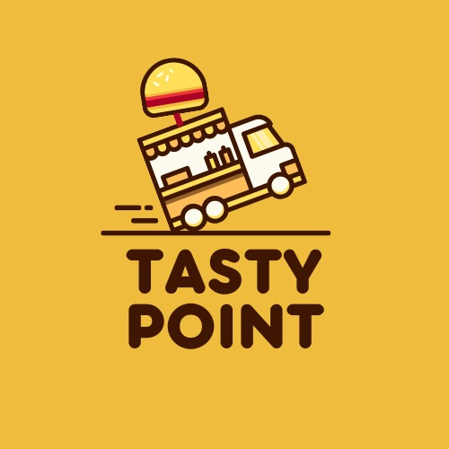{width="3.4625in"
height="3.4625in"}**Brand:**Primero, es necesario recalcar nuestras 2
intenciones al crear la marca: Evitar el desperdicio de comida, y
distribuir comida buena y barata.

Al fusionar estas 2 ideas, conseguimos Tasty point (algo como los
Recycling Points/puntos de reciclaje). Un punto al que cualquiera puede
acceder, donde puedes obtener buena comida y además ayudar al medio
ambiente combatiendo el desperdicio de alimentos.

Nuestro punto es\... hay buena comida aquí. ¡Ven a conseguirla!

En TastyPoint, basaremos nuestro Brand Style Guide en una plantilla que
se encuentra disponible en
[Figma](https://www.figma.com/file/kONwPzELBo1K7jPOZF3LpL/TastyPoint-General-Style-Guidelines?type=design&mode=design&t=hgbPfpeFWcCo3MCY-1)
. Para la elaboración de este vamos a considerar 5 elementos esenciales:

**Misión**: Facilitar a las personas el acceso a los alimentos de forma
sostenible. Creemos que todos merecen tener acceso a alimentos
nutritivos y estamos trabajando para que sea una realidad.

**Visión**: Promover una cultura de consumo responsable y eficaz.
Queremos mostrarle al mundo que es posible comer comida deliciosa sin
desperdiciar recursos. También estamos comprometidos con el apoyo al
comercio local y la promoción de la gastronomía peruana.

**Público objetivo:**

Dueños de restaurantes, los cuales se registrarán en nuestra plataforma
para monitorear y generar reportes acerca la temperatura del almacén de
su restaurante y ingresar productos para saber sobre el estado actual de
estos. Asimismo, el sistema les brindara la opción de automatizar la
refrigeración del almacén cuando se requiera. Consumidores quienes
buscan comida a un mejor costo en nuestra aplicación móvil.

**Personalidad de la marca:** Nuestra marca es amistosa, dedicada y
transparente.

**Valores fundamentales:**

-   Confianza, lealtad, perseverancia y empatía. El deseo por mejorar y
    ofrecer un mejor servicio cada día.

-   Dimensiones del tono de comunicación y lenguaje aplicado tomando en
    cuenta que nuestro público objetivo son tanto dueños de restaurantes
    como consumidores el tono debe ser amigable, formal, respetuoso y
    entusiasta con el objetivo de que nuestros clientes se sientan
    confiados y seguros del servicio brindado. Asimismo, consideramos
    que el lenguaje aplicado será en tercera persona y en inglés y
    castellano neutro para llegar a empresas de diferentes países del
    mundo.

-   Con el tono elegido esperamos transmitir confianza, lealtad y
    empatía, no solo con nuestros clientes (dueño de restaurante y
    consumidor) sino también con la causa por la que ofrecemos nuestro
    servicio que es garantizar la venta y adquisición de alimentos de
    calidad y de bajo costo. Del mismo modo, buscaremos lograr la
    seguridad de nuestros usuarios al contar con reseñas, testimonios o
    historias de clientes satisfechos con el servicio de TastyPoint.

-   Las palabras banderas de nuestra marca serán las siguientes:
    confiable, seguro, novedoso.

Colors

El color principal de la marca es el Amarillo (Meat Brown): Este
representa la vitalidad y confiabilidad que queremos representar para
nuestros clientes.

{width="6.9in"
height="5.0777777777777775in"}

Typography

**Títulos #1: Secular one**

Esta fuente creada por Michal Sahar es un diseño "simple pero no
neutral", amable pero no demasiado estilizado, y no excesivamente
directo. Es una fuente fácil de leer por el espaciado entre letras y el
grosor que la caracteriza.

**Títulos #2: Montserrat**

Montserrat es una tipografía agradable de leer y fue elegida por su gran
legibilidad en tamaños pequeños.

**Párrafos: Montserrat**

Es una tipografía neutral pero amigable, también cuenta con varios
estilos, lo que la hace una fuente versátil. Además, ya que fue
optimizada para la interfaz móvil, cuenta con una excelente legibilidad.

{width="4.703877952755906in"
height="3.3451695100612424in"}

{width="4.9139523184601925in"
height="3.4945636482939633in"}

**Botones: Montserrat**

B1: Montserrat 20 px.

B2: Montserrat, 15 px.

Spacing

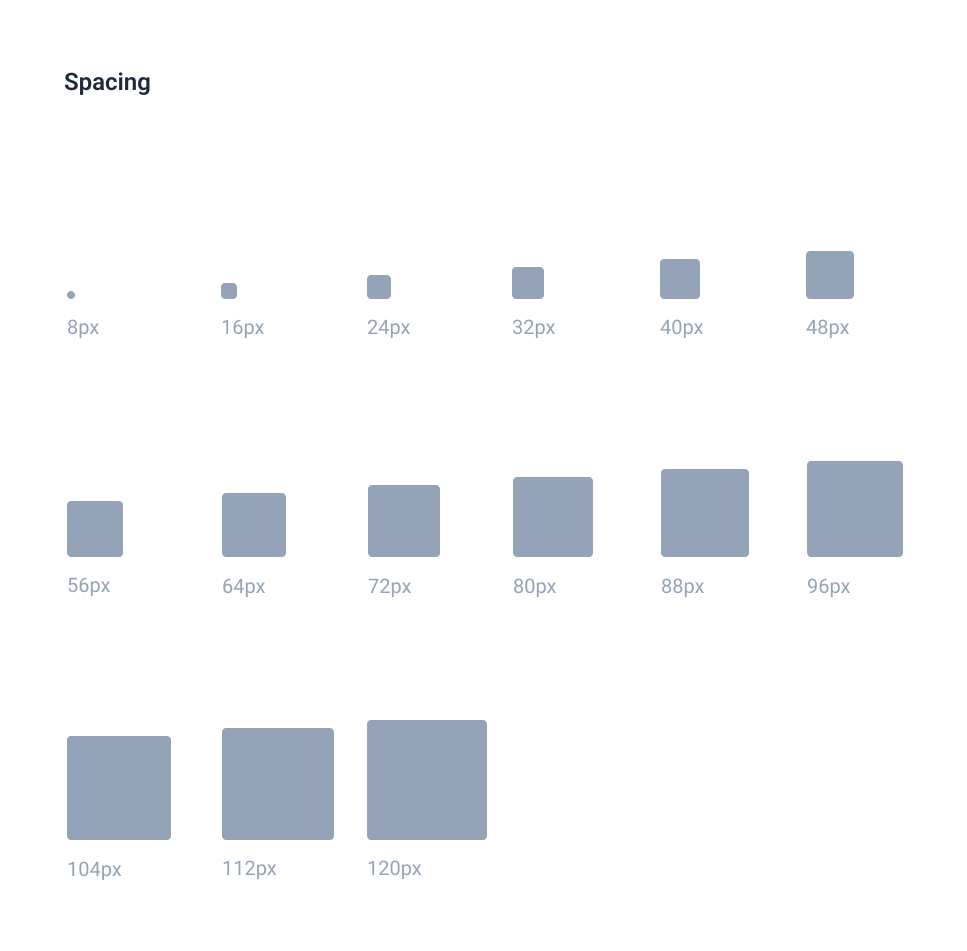{width="4.860464785651794in"
height="4.7802395013123355in"}

{width="5.145833333333333in"
height="3.3881944444444443in"}Nuestra aplicación web usará el Patrón en
Z:

### 5.1.2. Web, Mobile and IoT Style Guidelines. {#web-mobile-and-iot-style-guidelines. .unnumbered}

La interfaz de usuario con la van a interactuar nuestros usuarios es
importante, por lo que su diseño debe tener en cuenta múltiples
parámetros para una gran experiencia.

**Diseño Responsivo**

Una técnica esencial en el desarrollo web moderno que se centra en crear
sitios web y aplicaciones que se adapten de manera inteligente a
diferentes tamaños de pantalla y dispositivos. Esta técnica tiene
múltiples ventajas, una de las principales es que proporciona una
experiencia de usuario coherente y atractiva en todos los dispositivos.
Los elementos de la interfaz se reorganizan y redimensionan
automáticamente para adaptarse al espacio disponible, lo que garantiza
que los usuarios puedan acceder al contenido de manera eficiente sin
necesidad de hacer zoom o desplazarse horizontalmente. Esta técnica no
solo es aplicable al desarrollo de soluciones web sino también a
soluciones móviles, puesto que los dispositivos móviles vienen en una
amplia variedad de tamaños de pantalla, desde teléfonos pequeños hasta
tabletas más grandes. Por eso, el diseño debe ser adaptable y sensible a
diferentes resoluciones y tamaños de pantalla.

{width="6.9in" height="3.7256944444444446in"}\
*Responsive Design*

Para nuestra solución web podremos aplicar esta técnica utilizando el
Framework de desarrollo Web Angular y sus componentes que cumplen con
Material Design, Angular Material. Y en nuestra solución móvil, Flutter
SDK nos permitirá hacerlo sin necesidad de cambios complicados.

**Gráficos (IoT)**

En el contexto del Internet de las cosas (IoT), los gráficos desempeñan
un papel crucial en la comunicación visual y la comprensión de datos.
Los iconos gráficos se utilizan para visualizar datos recopilados por
dispositivos IoT y proporcionar información significativa a los
usuarios.

{width="6.9in" height="4.271527777777778in"}\
*IoT Temperature Report Graphic*

Nuestra solución web se encargará de mostrar a nuestros usuarios un
dashboard con un grafico de reporte de las temperaturas de sus
productos.

**Gestos táctiles (Mobile)**

En una solución móvil, se debe priorizar la facilidad de uso a través de
gestos táctiles intuitivos. Esto incluye la capacidad de deslizar,
tocar, pellizcar y hacer zoom de manera natural para interactuar con la
aplicación. Se deben implementar gestos de manera coherente y predecible
para garantizar una experiencia fluida y sin confusiones para los
usuarios.

{width="5.364583333333333in"
height="5.364583333333333in"}\
*Mobile Gestures*

### 5.2. Information Architecture. {#information-architecture. .unnumbered}

#### 5.2.1. Organization Systems. {#organization-systems. .unnumbered}

**Landing page:**

En el landing page se organizará el contenido de forma jerárquica.
Mostrando primero una breve descripción de Tasty Point y luego
ramificando las entradas para los 2 públicos objetivos a los que
queremos llegar.

**App móvil:**

En la aplicación móvil, se mostrarán los platos ordenados por tópicos,
desde el más popular, hasta el menos popular.

La aplicación también contará con opciones para cambiar el orden en que
se presentan los productos. Por ejemplo: Ordenado por fechas: del más
reciente al más antiguo, ordenado por fechas: del más antiguo al más
reciente, ordenado en orden alfabético: a -- z, ordenado en orden
alfabético: z -- a, etc

#### 5.2.2. Labeling Systems. {#labeling-systems. .unnumbered}

**Landing page:**

En el encabezado del landing page se emplean las etiquetas de "Home",
"About us", "Features", "Pricing" y el botón "Sign up"; que direccionan
al usuario a la sección elegida de la single page application o
aplicación móvil.

También se emplearon los botones: "Customers" y "Business".

Que direccionan a los usuarios a la sección de la página destinada para
ellos.

**App web:**

En la aplicación móvil se mostrarán las secciones en una barra lateral a
la izquierda de la pantalla. Estas direccionarán a la sección que busque
el usuario.

#### 5.2.3. SEO Tags and Meta Tags {#seo-tags-and-meta-tags .unnumbered}

**Landing page:**

Título: Tasty Point: The best way to help reduce food waste in Peru.

Description: With Tasty Point, you can help fight food waste. We have
different environments according to the segment to which it belongs.

Keywords: "comida", "medio ambiente", "comida económica", "ofertas de
comida", "aplicación web", "desperdicio de comida", "bajo presupuesto",
"ahorro", "comida rápida", "rico y económico".

Author: Outsiders

**App móvil:**

Título: Tasty Point

Description: Tasty Point's app móvil. Buy tasty food and help reduce
food waste.

Keywords: "App móvil", "comida", "medio ambiente", "comida económica",
"ofertas de comida", "aplicación web", "desperdicio de comida", "bajo
presupuesto", "ahorro", "comida rápida", "rico y económico".

#### 5.2.4. Searching Systems. {#searching-systems. .unnumbered}

La aplicación móvil de Tasty point contará con filtros al presentar los
platos del día. Filtros como:

\- Tipo de comida.

\- Nombre del Restaurante/Local de comida.

\- Precios.

Además, los platos se presentarán por defecto en orden de popularidad.
Sin embargo, los usuarios también podrán elegir su orden de presentación
preferido, como: Ordenado por fechas: del más reciente al más antiguo,
ordenado por fechas: del más antiguo al más reciente, ordenado en orden
alfabético: a -- z, ordenado en orden alfabético: z -- a, etc.

Como adicional, las opciones de platos disponibles tendrán un color
distinguible a los ojos del usuario.

#### 5.2.5. Navigation Systems. {#navigation-systems. .unnumbered}

**Landing page:**

Se usa un menú de navegación fija. De manera que, aunque el usuario haya
elegido una opción a seguir, el menú siempre permanecerá a su
disposición.

También incluye un pie de página para enlazar secciones pertinentes del
Landing page.

**App Móvil:**

Se incluye una barra lateral para mostrar las opciones que el usuario
puede elegir, opciones como: \"Inicio\", \"Agregar\", \"Catálogo\",
\"Reservaciones actuales\", \"Más información\", etc.

## 5.3. Landing Page UI Design. {#landing-page-ui-design. .unnumbered}

### 5.3.1. Landing Page Wireframe. {#landing-page-wireframe. .unnumbered}

A continuación, se mostrará el diseño del landing page de Tasty Point en
un modelo de tipo Wireframe. Para un mayor detalle, se puede visualizar
en
[Figma](https://www.figma.com/file/ZQ67XEsVMRaEnu6W0mBOcV/Tasty-Point-Landing-Page?type=design&node-id=0-1&mode=design). 

{width="6.344635826771653in"
height="4.521464348206474in"}\
*Tasty Point Landing Page Wireframe, Screenshoot.*

El objetivo de este diseño es dar un primer vistazo al landing page de
Tasty Point, que ofrecerá a nuestros usuarios información sobre Tasty
Point.

### 5.3.2. Landing Page Mock-up. {#landing-page-mock-up. .unnumbered}

A continuación, se muestra el diseño del landing page de Tasty Point en
un modelo de tipo Wireframe. Para un mayor detalle, se puede visualizar
en
[Figma](https://www.figma.com/file/ZQ67XEsVMRaEnu6W0mBOcV/Tasty-Point-Landing-Page?type=design&node-id=1-1049&mode=design).

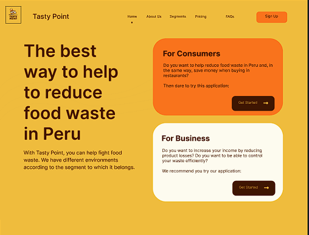{width="5.807659667541557in"
height="4.424339457567804in"}\
*Tasty Point Landing Page Mock-up, Screenshoot*

El objetivo de este diseño es mostrar el cómo verá nuestros usuarios el
landing page de Tasty Point.

## 5.4. Applications UX/UI Design (Web) {#applications-uxui-design-web .unnumbered}

### 5.4.1. Applications Wireframes. {#applications-wireframes. .unnumbered}

Mobile Wireframes:

Pantallas de inicio session y registro.

{width="6.9in"
height="2.504166666666667in"}

Pantallas de panel de control de productos.

{width="6.9in"
height="4.632638888888889in"}

Pantallas de monitoreo de temperatura, reporte y configuración de cuenta
y dispositivo IoT.

{width="6.9in"
height="5.111805555555556in"}

Páginas de error

{width="6.9in"
height="1.4881944444444444in"}

Enlace:
[Wireframes](https://www.figma.com/file/sNpzJHISWKt8WkWVwcPceo/TastyPoint-Web-Application---Wireframes?type=design&node-id=0%3A1&mode=design&t=y8QUMhOAJeiCe34R-1)

Mobile Wireframes:

{width="4.8375in"
height="6.590972222222222in"}

1.  

{width="4.95625in"
height="7.114583333333333in"}\
{width="6.230036089238845in"
height="8.730384951881016in"}

### 5.4.2. Applications Wireflow Diagrams. {#applications-wireflow-diagrams. .unnumbered}

Los diagramas de wireflow son una combinación de diagramas de flujo y
bocetos de interfaz de usuario que muestran los cambios visuales que
ocurren cuando los usuarios interactúan con nuestros productos. Con los
diagramas de wireflow se puede visualizer cómo un usuario realiza una
tarea, presentar el diseño esencial para una aplicación móvil y hacer
bocetos sencillos de pantalla para cada paso de un proceso. A
continuación los pasos para realizar una tarea se especifican en el
wireflow.

Tarea: Registro

{width="6.9in"
height="5.445138888888889in"}

Tarea: Inicio sesión

{width="5.105873797025372in"
height="4.0673293963254595in"}

Tarea: Crear producto

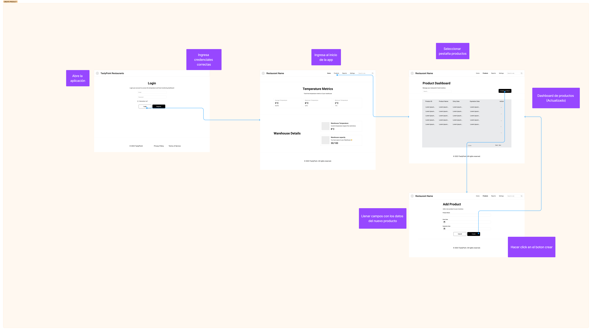{width="6.900099518810149in"
height="3.8674168853893263in"}

Tarea: Actualizar producto

{width="6.834163385826772in"
height="3.6186122047244096in"}

Tarea: Visualizar reporte

{width="6.833858267716535in"
height="3.7580719597550307in"}

Tarea: Ver métricas de temperatura

{width="4.569444444444445in"
height="3.7944444444444443in"}

Enlace: [Wireflow
diagram](https://www.figma.com/file/WqnMxr3cdR3MlmC8oEGXKv/TastyPoint-Web-Application---Wireflow?type=whiteboard&node-id=0%3A1&t=Vr5xX8DjQOF6HM18-1)

### 5.4.2. Applications Mock-ups. {#applications-mock-ups. .unnumbered}

Link del Figma:
<https://www.figma.com/file/ovsgmV9IY5qjDwlaMwa0Fm/TastyPoint-Web-Application---Mock-up?type=design&node-id=0%3A1&mode=design&t=5arj99fXICAjVFxl-1>

Login

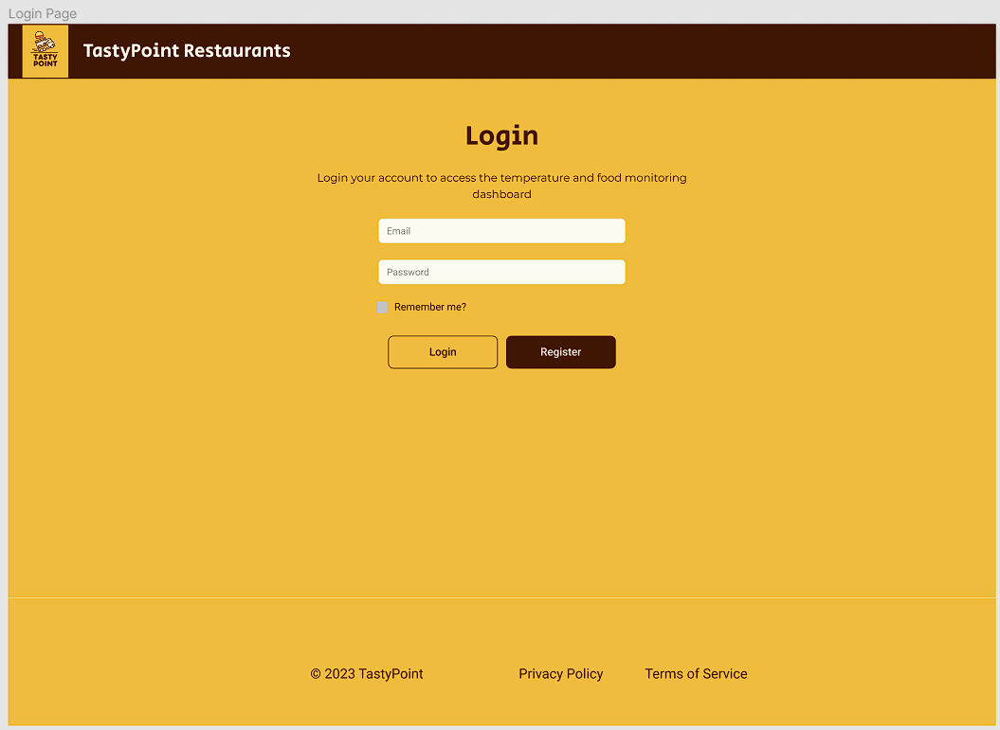{width="5.0in" height="3.65625in"}

Register

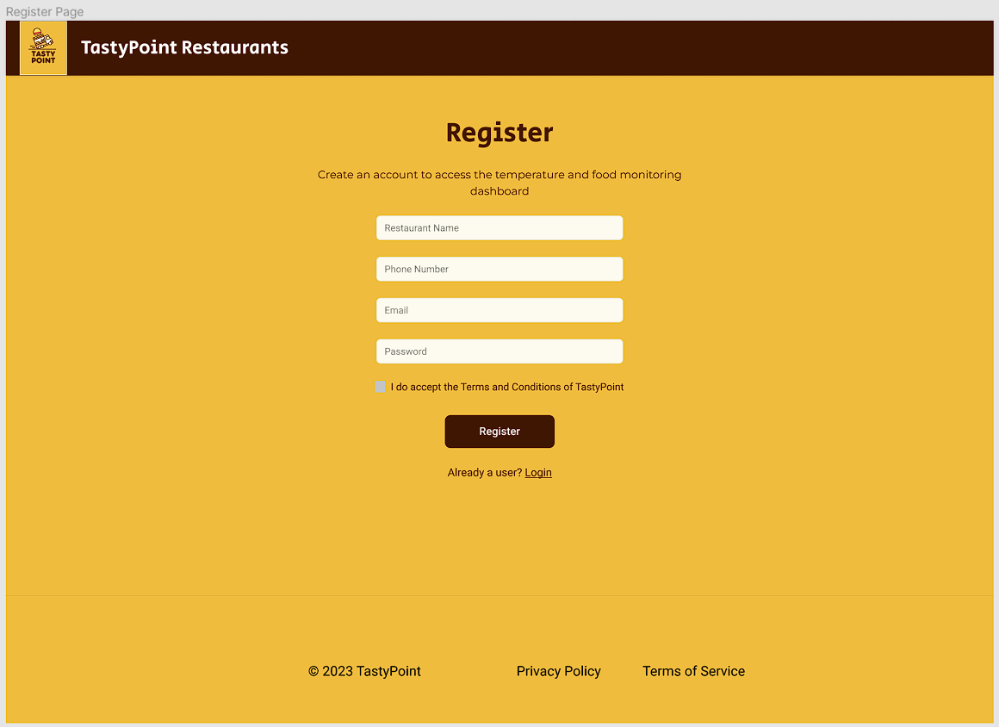{width="5.0in" height="3.625in"}

Temperature Metrics

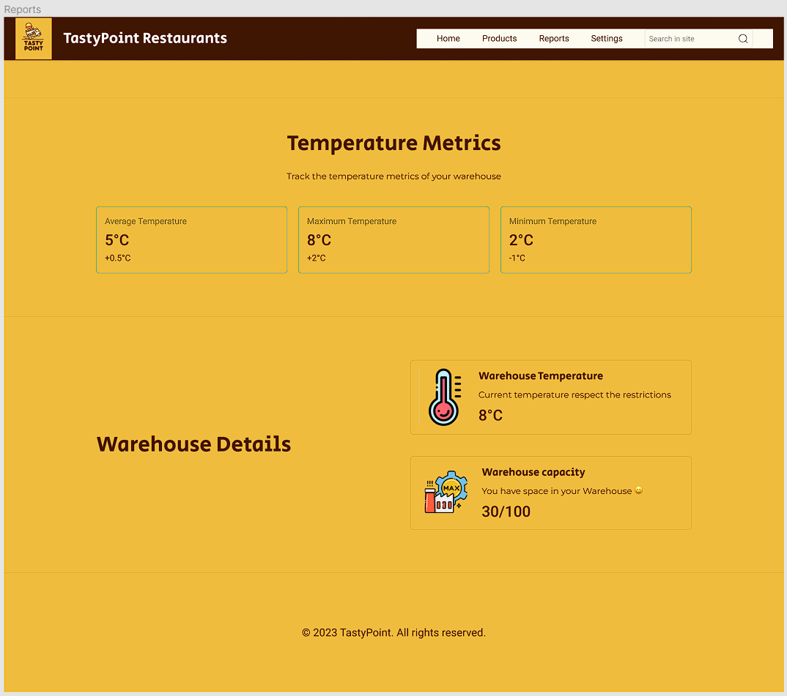{width="5.0in" height="4.427083333333333in"}

Product Dashboard

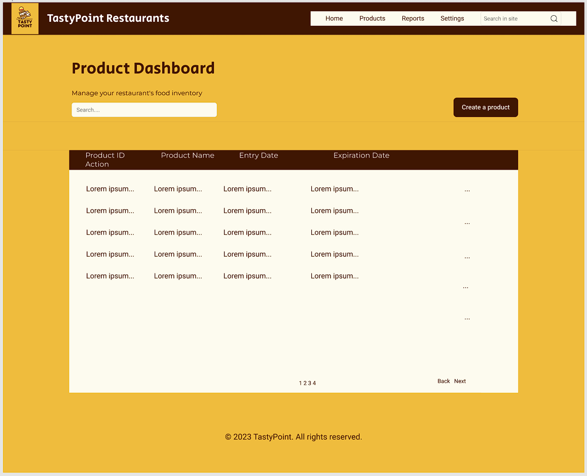{width="5.0in" height="4.0625in"}

Add Product

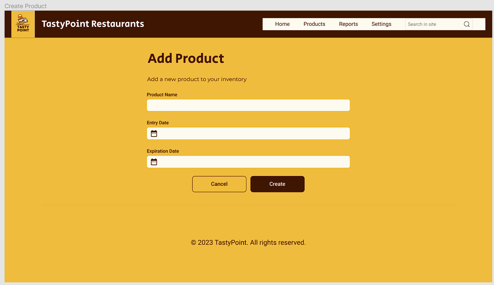{width="5.0in" height="2.8958333333333335in"}

Update Product

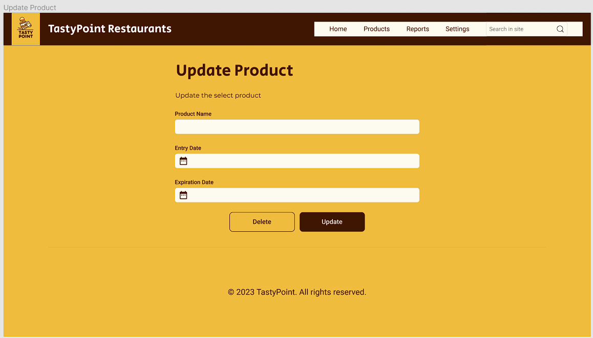{width="5.0in" height="2.84375in"}

Report

1.  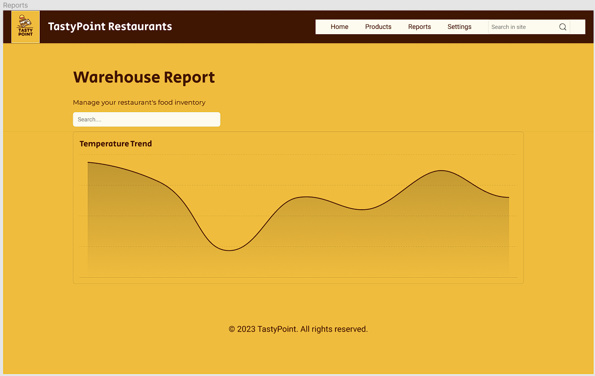{width="5.0in" height="3.15625in"}

```{=html}
<!-- -->
```
1.  

### 5.4.3. Applications User Flow Diagrams. {#applications-user-flow-diagrams. .unnumbered}

User goal: Como usuario, quiero registrarme.

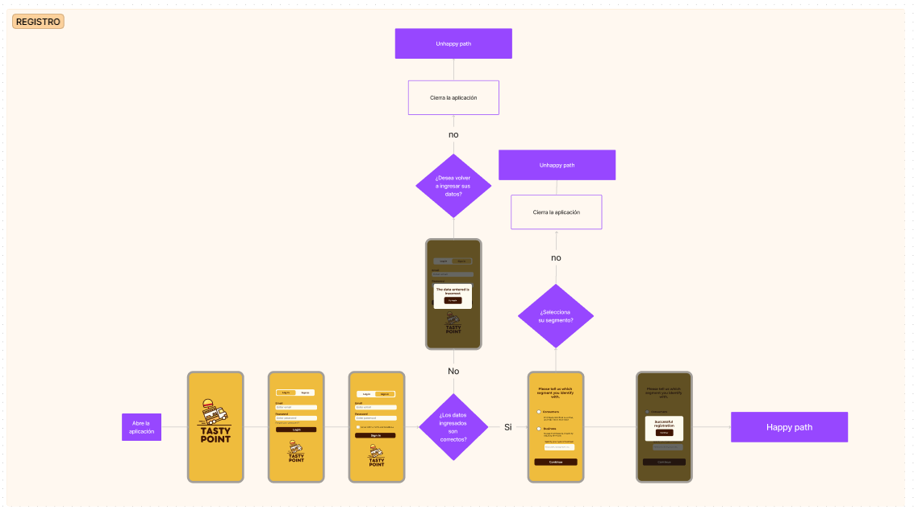{width="5.0in" height="2.8125in"}

User goal: Como usuario, quiero iniciar sesión.

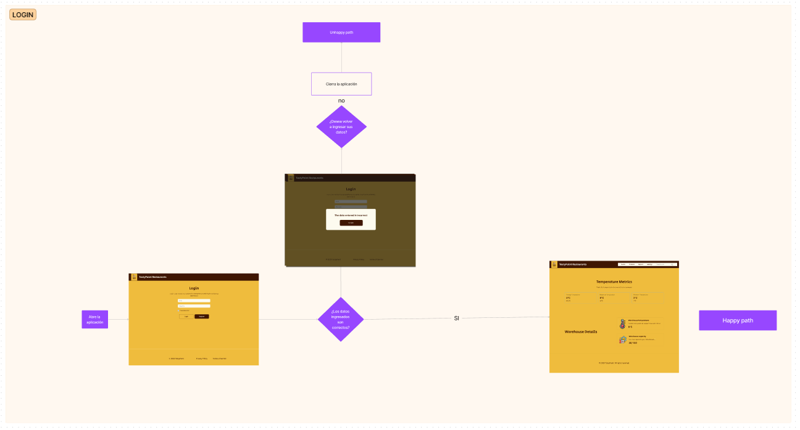{width="5.0in" height="2.6875in"}

User goal: Como usuario, quiero añadir un producto.

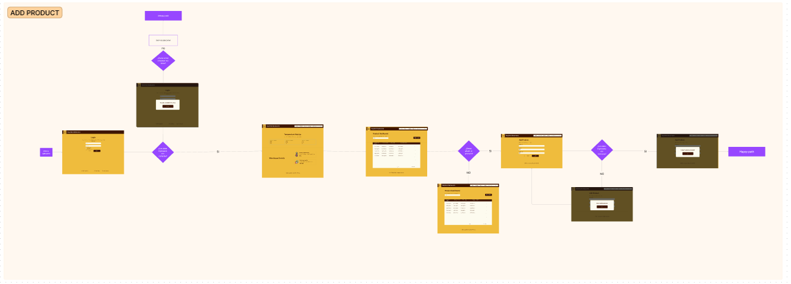{width="5.0in" height="1.78125in"}

User goal: Como usuario, quiero actualizar los datos de un producto.

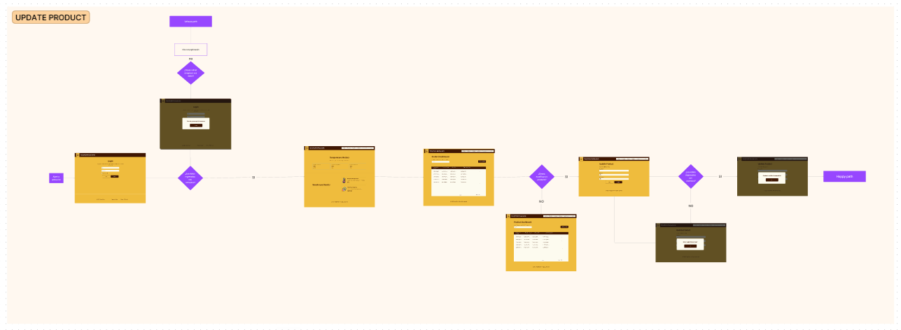{width="5.0in" height="1.8333333333333333in"}

User goal: Como usuario, quiero visualizar el reporte warehouse .

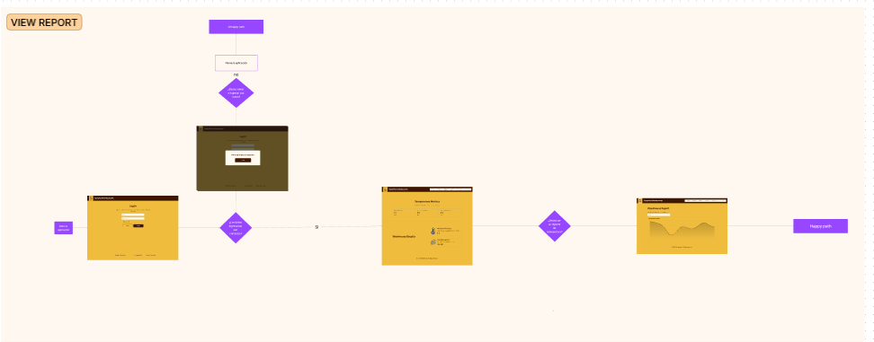{width="5.0in" height="1.9583333333333333in"}

### 5.4.4. Applications Prototyping. {#applications-prototyping. .unnumbered}

Con el proposito de comunicar la visión a los usuarios, clientes,
desarrolladores y otras partes interesadas, y a obtener su
retroalimentación para mejorar tu product, se utilize la herramienta
Figma para el prototipado de las funciones de los productos.

Link del Figma:
<https://www.figma.com/proto/ovsgmV9IY5qjDwlaMwa0Fm/TastyPoint-Web-Application---Mock-up?type=design&t=YpzNzDBkJejD4VCo-1&scaling=min-zoom&page-id=0%3A1&starting-point-node-id=1003%3A45&node-id=1003-45&mode=design>

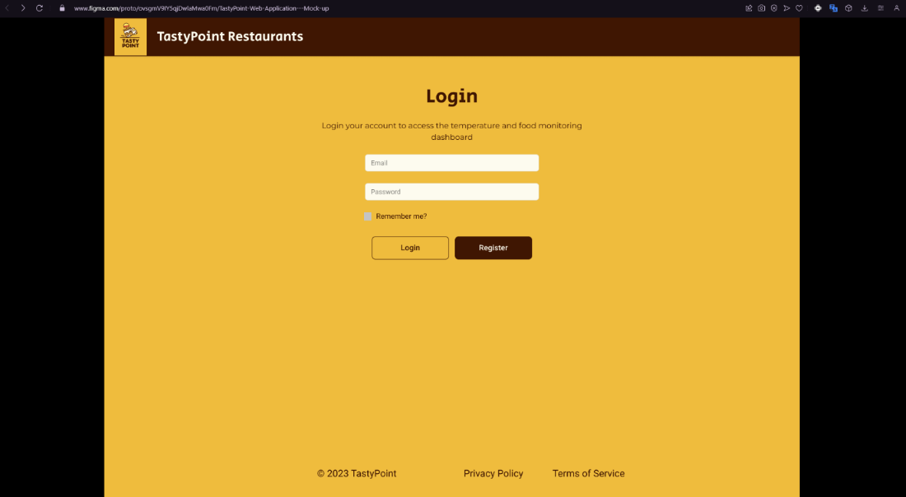{width="5.0in" height="2.75in"}

## 5.5 Applications UX/UI Design. (Mobile) {#applications-uxui-design.-mobile .unnumbered}

### 5.5.1 Application Mockups. {#application-mockups. .unnumbered}

Link del Figma:
<https://www.figma.com/file/06UddQCOZ2vMgNuB3rAPBJ/moviles-app?node-id=0%3A1&t=Wo9M5iYPzDMz30Cj-1>

{width="3.125in"
height="3.9895833333333335in"} {width="2.9791666666666665in"
height="4.0in"}

{width="2.2083333333333335in"
height="4.0in"}\
\
5.5.2 Application User Flow Diagrams.

El diagrama de flujo de usuario ilustra todos los pasos que un usuario
tiene que hacer para cumplir una tarea o conseguir un objetivo con tu
producto o experiencia. Asimismo, ayuda a crear una interfaz de usuario
que sea sencilla de usar, accesible e intuitiva para tus clientes. A
continuación se detalla los user Flow en la herramienta Figma.

Link del Figma:
<https://www.figma.com/file/yY8MUXcusNVVAjndMJBBKG/USERFLOWS?node-id=0%3A1&t=SeL8oWRa4H42dXCL-1>

User goal: Como usuario, quiero registrarme.

{width="6.5in"
height="3.6458333333333335in"}

User goal: Como usuario quiero iniciar sesión.

{width="6.5in" height="3.625in"}

User goal: Como consumidor, quiero realizar un pedido.

{width="6.5in" height="4.46875in"}

User goal: Como cliente, quiero actualizar mi plan de suscripción.

{width="6.5in"
height="3.4895833333333335in"}

### 5.5.3 Applications Prototype.  {#applications-prototype. .unnumbered}

Link del Figma:
<https://www.figma.com/proto/06UddQCOZ2vMgNuB3rAPBJ/moviles-app?type=design&node-id=7-2&scaling=scale-down&page-id=0%3A1&starting-point-node-id=8%3A2>

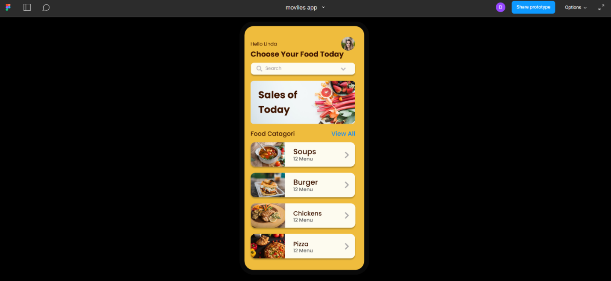{width="6.5in" height="3.0in"}

# Product implementation, validation & deployment  {#product-implementation-validation-deployment .unnumbered}

## 6.1. Software Configuration Management. {#software-configuration-management. .unnumbered}

### 6.1.1. Software Development Environment Configuration. {#software-development-environment-configuration. .unnumbered}

Para llevar a cabo el desarrollo de nuestro proyecto utilizamos las
siguientes tecnologías:

{width="1.9708333333333334in"
height="1.1097222222222223in"}{width="1.68292760279965in"
height="0.927405949256343in"}{width="1.0365857392825897in"
height="1.0365857392825897in"}

{width="2.035416666666667in"
height="1.5263888888888888in"}

{width="1.3611111111111112in"
height="1.5263888888888888in"}{width="1.9708333333333334in"
height="1.4729166666666667in"}

{width="1.3166666666666667in"
height="1.3166666666666667in"}

Pivotal Tracker: Es una herramienta de gestión de proyectos ágiles,
fácil de usar, que brinda colaboración enfocada a los equipos de
desarrollo de software.

Cada miembro del equipo comparte la misma vista en tiempo real de lo que
está sucediendo con cada proyecto y lo que debe hacerse a continuación.
Permite que los propietarios de productos sepan en detalle lo que
sucede, sin tener que preguntar, y permite que los desarrolladores
dediquen tiempo al trabajo, en lugar de informar sobre el trabajo.

Github: Es la herramienta de control de versiones que utilizaremos para
poder alojar nuestro código, esto agilizara nuestro trabajo como grupo,
además de mantener en orden la rama principal del proyecto ya que se
trabajaran con ramas alternas para testear los cambios antes de
implementarlos en la rama principal.

UXpressia : Es una herramienta en línea para el mapeo de la trayectoria
del cliente. Es un equilibrio óptimo entre las soluciones basadas en
stickers y tablas, con una interfaz intuitiva de arrastrar y soltar y un
montón de características personalizables. Utilizamos esta herramienta
en el desarrollo de los User Persona, User Journey Map e Impact Map.

LucidChart: Es una herramienta de diagramación que permite a los
usuarios colaborar en tiempo real creando diagramas de flujo,
organigramas, etc. Para este proyecto utilizamos

STRUCTURIZR: Es un servicio que nos ha permitido representar la
arquitectura de nuestro proyecto en base al modelo C4.

Figma: Es una herramienta de edición de gráficos que funciona para crear
interfaces de de aplicaciones tanto web como moviles. Permite al
diseñador enfocarse en la experiencia del usuario al navegar, con un
rango mínimo de error y en el menor tiempo posible.

Utilizamos esta herramienta en el desarrollo de los Wireframes y los
prototipos con simulación de interacción.

Postman: Es una herramienta que se utiliza, sobre todo, para el testing
de API REST, aunque también admite otras funcionalidades que se salen de
lo que engloba el testing de este tipo de sistemas.

Utilizamos esta herramienta para el testing de nuestra RESTful API y su
documentación

Android Studio: Es el entorno de Desarrollo integrado o IDE que
utilizamos para la construcción del proyecto.

### 6.1.2. Source Code Management. {#source-code-management. .unnumbered}

-   **Gitflow Implementation**

{width="5.055555555555555in"
height="3.1277777777777778in"}

A continuación, veremos la representación del flujo de trabajo Gitflow,
referenciada por el blog "Code Project" por Vyacheslav Voronenko, el
cual nos permite comprender de una manera dinámica e integral este
flujo.

-   **Master Branch**

La Master branch es la principal rama de desarrollo del proyecto. En
esta rama se encontrará el código que se encuentra actualmente en
producción.

Notación: master

-   **Developer Branch**

En esta rama, se aportarán las últimas actualizaciones o modificaciones
que se entregarán en la siguiente versión del proyecto.

Notación: develop

Creación: git checkout -b develop master

-   **Release Branch**

Nuestra rama release tiene como propósito solucionar errores, preparar
una nueva versión del proyecto y enviar actualizaciones a la rama
Developer.

Debe derivarse de la rama Develop.

Debe fusionarse con la rama Develop y Master.

Notación: release

Creación: git checkout -b release develop

-   **Feature Branches**

En este apartado, se presentan todas las futuras modificaciones que van
directo a la rama developer. Estas nuevas características nos permiten
agregar nuevas y mejores versiones para el proyecto.

Notación: feature/\[name of the feature\]

Creación: git checkout -b feature/\[name of the feature\] develop

-   **Hotfix Branch**

En nuestro proyecto se pueden presentar errores, por lo tanto el hotfix
branch nos permite corregir determinados errores de manera rápida a
nuestro producto. Debido a esto, el hotfix branch debe derivarse al
master branch y luego fusionarse a las ramas master y developer.

Notación: hotfix

Creación: git checkout -b hotfix master

### 6.1.3. Source Code Style Guide & Conventions.  {#source-code-style-guide-conventions. .unnumbered}

Para el desarrollo en **HTML** se usará el *HTML Style Guide and Coding*
que contiene las convenciones y la guía de estilos para html. Además, se
tendrá como referencia a este [sitio
web](https://www.w3schools.com/html/html5_syntax.asp), donde se
especifica la forma adecuada del desarrollo en html:

Para el desarrollo en **CSS** se utilizará el *Google HTML/CSS Style
Guide* que contiene las convenciones y la guía de estilos para CSS.
Convenciones que se pueden encontrar en este [sitio
web](https://google.github.io/styleguide/htmlcssguide.html).   

Para el desarrollo en **JavaScript** se usará el *JavaScript Coding
Conventions* que contiene las convenciones para JavaScript. Convenciones
que se pueden encontrar en este [sitio
web](https://www.w3schools.com/js/js_conventions.asp)

Para el desarrollo en **Gherkin** se usarán las convenciones mencionadas
en *Make your Gherkin Specifications More Readable* con el fin de
utilizar buenas prácticas que nos permitan comprender mejor lo
desarrollado. Convenciones que se encuentran en este [sitio
web](https://specflow.org/gherkin/gherkin-conventions-for-readable-specifications/). 

Para el desarrollo en **Flutter** se tendrán como referencia las
convenciones ya definidas en *Effective Dart: Style* y *Style guide for
Flutter repo* definidas por el equipo de Flutter. Esto con el objetivo
de mantener un formato entendible y que ayude en el mantenimiento del
sistema. Se puede visualizar las convenciones en los siguientes sitios
web [Dart Effective](https://dart.dev/effective-dart/style) y [Style
Guide For
Flutter](https://github.com/flutter/flutter/wiki/Style-guide-for-Flutter-repo):
 

Para el desarrollo en **C#** en nuestra API se tendrá en cuenta el *C#
at Google Style Guide de Google y Common C# code conventions* de
Microsoft. En estas guías se definen las convenciones para poder
trabajar de manera correcta con C#. Se puede visualizar las convenciones
en los siguientes sitios web [Google
C#](https://google.github.io/styleguide/csharp-style.html) y [Common
C#](https://learn.microsoft.com/en-us/dotnet/csharp/fundamentals/coding-style/coding-conventions)

Para el desarrollo en **Angular**, se tendrá en cuenta el *Style Guide
-- Ts* de Angular v2 Archive. En esta se definen las convenciones para
desarrollar en angular con **TypeScript**. Se pueden visualizar en este
[sitio
web](https://v2.angular.io/docs/ts/latest/guide/style-guide.html).

### 6.1.4. Software Deployment Configuration.  {#software-deployment-configuration. .unnumbered}

Para el Landing Page se utilizará GitHub Pages, debido a los despliegues
automáticos que hace según los nuevos commits sean aprobados en la rama
de despliegue (Ver Anexo 2).

{width="6.982638888888889in"
height="3.5116994750656167in"}\
*GitHub Pages Deployments*

[]{#_Toc149939439 .anchor}6.2 Landing Page, Services & Application.

## 6.2.1. Sprint 1  {#sprint-1 .unnumbered}

### 6.2.1.1. Sprint Planning 1.  {#sprint-planning-1. .unnumbered}

  -----------------------------------------------------------------------
  Sprint \#                           1
  ----------------------------------- -----------------------------------
  Sprint Planning Background          

  Date                                20/09/2023

  Time                                09:00 PM

  Location                            La reunión se realizó mediante la
                                      plataforma de Discord.

  Prepared By                         Breydi Ramos

  Attendees (to planning meeting)     Breydi Ramos, Yoimer Davila, Adrian
                                      Alzamora, Farid Josue Izquierdo

  Sprint 1 Review Summary             Debido a que este es el primer
                                      Sprint, no se tiene información
                                      sobre avances anteriores.

  Sprint 1 Retrospective Summary      Debido a que este es el primer
                                      Sprint, no se tienen opiniones de
                                      mejora sobre avances anteriores.

  Sprint Goal & User Stories          

  Sprint 1 Goal                       El objetivo de este sprint es
                                      desarrollar la Landing Page.

  Sprint 1 Velocity                   El equipo puede aceptar
                                      aproximadamente 30 Story Points.

  Sum of Story Points                 Teniendo en cuenta las User Stories
                                      que se desarrollarán, se llegó a
                                      una suma total de 32 Story Points.
  -----------------------------------------------------------------------

### 6.2.1.2. Sprint Backlog 1.  {#sprint-backlog-1. .unnumbered}

En este sprint se busca esencialmente hacer la implementación del
Landing page y publicarla por medio de GitHub pages. Esto se logrará a
partir de los artefactos previamente establecidos y desarrollados en el
curso, un ejemplo claro de esto sería el Landing page Wireframes y
Mockups. Así mismo, para la codificación e implementación del código se
utilizará GitHub y se empleará GitFlow como workflow para mantener una
estructura y flujo de trabajo conforme a lo establecido.

  ---------------------------------------------------------------------------------------
  N°         Historia de     To Do      In         To Review  Done          Estimación 
             usuarios                   Process                             
  ---------- --------------- ---------- ---------- ---------- ------------- -------------
  1          Visualizar                                       Diseñar la    2 
             productos y sus                                  vista para    
             datos                                            visualizar    
                                                              los productos 
                                                              y sus datos   

                                                              Implementar   2
                                                              vista para    
                                                              visualizar    
                                                              los productos 
                                                              y sus datos   

  2          Boton call to                                    Implementar   2 
             action                                           botón call to 
                                                              action que    
                                                              permita ir a  
                                                              la app movil  
                                                              desde la      
                                                              landing       
                                                              page          

  3          Visualizacion                                    Crear sección 2 
             de planes de                                     "pricing" en  
             suscripción                                      la lading     
                                                              page con      
                                                              información   
                                                              de las        
                                                              cantidades    
                                                              por pagar por 
                                                              el servicio   

  4          Visualizacion                                    Implementes   2 
             de redes                                         sección       
             sociales                                         "footer" en   
                                                              la lading     
                                                              page con      
                                                              enlaces a las 
                                                              redes         
                                                              sociales      

  5          Mobile                                           Implementar   2 
             responsive                                       diseño        
                                                              responsive de 
                                                              landing       
                                                              page          

  6          Visualizar la                                    Implementar   2 
             sección home                                     sección home  
             del landing                                      en landing    
             page                                             page          

  7          Visualizar la                                    Implementar   2 
             sección "about                                   el sección    
             us" en landing                                   about us en   
             page                                             landing page  
                                                              con la        
                                                              información   
                                                              de            
                                                              TastyPoint    

  8          Visualizar la                                    Implementar   2 
             sección                                          la sección    
             "segments" en                                    "segments" en 
             landing page                                     landing page  
                                                              con           
                                                              información   
                                                              del público   
                                                              objetivo de   
                                                              TastyPoint    
  ---------------------------------------------------------------------------------------

### 6.2.1.3. Development Evidence for Sprint Review.  {#development-evidence-for-sprint-review. .unnumbered}

  ------------------------------------------------------------------------------------------------------------------------------------------------
  Repository                                       Branch      Commit ID                                  Commit      Commit Message  Committed
                                                                                                          Message     Body            on(Date)
  ------------------------------------------------ ----------- ------------------------------------------ ----------- --------------- ------------
  TASTY-POINT/ [TastyPoint-LandingPage\            main        aa21566150b7951f291e036be0fc6b2678baff4a   Add Landing Added the       20/09/2023
  ](https://github.com/TastyPoint/lp-tastypoint)                                                          Page        landing page    
                                                                                                                      and             
                                                                                                                      documentation   

  ------------------------------------------------------------------------------------------------------------------------------------------------

### 6.2.1.4. Testing Suite Evidence for Sprint Review. {#testing-suite-evidence-for-sprint-review. .unnumbered}

Debido a que estamos en la etapa de diseño del prototipo de la
aplicación web no podemos realizar los respectivos tests. No obstante,
se está evaluando qué aplicaciones usar para realizar los test y
validaciones correspondientes para desarrollar una efectiva aplicación
web y que no contenga errores.

### 6.2.1.5. Execution Evidence for Sprint Review.  {#execution-evidence-for-sprint-review. .unnumbered}

<https://upcedupe-my.sharepoint.com/:v:/g/personal/u202015215_upc_edu_pe/EUCmbvRvg4ZLnLlirfSSElYBF890j_sRQ6fuyzsaiyR64w?e=AIKuzI&nav=eyJyZWZlcnJhbEluZm8iOnsicmVmZXJyYWxBcHAiOiJTdHJlYW1XZWJBcHAiLCJyZWZlcnJhbFZpZXciOiJTaGFyZURpYWxvZyIsInJlZmVycmFsQXBwUGxhdGZvcm0iOiJXZWIiLCJyZWZlcnJhbE1vZGUiOiJ2aWV3In19>

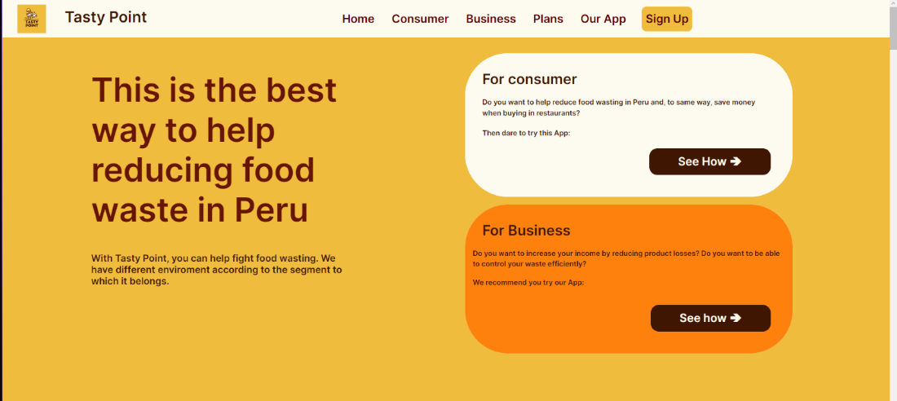{width="5.0in"
height="2.2395833333333335in"}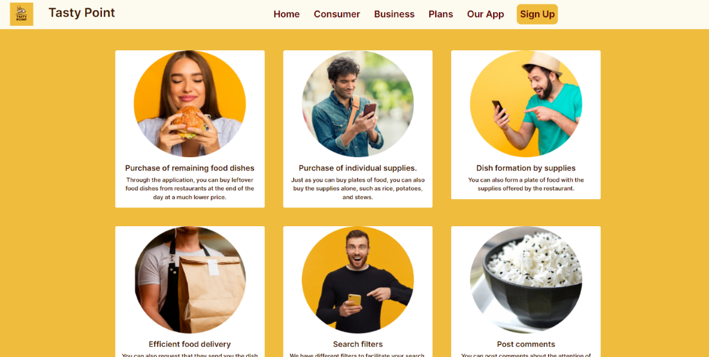{width="5.0in"
height="2.5208333333333335in"}

Link de acceso: [Landing
page](https://tastypoint.github.io/lp-tastypoint/)

### 6.2.1.6. Services Documentation Evidence for Sprint Review.  {#services-documentation-evidence-for-sprint-review. .unnumbered}

Como se mencionó anteriormente, debido a que estamos en la etapa de
diseño del prototipo de la aplicación web no podemos documentar la
relación de los endpoints.

### 6.2.1.7. Software Deployment Evidence for Sprint Review. {#software-deployment-evidence-for-sprint-review. .unnumbered}

Despliegue del Landing Page:

Para el despliegue del landing page, se deben descargar todos los
archivos que residen en el repositorio de "TastyPoint-LandingPage",
siendo "index.html" el más importante.

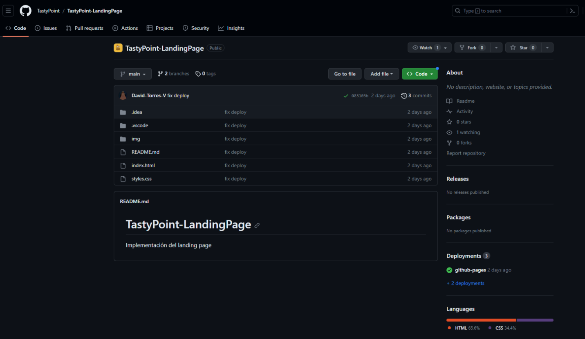{width="6.5in" height="3.7708333333333335in"}

Luego, debemos asegurarnos de que nuestro sitio web pueda ser desplegado
con la configuración de GitHub Pages:
<https://tastypoint.github.io/lp-tastypoint/>

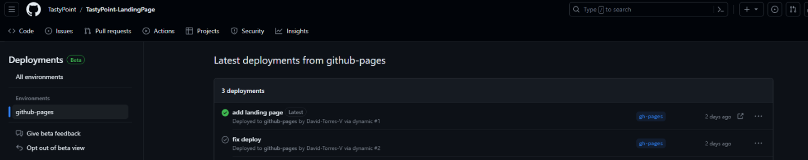{width="6.5in"
height="1.2916666666666667in"}{width="6.27083552055993in"
height="0.28125in"}

### 6.2.1.8. Team Collaboration Insights during Sprint. {#team-collaboration-insights-during-sprint. .unnumbered}

Para la realización de nuestro prototipo, hemos utilizado Figma, la cual
nos ha ayudado a establecer y plasmar lo que habíamos planeado con
anticipación cuando elaboramos los Wireframes y Mockups.

Por otro lado, para el desarrollo del Landing Page, hemos usado un
repositorio en GitHub en el cual, con la ayuda del flujo de trabajo
Gitflow, hemos implementado en de manera grupal el desarrollo de nuestro
Landing page. Esto se evidencia en los diferentes commits realizados en
el repositorio los cuales se pueden ver en las siguientes capturas de
pantalla:

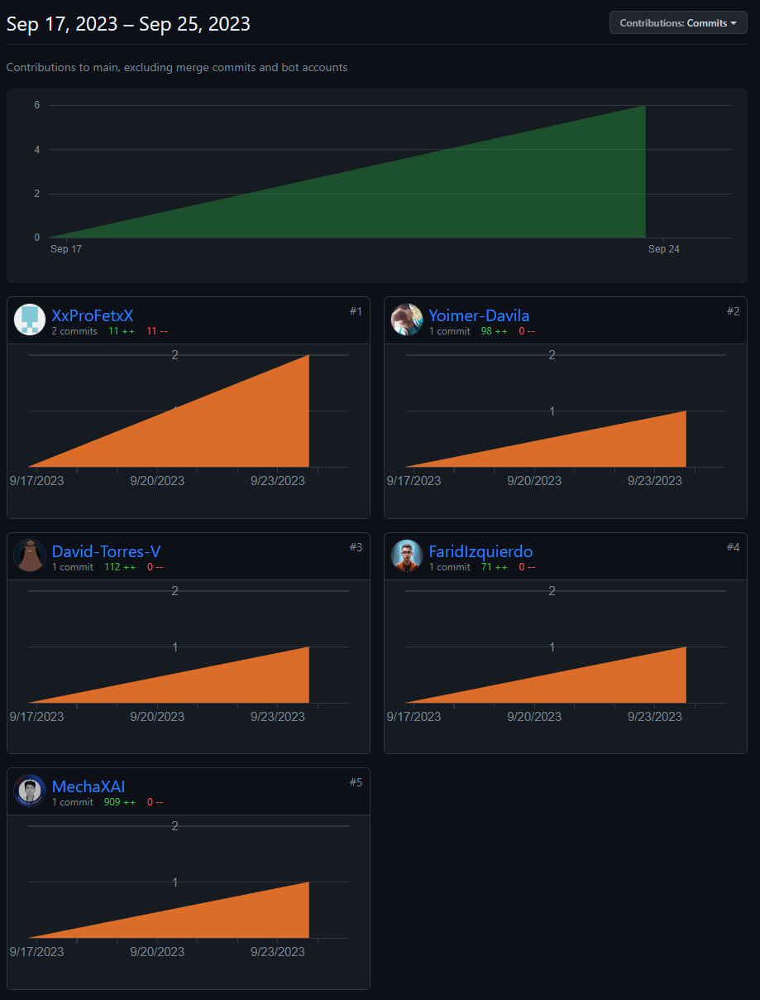{width="4.872830271216098in"
height="6.408104768153981in"}

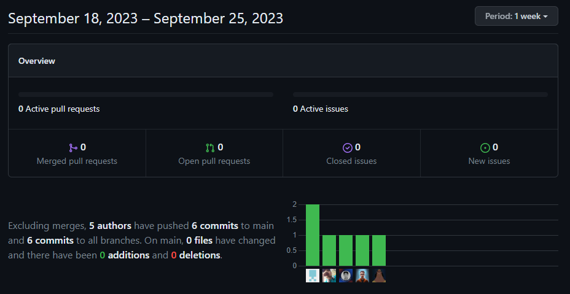{width="5.0in" height="2.5833333333333335in"}

## 6.2.2. Sprint 2 {#sprint-2 .unnumbered}

### 6.2.2.1. Sprint Planning 2.  {#sprint-planning-2. .unnumbered}

  -----------------------------------------------------------------------
  Sprint \#                           2
  ----------------------------------- -----------------------------------
  Sprint Planning Background          

  Date                                24/10/2023

  Time                                09:00 PM

  Location                            La reunión se realizó mediante la
                                      plataforma de Discord.

  Prepared By                         David Torres

  Attendees (to planning meeting)     Breydi Ramos, Yoimer Davila, Adrian
                                      Alzamora, Farid Josue Izquierdo,
                                      David Torres

  Sprint 1 Review Summary             Se culmino por completo el
                                      desarrollo del landing page, para
                                      proceder con los mvp de los
                                      apartados de app web, web services
                                      y IoT.

  Sprint 2 Retrospective Summary      Se mejoraron aspectos relacionados
                                      con el diseño responsivo del
                                      landing page, como tambien se
                                      culminó la parte del backend con la
                                      herramienta de firebase.

  Sprint Goal & User Stories          

  Sprint 2 Goal                       El objetivo de este sprint es
                                      desarrollar el Backend y conectarlo
                                      con nuestro Frontend.

  Sprint 2 Velocity                   El equipo puede aceptar
                                      aproximadamente 45 Story Points.

  Sum of Story Points                 Teniendo en cuenta las User Stories
                                      que se desarrollarán, se llegó a
                                      una suma total de 49 Story Points.
  -----------------------------------------------------------------------

### 6.2.2.2. Sprint Backlog 2. {#sprint-backlog-2. .unnumbered}

+-------+-------+-------+--------+--------+-------+--------+--------+
| Work  |       |       |        |        |       |        |        |
| -Item |       |       |        |        |       |        |        |
| /     |       |       |        |        |       |        |        |
| Task  |       |       |        |        |       |        |        |
+=======+=======+=======+========+========+=======+========+========+
| ID    | HU    | Title | Descr  | Esti   |       | As     | Status |
|       |       |       | iption | mation |       | signed |        |
|       |       |       |        | (      |       | To     |        |
|       |       |       |        | Hours) |       |        |        |
+-------+-------+-------+--------+--------+-------+--------+--------+
| #1    | US12  | Reg   | Como   | 3      |       | Farid  | Done   |
|       |       | istro | c      |        |       | Izq    |        |
|       |       | de    | liente |        |       | uierdo |        |
|       |       | cl    | deseo  |        |       |        |        |
|       |       | iente | poder  |        |       |        |        |
|       |       |       | regis  |        |       |        |        |
|       |       |       | trarme |        |       |        |        |
|       |       |       | en la  |        |       |        |        |
|       |       |       | apli   |        |       |        |        |
|       |       |       | cación |        |       |        |        |
|       |       |       | para   |        |       |        |        |
|       |       |       | a      |        |       |        |        |
|       |       |       | cceder |        |       |        |        |
|       |       |       | a      |        |       |        |        |
|       |       |       | todos  |        |       |        |        |
|       |       |       | sus    |        |       |        |        |
|       |       |       | bene   |        |       |        |        |
|       |       |       | ficios |        |       |        |        |
+-------+-------+-------+--------+--------+-------+--------+--------+
| #2    | US13  | Aut   | Como   | 3      |       | Farid  | Done   |
|       |       | entic | c      |        |       | Izq    |        |
|       |       | acion | liente |        |       | uierdo |        |
|       |       | de    | deseo  |        |       |        |        |
|       |       | cl    | poder  |        |       |        |        |
|       |       | iente | autent |        |       |        |        |
|       |       |       | icarme |        |       |        |        |
|       |       |       | en la  |        |       |        |        |
|       |       |       | apli   |        |       |        |        |
|       |       |       | cación |        |       |        |        |
|       |       |       | para   |        |       |        |        |
|       |       |       | a      |        |       |        |        |
|       |       |       | cceder |        |       |        |        |
|       |       |       | a      |        |       |        |        |
|       |       |       | todos  |        |       |        |        |
|       |       |       | sus    |        |       |        |        |
|       |       |       | bene   |        |       |        |        |
|       |       |       | ficios |        |       |        |        |
+-------+-------+-------+--------+--------+-------+--------+--------+
| #3    | US14  | Pago  | Como   | 2      |       | Yoimer | Done   |
|       |       | de    | c      |        |       | Dávila |        |
|       |       | s     | liente |        |       |        |        |
|       |       | uscri | deseo  |        |       |        |        |
|       |       | pción | poder  |        |       |        |        |
|       |       |       | pagar  |        |       |        |        |
|       |       |       | la     |        |       |        |        |
|       |       |       | suscr  |        |       |        |        |
|       |       |       | ipción |        |       |        |        |
|       |       |       | desde  |        |       |        |        |
|       |       |       | un     |        |       |        |        |
|       |       |       | enlace |        |       |        |        |
|       |       |       | de     |        |       |        |        |
|       |       |       | pago   |        |       |        |        |
|       |       |       | me     |        |       |        |        |
|       |       |       | diante |        |       |        |        |
|       |       |       | correo |        |       |        |        |
|       |       |       | para   |        |       |        |        |
|       |       |       | fac    |        |       |        |        |
|       |       |       | ilitar |        |       |        |        |
|       |       |       | un     |        |       |        |        |
|       |       |       | c      |        |       |        |        |
|       |       |       | ontrol |        |       |        |        |
|       |       |       | de     |        |       |        |        |
|       |       |       | pagos  |        |       |        |        |
+-------+-------+-------+--------+--------+-------+--------+--------+
| #4    | US15  | P     | Como   | 2      |       | David  | Done   |
|       |       | ublic | c      |        |       | Torres |        |
|       |       | ación | liente |        |       |        |        |
|       |       | de    | deseo  |        |       |        |        |
|       |       | p     | poder  |        |       |        |        |
|       |       | latos | pu     |        |       |        |        |
|       |       | sobr  | blicar |        |       |        |        |
|       |       | antes | los    |        |       |        |        |
|       |       |       | platos |        |       |        |        |
|       |       |       | que me |        |       |        |        |
|       |       |       | so     |        |       |        |        |
|       |       |       | braron |        |       |        |        |
|       |       |       | en el  |        |       |        |        |
|       |       |       | día    |        |       |        |        |
|       |       |       | para   |        |       |        |        |
|       |       |       | poder  |        |       |        |        |
|       |       |       | vender |        |       |        |        |
|       |       |       | lo     |        |       |        |        |
|       |       |       | máximo |        |       |        |        |
|       |       |       | p      |        |       |        |        |
|       |       |       | osible |        |       |        |        |
+-------+-------+-------+--------+--------+-------+--------+--------+
| #5    | US17  | Visua | Como   | 3      |       | Adrian | In     |
|       |       | lizar | c      |        |       | Al     | p      |
|       |       | a     | liente |        |       | zamora | rocess |
|       |       | visos | quiero |        |       |        |        |
|       |       | sobre | visu   |        |       |        |        |
|       |       | ca    | alizar |        |       |        |        |
|       |       | mbios | avisos |        |       |        |        |
|       |       | de    | en la  |        |       |        |        |
|       |       | t     | plat   |        |       |        |        |
|       |       | emper | aforma |        |       |        |        |
|       |       | atura | que me |        |       |        |        |
|       |       | y     | man    |        |       |        |        |
|       |       | hu    | tengan |        |       |        |        |
|       |       | medad | inf    |        |       |        |        |
|       |       | en el | ormado |        |       |        |        |
|       |       | al    | cuando |        |       |        |        |
|       |       | macen | se     |        |       |        |        |
|       |       |       | supere |        |       |        |        |
|       |       |       | cierto |        |       |        |        |
|       |       |       | nivel  |        |       |        |        |
|       |       |       | de     |        |       |        |        |
|       |       |       | tempe  |        |       |        |        |
|       |       |       | ratura |        |       |        |        |
|       |       |       | y      |        |       |        |        |
|       |       |       | h      |        |       |        |        |
|       |       |       | umedad |        |       |        |        |
|       |       |       | para   |        |       |        |        |
|       |       |       | ma     |        |       |        |        |
|       |       |       | ntener |        |       |        |        |
|       |       |       | en     |        |       |        |        |
|       |       |       | buen   |        |       |        |        |
|       |       |       | estado |        |       |        |        |
|       |       |       | los    |        |       |        |        |
|       |       |       | prod   |        |       |        |        |
|       |       |       | uctos. |        |       |        |        |
+-------+-------+-------+--------+--------+-------+--------+--------+
| #6    | US18  | Regi  | Como   | 2      |       | Farid  | Done   |
|       |       | strar | c      |        |       | Izq    |        |
|       |       | Inven | liente |        |       | uierdo |        |
|       |       | tario | quiero |        |       |        |        |
|       |       |       | añadir |        |       | Yoimer |        |
|       |       |       | pro    |        |       | Dávila |        |
|       |       |       | ductos |        |       |        |        |
|       |       |       | en el  |        |       |        |        |
|       |       |       | inve   |        |       |        |        |
|       |       |       | ntario |        |       |        |        |
|       |       |       | que    |        |       |        |        |
|       |       |       | tengo  |        |       |        |        |
+-------+-------+-------+--------+--------+-------+--------+--------+
| #7    | US019 | Eli   | Como   | 2      |       | Farid  | Done   |
|       |       | minar | c      |        |       | Izq    |        |
|       |       | Inven | liente |        |       | uierdo |        |
|       |       | tario | quiero |        |       |        |        |
|       |       |       | ell    |        |       | Yoimer |        |
|       |       |       | iminar |        |       | Dávila |        |
|       |       |       | pro    |        |       |        |        |
|       |       |       | ductos |        |       |        |        |
|       |       |       | en el  |        |       |        |        |
|       |       |       | inve   |        |       |        |        |
|       |       |       | ntario |        |       |        |        |
|       |       |       | que    |        |       |        |        |
|       |       |       | tengo  |        |       |        |        |
+-------+-------+-------+--------+--------+-------+--------+--------+
| #8    | US20  | Ven   | Como   | 2      |       | Breydi | In     |
|       |       | tanas | c      |        |       |        | pr     |
|       |       | emerg | liente |        |       |        | ogress |
|       |       | entes | quiero |        |       |        |        |
|       |       |       | ve     |        |       |        |        |
|       |       |       | ntanas |        |       |        |        |
|       |       |       | emer   |        |       |        |        |
|       |       |       | gentes |        |       |        |        |
|       |       |       | sobre  |        |       |        |        |
|       |       |       | las    |        |       |        |        |
|       |       |       | ac     |        |       |        |        |
|       |       |       | ciones |        |       |        |        |
|       |       |       | que    |        |       |        |        |
|       |       |       | r      |        |       |        |        |
|       |       |       | ealice |        |       |        |        |
|       |       |       | con    |        |       |        |        |
|       |       |       | los    |        |       |        |        |
|       |       |       | pro    |        |       |        |        |
|       |       |       | ductos |        |       |        |        |
|       |       |       | de mi  |        |       |        |        |
|       |       |       | inve   |        |       |        |        |
|       |       |       | ntario |        |       |        |        |
+-------+-------+-------+--------+--------+-------+--------+--------+
| #9    | US21  | E     | Como   | 2      |       | Farid  | Done   |
|       |       | ditar | c      |        |       | Izq    |        |
|       |       | Inven | liente |        |       | uierdo |        |
|       |       | tario | quiero |        |       |        |        |
|       |       |       | editar |        |       | Yoimer |        |
|       |       |       | pro    |        |       | Dávila |        |
|       |       |       | ductos |        |       |        |        |
|       |       |       | en el  |        |       |        |        |
|       |       |       | inve   |        |       |        |        |
|       |       |       | ntario |        |       |        |        |
|       |       |       | que    |        |       |        |        |
|       |       |       | tengo  |        |       |        |        |
+-------+-------+-------+--------+--------+-------+--------+--------+
| #10   | US022 | Monit | Como   | 3      |       | Yoimer | Done   |
|       |       | orear | c      |        |       | Dávila |        |
|       |       | el    | liente |        |       |        |        |
|       |       | inven | quiero |        |       |        |        |
|       |       | tario | ver    |        |       |        |        |
|       |       |       | una    |        |       |        |        |
|       |       |       | tabla  |        |       |        |        |
|       |       |       | de     |        |       |        |        |
|       |       |       | todos  |        |       |        |        |
|       |       |       | los    |        |       |        |        |
|       |       |       | pro    |        |       |        |        |
|       |       |       | ductos |        |       |        |        |
|       |       |       | de mi  |        |       |        |        |
|       |       |       | inve   |        |       |        |        |
|       |       |       | ntario |        |       |        |        |
|       |       |       | con el |        |       |        |        |
|       |       |       | fin de |        |       |        |        |
|       |       |       | m      |        |       |        |        |
|       |       |       | onitor |        |       |        |        |
|       |       |       | earlos |        |       |        |        |
+-------+-------+-------+--------+--------+-------+--------+--------+
| #11   | US023 | Monit | Como   | 1      |       | Yoimer | Done   |
|       |       | orear | c      |        |       | Dávila |        |
|       |       | el    | liente |        |       |        |        |
|       |       | inven | quiero |        |       |        |        |
|       |       | tario | f      |        |       |        |        |
|       |       |       | iltrar |        |       |        |        |
|       |       |       | los    |        |       |        |        |
|       |       |       | pro    |        |       |        |        |
|       |       |       | ductos |        |       |        |        |
|       |       |       | de mi  |        |       |        |        |
|       |       |       | inve   |        |       |        |        |
|       |       |       | ntario |        |       |        |        |
+-------+-------+-------+--------+--------+-------+--------+--------+
| #12   | US024 | Gr    | Como   | 3      |       | Breydi | Done   |
|       |       | afica | c      |        |       |        |        |
|       |       | de    | liente |        |       |        |        |
|       |       | t     | quiero |        |       |        |        |
|       |       | emper | visu   |        |       |        |        |
|       |       | atura | alizar |        |       |        |        |
|       |       | del   | la     |        |       |        |        |
|       |       | inven | ten    |        |       |        |        |
|       |       | tario | dencia |        |       |        |        |
|       |       |       | de la  |        |       |        |        |
|       |       |       | tempe  |        |       |        |        |
|       |       |       | rature |        |       |        |        |
|       |       |       | del    |        |       |        |        |
|       |       |       | inve   |        |       |        |        |
|       |       |       | ntario |        |       |        |        |
|       |       |       | dentro |        |       |        |        |
|       |       |       | de un  |        |       |        |        |
|       |       |       | rango  |        |       |        |        |
|       |       |       | de     |        |       |        |        |
|       |       |       | fechas |        |       |        |        |
+-------+-------+-------+--------+--------+-------+--------+--------+
| #13   | US025 | Se    | Como   | 2      |       | Adrian | Done   |
|       |       | ccion | c      |        |       | Al     |        |
|       |       | home  | liente |        |       | zamora |        |
|       |       | del   | quiero |        |       |        |        |
|       |       | inven | visu   |        |       |        |        |
|       |       | tario | alizar |        |       |        |        |
|       |       | del   | me     |        |       |        |        |
|       |       | r     | tricas |        |       |        |        |
|       |       | estau | y      |        |       |        |        |
|       |       | rante | de     |        |       |        |        |
|       |       |       | talles |        |       |        |        |
|       |       |       | sobre  |        |       |        |        |
|       |       |       | mi     |        |       |        |        |
|       |       |       | inve   |        |       |        |        |
|       |       |       | ntario |        |       |        |        |
+-------+-------+-------+--------+--------+-------+--------+--------+
| #14   | US026 | Regi  | Como   | 1      |       | Farid  | Done   |
|       |       | strar | c      |        |       | Izq    |        |
|       |       | fecha | liente |        |       | uierdo |        |
|       |       | de    | quiero |        |       |        |        |
|       |       | produ | reg    |        |       |        |        |
|       |       | cción | istrar |        |       |        |        |
|       |       | y     | la     |        |       |        |        |
|       |       | cadu  | fecha  |        |       |        |        |
|       |       | cidad | de     |        |       |        |        |
|       |       |       | prod   |        |       |        |        |
|       |       |       | ucción |        |       |        |        |
|       |       |       | y      |        |       |        |        |
|       |       |       | cad    |        |       |        |        |
|       |       |       | ucidad |        |       |        |        |
|       |       |       | del    |        |       |        |        |
|       |       |       | pro    |        |       |        |        |
|       |       |       | ducto. |        |       |        |        |
+-------+-------+-------+--------+--------+-------+--------+--------+
| #15   | US027 | M     | Como   | 2      |       | David  | Done   |
|       |       | edios | c      |        |       |        |        |
|       |       | de    | liente |        |       |        |        |
|       |       | con   | quiero |        |       |        |        |
|       |       | tacto | e      |        |       |        |        |
|       |       |       | nlazar |        |       |        |        |
|       |       |       | todos  |        |       |        |        |
|       |       |       | los    |        |       |        |        |
|       |       |       | medios |        |       |        |        |
|       |       |       | de     |        |       |        |        |
|       |       |       | comuni |        |       |        |        |
|       |       |       | cación |        |       |        |        |
|       |       |       | que    |        |       |        |        |
|       |       |       | poseo  |        |       |        |        |
|       |       |       | para   |        |       |        |        |
|       |       |       | pe     |        |       |        |        |
|       |       |       | rmitir |        |       |        |        |
|       |       |       | a los  |        |       |        |        |
|       |       |       | cl     |        |       |        |        |
|       |       |       | ientes |        |       |        |        |
|       |       |       | conta  |        |       |        |        |
|       |       |       | ctarse |        |       |        |        |
|       |       |       | direct |        |       |        |        |
|       |       |       | amente |        |       |        |        |
|       |       |       | con    |        |       |        |        |
|       |       |       | nos    |        |       |        |        |
|       |       |       | otros. |        |       |        |        |
+-------+-------+-------+--------+--------+-------+--------+--------+
| #16   | US028 | Ver   | Como   | 2      |       | David  | Done   |
|       |       | opc   | c      |        |       |        |        |
|       |       | iones | liente |        |       | Torres |        |
|       |       | d     | Como   |        |       |        |        |
|       |       | ispon | c      |        |       |        |        |
|       |       | ibles | liente |        |       |        |        |
|       |       |       | quiero |        |       |        |        |
|       |       |       | ver    |        |       |        |        |
|       |       |       | las    |        |       |        |        |
|       |       |       | op     |        |       |        |        |
|       |       |       | ciones |        |       |        |        |
|       |       |       | que    |        |       |        |        |
|       |       |       | ofrece |        |       |        |        |
|       |       |       | Tasty  |        |       |        |        |
|       |       |       | Point  |        |       |        |        |
|       |       |       | para   |        |       |        |        |
|       |       |       | c      |        |       |        |        |
|       |       |       | onocer |        |       |        |        |
|       |       |       | el     |        |       |        |        |
|       |       |       | fu     |        |       |        |        |
|       |       |       | nciona |        |       |        |        |
|       |       |       | miento |        |       |        |        |
|       |       |       | de la  |        |       |        |        |
|       |       |       | app y  |        |       |        |        |
|       |       |       | elegir |        |       |        |        |
|       |       |       | alguna |        |       |        |        |
|       |       |       | de sus |        |       |        |        |
|       |       |       | op     |        |       |        |        |
|       |       |       | ciones |        |       |        |        |
|       |       |       | dispon |        |       |        |        |
|       |       |       | ibles. |        |       |        |        |
|       |       |       | quiero |        |       |        |        |
|       |       |       | ver la |        |       |        |        |
|       |       |       | lista  |        |       |        |        |
|       |       |       | de     |        |       |        |        |
|       |       |       | p      |        |       |        |        |
|       |       |       | edidos |        |       |        |        |
|       |       |       | solic  |        |       |        |        |
|       |       |       | itados |        |       |        |        |
|       |       |       | en mi  |        |       |        |        |
|       |       |       | restau |        |       |        |        |
|       |       |       | rante, |        |       |        |        |
|       |       |       | para   |        |       |        |        |
|       |       |       | c      |        |       |        |        |
|       |       |       | onocer |        |       |        |        |
|       |       |       | la     |        |       |        |        |
|       |       |       | d      |        |       |        |        |
|       |       |       | emanda |        |       |        |        |
|       |       |       | a      |        |       |        |        |
|       |       |       | través |        |       |        |        |
|       |       |       | de la  |        |       |        |        |
|       |       |       | App    |        |       |        |        |
|       |       |       | móvil. |        |       |        |        |
+-------+-------+-------+--------+--------+-------+--------+--------+
| #17   | US29  | Ver   | Como   | 2      | David | Done   |        |
|       |       | pe    | c      |        |       |        |        |
|       |       | didos | liente |        | T     |        |        |
|       |       |       | quiero |        | orres |        |        |
|       |       |       | ver la |        |       |        |        |
|       |       |       | lista  |        |       |        |        |
|       |       |       | de     |        |       |        |        |
|       |       |       | p      |        |       |        |        |
|       |       |       | edidos |        |       |        |        |
|       |       |       | solic  |        |       |        |        |
|       |       |       | itados |        |       |        |        |
|       |       |       | en mi  |        |       |        |        |
|       |       |       | restau |        |       |        |        |
|       |       |       | rante, |        |       |        |        |
|       |       |       | para   |        |       |        |        |
|       |       |       | c      |        |       |        |        |
|       |       |       | onocer |        |       |        |        |
|       |       |       | la     |        |       |        |        |
|       |       |       | d      |        |       |        |        |
|       |       |       | emanda |        |       |        |        |
|       |       |       | a      |        |       |        |        |
|       |       |       | través |        |       |        |        |
|       |       |       | de la  |        |       |        |        |
|       |       |       | App    |        |       |        |        |
|       |       |       | móvil. |        |       |        |        |
+-------+-------+-------+--------+--------+-------+--------+--------+
| #18   | US30  | Ver   | Como   | 2      | David | Done   |        |
|       |       | el    | c      |        |       |        |        |
|       |       | cat   | liente |        | T     |        |        |
|       |       | álogo | quiero |        | orres |        |        |
|       |       | de    | ver el |        |       |        |        |
|       |       | p     | ca     |        |       |        |        |
|       |       | latos | tálogo |        |       |        |        |
|       |       | e     | actual |        |       |        |        |
|       |       | in    | de     |        |       |        |        |
|       |       | sumos | platos |        |       |        |        |
|       |       |       | e      |        |       |        |        |
|       |       |       | i      |        |       |        |        |
|       |       |       | nsumos |        |       |        |        |
|       |       |       | ofr    |        |       |        |        |
|       |       |       | ecidos |        |       |        |        |
|       |       |       | por mi |        |       |        |        |
|       |       |       | est    |        |       |        |        |
|       |       |       | ableci |        |       |        |        |
|       |       |       | miento |        |       |        |        |
|       |       |       | para   |        |       |        |        |
|       |       |       | corr   |        |       |        |        |
|       |       |       | oborar |        |       |        |        |
|       |       |       | que    |        |       |        |        |
|       |       |       | los    |        |       |        |        |
|       |       |       | datos  |        |       |        |        |
|       |       |       | de la  |        |       |        |        |
|       |       |       | app    |        |       |        |        |
|       |       |       | coi    |        |       |        |        |
|       |       |       | ncidan |        |       |        |        |
|       |       |       | con mi |        |       |        |        |
|       |       |       | inven  |        |       |        |        |
|       |       |       | tario. |        |       |        |        |
+-------+-------+-------+--------+--------+-------+--------+--------+
| #19   | US31  | Abrir | Como   | 2      | David | Done   |        |
|       |       | vista | c      |        |       |        |        |
|       |       | de    | liente |        | T     |        |        |
|       |       | consu | quiero |        | orres |        |        |
|       |       | midor | contar |        |       |        |        |
|       |       |       | con la |        |       |        |        |
|       |       |       | vista  |        |       |        |        |
|       |       |       | de     |        |       |        |        |
|       |       |       | cons   |        |       |        |        |
|       |       |       | umidor |        |       |        |        |
|       |       |       | para   |        |       |        |        |
|       |       |       | as     |        |       |        |        |
|       |       |       | egurar |        |       |        |        |
|       |       |       | que    |        |       |        |        |
|       |       |       | mis    |        |       |        |        |
|       |       |       | pro    |        |       |        |        |
|       |       |       | ductos |        |       |        |        |
|       |       |       | se     |        |       |        |        |
|       |       |       | vean   |        |       |        |        |
|       |       |       | atra   |        |       |        |        |
|       |       |       | ctivos |        |       |        |        |
|       |       |       | para   |        |       |        |        |
|       |       |       | los    |        |       |        |        |
|       |       |       | c      |        |       |        |        |
|       |       |       | onsumi |        |       |        |        |
|       |       |       | dores. |        |       |        |        |
+-------+-------+-------+--------+--------+-------+--------+--------+
| #20   | US32  | E     | Como   |        |       |        |        |
|       |       | ditar | c      |        |       |        |        |
|       |       | las   | liente |        |       |        |        |
|       |       | carac | quiero |        |       |        |        |
|       |       | terís | ser    |        |       |        |        |
|       |       | ticas | capaz  |        |       |        |        |
|       |       | de un | de     |        |       |        |        |
|       |       | plato | editar |        |       |        |        |
|       |       | o     | las    |        |       |        |        |
|       |       | i     | car    |        |       |        |        |
|       |       | nsumo | acterí |        |       |        |        |
|       |       |       | sticas |        |       |        |        |
|       |       |       | que    |        |       |        |        |
|       |       |       | c      |        |       |        |        |
|       |       |       | oloqué |        |       |        |        |
|       |       |       | sobre  |        |       |        |        |
|       |       |       | algún  |        |       |        |        |
|       |       |       | plato  |        |       |        |        |
|       |       |       | o      |        |       |        |        |
|       |       |       | insumo |        |       |        |        |
|       |       |       | para   |        |       |        |        |
|       |       |       | co     |        |       |        |        |
|       |       |       | rregir |        |       |        |        |
|       |       |       | e      |        |       |        |        |
|       |       |       | rrores |        |       |        |        |
|       |       |       | o      |        |       |        |        |
|       |       |       | actu   |        |       |        |        |
|       |       |       | alizar |        |       |        |        |
|       |       |       | la     |        |       |        |        |
|       |       |       | inform |        |       |        |        |
|       |       |       | ación. |        |       |        |        |
+-------+-------+-------+--------+--------+-------+--------+--------+
| #21   | US33  | Con   | Como   | 2      | A     | Done   |        |
|       |       | figur | c      |        | drian |        |        |
|       |       | acion | liente |        | Alz   |        |        |
|       |       | del   | quiero |        | amora |        |        |
|       |       | d     | ser    |        |       |        |        |
|       |       | ispos | capaz  |        |       |        |        |
|       |       | itivo | de     |        |       |        |        |
|       |       | iot   | conf   |        |       |        |        |
|       |       |       | igurar |        |       |        |        |
|       |       |       | mi kit |        |       |        |        |
|       |       |       | iot    |        |       |        |        |
|       |       |       | para   |        |       |        |        |
|       |       |       | poder  |        |       |        |        |
|       |       |       | moni   |        |       |        |        |
|       |       |       | torear |        |       |        |        |
|       |       |       | la     |        |       |        |        |
|       |       |       | tempe  |        |       |        |        |
|       |       |       | ratura |        |       |        |        |
|       |       |       | de mi  |        |       |        |        |
|       |       |       | inve   |        |       |        |        |
|       |       |       | ntario |        |       |        |        |
+-------+-------+-------+--------+--------+-------+--------+--------+

### 6.2.2.3.Development Evidence for Sprint Review. {#development-evidence-for-sprint-review.-1 .unnumbered}

En esta seccion listamos las evidencias del developments de cada feature
que se ha decidido implementar en este spring. Puesto que se ha
trabajado con Git y GitHub, hemos colocado como evidencia un listado de
los diferentes commits señalando sus id y mensajes para cada uno de los
features en las diferentes ramas del repositorio principal.

  -------------------------------------------------------------------------------------------------------------------------------------------------------------------------------------------------------------------------------------------------------------------------------------
  Repository                                          Branch                             Commit ID                                  Commit Message                                                                                                         Commit Message  Commited on
                                                                                                                                                                                                                                                           Body            (Date)
  --------------------------------------------------- ---------------------------------- ------------------------------------------ ---------------------------------------------------------------------------------------------------------------------- --------------- ------------
  TastyPoint-WebApp                                   develop                            911b237a4ce2302fd16307780768b93b2fa7e431   [Add component                                                                                                         Initial Commit  27/09/2023
  <https://github.com/TastyPoint/TastyPoint-WebApp>                                                                                 footer-login](https://github.com/TastyPoint/TastyPoint-WebApp/commit/911b237a4ce2302fd16307780768b93b2fa7e431)                         

                                                      Feature/register-farid             5b7ed0d9b0ff1b8799146193d278d36b507e72d5   [Add Register section, also router module was also                                                                     Configuración e 29/09/2023
                                                                                                                                    added](https://github.com/TastyPoint/TastyPoint-WebApp/commit/5b7ed0d9b0ff1b8799146193d278d36b507e72d5)                interfaz        
                                                                                                                                                                                                                                                           register        

                                                      feature/login-farid                f990fa0f3bed0fd12ea653cb722db52f3b96cc22   [Add component                                                                                                         Configuración e 27/09/2023
                                                                                                                                    section-login](https://github.com/TastyPoint/TastyPoint-WebApp/commit/f990fa0f3bed0fd12ea653cb722db52f3b96cc22)        interfaz login  

                                                      Feature/register-inventory-farid   6b5f34996c431afbb87f39bec4772f20cd77cb85   [Add section                                                                                                           Configuración e 18/10/2023
                                                                                                                                    register-inventory](https://github.com/TastyPoint/TastyPoint-WebApp/commit/6b5f34996c431afbb87f39bec4772f20cd77cb85)   interfaz        
                                                                                                                                                                                                                                                           register        
                                                                                                                                                                                                                                                           inventory       

                                                      Feature/update-inventory-farid     52aa83246ad9cdcafc57cc56b6887cb97c192bde   [Add Section update-inventory and update routing                                                                       Configuración e 18/10/2023
                                                                                                                                    module](https://github.com/TastyPoint/TastyPoint-WebApp/commit/52aa83246ad9cdcafc57cc56b6887cb97c192bde)               interfaz update 
                                                                                                                                                                                                                                                           inventory       

                                                      Feature/graphics                   3404e6daccd0e35515b18b75ea1296035e3366d7   [feat: getting graphics data from firebase functionality                                                               Configuracion e 2/11/2023
                                                                                                                                    implemented](https://github.com/TastyPoint/TastyPoint-WebApp/commit/3404e6daccd0e35515b18b75ea1296035e3366d7)          interfaz para   
                                                                                                                                                                                                                                                           los graphicos   
                                                                                                                                                                                                                                                           de los datos    

                                                      Feature/inventory-filter           22d01325a75c51e7694ddae350bcd7a47f4d95e0   [added search field for filter                                                                                         Configarcion e  30/10/2023
                                                                                                                                    inventory](https://github.com/TastyPoint/TastyPoint-WebApp/commit/22d01325a75c51e7694ddae350bcd7a47f4d95e0)            interfaz para   
                                                                                                                                                                                                                                                           el filtrado de  
                                                                                                                                                                                                                                                           productos       

                                                      Feature/register-subscription      2b696c13d03f123b6df60f5dc3fca654bec8da19   [added information about                                                                                               Interfaz que    25/10/2023
                                                                                                                                    subscription](https://github.com/TastyPoint/TastyPoint-WebApp/commit/1b11c97a630433cf593bb54695fe03486eaf6ad2)         muestra         
                                                                                                                                                                                                                                                           información     
                                                                                                                                                                                                                                                           acerca de la    
                                                                                                                                                                                                                                                           suscripción a   
                                                                                                                                                                                                                                                           pagar           

                                                      Feature/inventory-table-david      525e3f3604e116c89e117e41ff0f7c6ec2e56f1c   [add inventory table](https://github.com/TastyPoint/TastyPoint-WebApp/commit/525e3f3604e116c89e117e41ff0f7c6ec2e56f1c) Configuración   24/10/2023
                                                                                                                                                                                                                                                           de interfaz     
                                                                                                                                                                                                                                                           para mostrar    
                                                                                                                                                                                                                                                           los productos   

                                                      Feature/iot-home-metrics           8cd4eaaffb5677c671d9bd9e488291c65354bdc9   [feat: implemented home iot metrics                                                                                    Configuración   02/11/2023
                                                                                                                                    component](https://github.com/TastyPoint/TastyPoint-WebApp/commit/8cd4eaaffb5677c671d9bd9e488291c65354bdc9)            de la interfaz  
                                                                                                                                                                                                                                                           para las        
                                                                                                                                                                                                                                                           metricas de los 
                                                                                                                                                                                                                                                           productos en    
                                                                                                                                                                                                                                                           home            

                                                      Feature/Graphics                   8bff6c40cafc4bbe2281b36c8c453cd9a286e092   [feat: getting graphics data from firebase functionality implemented]{.underline}                                      Configuración   02/11/2023
                                                                                                                                                                                                                                                           de interfaz     
                                                                                                                                                                                                                                                           para el gráfico 
                                                                                                                                                                                                                                                           de los grados   
                                                                                                                                                                                                                                                           de temperatura  
                                                                                                                                                                                                                                                           y humedad del   
                                                                                                                                                                                                                                                           inventario      
  -------------------------------------------------------------------------------------------------------------------------------------------------------------------------------------------------------------------------------------------------------------------------------------

### 6.2.2.4.Testing Suite Evidence for Sprint Review. {#testing-suite-evidence-for-sprint-review.-1 .unnumbered}

A continuación, se detallan los Unit Tests, Integration Tests y
Acceptance Tests automatizados para los Web Services relacionados con
los User Stories especificados en el Sprint 2. Para los tests de BDD, se
elaboran los archivos ".feature" utilizando el lenguaje Gherkin y los
archivos Steps en el lenguaje de programación. En esta sección se debe
incluir la relación de tests diseñados. En el caso de los Unit Tests, se
debe indicar con qué clases y comportamientos se relacionan. En el caso
de los Integration Tests ó Acceptance Tests bajo el enfoque BDD, se
incluye el código de los ".feature" Files, explicando con qué User
Stories se relacionan. También se incluye la ruta del repositorio de
control de versiones para los proyectos de Testing, junto con los id de
commits relacionados con los avances en Testing para este Sprint. En la
tabla siguiente se incluye para cada repositorio los commits
relacionados con testing.

  --------------------------------------------------------------------------------------------------------------------------------------------------------------------------------------------------------------
  Repository                                                                                        Branch                             Commit Id                                  Commit Messge     Commited on
                                                                                                                                                                                                    (Date)
  ------------------------------------------------------------------------------------------------- ---------------------------------- ------------------------------------------ ----------------- ------------
  [TastyPoint/TastyPoint-WebApp](https://github.com/TastyPoint/TastyPoint-WebApp)                   Feature/login-farid                #1                                         Configuración e   27/09/2023
                                                                                                                                                                                  interfaz login    

  [TastyPoint/TastyPoint-WebApp](https://github.com/TastyPoint/TastyPoint-WebApp)                   Feature/register-farid             #2                                         Configuración e   29/09/2023
                                                                                                                                                                                  interfaz register 

  [TastyPoint/TastyPoint-WebApp](https://github.com/TastyPoint/TastyPoint-WebApp)                   Feature/register-inventory-farid   #3                                         Configuración e   18/10/2023
                                                                                                                                                                                  interfaz register 
                                                                                                                                                                                  inventory         

  [TastyPoint/TastyPoint-WebApp](https://github.com/TastyPoint/TastyPoint-WebApp)                   Feature/update-inventory-farid     #4                                         Configuración e   18/10/2023
                                                                                                                                                                                  interfaz          
                                                                                                                                                                                  updateinventory   

  [[TastyPoint/TastyPoint-WebApp/]{.underline}](https://github.com/TastyPoint/TastyPoint-WebApp/)   feature/iot-home-metrics           8cd4eaa                                    Agregado soporte  18/10/2023
                                                                                                                                                                                  para sensor de    
                                                                                                                                                                                  humedad DHT22     

  [[TastyPoint/TastyPoint-WebApp/]{.underline}](https://github.com/TastyPoint/TastyPoint-WebApp/)   feature/iot-home-metrics           8cd4eaa                                    Corregido error   18/10/2023
                                                                                                                                                                                  en el cálculo de  
                                                                                                                                                                                  la temperatura    

  [[TastyPoint/TastyPoint-WebApp/]{.underline}](https://github.com/TastyPoint/TastyPoint-WebApp/)   feature/Graphics                   4273bfdcb08d4e4f1d9d07f63453200af5f38538   feat: get data    2/11/2023
                                                                                                                                                                                  from firebase     
                                                                                                                                                                                  funtionality      
                                                                                                                                                                                  added to the      
                                                                                                                                                                                  graphics.         
  --------------------------------------------------------------------------------------------------------------------------------------------------------------------------------------------------------------

### 6.2.2.5. Execution Evidence for Sprint Review. {#execution-evidence-for-sprint-review.-1 .unnumbered}

Dentro del presente sprint logramos implementar el kit iot y las
siguientes vistas de la plataforma web:

En la siguiente imagen se muestra el kit de iot implementado en el
simulador wokwi. Los componentes seleccionados son el microcontrolador
ESP32 y el sensor DHT22. El sensor DHT22 registra la temperatura y
humedad. Luego envía la información al ESP32, el cual mediante la red
wifi y las instancias y métodos de biblioteca "FirebaseESP32" se
transmite la información al servicio web desplegado en Firebase.

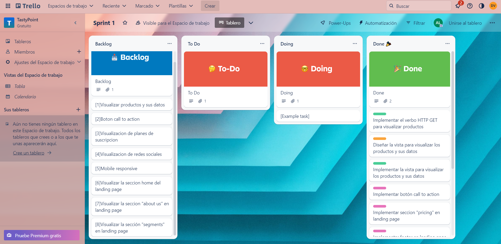{width="6.9in" height="3.236111111111111in"}

LOGIN

En esta vista el usuario se podrá iniciar sesión con una cuenta
previamente registrada, también tendrá la posibilidad de autenticarse
con su cuenta de Gmail.

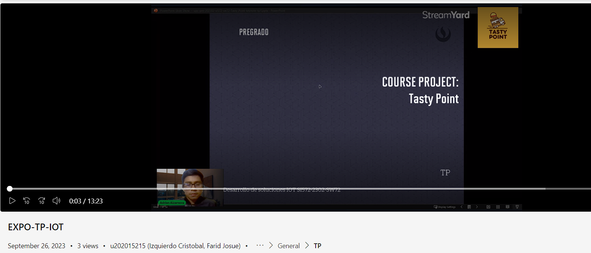{width="5.0in" height="2.6770833333333335in"}

LOGIN WITH GOOGLE

En esta vista se muestra cuando el dialog que se ejecuta cuando el
usuario le da a iniciar sesión con su cuenta de Gmail.

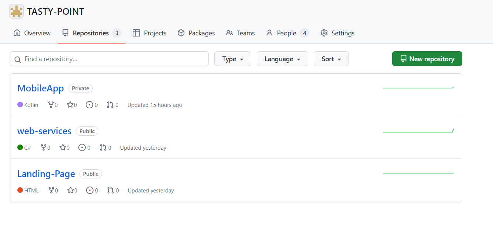{width="5.0in" height="2.6875in"}

REGISTER

En esta vista se muestra el formulario de registro de una cuenta, con
los campos requeridos para dicha accion.

{width="5.0in" height="2.6770833333333335in"}

HOME

En esta vista se muestra el resumen del inventario y las métricas tanto
de temperatura como de humedad.

{width="5.0in" height="2.5833333333333335in"}

PRODUCTS

En esta sección se muestran los productos registrados por los clientes,
tambien puede realizar todas las operaciones CRUD.

{width="5.0in" height="2.59375in"}

REPORTS

En esta sección se muestra el registro de la temperatura y la humedad
del inventario, registrado por los sensores. Tanto en tiempo real y
desde que inicio el funcionamineto de los dispositivos.

{width="5.0in" height="2.5833333333333335in"}

### 6.2.2.6. Services Documentation Evidence for Sprint Review. {#services-documentation-evidence-for-sprint-review.-1 .unnumbered}

En esta sección se presenta la lista de Endpoints configurados en
Firebase realtime database, relacionados con el alcance del Sprint 2.
Para este sprint se logró definir los endpoints que registran la
información de los restaurantes como nombre, dirección, correo, etc.
Asimismo, se definió el endpoint que registra la lectura enviada por el
sensor DHT22 en un formato: temperatura, humedad, tiemestamp.

+---------+------+------------------+----------------+---------------+
| Con     | HTTP | Enlace al        | Endpoint       | Acciones      |
| troller | Req  | servicio         |                |               |
|         | uest |                  |                |               |
+=========+======+==================+================+===============+
| Pr      | GET  | https:/          | tasty          | Retorna todos |
| oductos |      | /tastypoint-fire | point-firebase | los usuarios  |
|         |      | base-default-rtd | -default-rtdb. | registrados   |
|         |      | b.firebaseio.com | firebaseio.com |               |
|         |      |                  | /products      |               |
+---------+------+------------------+----------------+---------------+
|         | POST |                  | tastypoint-fir | Un usuario    |
|         |      |                  | ebase-default- | autenticado   |
|         |      |                  | rtdb.firebasei | en la app con |
|         |      |                  | o.com/products | su respectivo |
|         |      |                  | /\${user?.uid} | uid crea un   |
|         |      |                  |                | producto.     |
|         |      |                  |                |               |
|         |      |                  |                | Retorna un    |
|         |      |                  |                | status 201    |
|         |      |                  |                | (Created).    |
|         |      |                  |                |               |
|         |      |                  |                | Retorna un    |
|         |      |                  |                | error, status |
|         |      |                  |                | 400, en caso  |
|         |      |                  |                | los campos    |
|         |      |                  |                | requeridos no |
|         |      |                  |                | estén         |
|         |      |                  |                | completos o   |
|         |      |                  |                | se intente    |
|         |      |                  |                | crear un      |
|         |      |                  |                | producto con  |
|         |      |                  |                | un nombre     |
|         |      |                  |                | existente.    |
+---------+------+------------------+----------------+---------------+
|         | UP   |                  | ta             | Edita un      |
|         | DATE |                  | stypoint-fireb | producto      |
|         |      |                  | ase-default-rt | existente,    |
|         |      |                  | db.firebaseio. | especificado  |
|         |      |                  | com/products/\ | por el uid    |
|         |      |                  | ${user?.uid}/\ | del usuario y |
|         |      |                  | ${product?.id} | el id del     |
|         |      |                  |                | product a     |
|         |      |                  |                | actualizar en |
|         |      |                  |                | el endpoint,  |
|         |      |                  |                | y se le       |
|         |      |                  |                | asigna los    |
|         |      |                  |                | nuevos datos  |
|         |      |                  |                | actualizando  |
|         |      |                  |                | los atributos |
|         |      |                  |                | definidos.    |
|         |      |                  |                |               |
|         |      |                  |                | Retorna un    |
|         |      |                  |                | status 200    |
|         |      |                  |                | (OK) y el     |
|         |      |                  |                | recurso       |
|         |      |                  |                | respectivo.   |
|         |      |                  |                |               |
|         |      |                  |                | Retorna un    |
|         |      |                  |                | error, status |
|         |      |                  |                | 400, en caso  |
|         |      |                  |                | los campos    |
|         |      |                  |                | requeridos no |
|         |      |                  |                | estén         |
|         |      |                  |                | completos o   |
|         |      |                  |                | se intente    |
|         |      |                  |                | editar una    |
|         |      |                  |                | compañía con  |
|         |      |                  |                | un nombre ya  |
|         |      |                  |                | existente     |
+---------+------+------------------+----------------+---------------+
|         | DE   |                  | tastypoint-fir | Elimina un    |
|         | LETE |                  | ebase-default- | producto      |
|         |      |                  | rtdb.firebasei | existente,    |
|         |      |                  | o.com/products | especificado  |
|         |      |                  | /\${user?.uid} | por el uid    |
|         |      |                  |                | del usuario y |
|         |      |                  |                | el id del     |
|         |      |                  |                | product a     |
|         |      |                  |                | actualizar en |
|         |      |                  |                | el endpoint,  |
|         |      |                  |                | de tal manera |
|         |      |                  |                | eliminando el |
|         |      |                  |                | producto de   |
|         |      |                  |                | la database   |
|         |      |                  |                |               |
|         |      |                  |                | Retorna un    |
|         |      |                  |                | status 200 No |
|         |      |                  |                | Content.      |
|         |      |                  |                |               |
|         |      |                  |                | Retorna un    |
|         |      |                  |                | error, status |
|         |      |                  |                | 400, en caso  |
|         |      |                  |                | el id del     |
|         |      |                  |                | producto      |
|         |      |                  |                | especificado  |
|         |      |                  |                | no ha sido    |
|         |      |                  |                | creado.       |
+---------+------+------------------+----------------+---------------+
| U       | GET  | https:/          | tastypoint-    | Retorna todas |
| suarios |      | /tastypoint-fire | firebase-defau | los usuarios  |
|         |      | base-default-rtd | lt-rtdb.fireba | registrados y |
|         |      | b.firebaseio.com | seio.com/users | autenticados  |
|         |      |                  |                | en la app.    |
+---------+------+------------------+----------------+---------------+
|         | POST |                  | tastypoint-    | Crea un       |
|         |      |                  | firebase-defau | usuario nuevo |
|         |      |                  | lt-rtdb.fireba | con su        |
|         |      |                  | seio.com/users | respectiva    |
|         |      |                  |                | a             |
|         |      |                  |                | utenticación. |
+---------+------+------------------+----------------+---------------+
| L       | GET  | https://tas      | tastypoint-f   | Retorna todas |
| ecturas |      | typoint-firebase | irebase-defaul | las lecturas  |
|         |      | -default-rtdb.fi | t-rtdb.firebas | de un usuario |
|         |      | rebaseio.com/use | eio.com/users/ | con           |
|         |      | rs/{id}/readings | {id}/readings/ | identificador |
|         |      |                  |                | uid. Se       |
|         |      |                  |                | obtiene las   |
|         |      |                  |                | lecturas de   |
|         |      |                  |                | la            |
|         |      |                  |                | temperatura y |
|         |      |                  |                | humedad .     |
+---------+------+------------------+----------------+---------------+
|         | GET  |                  | tastypoin      | Retorna la    |
|         |      |                  | t-firebase-def | lectura de un |
|         |      |                  | ault-rtdb.fire | marca de      |
|         |      |                  | baseio.com/use | tiempo o      |
|         |      |                  | rs/{id}/readin | timestamp.    |
|         |      |                  | gs/{timestamp} |               |
+---------+------+------------------+----------------+---------------+

A continuación, se muestran capturas de la interacción, utilizando datos
de muestra, con la documentación de firebase realtime database. Además,
se coloca el URL del Web Services en firebase, junto con los id de los
commits relacionados con la Documentación para el Sprint 2.

URL: <https://tastypoint-firebase-default-rtdb.firebaseio.com>

  --------------------------------------------------------------------------
  ID Commit                           Descripción                         
  ----------------------------------- ----------------------------------- --
  8cd4eaa                             feat: implemented home iot metrics  
                                      component                           

  54d682f                             Add databse realtime of entity      
                                      users, only uid,                    
                                      email,restaurantname and            
                                      phonenumber                         

  7e0e672                             added product manage (create and    
                                      update)                             
  --------------------------------------------------------------------------

El endpoint de productos retorna los productos de un cliente registrado.
Cada producto tiene como campos la fecha de entrada, fecha de
vencimiento y nombre.

En la siguiente imagen se muestra un ejemplo.

{width="5.784700349956255in"
height="4.043350831146107in"}

En cuanto al endpoint de los usuarios, este recupera información como
dirección de correo electrónico, número telefónico, nombre del
restaurante y el identificador de la lista de los productos en su
almacén.

Con respecto al endpoint de las lecturas recibidas del kit iot
'readings' se obtiene métricas como humedad, temperatura y marca de
tiempo o timestamp que es la fecha completa en la cual se registran las
métricas.

{width="5.765608048993876in"
height="4.163552055993001in"}

### 6.2.2.7. Software Deployment Evidence for Sprint Review. {#software-deployment-evidence-for-sprint-review.-1 .unnumbered}

Vercel permite tener un despliegue de la plataforma por cada rama y
commit que se haya creado en github.

{width="6.9in"
height="2.5104166666666665in"}

{width="6.9in"
height="2.5069444444444446in"}

### 6.2.2.8. Team Collaboration Insights during Sprint. {#team-collaboration-insights-during-sprint.-1 .unnumbered}

Para el desarrollo del web application, hemos usado un repositorio en
GitHub en el cual, con la ayuda del flujo de trabajo Gitflow, hemos
implementado de manera grupal el desarrollo de nuestro frontend. Esto se
evidencia en los diferentes commits realizados en el repositorio, los
cuales fueron realizados mediante distintas ramas features para luego
unirlas en la rama develop. En las siguientes capturas de pantalla se
puede demostrar el trabajo colaborativo mediante el network graph,
herramienta que nos permite visualizar el trayecto de todas las ramas de
nuestro proyecto:

{width="5.0in"
height="1.9375in"}{width="5.0in"
height="2.1458333333333335in"}

## 6.3. Validation Interviews. {#validation-interviews. .unnumbered}

### 6.3.1. Diseño de Entrevistas.  {#diseno-de-entrevistas. .unnumbered}

**Consumidor:**

Buenos días, me presento, soy () y pertenezco a la carrera de Ingeniería
de Software de la UPC. Gracias por acceder a la entrevista, y antes de
comenzar con las preguntas, realizaré una breve introducción a nuestro
proyecto. Este tiene por nombre Tasty Point y se basa en la distribución
de los productos que los establecimientos alimenticios, no llegan a
vender durante su jornada. Usted como consumidor, podrá comprar estos
productos a través de nuestra aplicación a un menor precio, pero
agrupados en paquetes, en la cual se encontrarán los productos de cierto
restaurante específico. Dicho esto, comencemos con las validaciones.

-   ¿Cuál es su nombre completo?

-   ¿Cuántos años tiene?

-   En general, ¿Que te ha parecido nuestra aplicación?

-   ¿Le gusta la paleta de colores utilizadas?

-   ¿Cree que cumple con el propósito de ayudar a los consumidores?

-   ¿Tiene alguna recomendación con respecto a nuestra aplicación?

**Representante de negocio:**

Buenos días, me presento, soy () y pertenezco a la carrera de Ingeniería
de Software de la UPC. Gracias por acceder a la entrevista, y antes de
comenzar con las preguntas, realizaré una breve introducción a nuestro
proyecto. Este tiene por nombre Tasty Point y se basa en la distribución
de los productos que los establecimientos alimenticios, no llegan a
vender durante su jornada. Por lo que pueden estos establecimientos
generar ganancias adicionales con los alimentos que ya habían sido
considerado perdidas, asimismo, ayudar a cuidar el planeta disminuyendo
el desperdicio de alimentos. Dentro de esta aplicación web puede
monitorear la temperatura y humedad del inventario de productos. Dicho
esto, comencemos con las validaciones.

-   ¿Cuál es su nombre completo?

-   ¿Cuántos años tiene?

-   En general, ¿Que te ha parecido nuestra aplicación?

-   ¿Le gusta la paleta de colores utilizadas?

-   ¿Cree que cumple con el propósito de ayudar a los restaurantes?

-   ¿Tiene alguna recomendación con respecto a nuestra aplicación?

### 6.3.2. Registro de Entrevistas. {#registro-de-entrevistas. .unnumbered}

1.  **Representantes de Negocios:**

  -----------------------------------------------------------------------
  Nombres y apellidos                 Roberto Carlos Salazar Risco
  ----------------------------------- -----------------------------------
  Edad                                20

  Dirección                           Cajamarca, Cajamarca

  Duración                            04:20
  -----------------------------------------------------------------------

2.  

  -------------------------------------------------------------------------------------------------------------------------------------------------------------------------------------------------------------------------------------------------------------------------------------------------------------------------------------------------------
  {width="6.756944444444445in" height="3.9381944444444446in"}
  -------------------------------------------------------------------------------------------------------------------------------------------------------------------------------------------------------------------------------------------------------------------------------------------------------------------------------------------------------
  URL:
  [video1203682444.mp4](https://upcedupe-my.sharepoint.com/:v:/g/personal/u202010942_upc_edu_pe/EfGYhw40dHNElsK2KQV1bYwBn1j3ZYsiDUbjknXxkF4Y_w?nav=eyJyZWZlcnJhbEluZm8iOnsicmVmZXJyYWxBcHAiOiJPbmVEcml2ZUZvckJ1c2luZXNzIiwicmVmZXJyYWxBcHBQbGF0Zm9ybSI6IldlYiIsInJlZmVycmFsTW9kZSI6InZpZXciLCJyZWZlcnJhbFZpZXciOiJNeUZpbGVzTGlua0RpcmVjdCJ9fQ&e=Fg5Sq7)

  Entrevistador: David Torres Vilchez

  Análisis: La entrevista a Roberto Carlos, realizada por David Torres en representación del proyecto \"Tasty Point\", nos proporcionó una mejor visualización de la forma en la que el usuario navega por medio de las funciones de la aplicación web y cómo las características implementadas son recibidas. Roberto se mostró interesado y aseguro que
  la aplicación aporta en nuestra misión de disminuir la problemática, así también le agrado la paleta de colores usadas y la forma en la que la información es presentada.
  -------------------------------------------------------------------------------------------------------------------------------------------------------------------------------------------------------------------------------------------------------------------------------------------------------------------------------------------------------

1.  

  -----------------------------------------------------------------------
  Nombres y apellidos                 Julia Garcia Llontop
  ----------------------------------- -----------------------------------
  Edad                                52

  Dirección                           Cedros, Lima

  Duración                            05:02
  -----------------------------------------------------------------------

3.  

  -----------------------------------------------------------------------
  {width="6.773267716535433in"
  height="3.2596358267716536in"}
  -----------------------------------------------------------------------
  URL: <https://www.youtube.com/watch?v=hDac2ZqiLk8>

  Entrevistador: Breydi Ramos Terrones

  Análisis: La entrevista a Julia Garcia Llontop, realizada por Brady
  Ramos Terrones en representación del proyecto \"y Point\", proporciona
  una visión esclarecedora de las características y beneficios de la
  aplicación. Julia menciona su interés en la aplicación desde la
  perspectiva de un restaurante y cómo podría ayudar en la distribución
  de productos y la gestión de pedidos. Además, se aborda el aspecto
  visual de la aplicación, donde Julia destaca la importancia de una
  buena presentación de productos. En resumen, la entrevista arroja luz
  sobre la utilidad del proyecto y sugiere posibles áreas de mejora, lo
  que podría ser fundamental para el desarrollo futuro de la aplicación
  \"y Point\" en la industria alimentaria.
  -----------------------------------------------------------------------

2.  

**Consumidores:**

  -----------------------------------------------------------------------
  Nombres y apellidos                 Diego Fabián Cabrera Zelada
  ----------------------------------- -----------------------------------
  Edad                                21

  Dirección                           Lima, Surco

  Duración                            06:11
  -----------------------------------------------------------------------

1.  

  -------------------------------------------------------------------------------------------------------------------------------------------------------------------------------------------------------------------------------------------------------------------------------------------------------------------------------------------------------
  {width="6.756944444444445in" height="3.973611111111111in"}
  -------------------------------------------------------------------------------------------------------------------------------------------------------------------------------------------------------------------------------------------------------------------------------------------------------------------------------------------------------
  URL:
  [video1569336811.mp4](https://upcedupe-my.sharepoint.com/:v:/g/personal/u202010942_upc_edu_pe/EbDswuDPM4ZBpIpsYn3Q7HIB9dhb1evjRTgd5ChGFSPe4g?nav=eyJyZWZlcnJhbEluZm8iOnsicmVmZXJyYWxBcHAiOiJPbmVEcml2ZUZvckJ1c2luZXNzIiwicmVmZXJyYWxBcHBQbGF0Zm9ybSI6IldlYiIsInJlZmVycmFsTW9kZSI6InZpZXciLCJyZWZlcnJhbFZpZXciOiJNeUZpbGVzTGlua0RpcmVjdCJ9fQ&e=gdNAgu)

  Entrevistador: David Torres Vilchez

  Análisis: La entrevista a Diego Cabrera Zelada, realizada por David Torres en representación del proyecto \"Tasty Point\", nos proporcionó una mejor visualización de la forma en la que el usuario navega por medio de las funciones de la aplicación móvil y cómo las características implementadas son recibidas. Diego menciono su agrado por la
  paleta de colores y como esta es cómoda a la vista, así también como las funcionalidades implementadas, el único punto que resalto fue la funcionalidad de la barra de navegación y si se pudieran implementar más pasarelas de pago. Sin embargo, menciona que la aplicación cumple en su totalidad con su propósito y estaría dispuesto a utilizarla.
  -------------------------------------------------------------------------------------------------------------------------------------------------------------------------------------------------------------------------------------------------------------------------------------------------------------------------------------------------------

3.  

  -----------------------------------------------------------------------
  Nombres y apellidos                 Mayfer Ali Ruiz Alcalde
  ----------------------------------- -----------------------------------
  Edad                                20

  Dirección                           Cajamarca, Cajamarca

  Duración                            06:08
  -----------------------------------------------------------------------

1.  

  -------------------------------------------------------------------------------------------------------------------------------------------------------------------------------------------------------------------------------------------------------------------------------------------------------------------------------------
  {width="6.756944444444445in" height="3.9027777777777777in"}
  -------------------------------------------------------------------------------------------------------------------------------------------------------------------------------------------------------------------------------------------------------------------------------------------------------------------------------------
  URL:
  [video1413116711.mp4](https://upcedupe-my.sharepoint.com/:v:/g/personal/u202010942_upc_edu_pe/EXPSq7VXnTFNqbX47CpjZtEBTN-OXrqhtBxwetLRdaKDTA?e=9V4bOb&nav=eyJyZWZlcnJhbEluZm8iOnsicmVmZXJyYWxBcHAiOiJTdHJlYW1XZWJBcHAiLCJyZWZlcnJhbFZpZXciOiJTaGFyZURpYWxvZyIsInJlZmVycmFsQXBwUGxhdGZvcm0iOiJXZWIiLCJyZWZlcnJhbE1vZGUiOiJ2aWV3In19)

  Entrevistador: David Torres Vilchez

  Análisis: La entrevista a Mayfer Ali Ruiz Alcalde, realizada por David Torres en representación del proyecto \"Tasty Point\", nos proporcionó una mejor visualización de la forma en la que el usuario navega por medio de las funciones de la aplicación móvil y cómo las características implementadas son recibidas. Ali se mostró
  sumamente interesado en el funcionamiento de la aplicación y también resalto su agrado por la paleta de colores, pero indicando una pequeña molestia en cuanto a la aglomeración de ciertos componentes en ciertas vistas de la aplicación y lo saturado que puede llegar a ser para el usuario, fuera de ello solo nos recomendó
  implementar la recuperación de contraseña.
  -------------------------------------------------------------------------------------------------------------------------------------------------------------------------------------------------------------------------------------------------------------------------------------------------------------------------------------

### 6.3.3. Evaluaciones según heurísticas. {#evaluaciones-segun-heuristicas. .unnumbered}

A continuación, tenemos las evaluaciones heurísticas, las cuales son una
técnica de inspección que permite identificar problemas de usabilidad de
manera eficiente y a bajo costo. Para la evaluación de heurísticas se
tomo en cuenta toda la información abstraída mediante las entrevistas y
experiencia del usuario.

**Site o App a evaluar**

TastyPoint -- Web App

##### **Tareas a evaluar** {#tareas-a-evaluar .unnumbered}

El alcance de esta evaluación incluye la revisión de la usabilidad de
las siguientes tareas:

-   Visualización de métricas de humedad y temperatura.

-   Gestión del inventario de productos.

-   Eliminación de productos del inventario.

-   Añadir productos al inventario.

-   Editar productos del inventario.

-   Visualización en tiempo real de los gráficos.

##### **Observaciones** {#observaciones .unnumbered}

Recuperación de contraseña -- mejorar la seguridad para realizar el
cambio de contraseña

**\
**

##### **Escala de severidad** {#escala-de-severidad .unnumbered}

Los errores serán puntuados tomando en cuenta la siguiente escala de
severidad

  -----------------------------------------------------------------------
  Nivel     Descripción
  --------- -------------------------------------------------------------
  **1**     **Problema superficial:** puede ser fácilmente superador por
            el usuario u ocurre con muy poca frecuencia. No necesita ser
            arreglado a no ser que exista disponibilidad de tiempo.

  **2**     **Problema menor:** puede ocurrir un poco más frecuentemente
            o es un poco más difícil de superar para el usuario. Se le
            debería asignar una prioridad baja resolverlo de cara al
            siguiente reléase.

  **3**     **Problema mayor:** ocurre frecuentemente o los usuarios no
            son capaces de resolverlos. Es importante que sean corregidos
            y se les debe asignar una prioridad alta.

  **4**     **Problema muy grave:** un error de gran impacto que impide
            al usuario continuar con el uso de la herramienta. Es
            imperativo que sea corregido antes del lanzamiento.
  -----------------------------------------------------------------------

##### **Tabla Resumen** {#tabla-resumen .unnumbered}

  -----------------------------------------------------------------------------
  \#      Problema                           Escala de   Heurística/Principio
                                             severidad   violada(o)
  ------- ---------------------------------- ----------- ----------------------
  **1**   Especificación del manejo de los   2           Ayuda y documentación
          gráficos y los datos mostrados en              
          ellos.                                         

  **2**   Cancelar adición de producto al    3           Information
          inventario.                                    Architecture: Is it
                                                         usable?
  -----------------------------------------------------------------------------

##### **Descripción de problemas** {#descripción-de-problemas .unnumbered}

**PROBLEMA #1:** Especificación del manejo de los gráficos y los datos
mostrados en ellos.

Severidad: 2

Heurística violada: Ayuda y documentación

Problema: La sección de reportes de la aplicación muestra gráficas de la
temperatura en tiempo real, pero hay dificultad en entender lo que se
está viendo junto con una acumulación de información que puede ser
abrumadora para un usuario sin experiencia en el monitoreo de gráficas.

Recomendación: Añadir acceso a documentación mediante un botón de ayuda
para quienes necesiten de un mejor entendimiento de los gráficos en
tiempo real proporcionados por la aplicación o no sobrecargar la
pantalla de información.

**PROBLEMA #2:** Cancelar adición de producto al inventario.

Severidad: 3

Heurística violada: Information Architecture -- Is it usable?

Problema: Existe un problema al momento de cancelar el proceso de
adición de un nuevo producto al inventario dentro del apartado de
monitoreo.

Recomendación: Lo recomendable seria solucionar en cuanto antes del
funcionamiento del botón cancelar dentro del apartado de añadir producto
al inventario, puesto que la gestión del inventario es una tarea
indispensable para nuestros usuarios encargados del monitoreo de sus
productos.

**Site o App a evaluar**

TastyPoint -- Mobile App

##### **Tareas a evaluar** {#tareas-a-evaluar-1 .unnumbered}

El alcance de esta evaluación incluye la revisión de la usabilidad de
las siguientes tareas:

-   Visualización del catálogo de productos ofrecidos por los
    restaurantes.

-   Visualización de la información de cada producto.

-   Visualización de restaurantes.

-   Manejo del carrito de compras.

-   Pago del producto.

-   LogIn & LogOut.

No están incluidas en esta versión de la evaluación las siguientes
tareas:

-   Registro de usuario.

**\
**

##### **Escala de severidad** {#escala-de-severidad-1 .unnumbered}

Los errores serán puntuados tomando en cuenta la siguiente escala de
severidad

  -----------------------------------------------------------------------
  Nivel     Descripción
  --------- -------------------------------------------------------------
  **1**     **Problema superficial:** puede ser fácilmente superador por
            el usuario u ocurre con muy poca frecuencia. No necesita ser
            arreglado a no ser que exista disponibilidad de tiempo.

  **2**     **Problema menor:** puede ocurrir un poco más frecuentemente
            o es un poco más difícil de superar para el usuario. Se le
            debería asignar una prioridad baja resolverlo de cara al
            siguiente reléase.

  **3**     **Problema mayor:** ocurre frecuentemente o los usuarios no
            son capaces de resolverlos. Es importante que sean corregidos
            y se les debe asignar una prioridad alta.

  **4**     **Problema muy grave:** un error de gran impacto que impide
            al usuario continuar con el uso de la herramienta. Es
            imperativo que sea corregido antes del lanzamiento.
  -----------------------------------------------------------------------

##### **Tabla Resumen** {#tabla-resumen-1 .unnumbered}

  -----------------------------------------------------------------------------
  \#      Problema                           Escala de   Heurística/Principio
                                             severidad   violada(o)
  ------- ---------------------------------- ----------- ----------------------
  **1**   Diseño incómodo en vistas Login y  1           Estética y diseño
          selección del producto.                        minimalista

  **2**   Ausencia de una pantalla para      2           Prevención de errores
          confirmar el cierre de sesión.                 

  **4**   Incluye una barra de búsqueda,     3           Information
          pero no cumple su función en su                Architecture: Is it
          totalidad.                                     usable?
  -----------------------------------------------------------------------------

##### **Descripción de problemas** {#descripción-de-problemas-1 .unnumbered}

**PROBLEMA #1:** Sobrecarga de elementos en el login.

Severidad: 1

Heurística violada: Estética y diseño minimalista

Problema: Al momento de que un usuario ingresa a la aplicación móvil, se
encuentra con una vista cargada de colores y opciones que no son
necesarias y solo hacen más incómoda la experiencia la usuario, también
se presenta este problema al visualizar información de ciertos productos
en las que algunos elementos poseen un sombreado innecesario y el tamaño
de la letra es bastante grande.

Recomendación: Se debería corregir los errores de diseño que sobrecargan
ciertas vistas de la aplicación móvil y eliminar los colores
innecesarios de varias secciones.

**PROBLEMA #2:** Ausencia de una pantalla para confirmar el cierre de
sesión.

Severidad: 2

Heurística violada: Prevención de errores

Problema: Al dar al botón de cerrar sesión no aparece ninguna pantalla
de confirmación, por lo cual si el usuario lo presiona por casualidad
tendría que volver a ingresar su correo y contraseña el cual sería un
fastidio para el usuario.

Recomendación: Colocar una notificación para confirmar el cierre de
sesión

**PROBLEMA #3:** Incluye una barra de búsqueda, pero no cumple su
función en su totalidad

Severidad: 3

Heurística violada: Information Architecture -- Is it usable?

Problema: Al momento de realizar la búsqueda de un plato de comida, no
se muestran laos productos demostrando la falta de funcionamiento de la
barra de búsqueda.

Recomendación: Arreglar la funcionalidad de búsqueda, además de
implementar más filtros de búsqueda y desarrollar botones con los cuales
se podría identificar que filtro se esta usando en ese momento, ya que
esto daría mayor facilidad al usuario al momento de navegar en ese
apartado.

## 6.4 Video About-the-Product. {#video-about-the-product. .unnumbered}

Landing Page:

En este apartado definimos que es Tasty Point y quienes serán nuestros
usuarios objetivos mostrando nuestra landing page. Le explicamos al
cliente que obtendrá y cuáles son los beneficios de usar y elegir
nuestra aplicación. Enlace al video en Anexos.

{width="6.828193350831146in"
height="3.2291666666666665in"}\
*screenshoot del video about the product*

**Mobile Application -- Consumers:**

A continuación, el video about the product de nuestro aplicativo móvil
enfocado en el segmento de consumidores, el propósito del aplicativo
móvil es permitir a los consumidores acceder al catálogo de los
productos que pongan en venta los representantes de negocios de comida
desde la aplicación web.

{width="6.9in"
height="4.036111111111111in"}

*screenshoot del video about the product (mobile application)*

Enlace del video de la aplicación móvil:
[mobileapp.mp4](https://upcedupe-my.sharepoint.com/:v:/g/personal/u202010942_upc_edu_pe/EW30-rYh3NFFk4-N4g5TcWgBmBGIEfA8gIzpZQG46Gz-6Q?nav=eyJyZWZlcnJhbEluZm8iOnsicmVmZXJyYWxBcHAiOiJPbmVEcml2ZUZvckJ1c2luZXNzIiwicmVmZXJyYWxBcHBQbGF0Zm9ybSI6IldlYiIsInJlZmVycmFsTW9kZSI6InZpZXciLCJyZWZlcnJhbFZpZXciOiJNeUZpbGVzTGlua0RpcmVjdCJ9fQ&e=O6oiYx)

# CONCLUSIONES {#conclusiones .unnumbered}

Tasty Point, el startup encargado de evitar el desperdicio de comida y
comercializarlos a un precio justo, mucho más económico, cuenta con una
idea delimitada que cumplirá con los estándares del curso.  Es útil
mencionar que, el desarrollo el proyecto se inicia con una idea de
negocio que mundialmente desempeña un factor beneficiarte dentro de la
sociedad, para realizar la implementación se irá realizando mejoras
continuas que beneficien la trascendencia del proyecto. 

En segundo lugar, el proceso de recopilación de información mediante
entrevistas de nuestro público objetivo nos facilita en el planteamiento
de las funciones a desarrollar en la aplicación, mejorando nuestras
ideas e incrementando las capacidades de la app y por ende asegurando
una buena recepción en su lanzamiento. 

Por último, la elaboración de los artefactos C4 relacionados con los
diagramas de arquitectura a nivel de contexto, componentes, contenedores
y clases involucro una investigación en el campo de IoT para identificar
las tecnologías y protocolos de comunicación con MQTT que se iban a
emplear en la solución.

Recomendaciones

Se recomienda continuar el desarrollo de la aplicación en base a User
Stories es otra parte clave de este proyecto. En las User Stories se
definen todas aquellas características o funcionalidades, o mejor
llamados requisitos, dándonos una idea clara y precisa acerca de cuáles
son los siguientes pasos para seguir durante todo el proceso de
desarrollo. Asimismo, gracias a herramientas como el Product Backlog,
nos permiten organizar mejor nuestros tiempos y ser más eficientes en
todo aspecto.

Del mismo modo, se recomienda realizar un estudio más a fondo del código
del proyecto (landing page para ir mejorando), porque consideramos que
falta mayor eficiencia y más comprensión por parte del código. Además,
es necesario ejercer mayor compromiso y dedicación para resolver las
dudas e inquietudes, cosa que es un gran impedimento para la
coordinación y solución de problemas que nos toman tiempo y es una
barrera para superar.

Utilizar herramientas como GitHub y otras herramientas colaborativas
ayuda en gran medida a que desarrollemos el Proyecto de forma rápida.
Además, permite evitar varios errores en el Código.

Integrar un kit iot con un sistema permite brindar a los clientes una
forma de poder automatizar y simplificar sus flujos de trabajo. En este
proyecto se

# BIBLIOGRAFÍA {#bibliografía .unnumbered}

Organización de las Naciones Unidas para la Alimentación y la
agricultura. (s.f.). Día Internacional de Concienciación sobre la
Pérdida y el Desperdicio de Alimentos. Recuperado de
<https://www.fao.org/international-day-awareness-food-loss-waste/es/>
\[Consulta: 25 de agosto de 2022\].

ONU, Programa para el medio ambiente. (4 de marzo de 2021). Se
desperdicia 17% de todos los alimentos disponibles a nivel del
consumidor. ONU. Recuperado de
<https://www.unep.org/es/noticias-y-reportajes/comunicado-de-prensa/onu-se-desperdicia-17-de-todos-los-alimentos-disponibles>
\[Consulta: 25 de agosto de 2016\].

PHENIX. (2022). ¿Quién es Phenix, la startup que actúa contra el
desperdicio? Francia: Phenix. Recuperado de
<https://www.wearephenix.com/es/es-homepage-generale/quienes-somos/>
\[Consulta: 30 de agosto de 2022\].

Too Good To Go. (s.f.). Salva comida ahora. Recuperado de
<https://toogoodtogo.es/es/consumer> \[Consulta: 30 de agosto de 2022\].

Pablo Rodrígez. (29 Diciembre 2020).Too Good To Go, la app que vende la
comida sobrante de supermercados y restaurantes tres veces más barata y
en packs sorpresa. \[Entrada en blog\]. Recuperado de
<https://www.xataka.com/servicios/too-good-to-go-app-que-vende-comida-sobrante-supermercados-restaurantes-tres-veces-barata-packs-sorpresa>
\[Consulta: 1 de septiembre de 2022\].

Elizabeth Royte. (s.f.). Un tercio de los alimentos que cultivamos se
desperdician o se pierden. National Geographic. Recuperado de
<https://www.nationalgeographic.es/medio-ambiente/un-tercio-de-los-alimentos-que-cultivamos-se-desperdician-o-se-pierden>
\[Consulta: 1 de septiembre de 2022\].

Redacción RPP. (10 de febrero del 2021). Delivery creció 250% en el Perú
durante la pandemia. RPP Noticias. Recuperado de
<https://rpp.pe/economia/economia/delivery-peruanos-gastan-entre-s-80-y-s-200-en-promedio-en-pedidos-servicio-de-reparto-a-domicilio-restaurantes-tiendas-supermercados-noticia-1319925>
\[Consulta: 1 de septiembre de 2022\].

**ANEXO 1:**

**Video TB1:**

[upc-pre-202302-si572-sw72-Tasty_Point-expo-tb1.mp4](https://upcedupe.sharepoint.com/:v:/s/IOT-2302-Grupo2/EUnw7Vop1NpCpuk0hU9MTFABkGWALqmYHLXShL00F8f4DQ?e=duqjdU&nav=eyJyZWZlcnJhbEluZm8iOnsicmVmZXJyYWxBcHAiOiJTdHJlYW1XZWJBcHAiLCJyZWZlcnJhbFZpZXciOiJTaGFyZURpYWxvZyIsInJlZmVycmFsQXBwUGxhdGZvcm0iOiJXZWIiLCJyZWZlcnJhbE1vZGUiOiJ2aWV3In19)

Link de Trello:
https://trello.com/invite/tastypoint/ATTI3bf72a5205b4217a503be11ddd3522d96FB33842

Product backlog:

{width="6.9in" height="3.370833333333333in"}

**ANEXO 2:**

**Video TP1: [Video
TP1](https://upcedupe.sharepoint.com/:v:/s/IOT-2302-Grupo2/EVac6DsYjIhEoyeBvGSzJOQB25gnKDrqlRI5PuuIecXHlQ?e=RD6EY1&nav=eyJyZWZlcnJhbEluZm8iOnsicmVmZXJyYWxBcHAiOiJTdHJlYW1XZWJBcHAiLCJyZWZlcnJhbFZpZXciOiJTaGFyZURpYWxvZyIsInJlZmVycmFsQXBwUGxhdGZvcm0iOiJXZWIiLCJyZWZlcnJhbE1vZGUiOiJ2aWV3In19)**

{width="6.9in"
height="2.9541666666666666in"}

**Link Landing Page: <https://tastypoint.github.io/lp-tastypoint/>**

Link plataforma Web: <https://tasty-point-web-app.vercel.app/>

Link APK Mobile App:
<https://drive.google.com/file/d/1XKN1JASpGI7xTsrKa0R1_rp1gik1tReV/view?usp=sharing>

{width="4.496527777777778in"
height="2.129861111111111in"}Link de organización en GitHub:
<https://github.com/orgs/TastyPoint/repositories>

**Video TB2:**
[[EXPO-TB2-IOT.mp4]{.underline}](https://upcedupe.sharepoint.com/:v:/s/IOT-2302-Grupo2/EZvk-NbQIbBHvM0bV6ruZeABdPhoCE-KZAQ0oZJnUWeGBQ?e=QXGKcf&nav=eyJyZWZlcnJhbEluZm8iOnsicmVmZXJyYWxBcHAiOiJTdHJlYW1XZWJBcHAiLCJyZWZlcnJhbFZpZXciOiJTaGFyZURpYWxvZyIsInJlZmVycmFsQXBwUGxhdGZvcm0iOiJXZWIiLCJyZWZlcnJhbE1vZGUiOiJ2aWV3In19)

**Video About The Product:**
[About-The-Product.mp4](https://upcedupe.sharepoint.com/:v:/s/IOT-2302-Grupo2/EYosINiXNSpNkKObjmVGNO8B24o8uyMZlM9eZ7OrPDFF_A?e=hSkz9m&nav=eyJyZWZlcnJhbEluZm8iOnsicmVmZXJyYWxBcHAiOiJTdHJlYW1XZWJBcHAiLCJyZWZlcnJhbFZpZXciOiJTaGFyZURpYWxvZyIsInJlZmVycmFsQXBwUGxhdGZvcm0iOiJXZWIiLCJyZWZlcnJhbE1vZGUiOiJ2aWV3In19)
